# Egeria User Guide: My Profile Application

The **My Profile Application** (`my_profile_app.py`) is an interactive terminal-based user interface (TUI) powered by Egeria. It is designed for business users, data citizens, data analysts, team leaders, and governance professionals to manage personal governance profiles, track daily activities, collaborate on governance artifacts, and discover organizational data assets.

---

## Target Audience & User Personas

This application is tailored for business roles within an organization that uses Egeria as its open metadata and governance platform:

- **Business Analysts & Data Citizens**: Search glossaries, explore business terms, browse digital data catalogs, and subscribe to data assets.
- **Team Leaders & Project Managers**: View team membership, oversee project assignments, manage governance roles, and track team activities.
- **Governance Officers & Stewards**: Add and manage governance to-dos, document insights via blogs and journals, comment on metadata elements, and trigger automated catalog templates.

> **Note:** Modification screens (`EditElementsScreens.py`) are currently under construction and are not covered in this guide.

---

## Getting Started & Profile Initialization

### Application Startup & Authentication

When the application launches, it automatically loads configuration settings and establishes a secure connection to the Egeria View Server:

1. **Configuration & Credentials**: Loads application environment settings and user credentials (`user_name`, `user_password`, `egeria_view_server`, `egeria_platform_url`).
2. **Profile Retrieval**: Calls Egeria via `MyProfile._async_get_my_profile()` using the `My-User-MD` specification.
3. **Karma Points & Reputation**: Calculates and displays the user's active **Karma Points**, recognizing contributions to the metadata ecosystem.
4. **Table Population**: Asynchronously populates the main dashboard tables (Associations, Roles, Teams, Blogs, Journal, To-Dos, User Identity, and Collections).

### First-Time User: Profile Creation

If no existing profile is found for your account in Egeria (`my_profile_data == []`), the application automatically launches the **Create Profile** modal dialog (`CreateProfileScreen.py`).

| Field | Description | Example / Format |
| :--- | :--- | :--- |
| `Courtesy Title` | Preferred formal title | `Dr.`, `Ms.`, `Mr.` |
| `Given Names` | First / given names | `Gary` |
| `Family Name` | Surname / last name | `Geeke` |
| `Preferred Name` | Preferred display name | `Gary Geeke` |
| `Pronouns` | Personal pronouns | `he/him`, `they/them` |
| `Job Title` | Professional role in organization | `Lead Data Architect` |
| `Description` | Brief summary of role and responsibilities | `Responsible for enterprise data modeling` |
| `Employee ID` | Organization employee identifier | `EMP-10492` |
| `Preferred Language` | Language for system interactions | `en-US` |
| `Resident Country` | Country of employment / residence | `United Kingdom` |
| `Time Zone` | Working time zone | `Europe/London` |

Click **Create Profile** or submit the form. Egeria creates your `Person` entity and anchors your user profile. If you cancel or encounter an issue, press `q` to dismiss.

---

### Startup & Profile Architecture Flows

#### Component & Flow Map

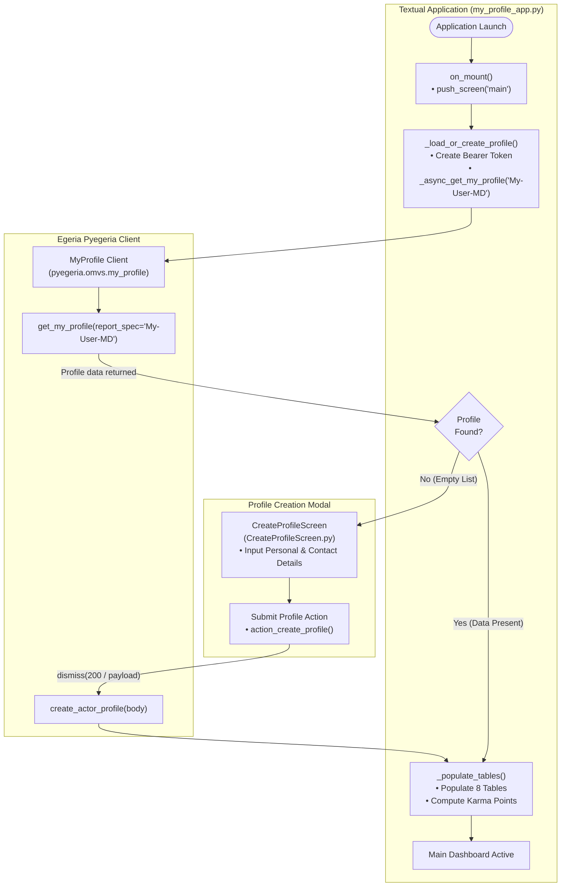
```mermaid
flowchart TD
    %% App Startup and Profile Loading
    subgraph ClientApp ["Textual Application (my_profile_app.py)"]
        START(["Application Launch"])
        ONMOUNT["on_mount()<br/>• push_screen('main')"]
        LOAD["_load_or_create_profile()<br/>• Create Bearer Token<br/>• _async_get_my_profile('My-User-MD')"]
        CHECK{"Profile<br/>Found?"}
        POPULATE["_populate_tables()<br/>• Populate 8 Tables<br/>• Compute Karma Points"]
        MAIN["Main Dashboard Active"]
    end

    subgraph Modals ["Profile Creation Modal"]
        CPS["CreateProfileScreen<br/>(CreateProfileScreen.py)<br/>• Input Personal & Contact Details"]
        SUBMIT["Submit Profile Action<br/>• action_create_profile()"]
    end

    subgraph EgeriaOMVS ["Egeria Pyegeria Client"]
        MP["MyProfile Client<br/>(pyegeria.omvs.my_profile)"]
        GET_P["get_my_profile(report_spec='My-User-MD')"]
        CREATE_P["create_actor_profile(body)"]
    end

    START --> ONMOUNT --> LOAD
    LOAD --> MP --> GET_P
    GET_P -- "Profile data returned" --> CHECK
    CHECK -- "Yes (Data Present)" --> POPULATE --> MAIN
    CHECK -- "No (Empty List)" --> CPS
    CPS --> SUBMIT -- "dismiss(200 / payload)" --> CREATE_P
    CREATE_P --> POPULATE
```

#### Sequence & Data Exchange

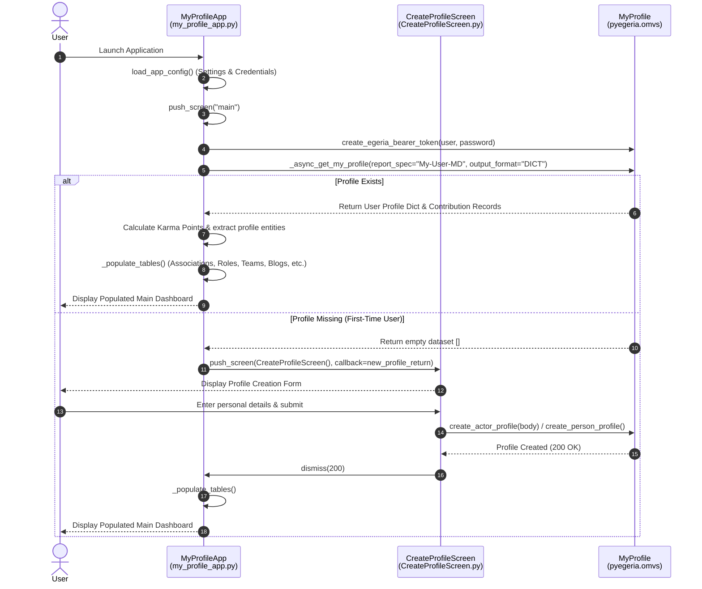
```mermaid
sequenceDiagram
    autonumber
    actor User
    participant App as MyProfileApp<br/>(my_profile_app.py)
    participant Modal as CreateProfileScreen<br/>(CreateProfileScreen.py)
    participant MP as MyProfile<br/>(pyegeria.omvs)

    User->>App: Launch Application
    App->>App: load_app_config() (Settings & Credentials)
    App->>App: push_screen("main")
    App->>MP: create_egeria_bearer_token(user, password)
    App->>MP: _async_get_my_profile(report_spec="My-User-MD", output_format="DICT")

    alt Profile Exists
        MP-->>App: Return User Profile Dict & Contribution Records
        App->>App: Calculate Karma Points & extract profile entities
        App->>App: _populate_tables() (Associations, Roles, Teams, Blogs, etc.)
        App-->>User: Display Populated Main Dashboard
    else Profile Missing (First-Time User)
        MP-->>App: Return empty dataset []
        App->>Modal: push_screen(CreateProfileScreen(), callback=new_profile_return)
        Modal-->>User: Display Profile Creation Form
        User->>Modal: Enter personal details & submit
        Modal->>MP: create_actor_profile(body) / create_person_profile()
        MP-->>Modal: Profile Created (200 OK)
        Modal->>App: dismiss(200)
        App->>App: _populate_tables()
        App-->>User: Display Populated Main Dashboard
    end
```

---

## Main Dashboard Layout & Workspace Structure

The main dashboard (`MainScreen.py`) organizes all user-relevant metadata into clean, scrollable containers:

```mermaid
flowchart TB
    subgraph Dashboard ["Main Dashboard (MainScreen.py)"]
        HEADER["Header: Egeria - My Profile | User: &lt;user_name&gt; (Karma Points: &lt;points&gt;)"]
        
        subgraph TopRow ["Top Grid Container"]
            ASSOC["User Associations Container<br/>• Community & project ties<br/>• #associations_table"]
            COLL["My Collections Container<br/>• Personal asset collections<br/>• #my_collections_table"]
        end

        subgraph MidRow ["Middle Grid Container"]
            OTHER["Other Functions Menu<br/>• [1] User Identities<br/>• [2] Catalogs/Shop for Data<br/>• [3] Technology Types"]
            ROLES["Assigned Roles Container<br/>• Governance & business roles<br/>• #roles_table (Drill-down to Teams)"]
        end

        subgraph LowerRow ["Lower Grid Container"]
            TEAMS["Teams Container<br/>• Departments & Squads<br/>• #teams_table"]
            ACTIVITIES["Activities & Note Logs<br/>• Blogs: #blogs_table<br/>• Journal: #journal_table<br/>• To-Dos: #todos_table"]
        end

        subgraph BottomRow ["Identity Container"]
            IDENTITY["User Identity Container<br/>• Distinguished names across repositories<br/>• #user_identity_table"]
        end

        FOOTER["Footer: Global Keyboard Shortcuts & Status Indicators"]
        
        HEADER --- TopRow
        TopRow --- MidRow
        MidRow --- LowerRow
        LowerRow --- BottomRow
        BottomRow --- FOOTER
    end
```

### Dashboard Data Sections

- **User Associations**: Displays communities, initiatives, and working groups the user is associated with.
- **My Collections**: Lists personal asset collections and pinned resource groupings.
- **Roles**: Shows formal roles assigned to the user (e.g., `TeamLeader`, `DataSteward`, `BusinessAnalyst`).
- **Teams**: Displays departments, squads, and operational units where the user is a member.
- **Activities (Blogs, Journal, To-Dos)**:
  - **Blogs**: Published articles and knowledge-sharing entries.
  - **Journal**: Private or internal work log entries with timestamps.
  - **To-Dos**: Assigned action items, tasks, and governance workflows with activity statuses.
- **User Identity**: Identity mappings linking user accounts to directory services and repository platforms.
- **Other Functions**: Quick-access navigation menu to specialized workspaces.

---

## Keyboard Navigation & Global Shortcuts

The My Profile application provides rapid keyboard-driven navigation:

| Key Binding | Action | Scope | Description |
| :--- | :--- | :--- | :--- |
| `q` | **Quit** | Global | Exits the application or dismisses the current modal window. |
| `r` | **Refresh Data** | Global | Reloads profile data, activities, and tables from Egeria. |
| `ctrl+s` | **Show Comments** | Main Screen | Opens the comment thread for the currently highlighted table row. |
| `ctrl+t` | **Add To-Do** | Main Screen | Opens the quick-creation dialog for a new To-Do item. |
| `ctrl+b` | **Add Blog** | Main Screen | Opens the creation dialog for a new Blog post. |
| `ctrl+j` | **Add Journal** | Main Screen | Opens the creation dialog for a new Journal entry. |
| `ctrl+c` | **Add Association** | Main Screen | Links the profile to a Community or Project. |
| `ctrl+r` | **Add Role** | Main Screen | Creates and assigns a new governance role. |
| `ctrl+g` | **Add Team** | Main Screen | Creates a new Team structure. |
| `ctrl+m` | **Add Collection**| Main Screen | Creates a new asset collection. |
| `ctrl+e` | **Toggle Twisties**| Trees | Expands or collapses all nodes in hierarchical trees. |
| `Escape` / `b` | **Back / Exit** | Modals | Closes the current modal dialog and returns to the previous screen. |

---

## Managing User Activities & Adding Elements

The application includes dedicated quick-entry dialogs (`AddToElementsScreens.py` managed via `elements_crud_handler.py`) to create new items without needing complex scripts:

### 1. Adding a To-Do Item (`ctrl+t`)
- **Fields**:
  - `Name of Todo`: Clear summary of the required task.
  - `Description of Todo`: Detailed instructions or requirements.
  - `Priority of Todo`: Priority indicator (e.g., `High`, `Medium`, `Low`).
  - `Link Todo to your profile?`: Toggle switch (defaults to `True`) to anchor the task to your active profile.
- **Behavior**: New To-Dos are automatically created with status `REQUESTED` and linked directly to your Egeria profile.

### 2. Adding a Blog Entry (`ctrl+b`)
- **Fields**:
  - `Blog Title`: Title for the knowledge post.
  - `Qualified Name`: Unique system identifier for the blog entry.
  - `Blog Entry Text`: Detailed markdown or plain-text body of the post.
  - `Link to Blog?`: Switch to associate the entry with an existing blog channel.

### 3. Adding a Journal Entry (`ctrl+j`)
- **Fields**:
  - `Journal Name`: Title or identifier for the journal log.
  - `Journal Entry Text`: Detailed notes or work summary.
  - `Link to Profile`: Automatically anchors the entry with the current timestamp.

### 4. Adding a Community (`AddCommunityScreen`)
- **Fields**:
  - `Community Name`: Display name for the community of practice.
  - `Community Description`: Mission and purpose of the community.
  - `Community Category`: Functional group or business area.
  - `Assignment Type`: User membership level (e.g., `Leader`, `Member`, `Contributor`).
  - `Community Mission`: Strategic objectives.

### 5. Adding a Project (`AddProjectScreen`)
- **Fields**:
  - `Project Name`: Name of the project or initiative.
  - `Project Description`: Goals and deliverables.
  - `Project Category`: Type of project (e.g., `Governance`, `Data Migration`, `Analytics`).
  - `Project Status`: Initial project state (e.g., `PROPOSED`, `ACTIVE`).
  - `Start Date` / `End Date`: Planned execution timeline.

### 6. Adding a Role (`ctrl+r`)
- **Fields**:
  - `Role Name`: Functional title (e.g., `Data Steward - Finance`).
  - `Role Type`: Egeria role type specification.
  - `Role Description`: Responsibilities and delegation authority.
  - `Scope`: Department, business domain, or organizational unit.
  - `Appointed Actor`: Target user or profile appointed to the role.

---

### Element Management & CRUD Architecture Flows

#### Component & Flow Map

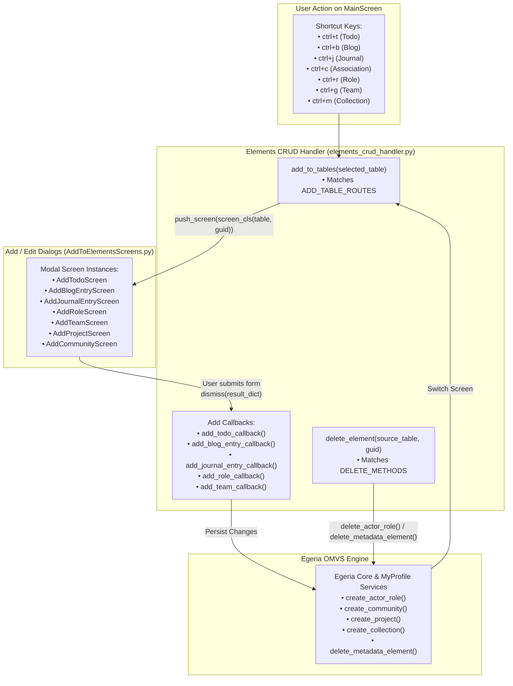
```mermaid
flowchart TD
    subgraph Trigger ["User Action on MainScreen"]
        KEY["Shortcut Keys:<br/>• ctrl+t (Todo)<br/>• ctrl+b (Blog)<br/>• ctrl+j (Journal)<br/>• ctrl+c (Association)<br/>• ctrl+r (Role)<br/>• ctrl+g (Team)<br/>• ctrl+m (Collection)"]
    end

    subgraph Handler ["Elements CRUD Handler (elements_crud_handler.py)"]
        ADD_ROUTER["add_to_tables(selected_table)<br/>• Matches ADD_TABLE_ROUTES"]
        CALLBACKS["Add Callbacks:<br/>• add_todo_callback()<br/>• add_blog_entry_callback()<br/>• add_journal_entry_callback()<br/>• add_role_callback()<br/>• add_team_callback()"]
        DEL["delete_element(source_table, guid)<br/>• Matches DELETE_METHODS"]
    end

    subgraph Screens ["Add / Edit Dialogs (AddToElementsScreens.py)"]
        MODALS["Modal Screen Instances:<br/>• AddTodoScreen<br/>• AddBlogEntryScreen<br/>• AddJournalEntryScreen<br/>• AddRoleScreen<br/>• AddTeamScreen<br/>• AddProjectScreen<br/>• AddCommunityScreen"]
    end

    subgraph EgeriaOMVS ["Egeria OMVS Engine"]
        OMVS["Egeria Core & MyProfile Services<br/>• create_actor_role()<br/>• create_community()<br/>• create_project()<br/>• create_collection()<br/>• delete_metadata_element()"]
    end

    KEY --> ADD_ROUTER
    ADD_ROUTER -- "push_screen(screen_cls(table, guid))" --> MODALS
    MODALS -- "User submits form<br/>dismiss(result_dict)" --> CALLBACKS
    CALLBACKS -- "Persist Changes" --> OMVS
    OMVS -- "Switch Screen" --> ADD_ROUTER
    DEL -- "delete_actor_role() / delete_metadata_element()" --> OMVS
```

#### Sequence & Data Exchange

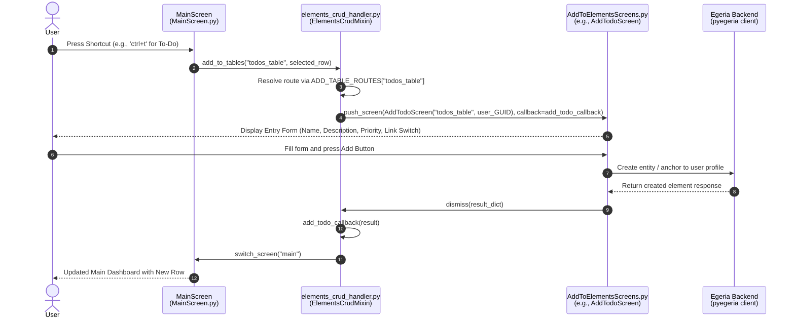
```mermaid
sequenceDiagram
    autonumber
    actor User
    participant Main as MainScreen<br/>(MainScreen.py)
    participant Handler as elements_crud_handler.py<br/>(ElementsCrudMixin)
    participant Modal as AddToElementsScreens.py<br/>(e.g., AddTodoScreen)
    participant OMVS as Egeria Backend<br/>(pyegeria client)

    User->>Main: Press Shortcut (e.g., 'ctrl+t' for To-Do)
    Main->>Handler: add_to_tables("todos_table", selected_row)
    Handler->>Handler: Resolve route via ADD_TABLE_ROUTES["todos_table"]
    Handler->>Modal: push_screen(AddTodoScreen("todos_table", user_GUID), callback=add_todo_callback)
    Modal-->>User: Display Entry Form (Name, Description, Priority, Link Switch)
    User->>Modal: Fill form and press Add Button
    Modal->>OMVS: Create entity / anchor to user profile
    OMVS-->>Modal: Return created element response
    Modal->>Handler: dismiss(result_dict)
    Handler->>Handler: add_todo_callback(result)
    Handler->>Main: switch_screen("main")
    Main-->>User: Updated Main Dashboard with New Row
```

---

## Collaboration & Element Comments

Egeria supports collaborative feedback on any metadata element across the dashboard via `ShowCommentsScreen.py`:

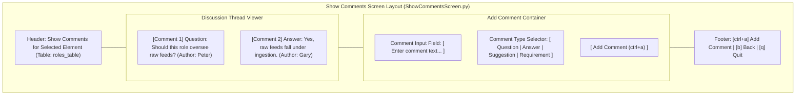
```mermaid
flowchart TB
    subgraph CommentUI ["Show Comments Screen Layout (ShowCommentsScreen.py)"]
        HEADER["Header: Show Comments for Selected Element (Table: roles_table)"]
        
        subgraph ThreadPane ["Discussion Thread Viewer"]
            C1["[Comment 1] Question: Should this role oversee raw feeds? (Author: Peter)"]
            C2["[Comment 2] Answer: Yes, raw feeds fall under ingestion. (Author: Gary)"]
        end

        subgraph EntryPane ["Add Comment Container"]
            INPUT["Comment Input Field: [ Enter comment text... ]"]
            SELECT["Comment Type Selector: [ Question | Answer | Suggestion | Requirement ]"]
            SUBMIT_BTN["[ Add Comment (ctrl+a) ]"]
        end

        FOOTER["Footer: [ctrl+a] Add Comment | [b] Back | [q] Quit"]

        HEADER --- ThreadPane
        ThreadPane --- EntryPane
        EntryPane --- FOOTER
    end
```

### Viewing Comments
1. Highlight any row in any table (e.g., Roles, Projects, Teams, Collections).
2. Press `ctrl+s`.
3. The system extracts the element's unique `GUID` or `Qualified Name` and retrieves all attached discussion threads using Egeria's `Comment-by-Element` service.

### Adding a Comment
1. In the comments view, press `ctrl+a` or navigate to the input container.
2. Enter your comment text.
3. Specify a valid **Comment Type**:
   - `Question`: Ask for clarification or metadata details.
   - `Answer`: Provide a resolution to an open question.
   - `Suggestion`: Propose enhancements or governance adjustments.
   - `Requirement`: Specify mandatory compliance or data quality conditions.
4. Click **Add**. The comment is immediately attached to the element in Egeria.

---

### Collaboration & Comments Architecture Flows

#### Component & Flow Map

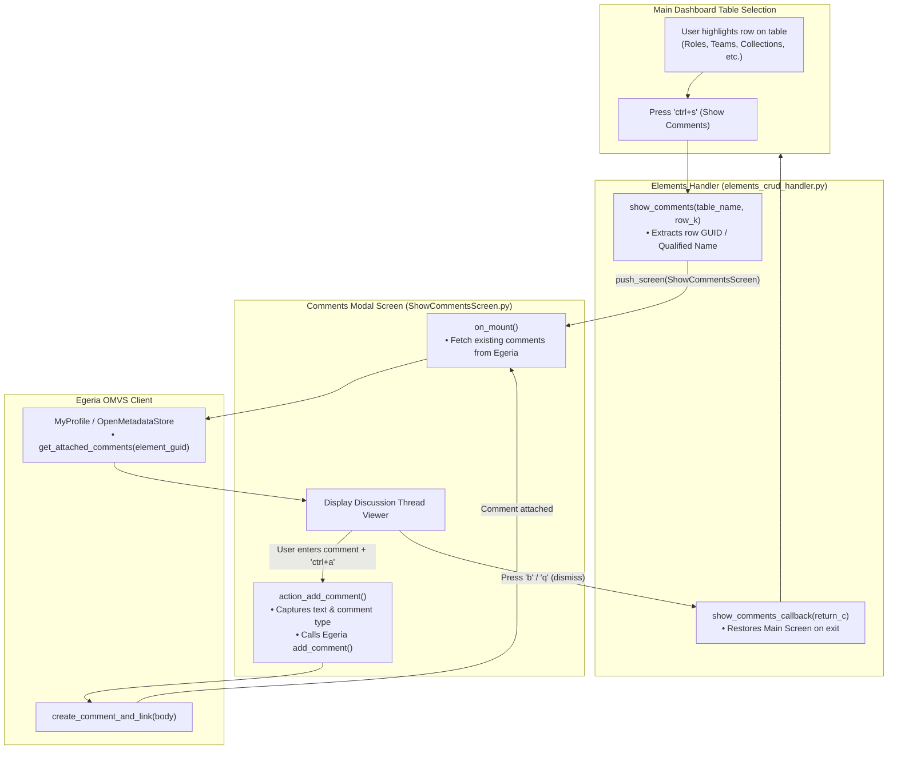
```mermaid
flowchart TD
    subgraph Main ["Main Dashboard Table Selection"]
        SELECT_ROW["User highlights row on table<br/>(Roles, Teams, Collections, etc.)"]
        TRIGGER["Press 'ctrl+s' (Show Comments)"]
    end

    subgraph Handler ["Elements Handler (elements_crud_handler.py)"]
        SHOW["show_comments(table_name, row_k)<br/>• Extracts row GUID / Qualified Name"]
        CALLBACK["show_comments_callback(return_c)<br/>• Restores Main Screen on exit"]
    end

    subgraph Screen ["Comments Modal Screen (ShowCommentsScreen.py)"]
        INIT["on_mount()<br/>• Fetch existing comments from Egeria"]
        VIEW["Display Discussion Thread Viewer"]
        ADD["action_add_comment()<br/>• Captures text & comment type<br/>• Calls Egeria add_comment()"]
    end

    subgraph Egeria ["Egeria OMVS Client"]
        FETCH_C["MyProfile / OpenMetadataStore<br/>• get_attached_comments(element_guid)"]
        POST_C["create_comment_and_link(body)"]
    end

    SELECT_ROW --> TRIGGER --> SHOW
    SHOW -- "push_screen(ShowCommentsScreen)" --> INIT
    INIT --> FETCH_C --> VIEW
    VIEW -- "User enters comment + 'ctrl+a'" --> ADD
    ADD --> POST_C -- "Comment attached" --> INIT
    VIEW -- "Press 'b' / 'q' (dismiss)" --> CALLBACK --> Main
```

#### Sequence & Data Exchange

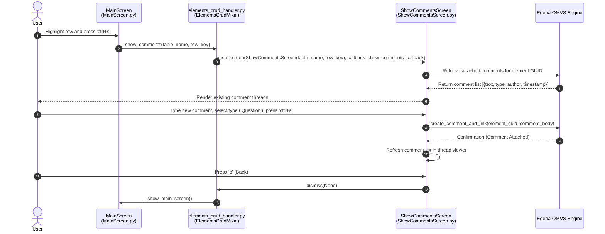
```mermaid
sequenceDiagram
    autonumber
    actor User
    participant Main as MainScreen<br/>(MainScreen.py)
    participant Handler as elements_crud_handler.py<br/>(ElementsCrudMixin)
    participant Comments as ShowCommentsScreen<br/>(ShowCommentsScreen.py)
    participant OMVS as Egeria OMVS Engine

    User->>Main: Highlight row and press 'ctrl+s'
    Main->>Handler: show_comments(table_name, row_key)
    Handler->>Comments: push_screen(ShowCommentsScreen(table_name, row_key), callback=show_comments_callback)
    Comments->>OMVS: Retrieve attached comments for element GUID
    OMVS-->>Comments: Return comment list [{text, type, author, timestamp}]
    Comments-->>User: Render existing comment threads
    User->>Comments: Type new comment, select type ('Question'), press 'ctrl+a'
    Comments->>OMVS: create_comment_and_link(element_guid, comment_body)
    OMVS-->>Comments: Confirmation (Comment Attached)
    Comments->>Comments: Refresh comment list in thread viewer
    User->>Comments: Press 'b' (Back)
    Comments->>Handler: dismiss(None)
    Handler->>Main: _show_main_screen()
```

---

## Team & Role Exploration

The **My Team** view (`MyTeamScreen.py` & `team_roles_handler.py`) enables managers and team leads to explore their organizational structure directly from the dashboard:

1. **Role Selection**: In the **Roles** table on the main screen, highlight and select any role marked with `TeamLeader` or `TeamMember`.
2. **Dynamic Member Resolution**: The system queries Egeria for the associated department or team structure.
3. **Team Roster Display**:
   - **Header**: Shows Team Display Name, Qualified Name, Category, and Description.
   - **Roster Table**: Lists all team members, their individual assigned roles, and their personal `GUID`s.
4. **Navigation**: Press `b` to return to the main dashboard or `q` to dismiss.

---

### Team & Role Exploration Architecture Flows

#### Component & Flow Map

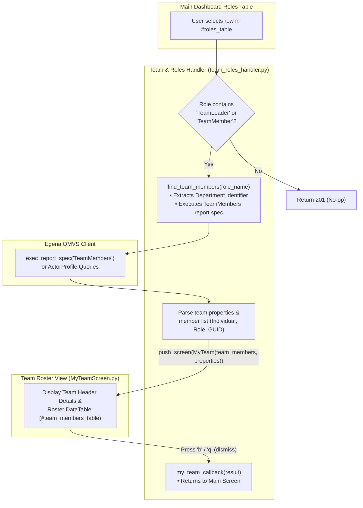
```mermaid
flowchart TD
    subgraph Main ["Main Dashboard Roles Table"]
        SELECT_ROLE["User selects row in #roles_table"]
    end

    subgraph Handler ["Team & Roles Handler (team_roles_handler.py)"]
        EVAL{"Role contains<br/>'TeamLeader' or<br/>'TeamMember'?"}
        FIND["find_team_members(role_name)<br/>• Extracts Department identifier<br/>• Executes TeamMembers report spec"]
        PARSE["Parse team properties &<br/>member list (Individual, Role, GUID)"]
        CALLBACK["my_team_callback(result)<br/>• Returns to Main Screen"]
    end

    subgraph Screen ["Team Roster View (MyTeamScreen.py)"]
        DISPLAY["Display Team Header Details &<br/>Roster DataTable (#team_members_table)"]
    end

    subgraph Egeria ["Egeria OMVS Client"]
        SPEC["exec_report_spec('TeamMembers')<br/>or ActorProfile Queries"]
    end

    SELECT_ROLE --> EVAL
    EVAL -- "No" --> EXIT_NOOP["Return 201 (No-op)"]
    EVAL -- "Yes" --> FIND
    FIND --> SPEC --> PARSE
    PARSE -- "push_screen(MyTeam(team_members, properties))" --> DISPLAY
    DISPLAY -- "Press 'b' / 'q' (dismiss)" --> CALLBACK
```

#### Sequence & Data Exchange

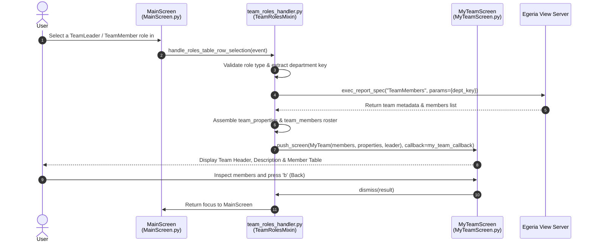
```mermaid
sequenceDiagram
    autonumber
    actor User
    participant Main as MainScreen<br/>(MainScreen.py)
    participant Handler as team_roles_handler.py<br/>(TeamRolesMixin)
    participant TeamScreen as MyTeamScreen<br/>(MyTeamScreen.py)
    participant Egeria as Egeria View Server

    User->>Main: Select a TeamLeader / TeamMember role in #roles_table
    Main->>Handler: handle_roles_table_row_selection(event)
    Handler->>Handler: Validate role type & extract department key
    Handler->>Egeria: exec_report_spec("TeamMembers", params={dept_key})
    Egeria-->>Handler: Return team metadata & members list
    Handler->>Handler: Assemble team_properties & team_members roster
    Handler->>TeamScreen: push_screen(MyTeam(members, properties, leader), callback=my_team_callback)
    TeamScreen-->>User: Display Team Header, Description & Member Table
    User->>TeamScreen: Inspect members and press 'b' (Back)
    TeamScreen->>Handler: dismiss(result)
    Handler->>Main: Return focus to MainScreen
```

---

## Data Shopping & Catalog Explorer

The **Catalogs / Shop for Data** workspace (`ShopForDataScreen.py`, `SelectionOverviewScreen.py`, `SearchForTermScreen.py`, `GenericDataViewScreen.py`, and `CreateSubscriptionRequestScreen.py`) is a discovery hub for data assets:

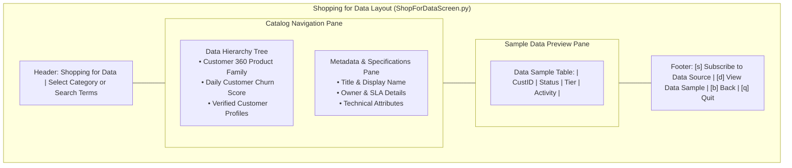
```mermaid
flowchart TB
    subgraph ShopScreenUI ["Shopping for Data Layout (ShopForDataScreen.py)"]
        HEADER["Header: Shopping for Data | Select Category or Search Terms"]
        
        subgraph SplitView ["Catalog Navigation Pane"]
            TREE["Data Hierarchy Tree<br/>• Customer 360 Product Family<br/>  • Daily Customer Churn Score<br/>  • Verified Customer Profiles"]
            DETAILS["Metadata & Specifications Pane<br/>• Title & Display Name<br/>• Owner & SLA Details<br/>• Technical Attributes"]
        end

        subgraph SamplePane ["Sample Data Preview Pane"]
            SAMPLE_TABLE["Data Sample Table: | CustID | Status | Tier | Activity |"]
        end

        FOOTER["Footer: [s] Subscribe to Data Source | [d] View Data Sample | [b] Back | [q] Quit"]

        HEADER --- SplitView
        SplitView --- SamplePane
        SamplePane --- FOOTER
    end
```

### 1. Selecting a Data Source Category
Selecting **Catalogs/Shop for Data** from the *Other Functions* menu presents 5 data categories:
- **Glossaries**: Authoritative business terminology, definitions, and hierarchies.
- **Digital Product Catalogs**: Packaged data products and product families.
- **Data Dictionaries**: Structural data dictionaries and schema definitions.
- **Business Domains**: Enterprise business capabilities and domain mappings.
- **Root Collections**: Asset collections and curated resource groups.

### 2. Interactive Selection & Hierarchical Tree
Selecting any item opens the **Selection Overview Screen**:
- **Navigation Tree**: Browse categories, nested products, and sub-assets. Press `ctrl+e` to expand or collapse all branches.
- **Metadata Details**: Displays rich Markdown-formatted descriptions, ownership metadata, and technical attributes.
- **Data Samples**: Displays sample records for digital products to verify fitness for use before requesting access.

### 3. Searching for Glossary Terms (`SearchForTermScreen`)
- Access keyword-based term discovery.
- Enter search terms to find matching glossary definitions across the entire catalog.
- Displays comprehensive term definitions, status, examples, and relationships.

---

### Catalog Discovery & Exploration Architecture Flows

#### Component & Flow Map

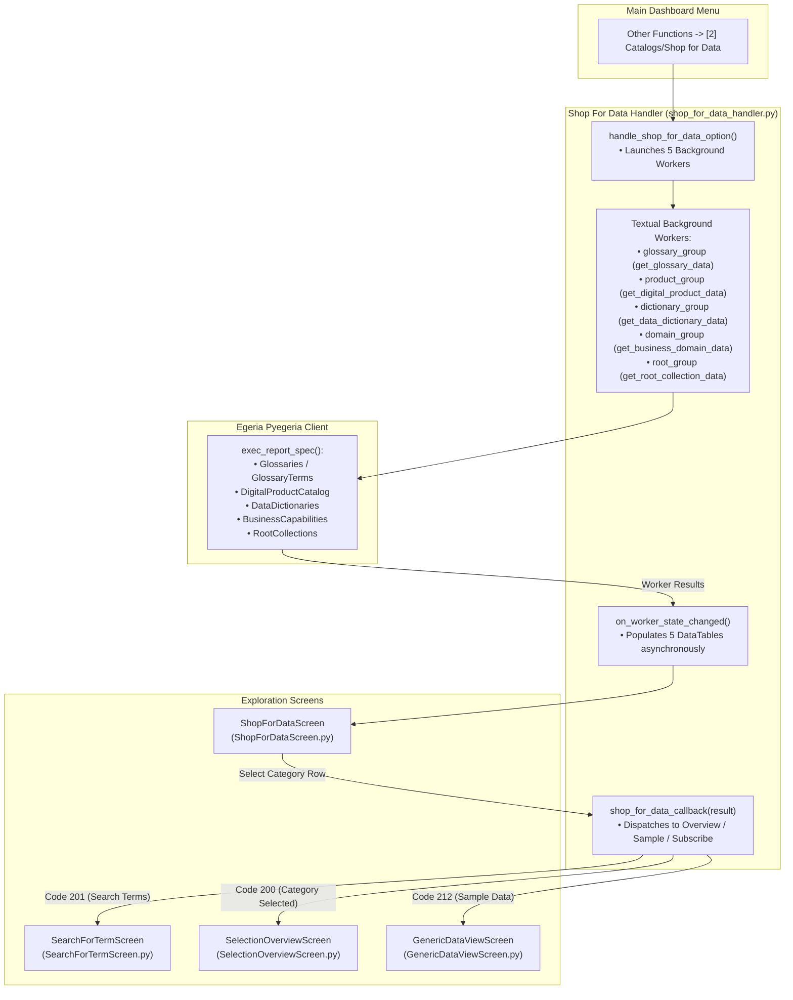
```mermaid
flowchart TD
    subgraph Menu ["Main Dashboard Menu"]
        SELECT_SHOP["Other Functions -> [2] Catalogs/Shop for Data"]
    end

    subgraph Handler ["Shop For Data Handler (shop_for_data_handler.py)"]
        HANDLE_OPT["handle_shop_for_data_option()<br/>• Launches 5 Background Workers"]
        WORKERS["Textual Background Workers:<br/>• glossary_group (get_glossary_data)<br/>• product_group (get_digital_product_data)<br/>• dictionary_group (get_data_dictionary_data)<br/>• domain_group (get_business_domain_data)<br/>• root_group (get_root_collection_data)"]
        STATE_CHANGE["on_worker_state_changed()<br/>• Populates 5 DataTables asynchronously"]
        CALLBACK["shop_for_data_callback(result)<br/>• Dispatches to Overview / Sample / Subscribe"]
    end

    subgraph Screens ["Exploration Screens"]
        SFDS["ShopForDataScreen<br/>(ShopForDataScreen.py)"]
        SEARCH["SearchForTermScreen<br/>(SearchForTermScreen.py)"]
        OVERVIEW["SelectionOverviewScreen<br/>(SelectionOverviewScreen.py)"]
        DATAVIEW["GenericDataViewScreen<br/>(GenericDataViewScreen.py)"]
    end

    subgraph EgeriaOMVS ["Egeria Pyegeria Client"]
        REPORTS["exec_report_spec():<br/>• Glossaries / GlossaryTerms<br/>• DigitalProductCatalog<br/>• DataDictionaries<br/>• BusinessCapabilities<br/>• RootCollections"]
    end

    SELECT_SHOP --> HANDLE_OPT
    HANDLE_OPT --> WORKERS
    WORKERS --> REPORTS
    REPORTS -- "Worker Results" --> STATE_CHANGE
    STATE_CHANGE --> SFDS
    SFDS -- "Select Category Row" --> CALLBACK
    CALLBACK -- "Code 200 (Category Selected)" --> OVERVIEW
    CALLBACK -- "Code 201 (Search Terms)" --> SEARCH
    CALLBACK -- "Code 212 (Sample Data)" --> DATAVIEW
```

#### Sequence & Data Exchange

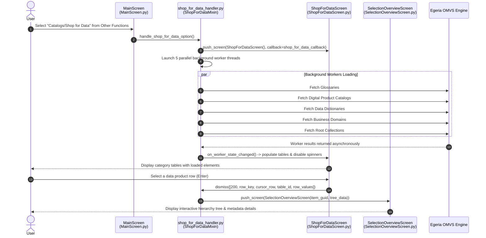
```mermaid
sequenceDiagram
    autonumber
    actor User
    participant Main as MainScreen<br/>(MainScreen.py)
    participant Handler as shop_for_data_handler.py<br/>(ShopForDataMixin)
    participant ShopScreen as ShopForDataScreen<br/>(ShopForDataScreen.py)
    participant OverviewScreen as SelectionOverviewScreen<br/>(SelectionOverviewScreen.py)
    participant Egeria as Egeria OMVS Engine

    User->>Main: Select "Catalogs/Shop for Data" from Other Functions
    Main->>Handler: handle_shop_for_data_option()
    Handler->>ShopScreen: push_screen(ShopForDataScreen(), callback=shop_for_data_callback)
    Handler->>Handler: Launch 5 parallel background worker threads
    par Background Workers Loading
        Handler->>Egeria: Fetch Glossaries
        Handler->>Egeria: Fetch Digital Product Catalogs
        Handler->>Egeria: Fetch Data Dictionaries
        Handler->>Egeria: Fetch Business Domains
        Handler->>Egeria: Fetch Root Collections
    end
    Egeria-->>Handler: Worker results returned asynchronously
    Handler->>ShopScreen: on_worker_state_changed() -> populate tables & disable spinners
    ShopScreen-->>User: Display category tables with loaded elements
    User->>ShopScreen: Select a data product row (Enter)
    ShopScreen->>Handler: dismiss([200, row_key, cursor_row, table_id, row_values])
    Handler->>OverviewScreen: push_screen(SelectionOverviewScreen(item_guid, tree_data))
    OverviewScreen-->>User: Display interactive hierarchy tree & metadata details
```

---

### 4. Subscribing to Data Assets (`CreateSubscriptionRequestScreen`)

Users can subscribe to data sources and products either directly from the **Shop For Data** table, through the **Selection Overview** tree, or after viewing a **Data Sample**.

#### Subscription Interaction Paths:
1. **Direct Subscribe from Shop For Data Table**: Highlight a row in the Digital Product Catalog (or other data table) on `ShopForDataScreen` and press `u` or `ctrl+s`.
2. **Subscribe from Selection Overview**: While inspecting an item tree in `SelectionOverviewScreen`, press `s`.
3. **Subscribe from Sample Data View**: While viewing a data sample preview in `GenericDataViewScreen`, press `s`.

#### Subscription Form & Submission:
1. The **Create Subscription Request** modal (`CreateSubscriptionRequestScreen.py`) opens pre-populated with the target item's GUID.
2. Enter a **Display Name**, optional **Description**, and **Identifier**.
3. Select an initial **Status** (`DRAFT`, `PROPOSED`, `ACTIVE`).
4. Submit the form (`c` / Submit). The handler constructs a `NewAgreementRequestBody` containing `DigitalSubscriptionProperties` and calls Egeria's `ProductManager.create_digital_subscription()`.

---

### Subscription Architecture & Data Flows

#### Component & Flow Map

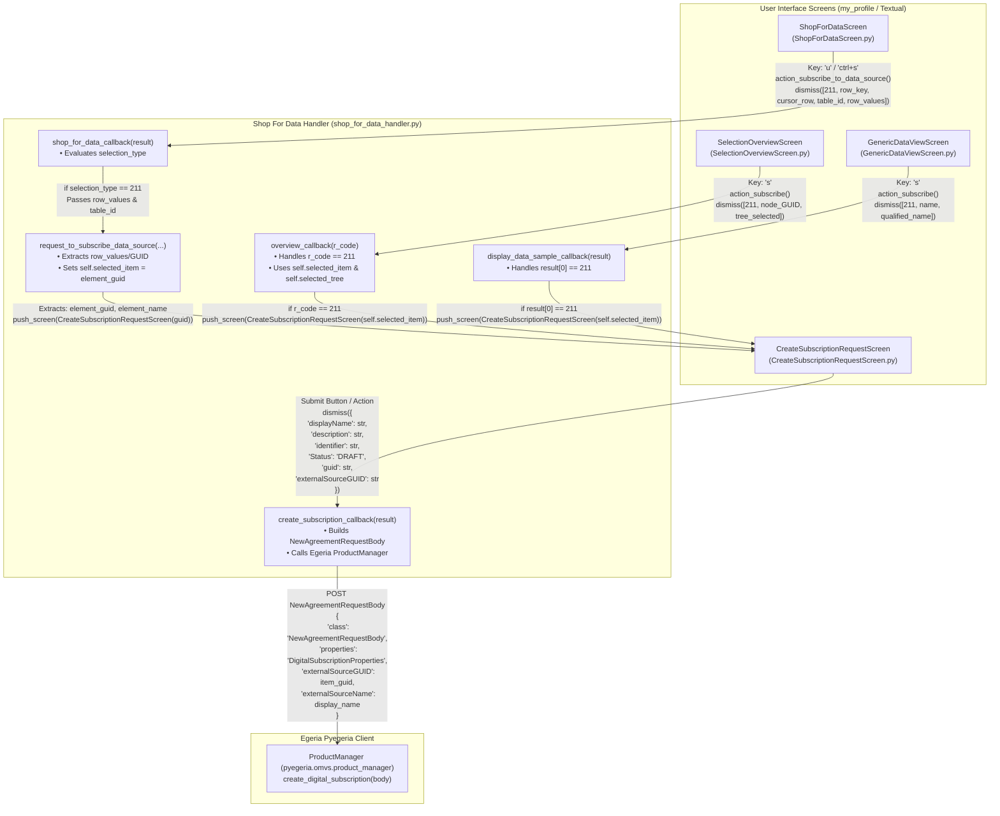
```mermaid
flowchart TD
    %% Entry Screens
    subgraph Screens ["User Interface Screens (my_profile / Textual)"]
        SFDS["ShopForDataScreen<br/>(ShopForDataScreen.py)"]
        SOS["SelectionOverviewScreen<br/>(SelectionOverviewScreen.py)"]
        GDVS["GenericDataViewScreen<br/>(GenericDataViewScreen.py)"]
        CSRS["CreateSubscriptionRequestScreen<br/>(CreateSubscriptionRequestScreen.py)"]
    end

    subgraph Handler ["Shop For Data Handler (shop_for_data_handler.py)"]
        SFDC["shop_for_data_callback(result)<br/>• Evaluates selection_type"]
        RTSDS["request_to_subscribe_data_source(...)<br/>• Extracts row_values/GUID<br/>• Sets self.selected_item = element_guid"]
        OC["overview_callback(r_code)<br/>• Handles r_code == 211<br/>• Uses self.selected_item & self.selected_tree"]
        DDSC["display_data_sample_callback(result)<br/>• Handles result[0] == 211"]
        CSC["create_subscription_callback(result)<br/>• Builds NewAgreementRequestBody<br/>• Calls Egeria ProductManager"]
    end

    subgraph EgeriaOMVS ["Egeria Pyegeria Client"]
        PM["ProductManager (pyegeria.omvs.product_manager)<br/>create_digital_subscription(body)"]
    end

    %% Flow 1: Direct Subscribe from ShopForDataScreen
    SFDS -- "Key: 'u' / 'ctrl+s'<br/>action_subscribe_to_data_source()<br/>dismiss([211, row_key, cursor_row, table_id, row_values])" --> SFDC
    SFDC -- "if selection_type == 211<br/>Passes row_values & table_id" --> RTSDS
    RTSDS -- "Extracts: element_guid, element_name<br/>push_screen(CreateSubscriptionRequestScreen(guid))" --> CSRS

    %% Flow 2: Subscribe from Overview Screen
    SOS -- "Key: 's'<br/>action_subscribe()<br/>dismiss([211, node_GUID, tree_selected])" --> OC
    OC -- "if r_code == 211<br/>push_screen(CreateSubscriptionRequestScreen(self.selected_item))" --> CSRS

    %% Flow 3: Subscribe from Data Sample View Screen
    GDVS -- "Key: 's'<br/>action_subscribe()<br/>dismiss([211, name, qualified_name])" --> DDSC
    DDSC -- "if result[0] == 211<br/>push_screen(CreateSubscriptionRequestScreen(self.selected_item))" --> CSRS

    %% Modal Submission & Egeria API Call
    CSRS -- "Submit Button / Action<br/>dismiss({<br/>  'displayName': str,<br/>  'description': str,<br/>  'identifier': str,<br/>  'Status': 'DRAFT',<br/>  'guid': str,<br/>  'externalSourceGUID': str<br/>})" --> CSC

    CSC -- "POST NewAgreementRequestBody<br/>{<br/>  'class': 'NewAgreementRequestBody',<br/>  'properties': 'DigitalSubscriptionProperties',<br/>  'externalSourceGUID': item_guid,<br/>  'externalSourceName': display_name<br/>}" --> PM
```

#### Sequence & Data Exchange

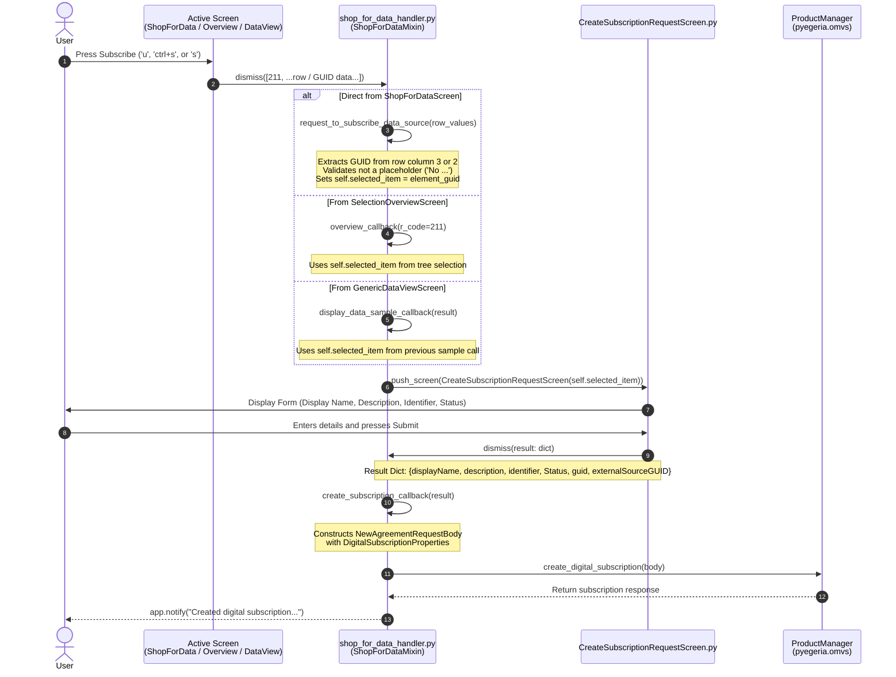
```mermaid
sequenceDiagram
    autonumber
    actor User
    participant Screen as Active Screen<br/>(ShopForData / Overview / DataView)
    participant Handler as shop_for_data_handler.py<br/>(ShopForDataMixin)
    participant Modal as CreateSubscriptionRequestScreen.py
    participant PM as ProductManager<br/>(pyegeria.omvs)

    %% Trigger
    User->>Screen: Press Subscribe ('u', 'ctrl+s', or 's')
    Screen->>Handler: dismiss([211, ...row / GUID data...])

    %% Handler processing
    alt Direct from ShopForDataScreen
        Handler->>Handler: request_to_subscribe_data_source(row_values)
        Note over Handler: Extracts GUID from row column 3 or 2<br/>Validates not a placeholder ('No ...')<br/>Sets self.selected_item = element_guid
    else From SelectionOverviewScreen
        Handler->>Handler: overview_callback(r_code=211)
        Note over Handler: Uses self.selected_item from tree selection
    else From GenericDataViewScreen
        Handler->>Handler: display_data_sample_callback(result)
        Note over Handler: Uses self.selected_item from previous sample call
    end

    %% Modal Display
    Handler->>Modal: push_screen(CreateSubscriptionRequestScreen(self.selected_item))
    Modal->>User: Display Form (Display Name, Description, Identifier, Status)
    User->>Modal: Enters details and presses Submit
    Modal->>Handler: dismiss(result: dict)
    Note over Modal,Handler: Result Dict: {displayName, description, identifier, Status, guid, externalSourceGUID}

    %% Egeria Request
    Handler->>Handler: create_subscription_callback(result)
    Note over Handler: Constructs NewAgreementRequestBody<br/>with DigitalSubscriptionProperties
    Handler->>PM: create_digital_subscription(body)
    PM-->>Handler: Return subscription response
    Handler-->>User: app.notify("Created digital subscription...")
```

---

## Technology Types & Governance Automation

The **Technology Types** suite (`TechnologyTypeScreens.py` & `tech_types_handler.py`) allows business and technical users to explore supported technologies and execute automated governance actions:

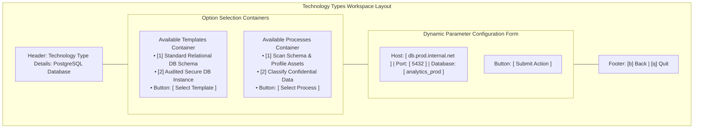
```mermaid
flowchart TB
    subgraph TechUI ["Technology Types Workspace Layout"]
        HEADER["Header: Technology Type Details: PostgreSQL Database"]
        
        subgraph OptionsSplit ["Option Selection Containers"]
            TEMPLATES["Available Templates Container<br/>• [1] Standard Relational DB Schema<br/>• [2] Audited Secure DB Instance<br/>• Button: [ Select Template ]"]
            PROCESSES["Available Processes Container<br/>• [1] Scan Schema & Profile Assets<br/>• [2] Classify Confidential Data<br/>• Button: [ Select Process ]"]
        end

        subgraph ParamForm ["Dynamic Parameter Configuration Form"]
            PARAMS["Host: [ db.prod.internal.net ] | Port: [ 5432 ] | Database: [ analytics_prod ]"]
            SUBMIT_ACTION["Button: [ Submit Action ]"]
        end

        FOOTER["Footer: [b] Back | [q] Quit"]

        HEADER --- OptionsSplit
        OptionsSplit --- ParamForm
        ParamForm --- FOOTER
    end
```

1. **Technology Types Hierarchy**: Navigate through technologies (e.g., Databases, Data Lakes, Kafka Topics, Cloud Storage).
2. **Templates & Processes Discovery**:
   - **Catalog Templates**: Reusable asset templates that preconfigure connectors, classifications, and relationships.
   - **Governance Action Processes**: Pre-built governance workflows (such as profiling, lineage extraction, and quality verification).
3. **Dynamic Parameter Forms**:
   - Selecting a template or process dynamically builds an input form based on its required request parameters.
   - Each parameter shows its **Name**, **Data Type**, **Description**, **Example Value**, and whether it is **Required**.
4. **Execution**: Fill in the parameter values and click **Submit Action** to trigger the automated governance pipeline in Egeria.

---

### Technology Types & Automation Architecture Flows

#### Component & Flow Map

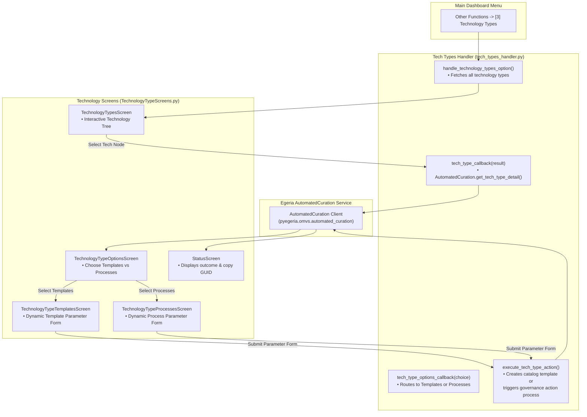
```mermaid
flowchart TD
    subgraph Menu ["Main Dashboard Menu"]
        SELECT_TT["Other Functions -> [3] Technology Types"]
    end

    subgraph Handler ["Tech Types Handler (tech_types_handler.py)"]
        FETCH_TT["handle_technology_types_option()<br/>• Fetches all technology types"]
        CALLBACK_TT["tech_type_callback(result)<br/>• AutomatedCuration.get_tech_type_detail()"]
        OPT_CALLBACK["tech_type_options_callback(choice)<br/>• Routes to Templates or Processes"]
        ACTION_EXEC["execute_tech_type_action()<br/>• Creates catalog template or<br/>triggers governance action process"]
    end

    subgraph Screens ["Technology Screens (TechnologyTypeScreens.py)"]
        TTS["TechnologyTypesScreen<br/>• Interactive Technology Tree"]
        TTOS["TechnologyTypeOptionsScreen<br/>• Choose Templates vs Processes"]
        TTTS["TechnologyTypeTemplatesScreen<br/>• Dynamic Template Parameter Form"]
        TTPS["TechnologyTypeProcessesScreen<br/>• Dynamic Process Parameter Form"]
        STATUS["StatusScreen<br/>• Displays outcome & copy GUID"]
    end

    subgraph Egeria ["Egeria AutomatedCuration Service"]
        AC["AutomatedCuration Client<br/>(pyegeria.omvs.automated_curation)"]
    end

    SELECT_TT --> FETCH_TT --> TTS
    TTS -- "Select Tech Node" --> CALLBACK_TT
    CALLBACK_TT --> AC --> TTOS
    TTOS -- "Select Templates" --> TTTS
    TTOS -- "Select Processes" --> TTPS
    TTTS -- "Submit Parameter Form" --> ACTION_EXEC
    TTPS -- "Submit Parameter Form" --> ACTION_EXEC
    ACTION_EXEC --> AC --> STATUS
```

#### Sequence & Data Exchange

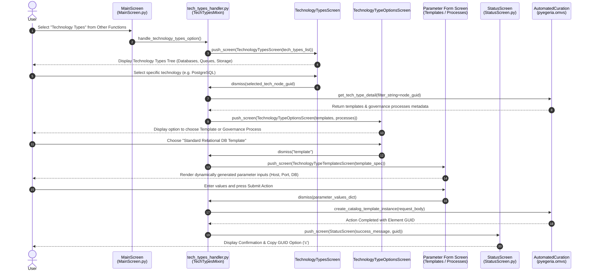
```mermaid
sequenceDiagram
    autonumber
    actor User
    participant Main as MainScreen<br/>(MainScreen.py)
    participant Handler as tech_types_handler.py<br/>(TechTypesMixin)
    participant TTS as TechnologyTypesScreen
    participant TTOS as TechnologyTypeOptionsScreen
    participant Form as Parameter Form Screen<br/>(Templates / Processes)
    participant Status as StatusScreen<br/>(StatusScreen.py)
    participant AC as AutomatedCuration<br/>(pyegeria.omvs)

    User->>Main: Select "Technology Types" from Other Functions
    Main->>Handler: handle_technology_types_option()
    Handler->>TTS: push_screen(TechnologyTypesScreen(tech_types_list))
    TTS-->>User: Display Technology Types Tree (Databases, Queues, Storage)
    User->>TTS: Select specific technology (e.g. PostgreSQL)
    TTS->>Handler: dismiss(selected_tech_node_guid)
    Handler->>AC: get_tech_type_detail(filter_string=node_guid)
    AC-->>Handler: Return templates & governance processes metadata
    Handler->>TTOS: push_screen(TechnologyTypeOptionsScreen(templates, processes))
    TTOS-->>User: Display option to choose Template or Governance Process
    User->>TTOS: Choose "Standard Relational DB Template"
    TTOS->>Handler: dismiss("template")
    Handler->>Form: push_screen(TechnologyTypeTemplatesScreen(template_spec))
    Form-->>User: Render dynamically generated parameter inputs (Host, Port, DB)
    User->>Form: Enter values and press Submit Action
    Form->>Handler: dismiss(parameter_values_dict)
    Handler->>AC: create_catalog_template_instance(request_body)
    AC-->>Handler: Action Completed with Element GUID
    Handler->>Status: push_screen(StatusScreen(success_message, guid))
    Status-->>User: Display Confirmation & Copy GUID Option ('c')
```

---

## User Identities & Account Mappings

The **User Identities Screen** (`UserIdentitiesScreen.py`) gives users full visibility into their mapped security and directory credentials across the enterprise:

- Accessible via **Other Functions -> User Identities**.
- Displays a structured table containing:
  - **Display Name**: Identity moniker.
  - **User ID**: System account identifier.
  - **Distinguished Name (DN)**: LDAP / Active Directory full path.
  - **Category & Type Name**: Identity classification.
  - **Metadata Collection Name & ID**: Home repository where the identity originates.
  - **GUID**: Unique identifier in Egeria.

---

## Status Reporting & Clipboard Integration

All operations that create or modify metadata communicate outcomes through the **Status Screen** (`StatusScreen.py`):

- **Status Message Area**: Displays structured feedback, success confirmation, or backend diagnostic information.
- **Copy GUID to Clipboard (`c` key)**: When an element is created or retrieved, pressing `c` extracts its `GUID` and copies it directly to your system clipboard for use in other tools, CLI commands, or documentation.
- **Completion Actions**: Press `Enter` to continue, `b` to report a bad result, or `q` to dismiss.

---

## Summary of Business User Workflows

The following master workflow diagram provides a complete architectural overview of all navigation paths, operational modes, and subsystem integrations available within the My Profile application:

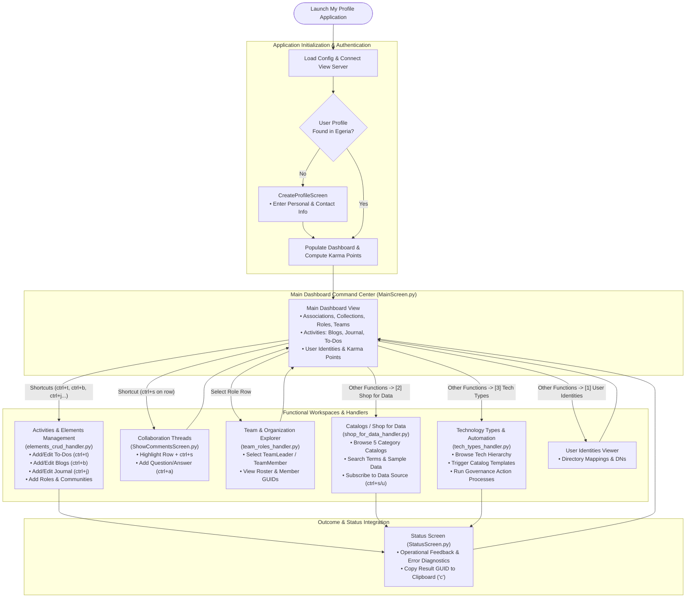
```mermaid
flowchart TD
    %% Master User Workflow
    LAUNCH(["Launch My Profile Application"])
    
    subgraph InitPhase ["Application Initialization & Authentication"]
        CONFIG["Load Config & Connect View Server"]
        CHECK_PROF{"User Profile<br/>Found in Egeria?"}
        CREATE_MODAL["CreateProfileScreen<br/>• Enter Personal & Contact Info"]
        POP_TABLES["Populate Dashboard & Compute Karma Points"]
    end

    subgraph CoreHub ["Main Dashboard Command Center (MainScreen.py)"]
        MAIN_SCREEN["Main Dashboard View<br/>• Associations, Collections, Roles, Teams<br/>• Activities: Blogs, Journal, To-Dos<br/>• User Identities & Karma Points"]
    end

    subgraph Subsystems ["Functional Workspaces & Handlers"]
        CRUD["Activities & Elements Management<br/>(elements_crud_handler.py)<br/>• Add/Edit To-Dos (ctrl+t)<br/>• Add/Edit Blogs (ctrl+b)<br/>• Add/Edit Journal (ctrl+j)<br/>• Add Roles & Communities"]
        COMMENTS["Collaboration Threads<br/>(ShowCommentsScreen.py)<br/>• Highlight Row + ctrl+s<br/>• Add Question/Answer (ctrl+a)"]
        TEAM_VIEW["Team & Organization Explorer<br/>(team_roles_handler.py)<br/>• Select TeamLeader / TeamMember<br/>• View Roster & Member GUIDs"]
        SHOP["Catalogs / Shop for Data<br/>(shop_for_data_handler.py)<br/>• Browse 5 Category Catalogs<br/>• Search Terms & Sample Data<br/>• Subscribe to Data Source (ctrl+s/u)"]
        TECH["Technology Types & Automation<br/>(tech_types_handler.py)<br/>• Browse Tech Hierarchy<br/>• Trigger Catalog Templates<br/>• Run Governance Action Processes"]
        IDENTITIES["User Identities Viewer<br/>• Directory Mappings & DNs"]
    end

    subgraph Outcome ["Outcome & Status Integration"]
        STATUS_SCREEN["Status Screen (StatusScreen.py)<br/>• Operational Feedback & Error Diagnostics<br/>• Copy Result GUID to Clipboard ('c')"]
    end

    LAUNCH --> CONFIG --> CHECK_PROF
    CHECK_PROF -- "No" --> CREATE_MODAL --> POP_TABLES
    CHECK_PROF -- "Yes" --> POP_TABLES
    POP_TABLES --> MAIN_SCREEN

    MAIN_SCREEN -- "Shortcuts (ctrl+t, ctrl+b, ctrl+j...)" --> CRUD
    MAIN_SCREEN -- "Shortcut (ctrl+s on row)" --> COMMENTS
    MAIN_SCREEN -- "Select Role Row" --> TEAM_VIEW
    MAIN_SCREEN -- "Other Functions -> [2] Shop for Data" --> SHOP
    MAIN_SCREEN -- "Other Functions -> [3] Tech Types" --> TECH
    MAIN_SCREEN -- "Other Functions -> [1] User Identities" --> IDENTITIES

    CRUD --> STATUS_SCREEN
    COMMENTS --> MAIN_SCREEN
    TEAM_VIEW --> MAIN_SCREEN
    SHOP --> STATUS_SCREEN
    TECH --> STATUS_SCREEN
    IDENTITIES --> MAIN_SCREEN
    STATUS_SCREEN --> MAIN_SCREEN
```

The **My Profile Application** provides a unified, keyboard-friendly command center for all your daily Egeria data stewardship and governance responsibilities. Use it to keep your activities current, discover organizational data, collaborate with team members, and drive automated governance across your enterprise.
