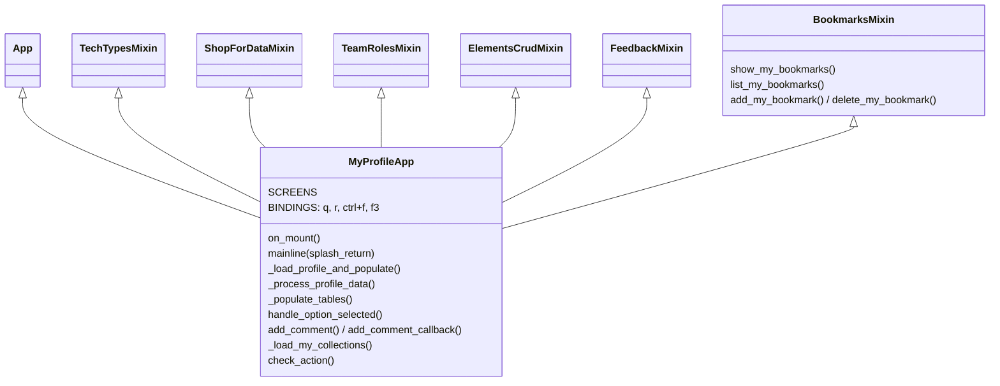
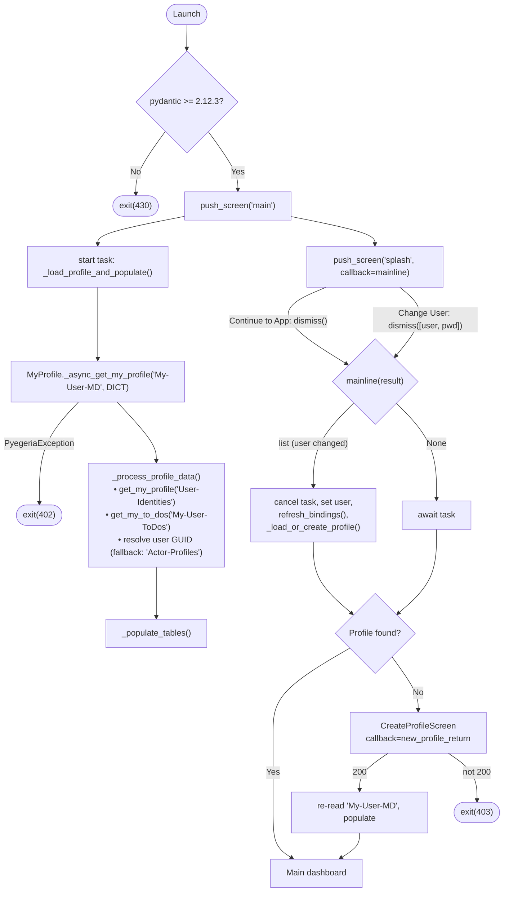
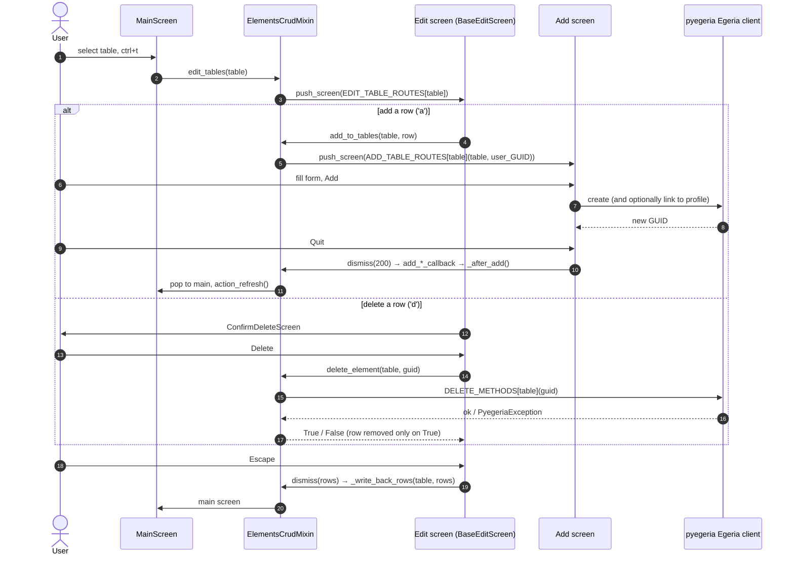
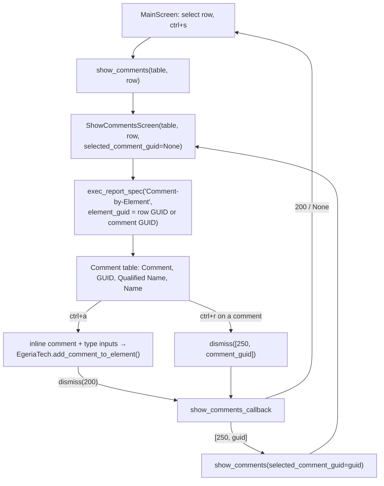
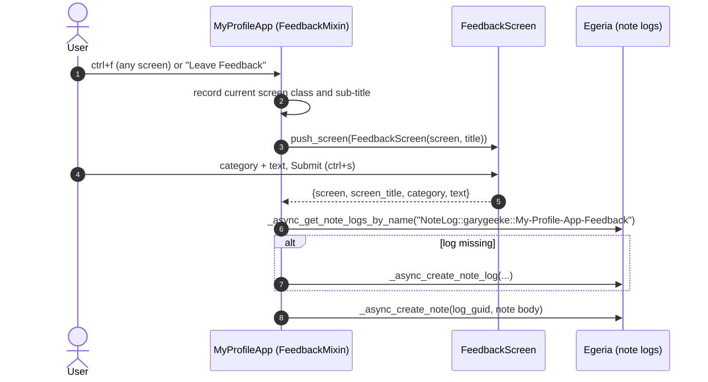
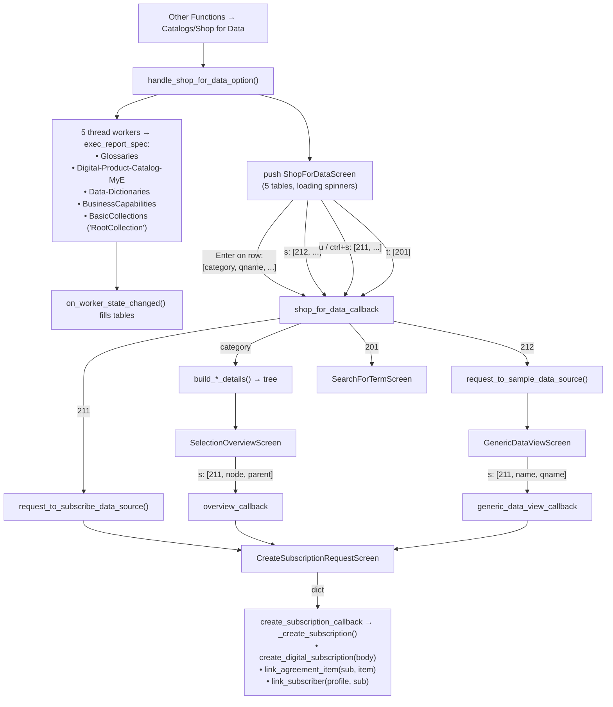
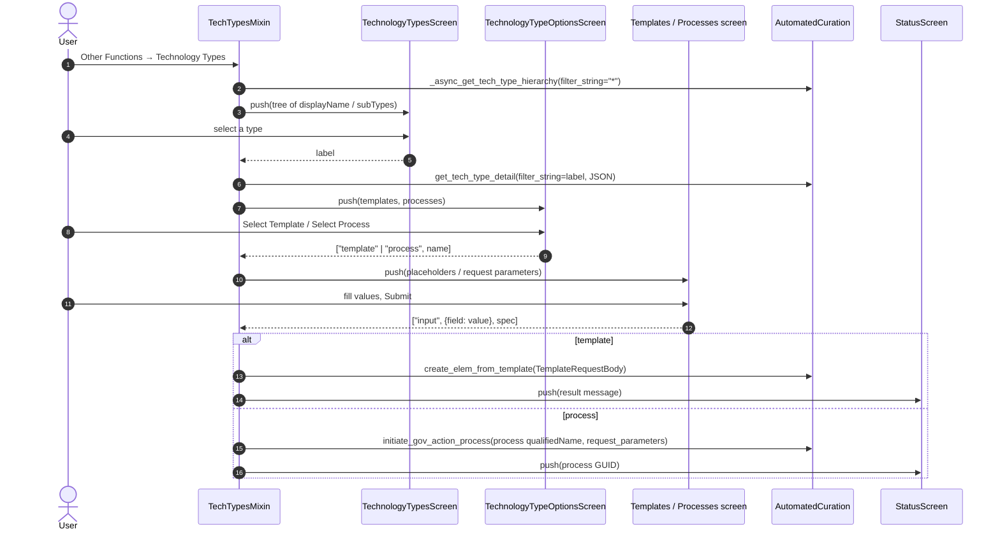

<!-- SPDX-License-Identifier: CC-BY-4.0 -->
<!-- Copyright Contributors to the ODPi Egeria project. -->

# My Profile Application: Reference Guide

This guide explains how the **My Profile Application** (`my_profile_app.py`) is put together: its screens, the handler mixins behind them, the Egeria calls each flow makes, and the codes screens use to talk to the app. To learn how to *use* the app (configuration, starting it, keys), see the [My Profile App User Manual](my_profile_app_manual.md).

All source files named here are in `my_egeria/my_egeria/DemoCode/My_Profile/`.

---

## Source Layout

| File | Contents |
| :--- | :--- |
| `my_profile_app.py` | `MyProfileApp`: startup, profile loading, table population, menu dispatch, comments-from-main |
| `MainScreen.py` | The dashboard: tables, Other Functions menu, row-selection tracking |
| `SplashScreen.py` | Welcome card and Change User |
| `CreateProfileScreen.py` | First-time profile creation |
| `elements_crud_handler.py` | `ElementsCrudMixin`: add/edit/delete routing, comments screen routing |
| `AddToElementsScreens.py` | `BaseAddScreen` and every Add screen |
| `EditElementsScreens.py` | `BaseEditScreen`, `ConfirmDeleteScreen`, per-table edit screens, `EditProfileScreen` |
| `AddCommentScreen.py`, `ShowCommentsScreen.py` | Commenting on a row; viewing and replying to comment threads |
| `feedback_handler.py`, `FeedbackScreens.py` | `FeedbackMixin`, `FeedbackScreen`, `FeedbackLogScreen` |
| `shop_for_data_handler.py` | `ShopForDataMixin`: catalog loading, overview trees, sampling, subscriptions |
| `ShopForDataScreen.py`, `SelectionOverviewScreen.py`, `GenericDataViewScreen.py`, `CreateSubscriptionRequestScreen.py`, `SearchForTermScreen.py` | Shop for Data screens |
| `ViewSubscriptionsScreen.py` | Subscriptions menu entry |
| `tech_types_handler.py`, `TechnologyTypeScreens.py` | `TechTypesMixin` and the technology type screens |
| `team_roles_handler.py`, `MyTeamScreen.py` | `TeamRolesMixin` and the team roster screen |
| `bookmarks_handler.py`, `MyBookMarksScreen.py` | `BookmarksMixin` (bookmarks kept in a personal collection) and the bookmarks screen |
| `UserIdentitiesScreen.py` | Read-only user identity table |
| `StatusScreen.py` | Result message with copy-GUID |
| `profile_utils.py` | Environment check and data clean-up helpers |
| `my_profile.tcss` | Layout and theme |
| `RETURN_CODES.md`, `catalog_api_calls.md` | Return-code list and Shop for Data API notes |

---

## Application Structure



- **App bindings:**
  - `q` quits with `200`.
  - `r` re-runs the profile load and table population.
  - `ctrl+f` (feedback) and `f3` (feedback log) are *priority* bindings. Textual ignores ordinary App bindings while a modal screen is active, and priority bindings get round that.
- **`check_action`** hides and disables `view_feedback_log` unless the current user is the feedback owner (`garygeeke`).
- **Screen registration:** most screens are registered by name in `SCREENS`. `EditCollectionsScreen`, `AddCollectionScreen`, `AddUserIdentityScreen`, `FeedbackScreen`, `FeedbackLogScreen` and `ConfirmDeleteScreen` are pushed as instances instead.
- **Mixins and `@on`:** the mixins are plain Python classes, not Textual message pumps. Textual only collects `@on(...)`-decorated handlers from classes built with its own metaclass, so an `@on` handler defined on a mixin is never dispatched. Put any `@on` handler on `MyProfileApp` itself and have it delegate to the mixin, as `_on_roles_row_selected` does. Handlers found by name (`on_worker_state_changed`, `action_*`) and callbacks passed to `push_screen` work on mixins.
- **Entry point:** `main()` runs the app. It is the target of the `my_profile` console script.

---

## Startup and Profile Loading



- **Parallel loading.** The profile load starts as soon as the app mounts, while the splash screen is still showing. If the user switches account, the background task is cancelled and the load is repeated for the new user.
- **Escape on the splash screen** dismisses it, the same as **Continue to App**. It must dismiss rather than `pop_screen`, because `pop_screen` discards the pushed screen's callback, so `mainline` (and the missing-profile check) would never run.
- **Change User** also writes the new user and password into pyegeria's cached `settings.User_Profile`. Screens read the user from there, so every screen opened afterwards runs its Egeria calls as the new user.
- **Change User check.** The splash screen builds an `Egeria` client from the new credentials and closes it again, but it does not request a token. Bad credentials are therefore only found when the profile load fails.
- **What `_process_profile_data` extracts** from the first `My-User-MD` record:
  - Contribution Record, which supplies the Karma Points;
  - Projects, Teams, Communities and Roles;
  - Note Logs, split into blogs and journal by their `class`.

### Create Profile

`CreateProfileScreen` builds a `NewElementRequestBody` from its fields and calls `MyProfile.add_my_profile(body)`:
- the qualified name is made from "Person", the employee ID, the country and the given and family names;
- `initials` is set to `"PAT"` and `employeeType` to `"Full-Time"`.

It returns `200` on success and `401` on failure.

---

## Main Screen Data Sources

| Table id | Source | Notes |
| :--- | :--- | :--- |
| `associations_table` | Communities from `My-User-MD` | |
| `my_collections_table` | `Egeria.find_collections("*", JSON)`, keeping those whose `elementHeader.versions.createdBy` is the current user, minus the bookmarks collection (`_load_my_collections`) | |
| `roles_table` | Roles from `My-User-MD` | |
| `teams_table` | Teams from `My-User-MD` | |
| `blogs_table`, `journal_table` | Note Logs from `My-User-MD` | |
| `todos_table` | `MyProfile.get_my_to_dos(report_spec="My-User-ToDos")` | |
| `user_identity_table` | `MyProfile.get_my_profile(report_spec="User-Identities")` | |

| `projects_table` | Projects from `My-User-MD` | |

`communities_table` is not on the main screen (communities show in User Associations); `_populate_tables_sync` skips any table that isn't composed.

`MainScreen` tracks the selected table and row through focus, highlight, select and cell events. It uses them for `ctrl+t` (edit table), `ctrl+a` (add comment) and `ctrl+s` (show comments).

### Other Functions menu dispatch (`handle_option_selected`)

| Option | Action |
| :--- | :--- |
| User Identities | `UserIdentitiesScreen(karma_points, user_identities)` |
| Catalogs/Shop for Data | `handle_shop_for_data_option()` |
| Edit Profile | `EditProfileScreen(karma_points, user_profile, user_GUID)` |
| Subscriptions | `ViewSubscriptionsScreen()` |
| Technology Types | `handle_technology_types_option()` |
| User Bookmarks | `show_my_bookmarks()` |
| Leave Feedback | `action_feedback()` |
| Feedback Log | `action_view_feedback_log()` (owner only) |

---

## Element Management (Add, Edit, Delete)

Three routing tables in `elements_crud_handler.py` drive everything, all keyed by the main-screen table id:

| Table id | Edit screen | Add screen | Delete call |
| :--- | :--- | :--- | :--- |
| `associations_table` | `EditAssociationsScreen` | `AddAssociationScreen` | `delete_community` |
| `blogs_table` | `EditBlogsScreen` | `AddBlogEntryScreen` | `delete_metadata_element` |
| `communities_table` | `EditCommunitiesScreen` | `AddCommunityScreen` | `delete_community` |
| `journal_table` | `EditJournalScreen` | `AddJournalEntryScreen` | `delete_metadata_element` |
| `my_collections_table` | `EditCollectionsScreen` | `AddCollectionScreen` | `delete_collection` |
| `projects_table` | `EditProjectsScreen` | `AddProjectScreen` | `delete_project` |
| `roles_table` | `EditRolesScreen` | `AddRoleScreen` | `delete_actor_role` |
| `teams_table` | `EditTeamsScreen` | `AddTeamScreen` | `delete_actor_profile` |
| `todos_table` | `EditTodosScreen` | `AddTodoScreen` | `delete_metadata_element` |
| `user_identity_table` | `EditIdentitiesScreen` | `AddUserIdentityScreen` | `delete_user_identity` |

These are `EDIT_TABLE_ROUTES`, `ADD_TABLE_ROUTES` and `DELETE_METHODS`. Blogs, journal entries and to-dos have no bespoke SDK delete, so they use the generic `delete_metadata_element`. It takes only a GUID, so it cannot get the element's type wrong.

### Edit screens (`BaseEditScreen`)

- **On mount:** each subclass names its `SOURCE_TABLE`, and the screen copies that table's columns and rows from the main screen.
- **`a` (add row):** calls `app.add_to_tables(SOURCE_TABLE, row)`, which pushes the Add screen from `ADD_TABLE_ROUTES`.
- **`d` (delete row):** takes the GUID from the row's last column and pushes `ConfirmDeleteScreen`. If the user confirms, it calls `app.delete_element(SOURCE_TABLE, guid)`, which looks up `DELETE_METHODS` and calls Egeria. The row is removed only if that returns `True`.
- **`Escape`:** dismisses with `[(row_key, row_values), ...]`. The table's edit callback then writes those rows back to the main table through `_write_back_rows()`.

### Add screens

The newer Add screens subclass **`BaseAddScreen`**. A subclass declares its form and implements only the Egeria calls:

```python
class AddCollectionScreen(BaseAddScreen):
    SCREEN_ID = "add_collection_screen"
    ELEMENT_NAME = "Collection"
    FIELDS = [("collection_name", "Name of Collection", True), ...]   # (input id, label, required)
    LINK_LABEL = None             # set to show a "link to my profile" switch

    def create_element(self, client, values) -> str: ...   # returns the new GUID
    def link_element(self, client, guid) -> None: ...      # only needed if LINK_LABEL is set
```

`BaseAddScreen` provides:
- connection settings;
- the form layout;
- required-field validation, which names the missing fields;
- the `Egeria` client lifecycle, including bearer token, session close and error notices;
- the optional link to the user's profile, skipped with a warning if the profile GUID is unknown;
- clearing the form after a successful add (a failed add keeps the input so it can be corrected);
- the Add, Quit and `ctrl+a` controls.

The screen stays open for repeated adds and dismisses with `200`.

| Add screen | Base | Egeria calls |
| :--- | :--- | :--- |
| `AddCollectionScreen` | `BaseAddScreen` | `create_collection(display_name, description, category)` |
| `AddUserIdentityScreen` | `BaseAddScreen` | `create_user_identity(body)` with `UserIdentityProperties`; `link_identity_to_profile(identity_guid, profile_guid)` |
| `AddTodoScreen` | `BaseAddScreen` | `create_my_todo(todo_name, description, priority, activity_status="REQUESTED")` |
| `AddBlogEntryScreen` | `BaseAddScreen` | `blog_my_activity(body)` with `BlogEntryProperties` (attached to the user's blog) |
| `AddJournalEntryScreen` | `BaseAddScreen` | `journal_my_activity(body)` with `JournalEntryProperties` (attached to the user's journal) |
| `AddProjectScreen` | `BaseAddScreen` | `create_project(...)`; link: `add_to_project_team(project_guid, actor_guid=profile GUID)` |
| `AddCommunityScreen` | `BaseAddScreen` | `create_community(body)` with `CommunityProperties` |
| `AddRoleScreen` | `BaseAddScreen` | `create_actor_role(body)` with `PersonRoleProperties`; link: `link_person_role_to_profile(role_guid, profile_guid)` |
| `AddTeamScreen` | `BaseAddScreen` | `create_actor_profile(body)` with `TeamProperties`; join: `create_actor_role` (a `TeamMember` role), `link_person_role_to_profile(role, profile)`, `link_assignment_scope(team, role)` |
| `AddAssociationScreen` | `ModalScreen` | None: a chooser that dismisses with `"project"` or `"community"`. `add_association_callback` then pushes `AddProjectScreen` or `AddCommunityScreen`. |

`BaseAddScreen.validate(values)` lets a subclass reject values before any Egeria call. To-Do checks that its priority is a whole number; Project checks its kind and its `YYYY-MM-DD` dates.

Team membership in Egeria is a `TeamMember` role (a PersonRole subtype) appointed to the person and scoped to the team by an `AssignmentScope` relationship. This is the same model Dr.Egeria's `Link Team Membership` uses. `link_element()` can read the form values through `self.last_values`. Communities have no "link to me" step, because pyegeria has no community-membership call.

When any Add screen closes, its `add_*_callback` calls `_after_add()`. That pops back to the main screen, which drops the edit screen's stale rows, and schedules `action_refresh()` so the new element appears.



### Edit Profile

`EditProfileScreen` pre-fills the person properties and calls `Egeria.update_actor_profile(user_GUID, UpdateElementRequestBody{PersonProperties})`. It returns `200` on success and `401` on failure.

Its `ctrl+c`, `ctrl+i`, `ctrl+r` and `ctrl+t` keys return `"community"`, `"identity"`, `"role"` or `"team"`. `edit_profile_callback` then opens the matching edit screen.

---

## Comments and Threaded Responses

There are two ways to comment.

**1. From the main screen (`ctrl+a`).**
1. `app.add_comment(table, row)` finds the row's GUID column, falling back to a "Qualified Name" column.
2. It pushes `AddCommentScreen`, which dismisses with `[comment, type, guid]`.
3. `add_comment_callback` calls `Egeria.add_comment_to_element(guid, comment, TYPE)`.

**2. From the comments screen (`ctrl+s`).** `ShowCommentsScreen` handles both viewing comments and replying to them:



A response is a comment whose anchor is another comment. Each `ctrl+r` re-opens the screen with the selected comment as its target, so threads can nest to any depth. `q` on the comments screen calls `app.pop_screen`.

---

## Feedback Mechanism

`FeedbackMixin` lets any user leave feedback from any screen.



Each note records:
- `qualifiedName`: `Note::{log_guid}::{user}::{timestamp}`
- `displayName`: `"{category} - {screen}"`
- `description`: the feedback text
- `additionalProperties`: `category`, `screen`, `screenTitle`, `submittedBy` and `submittedAt`

**Viewing the log.** `F3` or "Feedback Log" reads the notes with `_async_get_notes_for_note_log`, sorts them newest first and shows them in `FeedbackLogScreen`.

**Privacy.** Only the owner (`FEEDBACK_LOG_OWNER = "garygeeke"`) can open the log. The app enforces this, not Egeria.

---

## Team and Role Exploration

When a row in the Roles table is selected, `MyProfileApp._on_roles_row_selected` calls `TeamRolesMixin.handle_roles_table_row_selection`:
1. For a role whose name or type contains `TeamLeader` or `TeamMember`, it calls `find_team_members()`.
2. `find_team_members()` takes the text after the first `::` in the role name and runs `exec_report_spec("Team-Members")`.
3. The handler then pushes `MyTeam(members, properties)`.

`MyTeam` shows the team name, qualified name, category and description, and a Name / Role / GUID table. `q` returns `"200"` and `b` returns `"201"`.

---

## Shop for Data and Catalog Exploration



### Detail builders

| Category | Data used | Tree |
| :--- | :--- | :--- |
| dictionary | `Data-Dictionaries` | Grouped by subject area |
| domain | `BusinessCapabilities` | Containing members / member of |
| catalog | `Digital-Product-Catalog` | Products. For each digital product it also calls `find_tabular_data_sets(page_size=1)` and `get_tabular_data_set(max_row_count=10, output_format="MD")` to get sample data. |
| glossary | Pre-fetched "Folders" | Folders |
| collection | Pre-fetched root collections | First collection only |

### Selection overview

`SelectionOverviewScreen` shows details for the selected tree node:

| Node type | Report spec | Output format |
| :--- | :--- | :--- |
| glossary | `Glossary-Terms` | MD |
| catalog | `Digital-Products-MyE` | MD, plus sample data |
| dictionary | `Data-Dictionaries` | MD |
| domain | `BusinessCapabilities` | DICT, shown in a text area |
| collection | `Collections` | MD |

`q` returns `210`, `b` returns `200` and `s` returns `[211, node, parent]`.

### Sampling

Only digital products have real sample data. For other rows the sample view shows the element's attributes as Key/Value pairs. `GenericDataViewScreen` can parse several formats: tabular data set reports, `{"data": [...]}`, `dataRecords`/`columnDescriptions`, dicts, lists and strings.

### Subscriptions

- **Form result.** `CreateSubscriptionRequestScreen` returns `{externalSourceGUID, guid, GUID, displayName, description, identifier, Status}`. An invalid status becomes `DRAFT`.
- **Creating the subscription.** All three subscribe paths (shop table, overview, sample view) open `CreateSubscriptionRequestScreen`. Its result goes to `create_subscription_callback`, which calls `_create_subscription()`. That:
  1. calls `ProductManager.create_digital_subscription(body)` with `DigitalSubscriptionProperties`; `contentStatus` is the status from the form, and the qualified name includes the user and a timestamp, so names can repeat;
  2. calls `link_agreement_item(subscription, item)` to link the subscription to the chosen item;
  3. calls `link_subscriber(profile, subscription)` to link the user's profile as subscriber.
  If a link fails, the subscription is kept and the user gets a warning naming what couldn't be linked.
- **Viewing subscriptions.** `ViewSubscriptionsScreen` calls `Egeria.find_collections(search_string="*", metadata_element_type_name="DigitalSubscription", JSON)`. It lists those the user created: name, status, description and GUID.

### Glossary term search

`SearchForTermScreen` runs `exec_report_spec("Glossary-Terms", output_format="MD", search_string=term)` and renders the Markdown. `t` on `ShopForDataScreen` returns `[201]`, which opens it. Going back from it (`g`, result `201`) re-runs `handle_shop_for_data_option()`, so the catalog tables are reloaded rather than shown empty.

---

## Technology Types



- **Template validity dates.** Template requests use the fixed dates `effectiveFrom: 2026-01-01` and `effectiveTo: 2030-12-31`.
- **After the status screen** closes, `status_callback` returns to the main screen.
- **Process parameters.** `TechnologyTypeProcessesScreen` records each input's real parameter name (`parameter_names`), so names containing spaces or underscores are sent unchanged. Only non-empty values are sent. A process with no `qualifiedName` can't be started; the user is told why.
- **No technology types.** If the hierarchy comes back empty, the user gets a notice and stays on the main screen.
- **Fetch failure.** If the hierarchy can't be fetched, the app exits with `416`.

---

## Bookmarks

pyegeria has no favourites API, so `BookmarksMixin` (`bookmarks_handler.py`) keeps a user's bookmarks as the members of a personal collection. Its qualified name is `Collection::<user>::Bookmarks` and its display name is "My Bookmarks".

| Function | What it does |
| :--- | :--- |
| `list_my_bookmarks()` | `get_collections_by_name(qualified name)` → `get_collection_members(guid, JSON)` → `(name, type, GUID)` rows; `[]` if the collection doesn't exist yet, `None` if Egeria can't be reached |
| `show_my_bookmarks()` | Pushes `MyBookMarksScreen(rows)` |
| `add_my_bookmark(guid)` | Creates the collection on first use (`create_collection`), then `add_to_collection(collection, guid)` |
| `delete_my_bookmark(guid)` | `remove_from_collection(collection, guid)` |
| `bookmark_table_row(table, row_key)` | Reads the row's GUID column (labelled `GUID` or ending ` GUID`) with `profile_utils.row_identity()`. If there's no GUID, it resolves the row's `Qualified Name` with `get_guid_for_name`. Then it calls `add_my_bookmark`. Used by `ctrl+k` on `MainScreen` and `k` on `ShopForDataScreen`. |

`MyBookMarksScreen` lists the rows:
- `ctrl+n` adds a bookmark by GUID;
- `d` removes the highlighted bookmark;
- `q` closes the screen.

After each change it re-reads the list through the app. The lookup matches on the exact qualified name, so another user's "My Bookmarks" collection is never used. `profile_utils.element_summary()` flattens raw JSON elements for both bookmarks and My Collections, including member results wrapped in `relatedElement`.

---

## Status Screen

`StatusScreen(message)` shows a read-only message:
- `c` copies the first `'...'`-quoted substring (normally a GUID) to the clipboard with pyegeria's `copy_to_clipboard`;
- `q` and `Enter` return `200`;
- `b` returns `400`.

The app's `status_callback` then returns to the main screen.

---

## Report Specs and Clients

| Report spec | Used by |
| :--- | :--- |
| `My-User-MD` | Profile load and reload |
| `User-Identities` | User identity table |
| `My-User-ToDos` | To-dos table |
| `Actor-Profiles` | User GUID fallback |
| `Comment-by-Element` | Comments screen |
| `Team-Members` | Team roster |
| `Glossaries`, `Digital-Product-Catalog-MyE`, `Data-Dictionaries`, `BusinessCapabilities`, `BasicCollections` | Shop for Data tables |
| `Digital-Product-Catalog` | Catalog tree |
| `Digital-Products-MyE`, `Collections`, `Glossary-Terms` | Overview details and term search |

| Client | Used for |
| :--- | :--- |
| `MyProfile` | Profile, identities, to-dos, `add_my_profile` |
| `Egeria` | Element create, link and delete; comments from main; bookmarks; feedback note logs; tabular data; `update_actor_profile`; `find_collections` |
| `EgeriaTech` | Comments screen |
| `AutomatedCuration` | Technology types |
| `ProductManager` | Digital subscriptions |

Report specs are run with `exec_report_spec(...)`.

---

## Screen Return Codes

Screens tell the app what to do next through their `dismiss(...)` value:

| Code | Meaning |
| :--- | :--- |
| `200` | Done / back |
| `201` | Alternative navigation |
| `210` | Quit to main |
| `211` | Subscribe |
| `212` | Sample data |
| `250` | Show responses to a comment |

Failures use codes from the `4xx` range, and some of them exit the app. The [user manual](my_profile_app_manual.md#exit-and-return-codes) lists the common ones, and `RETURN_CODES.md` has the full list.

---

## Testing

The suite in `tests/micro-tests/my_profile/` has one module per handler and screen group.

**Fake mode (default).** Tests run against in-memory fakes. An autouse fixture blocks real HTTP, so any un-mocked Egeria call fails the test. Mark a test `@pytest.mark.allow_network` to opt out.

**Live mode (`PYEG_LIVE_EGERIA=1`).**
- `egeria_backend.py` swaps the fakes for mocks that wrap the real SDK. Call assertions therefore hold in both modes; only assertions about returned data differ.
- Connection details come from `PYEG_PLATFORM_URL`, `PYEG_SERVER_NAME`, `PYEG_USER_ID` and `PYEG_USER_PWD`.
- Live mode writes to the server: it creates subscriptions and template elements, and may create a profile.

**Running the whole app in a test.** Tests that run `MyProfileApp.run_test()` stub the profile client with `stub_profile_client()`.

**Add screens.** `test_screens.py::TestBaseAddScreen` covers the `BaseAddScreen` flow: required-field checks, create, link or no link, and keeping the form after a failed create.

---

## Known Gaps

The user-visible limitations are listed in the [user manual](my_profile_app_manual.md#known-limitations). Other internal gaps:

- `get_data_product_catalog_table`, `get_guid_for_qualified_name`, `display_glossary_term_details`, `tech_type_processes_details`, `unpack_egeria_data` and `display_selected_data_specification` are defined but never called.
- Bookmarks, My Collections, team joining, subscription links and starting processes have only been tested against fakes; they haven't yet been run against a live Egeria server.

---
License: [CC BY 4.0](https://creativecommons.org/licenses/by/4.0/),
Copyright Contributors to the ODPi Egeria project.
