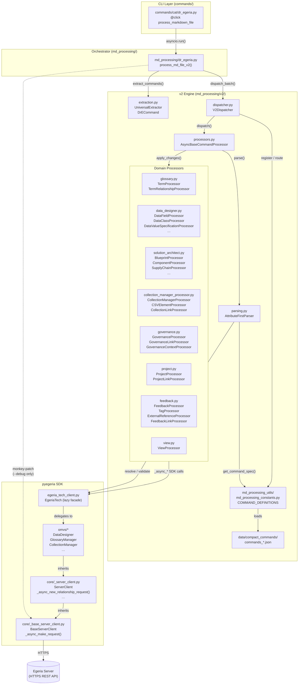
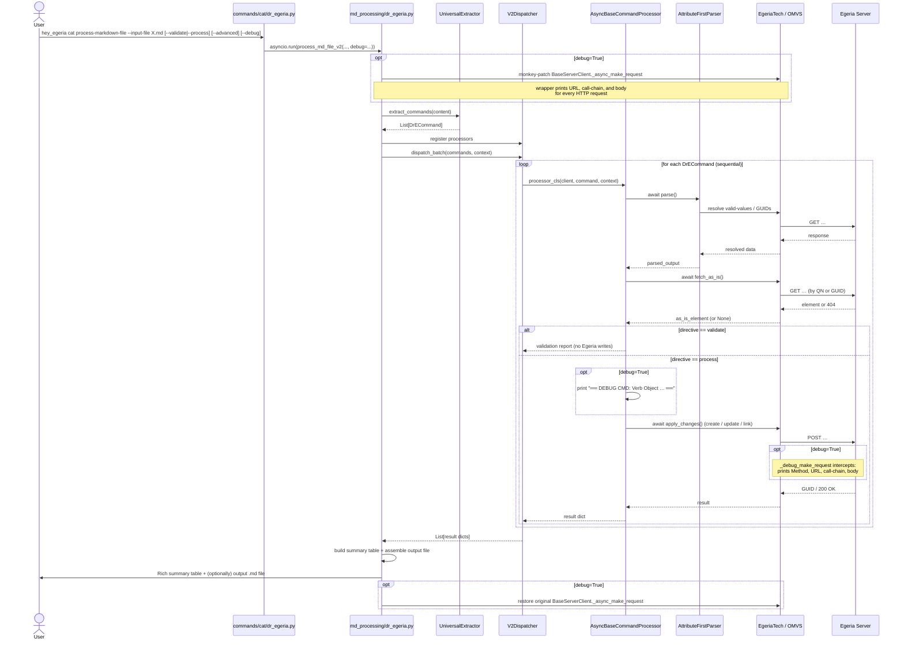
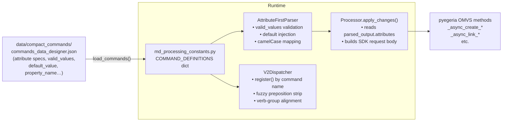

# Dr.Egeria — Module Structure & Processing Flow

This document provides a visual reference for the `md_processing` subsystem and its relationships to the `commands/` CLI layer and the `pyegeria` SDK.

---

## Module Dependency Map

---

## Processing Flow (Sequence)

---

## Key Data Structures

### `DrECommand` (extraction.py)

| Field | Type | Description |
|-------|------|-------------|
| `verb` | `str` | Canonical verb, e.g. `Create`, `Link` |
| `object_type` | `str` | Canonical object type, e.g. `Data Field` |
| `source_verb` | `str` | Verb exactly as written in the Markdown header |
| `source_object_type` | `str` | Object type exactly as written |
| `attributes` | `dict` | Raw `label → raw_value` mapping |
| `raw_block` | `str` | The complete original Markdown block |
| `is_command` | `bool` | `False` for non-command prose blocks |

### `parsed_output` (from `AttributeFirstParser.parse()`)

| Field | Type | Description |
|-------|------|-------------|
| `attributes` | `dict[str, AttrData]` | Parsed + validated attribute map |
| `qualified_name` | `str` | Resolved qualified name |
| `display_name` | `str` | Human-readable name |
| `guid` | `str \| None` | GUID if element already exists |
| `exists` | `bool` | Whether element was found in Egeria |
| `valid` | `bool` | Whether all required attributes parsed OK |
| `errors` | `list[str]` | Blocking errors (prevent execution) |
| `warnings` | `list[str]` | Non-blocking warnings |

### `context` dict (threaded through all processors)

| Key | Type | Description |
|-----|------|-------------|
| `directive` | `str` | `display`, `validate`, or `process` |
| `input_file` | `str` | Source file path |
| `request_id` | `str` | UUID for this run |
| `debug` | `bool` | Whether debug mode is active |
| `planned_elements` | `set[str]` | QNs of elements created earlier in the same document |

---

## Processor Hierarchy

```mermaid
classDiagram
    class AsyncBaseCommandProcessor {
        +client: EgeriaTech
        +command: DrECommand
        +context: dict
        +parsed_output: dict
        +execute() dict
        +apply_changes()* str
        +fetch_as_is()* dict
        +validate_only() str
        +render_result_markdown(guid) str
        +resolve_element_guid(name) str
    }

    AsyncBaseCommandProcessor <|-- TermProcessor
    AsyncBaseCommandProcessor <|-- TermRelationshipProcessor
    AsyncBaseCommandProcessor <|-- DataFieldProcessor
    AsyncBaseCommandProcessor <|-- DataClassProcessor
    AsyncBaseCommandProcessor <|-- DataValueSpecificationProcessor
    AsyncBaseCommandProcessor <|-- LinkDataFieldProcessor
    AsyncBaseCommandProcessor <|-- DataStructureProcessor
    AsyncBaseCommandProcessor <|-- DataCollectionProcessor
    AsyncBaseCommandProcessor <|-- BlueprintProcessor
    AsyncBaseCommandProcessor <|-- ComponentProcessor
    AsyncBaseCommandProcessor <|-- SupplyChainProcessor
    AsyncBaseCommandProcessor <|-- SolutionLinkProcessor
    AsyncBaseCommandProcessor <|-- CollectionManagerProcessor
    AsyncBaseCommandProcessor <|-- CollectionLinkProcessor
    AsyncBaseCommandProcessor <|-- ProjectProcessor
    AsyncBaseCommandProcessor <|-- GovernanceProcessor
    AsyncBaseCommandProcessor <|-- GovernanceLinkProcessor
    AsyncBaseCommandProcessor <|-- FeedbackProcessor
    AsyncBaseCommandProcessor <|-- ExternalReferenceProcessor
    AsyncBaseCommandProcessor <|-- FeedbackLinkProcessor
    AsyncBaseCommandProcessor <|-- ViewProcessor
```

---

## Compact Command JSON → Runtime Mapping

---

## File Reference

| File | Role |
|------|------|
| `commands/cat/dr_egeria.py` | Click CLI entry-point; `--validate` / `--process` shortcut flags, `--advanced`, `--debug` |
| `md_processing/dr_egeria.py` | Async orchestrator: extraction → dispatch → output; owns debug patch/restore |
| `md_processing/v2/extraction.py` | `UniversalExtractor` — produces `DrECommand` list from raw Markdown |
| `md_processing/v2/parsing.py` | `AttributeFirstParser` — async, spec-driven, with server-side validation cache |
| `md_processing/v2/dispatcher.py` | `V2Dispatcher` — sequential batch dispatch; fuzzy matching; planned-element tracking |
| `md_processing/v2/processors.py` | `AsyncBaseCommandProcessor` — base class: parse → validate → fetch → apply |
| `md_processing/v2/data_designer.py` | Data Designer domain processors (Data Field, Data Class, Data Value Specification, …) |
| `md_processing/v2/glossary.py` | Glossary / Term processors |
| `md_processing/v2/solution_architect.py` | Blueprint, Component, Supply-Chain processors |
| `md_processing/v2/collection_manager_processor.py` | Collection, Product, Agreement processors |
| `md_processing/v2/governance.py` | Governance definition processors |
| `md_processing/v2/project.py` | Project / Campaign / Task processors |
| `md_processing/v2/feedback.py` | Comment, Tag, External Reference, Like, Rating processors |
| `md_processing/v2/view.py` | `ViewProcessor` — runs pyegeria report engine |
| `md_processing/v2/rewriters.py` | `CommandRewriter` — upsert / verb-normalisation pre-pass |
| `md_processing/md_processing_utils/md_processing_constants.py` | `COMMAND_DEFINITIONS` registry; `load_commands()` |
| `md_processing/data/compact_commands/` | JSON specs driving parsing, validation and SDK call routing |
| `pyegeria/egeria_tech_client.py` | `EgeriaTech` lazy facade over all OMVS subclients |
| `pyegeria/core/_base_server_client.py` | `BaseServerClient._async_make_request` — HTTP transport layer; target of debug patch |

