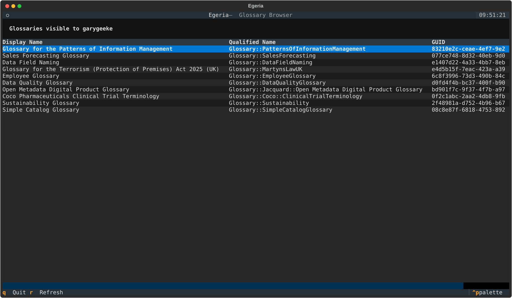
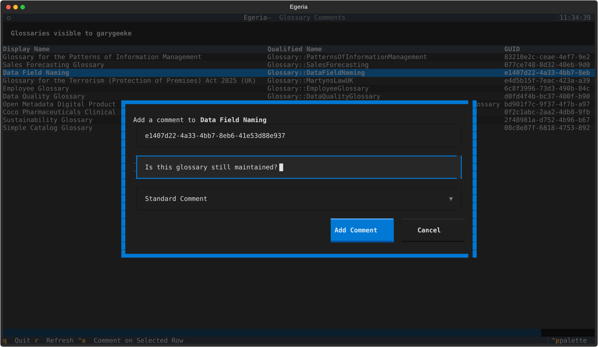
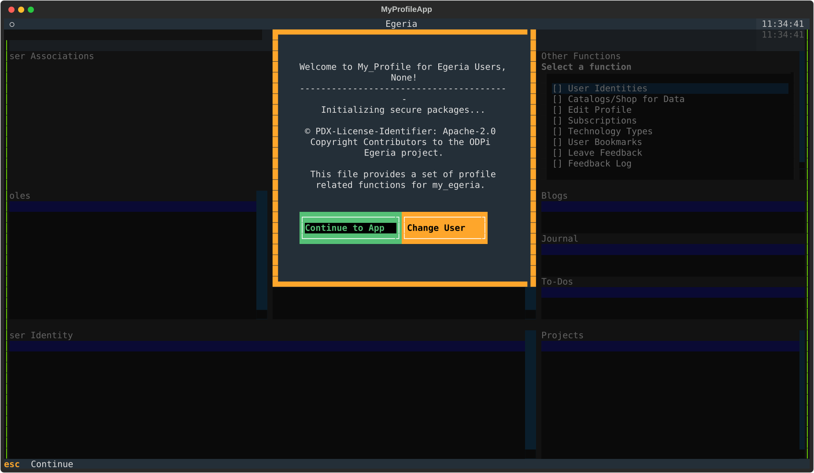
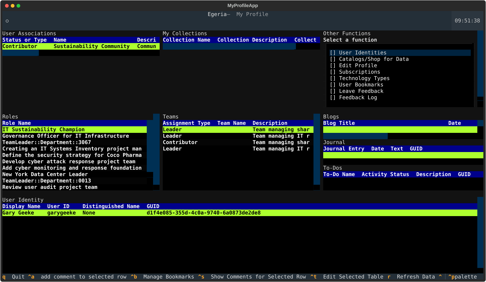
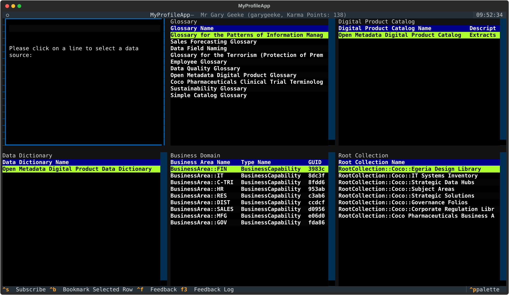
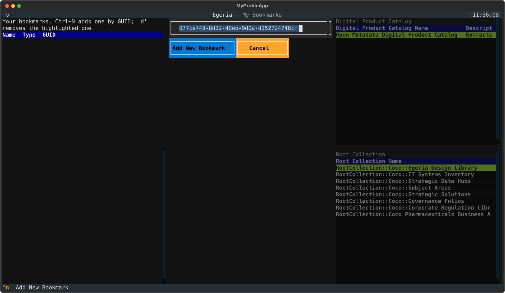

<!-- SPDX-License-Identifier: CC-BY-4.0 -->
<!-- Copyright Contributors to the ODPi Egeria project. -->

# Developer Guide: Building Egeria Applications in Python with pyegeria and Textual

This guide is for Python programmers who are new to [Egeria](https://egeria-project.org/) and to
[Textual](https://textual.textualize.io/). It shows how to write Python programs, and then
full terminal user interfaces (TUIs), that read and update open metadata held in Egeria.

You should already be comfortable with Python itself: classes and inheritance, decorators,
virtual environments, and the basic idea of `async`/`await`. No previous Egeria or Textual
knowledge is assumed.

The guide works in three stages:

1. **Learn the building blocks** with three small, runnable example programs that grow step by
   step, from a 30-line script to a Textual app that acts on the row the user selects.
2. **Read a real application**, the *My Profile* app from My Egeria, to see how the same
   patterns scale to a multi-screen app.
3. **Look at two other styles of pyegeria program** in this repository: *Dr. Egeria* (a
   Markdown command processor) and *hey_egeria* (a command line interface).

> **About borrowed content.** Egeria, pyegeria and Textual each have their own documentation,
> and this guide deliberately does not repeat all of it. Where a section summarises material
> from another guide, a **Source** note says so and links to the original, which is the
> authoritative and more complete version. A full list is in [References](#references).

## Contents

1. [The pieces and how they fit together](#1-the-pieces-and-how-they-fit-together)
2. [Set up a live Egeria to test against](#2-set-up-a-live-egeria-to-test-against)
3. [Set up your Python environment](#3-set-up-your-python-environment)
4. [Egeria concepts a Python programmer needs](#4-egeria-concepts-a-python-programmer-needs)
5. [pyegeria essentials (Step 1)](#5-pyegeria-essentials-step-1)
6. [Textual essentials (Steps 2 and 3)](#6-textual-essentials-steps-2-and-3)
7. [Case study: the My Profile app](#7-case-study-the-my-profile-app)
8. [Another style: Dr. Egeria](#8-another-style-dr-egeria)
9. [Another style: hey_egeria](#9-another-style-hey_egeria)
10. [Testing Textual apps](#10-testing-textual-apps)
11. [Debugging tips and common pitfalls](#11-debugging-tips-and-common-pitfalls)
12. [References](#references)

---

## 1. The pieces and how they fit together

| Piece | What it is | Where it lives |
|---|---|---|
| **Egeria** | An open source metadata and governance platform. It runs as a set of servers; you talk to it over REST. | [egeria-project.org](https://egeria-project.org/), [github.com/odpi/egeria](https://github.com/odpi/egeria) |
| **pyegeria** | The Python client library for Egeria. It wraps the REST APIs in Python classes and methods, and formats results. | This repository ([github.com/odpi/egeria-python](https://github.com/odpi/egeria-python)), package `pyegeria/`, also on PyPI as `pyegeria` |
| **Textual** | A Python framework for building rich terminal applications: widgets, layouts, CSS styling, key bindings, background workers. | [textual.textualize.io](https://textual.textualize.io/), [github.com/Textualize/textual](https://github.com/Textualize/textual) |
| **My Egeria** | Personal, user-facing interfaces to Egeria. *My Profile* is the TUI used as this guide's case study. | [My Egeria overview](https://egeria-project.org/user-interfaces/my-egeria/overview/), `my_egeria/` in this repository |
| **Dr. Egeria** | Turns Markdown documents containing commands into Egeria API calls and reports. | [Dr. Egeria overview](https://egeria-project.org/user-interfaces/dr-egeria/overview/), `md_processing/` and `commands/cat/dr_egeria.py` |
| **hey_egeria** | A command line interface for Egeria built on pyegeria, Click and Rich. | [Hey Egeria overview](https://egeria-project.org/user-interfaces/hey-egeria/overview/), `commands/` |

Every program in this guide has the same shape: **your code → pyegeria → Egeria view server
(REST) → metadata store**. Textual, Click or Markdown processing sit on top of that and decide
how the user interacts with it.

---

## 2. Set up a live Egeria to test against

You need a running Egeria to try anything in this guide. The easiest way is the **Egeria
Workspaces quick start**, which runs Egeria and its supporting services in Docker, and loads
it with demonstration metadata from the fictional *Coco Pharmaceuticals* company.

> **Source:** this section summarises the Egeria Workspaces
> [Quick Start](https://egeria-project.org/egeria-workspaces/quick-start/overview/) page.
> Follow that page for the current, complete instructions.

1. Install [Docker Desktop](https://www.docker.com/products/docker-desktop) (or
   [Podman](https://podman.io/docs)), and optionally [git](https://github.com/git-guides/install-git).
2. Get the [egeria-workspaces](https://github.com/odpi/egeria-workspaces) repository:

   ```bash
   git clone https://github.com/odpi/egeria-workspaces.git
   cd egeria-workspaces
   ```

3. Start Egeria on your own machine:

   ```bash
   ./quick-start-local
   ```

   The script downloads everything Egeria needs and starts it. (`./quick-start-multi-host` is
   the variant to use if other machines need to connect to it.)

The quick start provides the defaults that every example in this guide assumes:

| Setting | Value |
|---|---|
| Platform URL | `https://localhost:9443` |
| View server | `qs-view-server` |
| Example user | `garygeeke` (Gary Geeke, an IT infrastructure lead at Coco Pharmaceuticals) |

The quick-start page lists the other demonstration personas (Erin Overview, Peter Profile, and
so on). Each sees different metadata, so logging in as another persona is a good way to explore.
If you cannot run Docker, the
[Demo Environment](https://egeria-project.org/egeria-workspaces/demo-environment/overview/)
page describes a shared sandbox.

> **Treat this instance as disposable.** Some examples, and the live-mode tests, *write*
> metadata (comments, subscriptions, profiles). Run them against a quick-start instance, never
> against an Egeria you care about.

---

## 3. Set up your Python environment

Python 3.12 or later is required.

**Working in this repository** (recommended, because you get the examples, My Profile, Dr.
Egeria and hey_egeria source together):

```bash
git clone https://github.com/odpi/egeria-python.git
cd egeria-python
uv sync                       # creates .venv with pyegeria, textual and the dev tools
source .venv/bin/activate
```

**Using pyegeria in your own project** instead:

```bash
pip install pyegeria textual textual-dev   # textual-dev only for the dev console and `textual run`
```

### Tell pyegeria where Egeria is

pyegeria reads its connection settings automatically the first time a client is created. The
simplest option is a `.env` file in the directory you run your program from:

```bash
# .env
EGERIA_PLATFORM_URL=https://localhost:9443
EGERIA_VIEW_SERVER=qs-view-server
EGERIA_USER=garygeeke
EGERIA_USER_PASSWORD=secret
```

The order of precedence is: explicit arguments in your code, then OS environment variables,
then `.env`, then `config.json`, then built-in defaults.

> **Source:** configuration is covered fully in the
> [pyegeria Programming Guide](user_programming.md#configuration-system) in this repository.

Check everything works by running Step 1 (section 5):

```bash
python examples/developer_guide/step1_hello_pyegeria.py
```

---

## 4. Egeria concepts a Python programmer needs

A handful of Egeria ideas come up in every program. Each is linked to its full description.

- **Element.** Everything stored in Egeria (a glossary, a term, a person, a project, a data
  set) is a metadata *element* with a *type*, for example `Glossary` or `Project`.
- **GUID.** Every element has a globally unique identifier, a string such as
  `83210e2c-ceae-4ef7-9e20-d09d9929ea81`. Most "act on this element" APIs take a GUID. See
  [GUID](https://egeria-project.org/concepts/guid/).
- **Qualified name.** A unique, human-readable name, for example
  `Glossary::PatternsOfInformationManagement`. When you only have a qualified name you can ask
  Egeria for the GUID (see [section 7.5](#75-acting-on-the-selected-row)).
- **View server and view services.** Client programs talk to a *view server*
  (`qs-view-server` in the quick start). It offers a set of REST *view services* (OMVS), each
  focused on one area: Glossary Manager, My Profile, Collection Manager, and so on. pyegeria has
  roughly one Python class per view service. See
  [View Server](https://egeria-project.org/concepts/view-server/) and the
  [list of view services](https://egeria-project.org/services/omvs/).
- **Bearer token.** After creating a client you log in once with
  `create_egeria_bearer_token()`. The client then sends the token with every request.

### What a result looks like

Ask for raw results (`output_format="JSON"`) and each element comes back as a dict with an
`elementHeader` (identity and type, including the GUID) and a `properties` dict:

```python
{
    "class": "OpenMetadataRootElement",
    "elementHeader": {"guid": "83210e2c-ceae-4ef7-9e20-d09d9929ea81", "type": {"typeName": "Glossary"}, ...},
    "properties": {
        "displayName": "Glossary for the Patterns of Information Management",
        "qualifiedName": "Glossary::PatternsOfInformationManagement",
        "description": "The terminology used by ...",
        ...
    },
}
```

### Report specs: results already shaped for display

Most pyegeria `find_*`/`get_*` methods also accept an `output_format` other than `JSON`.
`DICT` returns one flat dict per element with friendly column names, and `TABLE`, `MD`
(Markdown) and `REPORT` return formatted text. Which columns are included is controlled by a
named **report spec** (for example `"Glossaries"`). The My Profile app uses report specs and
`DICT` output for most of its tables, because the result drops straight into a `DataTable`
row.

> **Caution:** a report spec returns only the columns it defines. The `Glossaries` spec has no
> GUID column, so a program that needs glossary GUIDs should use `JSON` output, as the
> examples do, or look the GUID up from the qualified name.

> **Source:** report specs are documented in
> [Output Formats and Report Specs](output-formats-and-report-specs.md) in this repository.

---

## 5. pyegeria essentials (Step 1)

> **Source:** this section summarises the
> [pyegeria Programming Guide](user_programming.md) in this repository and the
> [Python Client for Egeria](https://egeria-project.org/guides/developer/python-clients/overview/)
> page on egeria-project.org. Both go further than this section does.

### Clients

pyegeria offers clients at two levels:

- **One class per view service**, for example `GlossaryManager`, `MyProfile`,
  `CollectionManager`. Each holds the methods for that service.
- **Facades** that combine many services behind one object, for example `EgeriaTech` and
  `Egeria`. Their sub-clients are created lazily, on first use, so a facade is cheap to make.
  This guide's examples use `EgeriaTech`. The My Profile app uses both `Egeria` and `MyProfile`.

Every client takes the same four connection arguments:

```python
from pyegeria import EgeriaTech

client = EgeriaTech("qs-view-server", "https://localhost:9443", "garygeeke", "secret")
client.create_egeria_bearer_token("garygeeke", "secret")
try:
    glossaries = client.find_glossaries("*", output_format="JSON", graph_query_depth=0)
finally:
    client.close_session()
```

Four habits are worth forming from the start:

- **Always close the session** (`close_session()`), ideally in a `finally` block.
- **Pass `graph_query_depth=0`** when you don't need related elements. The default (3) asks
  Egeria to follow relationships, which is slower and, on a busy server, can time out.
- **Catch `PyegeriaException`.** All Egeria errors are raised as this type.
  `print_basic_exception(e)` prints a readable summary that includes Egeria's own message
  and suggested user action.
- **Expect a string when nothing matches.** Many `find_*` methods return a message string
  instead of an empty list, so check `isinstance(result, list)`.

### Sync and async

Every public method has two forms. `find_glossaries(...)` is synchronous and simplest to use in
scripts. `_async_find_glossaries(...)` is the `async` implementation it wraps. Use the async
form when you are already inside an event loop, as Textual apps and Dr. Egeria are, and want to
`await` the call. The My Profile app does this when it loads the profile
(`await self.my_profile_inst._async_get_my_profile(...)`).

### Step 1: a first program

[`examples/developer_guide/common.py`](../examples/developer_guide/common.py) holds two
helpers that all three steps share: `connection_settings()` reads the settings described in
section 3, and `fetch_glossaries()` runs the query above and flattens each element into a dict:

```python
def fetch_glossaries(conn: Connection, search_string: str = "*") -> list[dict]:
    client = EgeriaTech(conn.view_server, conn.platform_url, conn.user_name, conn.user_password)
    try:
        client.create_egeria_bearer_token(conn.user_name, conn.user_password)
        elements = client.find_glossaries(search_string, output_format="JSON", graph_query_depth=0)
    finally:
        client.close_session()

    if not isinstance(elements, list):
        return []
    return [
        {
            "Display Name": element["properties"].get("displayName", ""),
            "Qualified Name": element["properties"].get("qualifiedName", ""),
            "Description": element["properties"].get("description", ""),
            "GUID": element["elementHeader"]["guid"],
        }
        for element in elements
    ]
```

[`step1_hello_pyegeria.py`](../examples/developer_guide/step1_hello_pyegeria.py) prints them:

```console
$ python examples/developer_guide/step1_hello_pyegeria.py
Connecting to qs-view-server at https://localhost:9443 as garygeeke
Glossary for the Patterns of Information Management     83210e2c-ceae-4ef7-9e20-d09d9929ea81
Sales Forecasting Glossary                              077ce748-8d32-40eb-9d0a-d152724748cf
Data Field Naming                                       e1407d22-4a33-4bb7-8eb6-41e53d88e937
...
```

### Finding the method you need

pyegeria has hundreds of methods. To explore them:

- In Python, `dir(EgeriaTech)` lists the methods and `help(EgeriaTech.find_glossaries)` shows
  one method's parameters.
- The source is organised one file per view service in `pyegeria/omvs/`.
- The REST calls behind each method are recorded in `.http` files under
  `pyegeria/http clients/`, which is useful when you need to see exactly what is sent.

### Ask only for the relationships you need: `graph_query_depth`

Every pyegeria `find_*`/`get_*` call sends a `graph_query_depth` that tells Egeria how many
levels of related elements to compute for each result. **The default is 3**, which is rich but
expensive, and the cost grows with the number of results. Measured on the quickstart server
while tuning the My Profile app:

| Call | Default depth (3) | Depth 0 |
|---|---|---|
| List of 13 glossaries | timed out at 90 s | 0.3 s |
| List of 100 collections (My Profile startup) | about 70 s | 0.6 s |
| Members of a 7-element collection | timed out at 30 s | 0.3 s |

Choose the depth from what your screen actually shows:

- **Lists and tables of names, descriptions, GUIDs** (header and properties only): use
  **`graph_query_depth=0`**.
- **A detail view of one selected element that shows its related elements** (a glossary's
  folders, a collection's members): fetch **just that element at depth 1** when it is
  selected, rather than loading the whole list at depth 1.
- **Some views need more.** In My Profile, the profile's Teams, Communities and Projects and a
  team's individual members disappear below depth 2.

Pass it as a keyword: `client.find_glossaries("*", graph_query_depth=0)`. Through
`exec_report_spec`, put it in `params` (`params={"search_string": "*", "graph_query_depth": 0}`);
this is forwarded to the method from pyegeria 6.1.26. Earlier versions silently dropped it.
A `params=` keyword on an SDK method itself is **not** a way to pass it: it is ignored.

To check a lower depth is safe, run the call at both depths with `output_format="JSON"` (or the
`DICT` your screen uses) and compare the fields your code reads.

---

## 6. Textual essentials (Steps 2 and 3)

> **Source:** this section introduces the Textual features the examples and My Profile use. The
> [Textual Guide](https://textual.textualize.io/guide/) is the authoritative, much fuller
> reference, and each subsection links to the matching chapter.

### Step 2: show Egeria data in a DataTable

[`step2_glossary_browser.py`](../examples/developer_guide/step2_glossary_browser.py) shows the
same glossaries in a scrollable, selectable table:



The whole app is one class:

```python
class GlossaryBrowserApp(App):
    TITLE = "Egeria"
    SUB_TITLE = "Glossary Browser"

    CSS = """
    #heading { padding: 1 2; text-style: bold; }
    DataTable { height: 1fr; }
    """

    BINDINGS = [
        ("q", "quit", "Quit"),
        ("r", "refresh", "Refresh"),
    ]

    def compose(self) -> ComposeResult:
        yield Header(show_clock=True)
        yield Static(f"Glossaries visible to {self.conn.user_name}", id="heading")
        yield DataTable(id="glossary_table", cursor_type="row", zebra_stripes=True)
        yield Footer()

    def on_mount(self) -> None:
        table = self.query_one("#glossary_table", DataTable)
        table.add_columns("Display Name", "Qualified Name", "GUID")
        self.action_refresh()

    def action_refresh(self) -> None:
        table = self.query_one("#glossary_table", DataTable)
        table.clear()
        table.loading = True
        self.load_glossaries()

    @work(thread=True, exclusive=True)
    def load_glossaries(self) -> None:
        try:
            glossaries = fetch_glossaries(self.conn)
        except PyegeriaException as e:
            self.call_from_thread(self.notify, f"Egeria request failed: {e}", severity="error")
            glossaries = []
        self.call_from_thread(self.show_glossaries, glossaries)

    def show_glossaries(self, glossaries: list[dict]) -> None:
        table = self.query_one("#glossary_table", DataTable)
        for glossary in glossaries:
            table.add_row(glossary["Display Name"], glossary["Qualified Name"], glossary["GUID"],
                          key=glossary["GUID"])
        table.loading = False
        self.notify(f"Loaded {len(glossaries)} glossaries")
```

The Textual ideas it uses:

- **App and compose** ([App Basics](https://textual.textualize.io/guide/app/)). `compose()`
  yields the widgets that make up the screen. `on_mount()` runs once they exist, which makes it
  the place to set up columns and start loading data.
- **Widgets and queries** ([Widgets](https://textual.textualize.io/guide/widgets/),
  [DataTable](https://textual.textualize.io/widgets/data_table/)). Give a widget an `id` and
  find it again with `self.query_one("#glossary_table", DataTable)`. A `DataTable` row can be
  given a `key`. Here it is the GUID, so the GUID of a selected row is available without
  reading a cell.
- **CSS** ([Textual CSS](https://textual.textualize.io/guide/CSS/)). Layout and styling use a
  CSS dialect, either inline as above or in a separate `.tcss` file named by `CSS_PATH` (as
  My Profile does).
- **Bindings and actions** ([Input](https://textual.textualize.io/guide/input/),
  [Actions](https://textual.textualize.io/guide/actions/)). The `("r", "refresh", "Refresh")`
  binding runs the method `action_refresh` and shows "r Refresh" in the footer.
- **Workers** ([Workers](https://textual.textualize.io/guide/workers/)). A synchronous Egeria
  call takes a noticeable time. Made directly from an event handler, it would freeze the UI.
  `@work(thread=True)` runs the method in a background thread. **Widgets must only be
  changed from the UI thread**, so the worker hands its results back with
  `self.call_from_thread(...)`. Setting `table.loading = True` shows a spinner until then.
- **Notifications.** `self.notify(...)` shows a toast message, with `severity="warning"` or
  `"error"` for problems.

### Step 3: act on the selected row with a modal screen

Most useful TUIs let the user pick something and then *do* something to it.
[`step3_glossary_comments.py`](../examples/developer_guide/step3_glossary_comments.py) extends
Step 2: highlight a glossary, press **Ctrl+A**, and a dialog opens, already holding that
glossary's GUID, for adding a comment to it in Egeria.



The app subclasses Step 2. Textual merges the `BINDINGS` lists, so Step 2's keys still work:

```python
class GlossaryCommentsApp(GlossaryBrowserApp):
    BINDINGS = [("ctrl+a", "add_comment", "Comment on Selected Row")]

    def action_add_comment(self) -> None:
        table = self.query_one("#glossary_table", DataTable)
        if table.row_count == 0:
            self.notify("There are no rows to comment on", severity="warning")
            return
        row_key = table.coordinate_to_cell_key(table.cursor_coordinate).row_key
        name = table.get_row(row_key)[0]
        self.push_screen(AddCommentScreen(name, row_key.value), callback=self.comment_entered)

    def comment_entered(self, result: tuple[str, str, str] | None) -> None:
        if result:
            self.add_comment(*result)

    @work(thread=True)
    def add_comment(self, guid: str, comment: str, comment_type: str) -> None:
        ...
        response = client.add_comment_to_element(guid, comment=comment, comment_type=comment_type)
```

And the dialog itself:

```python
class AddCommentScreen(ModalScreen[tuple[str, str, str] | None]):
    def compose(self) -> ComposeResult:
        with Vertical(id="dialog"):
            yield Label(f"Add a comment to [b]{self.element_name}[/b]")
            yield Input(value=self.element_guid, placeholder="GUID of the element", id="guid")
            yield Input(placeholder="Comment text", id="comment")
            yield Select(..., value="STANDARD_COMMENT", allow_blank=False, id="comment_type")
            with Horizontal(id="buttons"):
                yield Button("Add Comment", variant="primary", id="add")
                yield Button("Cancel", id="cancel")

    @on(Button.Pressed, "#add")
    def handle_add(self) -> None:
        guid = self.query_one("#guid", Input).value.strip()
        comment = self.query_one("#comment", Input).value.strip()
        if not guid or not comment:
            self.notify("Both a GUID and comment text are required", severity="warning")
            return
        self.dismiss((guid, comment, self.query_one("#comment_type", Select).value))
```

The new Textual ideas:

- **Screens** ([Screens](https://textual.textualize.io/guide/screens/)). An app holds a stack
  of screens. `push_screen()` puts a new one on top, and a `ModalScreen` covers the screen
  beneath it and takes all input until it closes.
- **Returning a result.** `self.dismiss(value)` closes the screen and passes `value` to the
  `callback` given to `push_screen()`. The type parameter, `ModalScreen[tuple[...] | None]`,
  documents what comes back. This *push → dismiss → callback* round trip is how every dialog
  in My Profile returns data.
- **Messages and `@on`** ([Events and Messages](https://textual.textualize.io/guide/events/)).
  Widgets post messages such as `Button.Pressed`. `@on(Button.Pressed, "#add")` handles the
  message only when it comes from the widget with id `add`.
- **Pre-filling input.** `Input(value=...)` puts the selected row's GUID in place, but the user
  can still edit it. My Profile's bookmark screen uses exactly the same technique
  ([section 7.5](#75-acting-on-the-selected-row)).

> **Note:** Step 3 writes to Egeria when you press *Add Comment*. Use a quick-start instance.

---

## 7. Case study: the My Profile app

*My Profile* is a TUI in which an Egeria user sees and maintains their own profile: roles,
teams, projects, blogs, journal and to-dos. It also lets them browse catalogs ("shop for
data"), subscribe to data products, comment on elements and leave feedback. It is a real
application, so it shows how the patterns from section 6 hold up at scale.

> **Source:** for what the app does from a user's point of view, see the
> [My Profile App User Manual](my_profile_app_manual.md). For its architecture, workflows and
> sequence diagrams in more depth, see [Egeria User Guide: My Profile Application](My-Egeria-Doc.md).
> This section picks out the patterns most useful to copy.

### 7.1 Running it

```bash
cd my_egeria/my_egeria/DemoCode/My_Profile
python my_profile_app.py
```

When developing, run it under the Textual dev tools so you can see its log output. Start the
console in one terminal and the app in another:

```bash
textual console                          # terminal 1: shows self.log(...) output
textual run --dev my_profile_app.py      # terminal 2
```

> **Pitfall:** make sure the `textual` command is the one from your project's `.venv`
> (`which textual`). A global install brings its own, possibly older, pydantic. pyegeria then
> builds request bodies that Egeria silently misreads ("parameter ... is null" errors). The app
> checks for this at startup and exits with code 430 if the environment is wrong.

The app opens with a splash screen, where you can continue as the configured user or switch
user:



Then comes the main screen:



### 7.2 How the code is organised

All files are in
[`my_egeria/my_egeria/DemoCode/My_Profile/`](../my_egeria/my_egeria/DemoCode/My_Profile/):

| File(s) | Role |
|---|---|
| `my_profile_app.py` | The `App` subclass, `MyProfileApp`: startup, loading the profile, filling the main tables, and shared actions such as comments. |
| `MainScreen.py` | The main dashboard screen: its layout, and keeping track of which table and row are selected. |
| `*Screen.py`, `*Screens.py` | One class per screen or dialog: `SplashScreen`, `ShopForDataScreen`, `MyBookMarksScreen`, `AddCommentScreen`, the `Edit*`/`Add*` screens, and so on. |
| `*_handler.py` | **Mixins**, each holding one feature area's logic: `shop_for_data_handler.py`, `tech_types_handler.py`, `team_roles_handler.py`, `elements_crud_handler.py`, `feedback_handler.py`, `bookmarks_handler.py`. |
| `profile_utils.py` | Plain functions with no UI code: data clean-up, flattening Egeria elements (`element_summary`), reading a row's GUID and qualified name (`row_identity`), and the environment check. |
| `my_profile.tcss` | All the Textual CSS for the app. |
| `RETURN_CODES.md` | The catalogue of numeric codes that screens pass back through `dismiss()`. |

Two design choices keep `my_profile_app.py` manageable.

**Feature logic lives in mixins.** The app class is assembled from them:

```python
class MyProfileApp(App, TechTypesMixin, ShopForDataMixin, TeamRolesMixin, ElementsCrudMixin, FeedbackMixin,
                   BookmarksMixin):
```

Each mixin adds the methods for one feature. For example, `ShopForDataMixin` adds
`handle_shop_for_data_option()`, its workers, and the callback for the Shop for Data screen. A
mixin can call any other app method through `self`.

**Screens are registered by name.** `SCREENS` maps names to screen classes, so code can push a
screen by name, for example `push_screen("main")`:

```python
    SCREENS = {
        "splash": SplashScreen,
        "main": MainScreen,
        "create_profile": CreateProfileScreen,
        "shop_4_data": ShopForDataScreen,
        "my_bookmarks": MyBookMarksScreen,
        # ... about 35 screens in all
    }
```

Screens that need constructor arguments, such as data to display, are created directly
instead: `push_screen(MyBookMarksScreen(my_bookmarks, target_guid=...))`.

### 7.3 Startup: load data while the splash screen shows

`on_mount` shows the main screen, starts loading the profile in the background, and puts the
splash screen on top, all at once. By the time the user presses *Continue*, the data is
usually already loaded:

```python
    async def on_mount(self) -> None:
        environment_error = check_request_serialization()
        if environment_error:
            self.exit(430, return_code=1, message=environment_error)
            return
        await self.push_screen("main")
        self._load_task = asyncio.create_task(self._load_profile_and_populate())
        await self.push_screen("splash", callback=self.mainline)
```

`_load_profile_and_populate()` uses the **async** pyegeria API directly, because it runs on
Textual's event loop:

```python
            self.my_profile_inst = MyProfile(self.view_server, self.platform_url, self.user_name, self.user_password)
            self.my_profile_inst.create_egeria_bearer_token(self.user_name, self.user_password)
            self.my_profile_data = await self.my_profile_inst._async_get_my_profile(
                report_spec="My-User-MD",
                output_format="DICT",
            )
```

When the splash screen is dismissed, `mainline()` receives its result. A `[user, password]`
list means the user switched identity, so the background load is cancelled and redone. If no
profile exists, the app pushes `CreateProfileScreen`. This is the push → dismiss → callback
pattern from Step 3, used to control the app's whole flow.

### 7.4 Loading several tables in parallel with workers

The Shop for Data screen shows five tables, each filled by a separate Egeria query:



`ShopForDataMixin.handle_shop_for_data_option()` creates each `DataTable`, sets
`loading = True`, starts one worker per table, and pushes the screen at once. Each worker is a
thread worker in a named **group**:

```python
    @work(thread=True, exclusive=False, group="glossary_group")
    async def get_glossary_data(self):
        try:
            self.glossary_data = exec_report_spec(
                format_set_name="Glossaries",
                output_format="DICT",
                params={"search_string": "*","graph_query_depth": 0},
                view_server=self.view_server,
                view_url=self.platform_url,
                user=self.user_name,
                user_pass=self.user_password,
            )
        except PyegeriaException as e:
            ...
        return self.glossary_data
```

`exec_report_spec()` runs a named report spec and returns its rows. Rather than calling
`call_from_thread`, these workers just *return* their result. Textual then posts a
`Worker.StateChanged` message on the UI thread, and the mixin's `on_worker_state_changed`
uses the group name to decide which table to fill:

```python
    def on_worker_state_changed(self, event: Worker.StateChanged) -> None:
        group_name = event.worker.group
        if event.state == WorkerState.SUCCESS:
            if group_name == "glossary_group":
                ...
                for g in self.glossary_data_extract:
                    glossary_table.add_row(g.get("Display Name", ""), g.get("Description", ""), g.get("Qualified Name", ""))
            elif group_name == "product_group":
                ...
        if event.state in (WorkerState.SUCCESS, WorkerState.ERROR, WorkerState.CANCELLED):
            ...  # turn off that table's loading spinner
```

That is the second of the two standard worker patterns, so you now have both:

| Pattern | Use it when |
|---|---|
| `call_from_thread(...)` from inside the worker (Step 2) | One worker updates one thing, and the code is simplest kept together. |
| Return a value, handle `Worker.StateChanged` (My Profile) | Several workers run at once and one handler routes the results. |

### 7.5 Acting on the selected row

My Profile lets the user act on "the selected row" from several places: add a comment
(Ctrl+A), show comments (Ctrl+S), edit (Ctrl+T), bookmark it (Ctrl+K) and open bookmarks with
its GUID ready to add (Ctrl+B). Two problems need solving.

**Which row is selected?** `MainScreen` records the table and row whenever the user
highlights, selects or focuses one, by handling `DataTable.RowHighlighted`,
`DataTable.RowSelected`, `DataTable.CellHighlighted` and `DescendantFocus` events. It then
offers one method that prefers the focused table's cursor and falls back to the last
recorded selection:

```python
    def get_current_table_and_row(self) -> tuple[str | None, Any]:
        """Return the currently focused or selected table id and row key."""
        focused_table = self.get_focused_table()
        if focused_table is not None:
            table_id = focused_table.id
            row_key = None
            if focused_table.row_count > 0 and 0 <= focused_table.cursor_row < focused_table.row_count:
                try:
                    row_key = focused_table.coordinate_to_cell_key(focused_table.cursor_coordinate).row_key
                except Exception:
                    row_key = None
            return table_id, row_key
        return self.selected_table, self.selected_row
```

**What is that row's GUID?** The tables don't all use the GUID as the row key, so the app
finds it by column heading instead. `profile_utils.row_identity(table, row_key)` returns the
row's GUID (from a column headed "GUID", or ending " GUID" such as "Collection GUID") and its
qualified name. Some tables, such as Shop for Data's glossary table (built from the
`Glossaries` report spec, which has no GUID column), only have the qualified name. For those,
`BookmarksMixin.get_row_guid` asks Egeria for the GUID:

```python
    def get_row_guid(self, table: Any, row_key: Any) -> str | None:
        if table is None or row_key is None:
            return None
        guid, qualified_name = row_identity(table, row_key)
        if guid or not qualified_name:
            return guid or None
        client = None
        try:
            client = self._bookmarks_client()
            resolved = client.get_guid_for_name(qualified_name)
            # "No elements found" is returned, rather than an exception, when nothing matches
            return resolved if isinstance(resolved, str) and resolved and "No " not in resolved else None
        ...
```

Because `get_row_guid` takes the table itself, not a table name on one particular screen, any
screen can use it, and each key binding is a few lines:

- **Ctrl+K** on the main screen, or **k** on Shop for Data, calls
  `self.app.bookmark_table_row(table, row_key)`, which bookmarks the row straight away.
- **Ctrl+B** calls `self.app.show_my_bookmarks(self.app.get_row_guid(table, row_key))`. The
  bookmark screen receives the GUID as `target_guid` and pre-fills its input with it, just as
  Step 3 did:



**The lesson:** put "how do I identify the selected element" in one shared helper, and make
each screen's key binding a few lines that call it.

**Where the bookmarks are kept.** Egeria has no special "bookmark" type, so My Profile uses
ordinary building blocks. Each user has a private collection with the qualified name
`Bookmarks::<user id>`, and each bookmark is a member of that collection. The collection is
created the first time the user adds a bookmark, by `BookmarksMixin` in `bookmarks_handler.py`.
A single `create_collection` call also
*anchors* it to the user's profile and links it there with a `ResourceList` relationship:

```python
        body = {
            "class": "NewElementRequestBody",
            "anchorGUID": profile_guid,
            "isOwnAnchor": False,
            "parentGUID": profile_guid,
            "parentRelationshipTypeName": "ResourceList",
            "parentAtEnd1": True,
            "parentRelationshipProperties": {
                "class": "ResourceListProperties",
                "resourceUse": BOOKMARKS_RESOURCE_USE,
                "resourceUseDescription": f"Private bookmarks for {self.user_name}",
            },
            "properties": {
                "class": "CollectionProperties",
                "qualifiedName": bookmarks_qualified_name(self.user_name),
                "displayName": BOOKMARKS_DISPLAY_NAME,
                ...
            },
        }
        guid = client.create_collection(body=body)
```

After that, bookmarking is plain collection membership:
`add_to_collection(collection_guid, element_guid)`, `get_collection_members(collection_guid)`
and `remove_from_collection(collection_guid, element_guid)`. Because the qualified name is
predictable, the app finds the collection again with
`get_collections_by_name("Bookmarks::<user id>")`, and
`get_attached_collections(profile_guid)` finds it from the profile side. The same approach
suits any per-user list (reading lists, watched items): a well-known qualified name, anchored
to and linked from the profile.

### 7.6 Other patterns worth copying

- **Return codes from screens.** Screens dismiss with small integers (200 = OK, 211 =
  subscribe, 212 = sample data, 4xx = failure), or with a list whose first entry is the code.
  The callback branches on the code. [`RETURN_CODES.md`](../my_egeria/my_egeria/DemoCode/My_Profile/RETURN_CODES.md)
  records them all, which matters once dozens of screens share the convention.
- **Priority bindings.** Ordinary app-level bindings are ignored while a `ModalScreen` is
  active. Declaring `Binding("ctrl+f", "feedback", "Feedback", priority=True)` makes
  "leave feedback" work on every screen.
- **Hiding bindings.** `check_action()` returns `False` to hide a binding from the footer. My
  Profile uses it to show the Feedback Log key only to the log's owner.
- **Startup environment check.** `profile_utils.check_request_serialization()` catches a broken
  environment before the user sees confusing errors. A fast, explicit check beats a slow,
  mysterious failure.

---

## 8. Another style: Dr. Egeria

Dr. Egeria is not a TUI. It reads a Markdown document, finds the commands written in it,
checks them, and turns them into pyegeria calls. It shows pyegeria used as the engine of a
larger tool.

> **Source:** see the [Dr. Egeria overview](https://egeria-project.org/user-interfaces/dr-egeria/overview/),
> the [Dr. Egeria user manual](dr_egeria_manual.md), and the design notes in
> [docs/design/](design/README.md) for the full picture. This section only points out the
> parts most relevant to a pyegeria programmer.

A command is a level-2 heading naming the action, followed by level-3 headings for its
attributes. This one is from
[`sample-data/egeria-inbox/dr_egeria_intro_part1.md`](../sample-data/egeria-inbox/dr_egeria_intro_part1.md):

```markdown
## Create Glossary

### Display Name

Egeria-Markdown

### Language

English

### Description

Glossary to describe the vocabulary of Dr.Egeria – an Egeria Markdown language ...

### Qualified Name
Glossary::Egeria-Markdown
```

Run it:

```bash
dr_egeria sample-data/egeria-inbox/dr_egeria_intro_part1.md              # validate only (default)
dr_egeria sample-data/egeria-inbox/dr_egeria_intro_part1.md --process    # really create it
dr_egeria <file> --process --debug   # also print every Egeria request URL and body
```

Inside, each command is handled by a **processor class**. The base class,
`AsyncBaseCommandProcessor` in `md_processing/v2/processors.py`, does the shared work:
parsing attributes, deriving the qualified name, looking up whether the element already exists
(so `Create` becomes `Update` when it does), and resolving references to other elements into
GUIDs. A subclass only implements `apply_changes()`. `ReportProcessor` in
[`md_processing/v2/report.py`](../md_processing/v2/report.py) is a compact example:

```python
class ReportProcessor(AsyncBaseCommandProcessor):
    async def apply_changes(self) -> str:
        attributes = self.parsed_output["attributes"]
        qualified_name = self.parsed_output.get("qualified_name") or self.derive_qualified_name(attributes)
        ...
        props = set_element_prop_body("Report", qualified_name, attributes)
        ...
        if self.as_is_element:
            guid = self.as_is_element["elementHeader"]["guid"]
            ...
            await self.client._async_update_asset(guid, update_body)
        else:
            ...
            guid = await self.client._async_create_asset(["ReportProperties"], create_body)
        ...
        return await self.render_result_markdown(guid)
```

What to take from it:

- The same `elementHeader`/`guid` structure from section 4 appears here.
- It awaits the `_async_*` methods, because Dr. Egeria runs on an event loop.
- **Upsert by qualified name.** Look the element up first, then create or update. This makes
  a command safe to run twice, a good habit for any program that writes metadata.

---

## 9. Another style: hey_egeria

`hey_egeria` is a command line interface: `hey_egeria cat show glossary glossaries`,
`hey_egeria tech show ...`, and so on (add `--help` at any level to see the commands). Each command is a small pyegeria program behind a
[Click](https://click.palletsprojects.com/) command, and most display their results with
[Rich](https://rich.readthedocs.io/) tables.

> **Source:** see the [Hey Egeria overview](https://egeria-project.org/user-interfaces/hey-egeria/overview/)
> and the [command line interface documentation](../commands/doc/README.md) in this repository.

The command that lists glossaries is in
[`commands/cli/egeria.py`](../commands/cli/egeria.py). It only collects the options and calls
a display function:

```python
@click.pass_context
def glossaries(ctx, search_string, output_format):
    """Display a list of glossaries"""
    c = ctx.obj
    display_glossaries(
        search_string,
        c.view_server,
        c.view_server_url,
        c.userid,
        c.password,
        c.jupyter,
        c.width,
        output_format,
    )
```

The display function is in
[`commands/cat/list_glossaries.py`](../commands/cat/list_glossaries.py). It uses the same
client pattern as Step 1, and then builds either a Rich table or a Markdown file:

```python
    m_client = EgeriaTech(view_server, view_url, user_id=user, user_pwd=user_pass)
    token = m_client.create_egeria_bearer_token()
    ...
    output = m_client.find_glossaries(search_string, output_format=output_format)
```

hey_egeria also links back to Textual. The CLI is decorated with `@tui(...)` from
[Trogon](https://github.com/Textualize/trogon), a Textualize library that turns any Click
application into a Textual app with menus and forms for every command. Run `hey_egeria tui`
to try it. You get a full TUI without writing any Textual code.

**Choosing a style for your own program:**

| If you want... | Start from |
|---|---|
| A one-off script or a scheduled job | Step 1 |
| A command that others run from the shell | hey_egeria (Click + Rich) |
| An interactive, multi-screen application | Steps 2–3, then My Profile |
| Metadata maintained as documents | Dr. Egeria |

---

## 10. Testing Textual apps

Textual can run an app *headless*, with no terminal, and drive it from code with a `Pilot`
that presses keys and clicks widgets.

> **Source:** [Textual Guide: Testing](https://textual.textualize.io/guide/testing/).

```python
async def test_comment_dialog_prefills_guid():
    app = GlossaryCommentsApp()
    async with app.run_test(size=(140, 36)) as pilot:
        table = app.query_one(DataTable)
        while table.loading:
            await pilot.pause(0.5)
        await pilot.press("down", "ctrl+a")
        assert isinstance(app.screen, AddCommentScreen)
        assert app.screen.query_one("#guid", Input).value == table.coordinate_to_cell_key(
            table.cursor_coordinate).row_key.value
```

This repository's pytest configuration uses `asyncio_mode = auto`, so `async def` tests need
no extra decorators. The My Profile tests in
[`tests/micro-tests/my_profile/`](../tests/micro-tests/my_profile/README.md) show the full
approach. The same tests run against a **fake** pyegeria backend by default, and against a
real server when you set `PYEG_LIVE_EGERIA=1`.

The `Pilot` is also how this guide's screenshots were made.
[`examples/developer_guide/capture_screenshots.py`](../examples/developer_guide/capture_screenshots.py)
drives the examples and My Profile and calls `app.save_screenshot()` at each step. Rerun it to
refresh the images after a UI change:

```bash
python examples/developer_guide/capture_screenshots.py
```

---

## 11. Debugging tips and common pitfalls

- **See your log output.** `self.log(...)` writes to the Textual dev console. Run
  `textual console` in one terminal and `textual run --dev your_app.py` in another. `print()`
  output is hidden while a Textual app is running.
- **See what was sent to Egeria.** `print_basic_exception(e)` shows Egeria's own error
  message, its ID, and the suggested action. For Dr. Egeria, `--debug` prints every request.
- **The UI freezes.** A synchronous pyegeria call is running on the UI thread. Move it into a
  `@work(thread=True)` worker.
- **Odd glitches or errors after loading data.** Check that no worker thread changes a widget
  directly. Hand every change back with `call_from_thread`, or return the result and handle
  `Worker.StateChanged`.
- **Results are empty, or a column is missing.** The report spec doesn't define that column,
  or `graph_query_depth` is too low for related data. Try `output_format="JSON"` to see
  everything Egeria returned.
- **Slow responses or time-outs.** Use `graph_query_depth=0` unless you need relationships
  (see [Ask only for the relationships you need](#ask-only-for-the-relationships-you-need-graph_query_depth)),
  and `page_size` to limit how many results come back.
- **`assert task is not None` in `textual/rlock.py`.** You are on Python 3.14, which Textual
  does not yet support. Use Python 3.13.
- **"Parameter ... is null" from Egeria when the parameter was set.** Your program is running
  under a different Python than your venv. Check `which python` and `which textual`.
- **An action does nothing.** Check for two `@on` handlers with the same method name in one
  class. The second silently replaces the first.
- **A non-Egeria error crashes the app.** `except PyegeriaException` doesn't catch, for
  example, `AttributeError` or `KeyError`. Around calls whose result shape you aren't sure
  of, catch more broadly and report the error with `notify()`.

---

## References

### Egeria project (egeria-project.org)

| Topic | Link | Used in |
|---|---|---|
| Egeria home | <https://egeria-project.org/> | §1 |
| Egeria Workspaces Quick Start | <https://egeria-project.org/egeria-workspaces/quick-start/overview/> | §2 (summarised) |
| Egeria Workspaces repository | <https://github.com/odpi/egeria-workspaces> | §2 |
| Demo Environment | <https://egeria-project.org/egeria-workspaces/demo-environment/overview/> | §2 |
| Python Client for Egeria (pyegeria) | <https://egeria-project.org/guides/developer/python-clients/overview/> | §5 (summarised) |
| pyegeria concept page | <https://egeria-project.org/concepts/pyegeria/> | §5 |
| GUID | <https://egeria-project.org/concepts/guid/> | §4 |
| View Server | <https://egeria-project.org/concepts/view-server/> | §4 |
| View services (OMVS) | <https://egeria-project.org/services/omvs/> | §4 |
| My Egeria | <https://egeria-project.org/user-interfaces/my-egeria/overview/> | §1, §7 |
| Dr. Egeria | <https://egeria-project.org/user-interfaces/dr-egeria/overview/> | §8 (summarised) |
| Hey Egeria | <https://egeria-project.org/user-interfaces/hey-egeria/overview/> | §9 (summarised) |
| Developer guides index | <https://egeria-project.org/guides/developer/> | further reading |

### This repository (egeria-python)

| Document | Used in |
|---|---|
| [pyegeria Programming Guide](user_programming.md) | §3, §5 (summarised) |
| [Output Formats and Report Specs](output-formats-and-report-specs.md) | §4 |
| [My Profile App User Manual](my_profile_app_manual.md) | §7 |
| [Egeria User Guide: My Profile Application](My-Egeria-Doc.md) | §7 |
| [My Profile return codes](../my_egeria/my_egeria/DemoCode/My_Profile/RETURN_CODES.md) | §7.6 |
| [My Profile tests](../tests/micro-tests/my_profile/README.md) | §10 |
| [Dr. Egeria user manual](dr_egeria_manual.md) and [design notes](design/README.md) | §8 |
| [Command line interface docs](../commands/doc/README.md) | §9 |
| [Developer Guide examples](../examples/developer_guide/) | §5, §6, §10 |

### Textual and related libraries

| Topic | Link | Used in |
|---|---|---|
| Textual Guide (all chapters) | <https://textual.textualize.io/guide/> | §6 (summarised) |
| App Basics | <https://textual.textualize.io/guide/app/> | §6 |
| Screens | <https://textual.textualize.io/guide/screens/> | §6, §7 |
| Textual CSS | <https://textual.textualize.io/guide/CSS/> | §6 |
| Input / Actions (bindings) | <https://textual.textualize.io/guide/input/>, <https://textual.textualize.io/guide/actions/> | §6, §7.6 |
| Events and Messages | <https://textual.textualize.io/guide/events/> | §6 |
| Workers | <https://textual.textualize.io/guide/workers/> | §6, §7.4 |
| Testing | <https://textual.textualize.io/guide/testing/> | §10 |
| DataTable widget | <https://textual.textualize.io/widgets/data_table/> | §6, §7.5 |
| Textual repository | <https://github.com/Textualize/textual> | §1 |
| Trogon (Click → Textual) | <https://github.com/Textualize/trogon> | §9 |
| Click | <https://click.palletsprojects.com/> | §9 |
| Rich | <https://rich.readthedocs.io/> | §9 |

*Versions used to write this guide:* Textual 8.2, pyegeria 6.1, Egeria quick start
(egeria-workspaces) as of October 2026.
