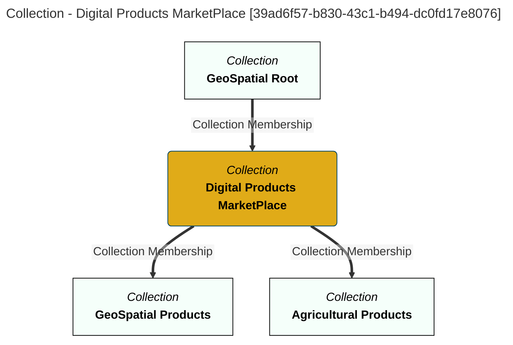
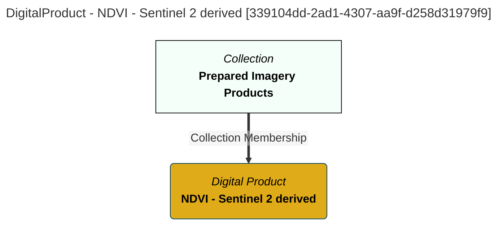
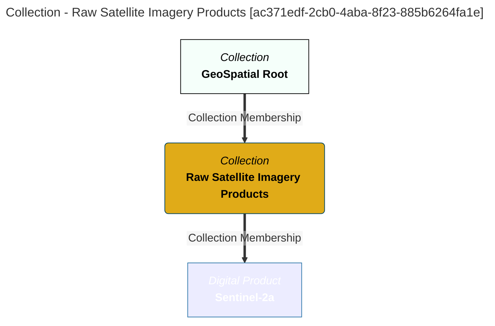
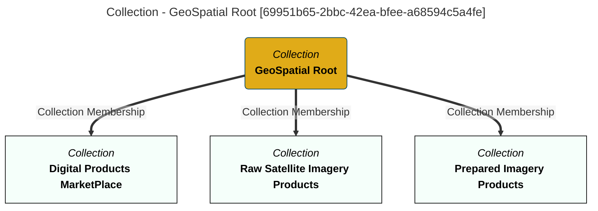
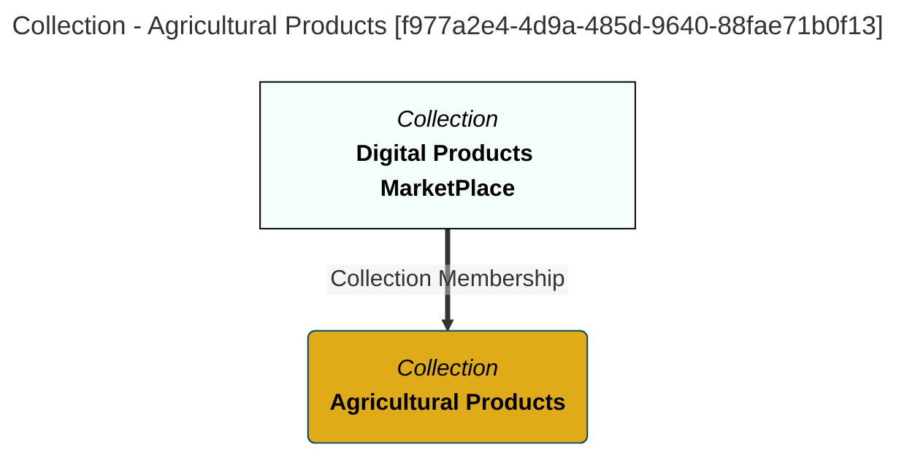
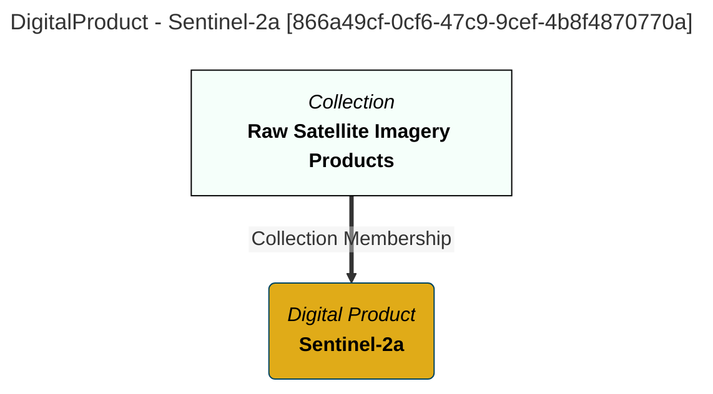
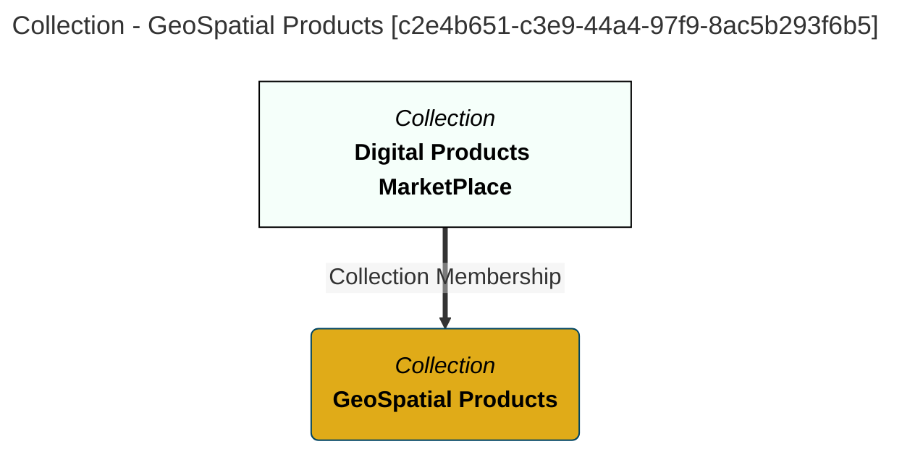
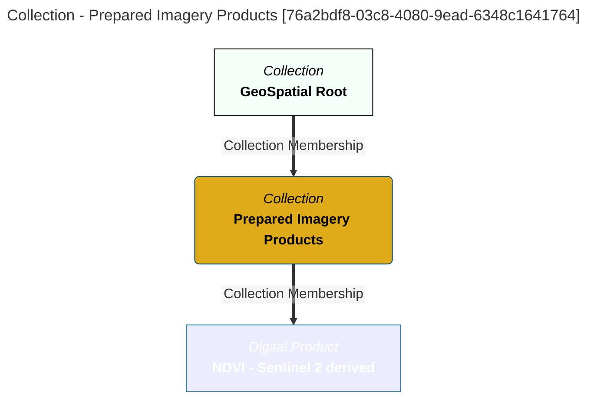
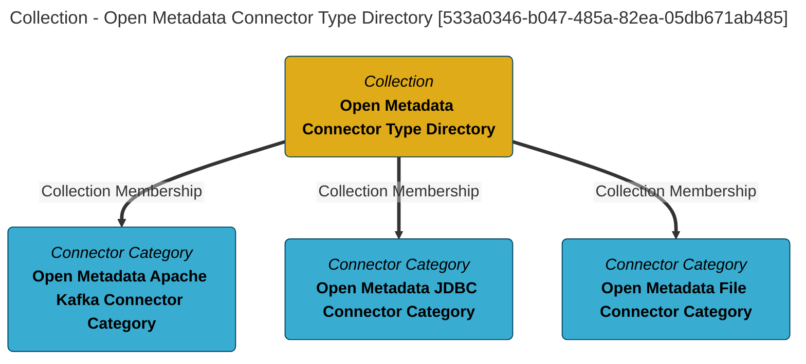

# Common Collection Information
Attributes generic to all Collections.

# Collections Report - created at 2025-08-12 13:35
	Collections  found from the search string:  `All`

# Collections Name: Digital Products MarketPlace

## Display Name
Digital Products MarketPlace

## Qualified Name
[Folder::Digital-Products-MarketPlace](#39ad6f57-b830-43c1-b494-dc0fd17e8076)

## Category
GeoSpatial

## Description
This is the digital products marketplace

## Type Name
Collection

## Created By
erinoverview

## Create Time
2025-08-12T18:26:51.578+00:00

## Members
Folder::GeoSpatial-Products, Folder::Agricultural-Products

## GUID
39ad6f57-b830-43c1-b494-dc0fd17e8076

## Mermaid Graph

[[Commons]]
---

# Collections Name: NDVI - Sentinel 2 derived

## Display Name
NDVI - Sentinel 2 derived

## Qualified Name
[DigitalProduct::NDVI---Sentinel-2-derived](#339104dd-2ad1-4307-aa9f-d258d31979f9)

## Category
GeoSpatial

## Description
NDVI vegetation index calculated from Sentinel 2 imagery

## Type Name
DigitalProduct

## Created By
erinoverview

## Create Time
2025-08-12T18:26:51.891+00:00

## GUID
339104dd-2ad1-4307-aa9f-d258d31979f9

## Mermaid Graph

[[Commons]]
---

# Collections Name: Raw Satellite Imagery Products

## Display Name
Raw Satellite Imagery Products

## Qualified Name
[Folder::Raw-Satellite-Imagery-Products](#ac371edf-2cb0-4aba-8f23-885b6264fa1e)

## Category
GeoSpatial

## Description
Raw satellite imagery imported from or referenced from satellite data providers

## Type Name
Collection

## Created By
erinoverview

## Create Time
2025-08-12T18:26:51.960+00:00

## Members
DigitalProduct::Sentinel-2a

## GUID
ac371edf-2cb0-4aba-8f23-885b6264fa1e

## Mermaid Graph

[[Commons]]
---

# Collections Name: GeoSpatial Root

## Display Name
GeoSpatial Root

## Qualified Name
[myLocal::RootCollection::GeoSpatial-Root](#69951b65-2bbc-42ea-bfee-a68594c5a4fe)

## Category
GeoSpatial

## Description
This is the root of the GeoSpatial work

## Type Name
Collection

## Created By
erinoverview

## Create Time
2025-08-12T18:26:51.536+00:00

## Members
Folder::Digital-Products-MarketPlace, Folder::Raw-Satellite-Imagery-Products, Folder::Prepared-Imagery-Products

## GUID
69951b65-2bbc-42ea-bfee-a68594c5a4fe

## Mermaid Graph

[[Commons]]
---

# Collections Name: Agricultural Products

## Display Name
Agricultural Products

## Qualified Name
[Folder::Agricultural-Products](#f977a2e4-4d9a-485d-9640-88fae71b0f13)

## Category
GeoSpatial

## Description
Agricultural product offerings

## Type Name
Collection

## Created By
erinoverview

## Create Time
2025-08-12T18:26:51.734+00:00

## GUID
f977a2e4-4d9a-485d-9640-88fae71b0f13

## Mermaid Graph

[[Commons]]
---

# Collections Name: Sentinel-2a

## Display Name
Sentinel-2a

## Qualified Name
[DigitalProduct::Sentinel-2a](#866a49cf-0cf6-47c9-9cef-4b8f4870770a)

## Category
GeoSpatial

## Description
Level 2a (surface level) imagery

## Type Name
DigitalProduct

## Created By
erinoverview

## Create Time
2025-08-12T18:26:52.028+00:00

## GUID
866a49cf-0cf6-47c9-9cef-4b8f4870770a

## Mermaid Graph

[[Commons]]
---

# Collections Name: GeoSpatial Products

## Display Name
GeoSpatial Products

## Qualified Name
[Folder::GeoSpatial-Products](#c2e4b651-c3e9-44a4-97f9-8ac5b293f6b5)

## Category
GeoSpatial

## Description
GeoSpatial product offerings

## Type Name
Collection

## Created By
erinoverview

## Create Time
2025-08-12T18:26:51.653+00:00

## GUID
c2e4b651-c3e9-44a4-97f9-8ac5b293f6b5

## Mermaid Graph

[[Commons]]
---

# Collections Name: Prepared Imagery Products

## Display Name
Prepared Imagery Products

## Qualified Name
[Folder::Prepared-Imagery-Products](#76a2bdf8-03c8-4080-9ead-6348c1641764)

## Category
GeoSpatial

## Description
Imagery products that are ready for consumption

## Type Name
Collection

## Created By
erinoverview

## Create Time
2025-08-12T18:26:51.811+00:00

## Members
DigitalProduct::NDVI---Sentinel-2-derived

## GUID
76a2bdf8-03c8-4080-9ead-6348c1641764

## Mermaid Graph

[[Commons]]
---

# Collections Name: Open Metadata Connector Type Directory

## Display Name
Open Metadata Connector Type Directory

## Qualified Name
OpenMetadataConnectorTypeDirectory_09450b83-20ff-4a8b-a8fb-f9b527bbcba6

## Description
Open Metadata standard connector categories and connector types.

## Type Name
Collection

## Created By
Egeria Project

## Create Time
2025-08-11T11:13:28.062+00:00

## Updated By
Egeria Project

## Members
OpenMetadataKafkaConnectorCategory_09450b83-20ff-4a8b-a8fb-f9b527bbcba6, OpenMetadataJDBCConnectorCategory_09450b83-20ff-4a8b-a8fb-f9b527bbcba6, OpenMetadataFileConnectorCategory_09450b83-20ff-4a8b-a8fb-f9b527bbcba6

## GUID
533a0346-b047-485a-82ea-05db671ab485

## Mermaid Graph

[[Commons]]