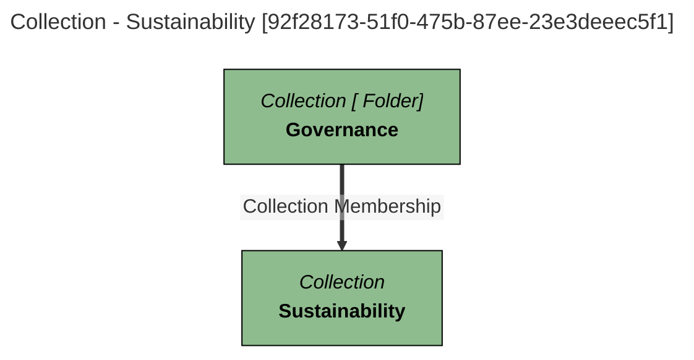

# Common Collection Information
Attributes generic to all Collections.

# Collection Report - created at 2025-09-21 19:53
	Collection  found from the search string:  `All`

<a id="92f28173-51f0-475b-87ee-23e3deeec5f1"></a>
# Collection Name: Sustainability

## Display Name
Sustainability

## Qualified Name
[DigitalProductCatalogFolder::Governance:Sustainability](#92f28173-51f0-475b-87ee-23e3deeec5f1)

## Category
Part of Coco Pharmaceuticals'' digital product catalog.

## Description
Information relating to the Coco Pharmaceuticals'' sustainability initiatives.

## Type Name
Collection

## Created By
Egeria Project

## Create Time
2021-12-20T07:20:40.038+00:00

## Updated By
Egeria Project

## Member Of
DigitalProductCatalogFolder::Governance

## GUID
92f28173-51f0-475b-87ee-23e3deeec5f1

## Mermaid Graph


[[Commons]]
---

<a id="310ff203-d9c3-4197-abfc-e0f4d323ac86"></a>
# Collection Name: Outcome

## Display Name
Outcome

## Qualified Name
[DigitalProductCatalogFolder::Clinical:Outcome](#310ff203-d9c3-4197-abfc-e0f4d323ac86)

## Category
Part of Coco Pharmaceuticals'' digital product catalog.

## Description
Information relating to the work understanding the result of a course of treatment.

## Type Name
Collection

## Created By
Egeria Project

## Create Time
2021-12-20T07:20:40.038+00:00

## Updated By
Egeria Project

## Member Of
DigitalProductCatalogFolder::Governance

## GUID
92f28173-51f0-475b-87ee-23e3deeec5f1

## Mermaid Graph


[[Commons]]
---

<a id="4108a380-cfba-4619-b768-14c7757bc8ef"></a>
# Collection Name: Digital Product Management

## Display Name
Digital Product Management

## Qualified Name
[DigitalProductCatalogFolder::Governance:DigitalProductManagement](#4108a380-cfba-4619-b768-14c7757bc8ef)

## Category
Part of Coco Pharmaceuticals'' digital product catalog.

## Description
Information relating to the management of digital products.

## Type Name
Collection

## Created By
Egeria Project

## Create Time
2021-12-20T07:20:40.038+00:00

## Updated By
Egeria Project

## Member Of
DigitalProductCatalogFolder::Governance

## GUID
92f28173-51f0-475b-87ee-23e3deeec5f1

## Mermaid Graph


[[Commons]]
---

<a id="e9051467-ea55-496a-9cd0-fcad710e28bc"></a>
# Collection Name: Treatment

## Display Name
Treatment

## Qualified Name
[DigitalProductCatalogFolder::Treatment](#e9051467-ea55-496a-9cd0-fcad710e28bc)

## Category
Part of Coco Pharmaceuticals'' digital product catalog.

## Description
Information relating to the Coco Pharmaceutical products and practices around patient care.

## Type Name
Collection

## Created By
Egeria Project

## Create Time
2021-12-20T07:20:40.038+00:00

## Updated By
Egeria Project

## Containing Members
DigitalProductCatalogFolder::Treatment:Product, DigitalProductCatalogFolder::Treatment:Recipe, DigitalProductCatalogFolder::Treatment:Order

## Member Of
DigitalProductCatalogFolder::Governance

## GUID
92f28173-51f0-475b-87ee-23e3deeec5f1

## Mermaid Graph


[[Commons]]
---

<a id="9306d05f-db5b-4f4e-bc43-13fa52ce8efd"></a>
# Collection Name: Recipe

## Display Name
Recipe

## Qualified Name
[DigitalProductCatalogFolder::Treatment:Recipe](#9306d05f-db5b-4f4e-bc43-13fa52ce8efd)

## Category
Part of Coco Pharmaceuticals'' digital product catalog.

## Description
Information relating to the ingredients and manufacturing know-how for Coco Pharmaceutical products.

## Type Name
Collection

## Created By
Egeria Project

## Create Time
2021-12-20T07:20:40.038+00:00

## Updated By
Egeria Project

## Containing Members
DigitalProductCatalogFolder::Treatment:Product, DigitalProductCatalogFolder::Treatment:Recipe, DigitalProductCatalogFolder::Treatment:Order

## Member Of
DigitalProductCatalogFolder::Governance

## GUID
92f28173-51f0-475b-87ee-23e3deeec5f1

## Mermaid Graph


[[Commons]]
---

<a id="34673f4c-1696-4a3e-a59f-58e74c61ced6"></a>
# Collection Name: Product

## Display Name
Product

## Qualified Name
[DigitalProductCatalogFolder::Treatment:Product](#34673f4c-1696-4a3e-a59f-58e74c61ced6)

## Category
Part of Coco Pharmaceuticals'' digital product catalog.

## Description
Information relating to the Coco Pharmaceutical products to be used in particular treatments.

## Type Name
Collection

## Created By
Egeria Project

## Create Time
2021-12-20T07:20:40.038+00:00

## Updated By
Egeria Project

## Containing Members
DigitalProductCatalogFolder::Treatment:Product, DigitalProductCatalogFolder::Treatment:Recipe, DigitalProductCatalogFolder::Treatment:Order

## Member Of
DigitalProductCatalogFolder::Governance

## GUID
92f28173-51f0-475b-87ee-23e3deeec5f1

## Mermaid Graph


[[Commons]]
---

<a id="37dffd61-563f-44c0-9d54-9e87946063a7"></a>
# Collection Name: Employee

## Display Name
Employee

## Qualified Name
[DigitalProductCatalogFolder::Person:Employee](#37dffd61-563f-44c0-9d54-9e87946063a7)

## Category
Part of Coco Pharmaceuticals'' digital product catalog.

## Description
Information relating to an individual who is employed by an organization.

## Type Name
Collection

## Created By
Egeria Project

## Create Time
2021-12-20T07:20:40.038+00:00

## Updated By
Egeria Project

## Containing Members
DigitalProductCatalogFolder::Treatment:Product, DigitalProductCatalogFolder::Treatment:Recipe, DigitalProductCatalogFolder::Treatment:Order

## Member Of
DigitalProductCatalogFolder::Governance

## GUID
92f28173-51f0-475b-87ee-23e3deeec5f1

## Mermaid Graph


[[Commons]]
---

<a id="168467bc-f852-424e-88e0-2f8021e8cc7b"></a>
# Collection Name: Invoice

## Display Name
Invoice

## Qualified Name
[DigitalProductCatalogFolder::ServiceQuality:Invoice](#168467bc-f852-424e-88e0-2f8021e8cc7b)

## Category
Part of Coco Pharmaceuticals'' digital product catalog.

## Description
Information relating to the Coco Pharmaceuticals'' billing and payments.

## Type Name
Collection

## Created By
Egeria Project

## Create Time
2021-12-20T07:20:40.038+00:00

## Updated By
Egeria Project

## Containing Members
DigitalProductCatalogFolder::Treatment:Product, DigitalProductCatalogFolder::Treatment:Recipe, DigitalProductCatalogFolder::Treatment:Order

## Member Of
DigitalProductCatalogFolder::Governance

## GUID
92f28173-51f0-475b-87ee-23e3deeec5f1

## Mermaid Graph


[[Commons]]
---

<a id="90a4afe3-281e-44a3-b3f3-96b488f7e18b"></a>
# Collection Name: Collaborator

## Display Name
Collaborator

## Qualified Name
[DigitalProductCatalogFolder::Person:Collaborator](#90a4afe3-281e-44a3-b3f3-96b488f7e18b)

## Category
Part of Coco Pharmaceuticals'' digital product catalog.

## Description
Information relating to an individual who works for a business partner.

## Type Name
Collection

## Created By
Egeria Project

## Create Time
2021-12-20T07:20:40.038+00:00

## Updated By
Egeria Project

## Containing Members
DigitalProductCatalogFolder::Treatment:Product, DigitalProductCatalogFolder::Treatment:Recipe, DigitalProductCatalogFolder::Treatment:Order

## Member Of
DigitalProductCatalogFolder::Governance

## GUID
92f28173-51f0-475b-87ee-23e3deeec5f1

## Mermaid Graph


[[Commons]]
---

<a id="6145074c-6e4c-40d9-9d02-e1e2552fcba0"></a>
# Collection Name: Hospital

## Display Name
Hospital

## Qualified Name
[DigitalProductCatalogFolder::Organization:Hospital](#6145074c-6e4c-40d9-9d02-e1e2552fcba0)

## Category
Part of Coco Pharmaceuticals'' digital product catalog.

## Description
Information relating to a hospital''s organization.

## Type Name
Collection

## Created By
Egeria Project

## Create Time
2021-12-20T07:20:40.038+00:00

## Updated By
Egeria Project

## Containing Members
DigitalProductCatalogFolder::Treatment:Product, DigitalProductCatalogFolder::Treatment:Recipe, DigitalProductCatalogFolder::Treatment:Order

## Member Of
DigitalProductCatalogFolder::Governance

## GUID
92f28173-51f0-475b-87ee-23e3deeec5f1

## Mermaid Graph


[[Commons]]
---

<a id="e599d0d0-a6b7-4370-a3d9-f576da99ae91"></a>
# Collection Name: Stock

## Display Name
Stock

## Qualified Name
[DigitalProductCatalogFolder::ServiceQuality:Stock](#e599d0d0-a6b7-4370-a3d9-f576da99ae91)

## Category
Part of Coco Pharmaceuticals'' digital product catalog.

## Description
Information relating to the Coco Pharmaceuticals'' stock management and control.

## Type Name
Collection

## Created By
Egeria Project

## Create Time
2021-12-20T07:20:40.038+00:00

## Updated By
Egeria Project

## Containing Members
DigitalProductCatalogFolder::Treatment:Product, DigitalProductCatalogFolder::Treatment:Recipe, DigitalProductCatalogFolder::Treatment:Order

## Member Of
DigitalProductCatalogFolder::Governance

## GUID
92f28173-51f0-475b-87ee-23e3deeec5f1

## Mermaid Graph


[[Commons]]
---

<a id="533a0346-b047-485a-82ea-05db671ab485"></a>
# Collection Name: Open Metadata Connector Type Directory

## Display Name
Open Metadata Connector Type Directory

## Qualified Name
OpenMetadataConnectorTypeDirectory_09450b83-20ff-4a8b-a8fb-f9b527bbcba6

## Category
Part of Coco Pharmaceuticals'' digital product catalog.

## Description
Open Metadata standard connector categories and connector types.

## Type Name
Collection

## Created By
Egeria Project

## Create Time
2021-12-20T07:20:40.038+00:00

## Updated By
Egeria Project

## Containing Members
DigitalProductCatalogFolder::Treatment:Product, DigitalProductCatalogFolder::Treatment:Recipe, DigitalProductCatalogFolder::Treatment:Order

## Member Of
DigitalProductCatalogFolder::Governance

## GUID
92f28173-51f0-475b-87ee-23e3deeec5f1

## Mermaid Graph


[[Commons]]
---

<a id="513d8fa7-9c4f-460d-b3a1-d3ca67823041"></a>
# Collection Name: Supplier

## Display Name
Supplier

## Qualified Name
[DigitalProductCatalogFolder::Organization:Supplier](#513d8fa7-9c4f-460d-b3a1-d3ca67823041)

## Category
Part of Coco Pharmaceuticals'' digital product catalog.

## Description
Information relating to a supplier''s organization.

## Type Name
Collection

## Created By
Egeria Project

## Create Time
2021-12-20T07:20:40.038+00:00

## Updated By
Egeria Project

## Containing Members
DigitalProductCatalogFolder::Treatment:Product, DigitalProductCatalogFolder::Treatment:Recipe, DigitalProductCatalogFolder::Treatment:Order

## Member Of
DigitalProductCatalogFolder::Governance

## GUID
92f28173-51f0-475b-87ee-23e3deeec5f1

## Mermaid Graph


[[Commons]]
---

<a id="f438ed4a-ebfc-47ba-bdbb-8dab9f124f5c"></a>
# Collection Name: Organization

## Display Name
Organization

## Qualified Name
[DigitalProductCatalogFolder::Organization](#f438ed4a-ebfc-47ba-bdbb-8dab9f124f5c)

## Category
Part of Coco Pharmaceuticals'' digital product catalog.

## Description
Information relating to an organization.

## Type Name
Collection

## Created By
Egeria Project

## Create Time
2021-12-20T07:20:40.038+00:00

## Updated By
Egeria Project

## Containing Members
DigitalProductCatalogFolder::Treatment:Product, DigitalProductCatalogFolder::Treatment:Recipe, DigitalProductCatalogFolder::Treatment:Order

## Member Of
DigitalProductCatalogFolder::Governance

## GUID
92f28173-51f0-475b-87ee-23e3deeec5f1

## Mermaid Graph


[[Commons]]
---

<a id="70a2b3b8-3ad0-4650-b4e8-ae3834c9c601"></a>
# Collection Name: Clinical

## Display Name
Clinical

## Qualified Name
[DigitalProductCatalogFolder::Clinical](#70a2b3b8-3ad0-4650-b4e8-ae3834c9c601)

## Category
Part of Coco Pharmaceuticals'' digital product catalog.

## Description
Information relating to the work understanding medical conditions and their resolution.

## Type Name
Collection

## Created By
Egeria Project

## Create Time
2021-12-20T07:20:40.038+00:00

## Updated By
Egeria Project

## Containing Members
DigitalProductCatalogFolder::Treatment:Product, DigitalProductCatalogFolder::Treatment:Recipe, DigitalProductCatalogFolder::Treatment:Order

## Member Of
DigitalProductCatalogFolder::Governance

## GUID
92f28173-51f0-475b-87ee-23e3deeec5f1

## Mermaid Graph


[[Commons]]
---

<a id="24b381ed-c508-4b76-8ff3-c7b799045de4"></a>
# Collection Name: Patient

## Display Name
Patient

## Qualified Name
[DigitalProductCatalogFolder::Person:Patient](#24b381ed-c508-4b76-8ff3-c7b799045de4)

## Category
Part of Coco Pharmaceuticals'' digital product catalog.

## Description
Information relating to an individual patient.

## Type Name
Collection

## Created By
Egeria Project

## Create Time
2021-12-20T07:20:40.038+00:00

## Updated By
Egeria Project

## Containing Members
DigitalProductCatalogFolder::Treatment:Product, DigitalProductCatalogFolder::Treatment:Recipe, DigitalProductCatalogFolder::Treatment:Order

## Member Of
DigitalProductCatalogFolder::Governance

## GUID
92f28173-51f0-475b-87ee-23e3deeec5f1

## Mermaid Graph


[[Commons]]
---

<a id="896ab7fc-bd54-48a7-8f20-258b3e1df59d"></a>
# Collection Name: Distribution

## Display Name
Distribution

## Qualified Name
[DigitalProductCatalogFolder::ServiceQuality:Distribution](#896ab7fc-bd54-48a7-8f20-258b3e1df59d)

## Category
Part of Coco Pharmaceuticals'' digital product catalog.

## Description
Information relating to the Coco Pharmaceuticals'' distribution of treatments.

## Type Name
Collection

## Created By
Egeria Project

## Create Time
2021-12-20T07:20:40.038+00:00

## Updated By
Egeria Project

## Containing Members
DigitalProductCatalogFolder::Treatment:Product, DigitalProductCatalogFolder::Treatment:Recipe, DigitalProductCatalogFolder::Treatment:Order

## Member Of
DigitalProductCatalogFolder::Governance

## GUID
92f28173-51f0-475b-87ee-23e3deeec5f1

## Mermaid Graph


[[Commons]]
---

<a id="e7c0ff93-a18c-4155-b39e-dfd0f59e5a23"></a>
# Collection Name: Clinical

## Display Name
Clinical

## Qualified Name
[DigitalProductCatalogFolder::Clinical:Symptom](#e7c0ff93-a18c-4155-b39e-dfd0f59e5a23)

## Category
Part of Coco Pharmaceuticals'' digital product catalog.

## Description
Information relating to the symptoms of a medical condition.

## Type Name
Collection

## Created By
Egeria Project

## Create Time
2021-12-20T07:20:40.038+00:00

## Updated By
Egeria Project

## Containing Members
DigitalProductCatalogFolder::Treatment:Product, DigitalProductCatalogFolder::Treatment:Recipe, DigitalProductCatalogFolder::Treatment:Order

## Member Of
DigitalProductCatalogFolder::Governance

## GUID
92f28173-51f0-475b-87ee-23e3deeec5f1

## Mermaid Graph


[[Commons]]
---

<a id="76912cc2-971b-4f79-ab78-e1ffb4b513f1"></a>
# Collection Name: Governance

## Display Name
Governance

## Qualified Name
[DigitalProductCatalogFolder::Governance](#76912cc2-971b-4f79-ab78-e1ffb4b513f1)

## Category
Part of Coco Pharmaceuticals'' digital product catalog.

## Description
Information relating to the Coco Pharmaceuticals'' governance initiatives.

## Type Name
Collection

## Created By
Egeria Project

## Create Time
2021-12-20T07:20:40.038+00:00

## Updated By
Egeria Project

## Containing Members
DigitalProductCatalogFolder::Treatment:Product, DigitalProductCatalogFolder::Treatment:Recipe, DigitalProductCatalogFolder::Treatment:Order

## Member Of
DigitalProductCatalogFolder::Governance

## GUID
92f28173-51f0-475b-87ee-23e3deeec5f1

## Mermaid Graph


[[Commons]]
---

<a id="c642ceed-f75e-463f-8c30-72372fa616f0"></a>
# Collection Name: Clinical Trial

## Display Name
Clinical Trial

## Qualified Name
[DigitalProductCatalogFolder::ProductDevelopment:ClinicalTrial](#c642ceed-f75e-463f-8c30-72372fa616f0)

## Category
Part of Coco Pharmaceuticals'' digital product catalog.

## Description
Information relating to the clinical trials run to support Coco Pharmaceuticals'' product development initiatives.

## Type Name
Collection

## Created By
Egeria Project

## Create Time
2021-12-20T07:20:40.038+00:00

## Updated By
Egeria Project

## Containing Members
DigitalProductCatalogFolder::Treatment:Product, DigitalProductCatalogFolder::Treatment:Recipe, DigitalProductCatalogFolder::Treatment:Order

## Member Of
DigitalProductCatalogFolder::Governance

## GUID
92f28173-51f0-475b-87ee-23e3deeec5f1

## Mermaid Graph


[[Commons]]
---

<a id="70cc0d1b-91fe-4c75-8d32-57bb41cc7f13"></a>
# Collection Name: Product Development

## Display Name
Product Development

## Qualified Name
[DigitalProductCatalogFolder::ProductDevelopment](#70cc0d1b-91fe-4c75-8d32-57bb41cc7f13)

## Category
Part of Coco Pharmaceuticals'' digital product catalog.

## Description
Information relating to the Coco Pharmaceuticals'' treatment development initiatives.

## Type Name
Collection

## Created By
Egeria Project

## Create Time
2021-12-20T07:20:40.038+00:00

## Updated By
Egeria Project

## Containing Members
DigitalProductCatalogFolder::Treatment:Product, DigitalProductCatalogFolder::Treatment:Recipe, DigitalProductCatalogFolder::Treatment:Order

## Member Of
DigitalProductCatalogFolder::Governance

## GUID
92f28173-51f0-475b-87ee-23e3deeec5f1

## Mermaid Graph

```mermaid
---
title: Collection - Sustainability [92f28173-51f0-475b-87ee-23e3deeec5f1]
---
flowchart TD
%%{init: {"flowchart": {"htmlLabels": false}} }%%

1@{ shape: rect, label: "*Collection*
**Sustainability**"}
2@{ shape: rect, label: "*Collection [ Folder]*
**Governance**"}
2==>|"Collection Membership"|1
style 1 color:#000000, fill:#8fbc8f, stroke:#000000
style 2 color:#000000, fill:#8fbc8f, stroke:#000000
```
[[Commons]]
---

<a id="58bd9dd7-6420-4aea-992f-1968b6db9380"></a>
# Collection Name: Measurement

## Display Name
Measurement

## Qualified Name
[DigitalProductCatalogFolder::Clinical:Measurement](#58bd9dd7-6420-4aea-992f-1968b6db9380)

## Category
Part of Coco Pharmaceuticals'' digital product catalog.

## Description
Information relating to the measurements taken to understanding medical conditions and their effectiveness.

## Type Name
Collection

## Created By
Egeria Project

## Create Time
2021-12-20T07:20:40.038+00:00

## Updated By
Egeria Project

## Containing Members
DigitalProductCatalogFolder::Treatment:Product, DigitalProductCatalogFolder::Treatment:Recipe, DigitalProductCatalogFolder::Treatment:Order

## Member Of
DigitalProductCatalogFolder::Governance

## GUID
92f28173-51f0-475b-87ee-23e3deeec5f1

## Mermaid Graph

```mermaid
---
title: Collection - Sustainability [92f28173-51f0-475b-87ee-23e3deeec5f1]
---
flowchart TD
%%{init: {"flowchart": {"htmlLabels": false}} }%%

1@{ shape: rect, label: "*Collection*
**Sustainability**"}
2@{ shape: rect, label: "*Collection [ Folder]*
**Governance**"}
2==>|"Collection Membership"|1
style 1 color:#000000, fill:#8fbc8f, stroke:#000000
style 2 color:#000000, fill:#8fbc8f, stroke:#000000
```
[[Commons]]
---

<a id="4cb64bab-2576-4361-a00c-1b04f7c172fe"></a>
# Collection Name: Contract

## Display Name
Contract

## Qualified Name
[DigitalProductCatalogFolder::ServiceQuality:Contract](#4cb64bab-2576-4361-a00c-1b04f7c172fe)

## Category
Part of Coco Pharmaceuticals'' digital product catalog.

## Description
Information relating to the Coco Pharmaceuticals'' contracts.

## Type Name
Collection

## Created By
Egeria Project

## Create Time
2021-12-20T07:20:40.038+00:00

## Updated By
Egeria Project

## Containing Members
DigitalProductCatalogFolder::Treatment:Product, DigitalProductCatalogFolder::Treatment:Recipe, DigitalProductCatalogFolder::Treatment:Order

## Member Of
DigitalProductCatalogFolder::Governance

## GUID
92f28173-51f0-475b-87ee-23e3deeec5f1

## Mermaid Graph

```mermaid
---
title: Collection - Sustainability [92f28173-51f0-475b-87ee-23e3deeec5f1]
---
flowchart TD
%%{init: {"flowchart": {"htmlLabels": false}} }%%

1@{ shape: rect, label: "*Collection*
**Sustainability**"}
2@{ shape: rect, label: "*Collection [ Folder]*
**Governance**"}
2==>|"Collection Membership"|1
style 1 color:#000000, fill:#8fbc8f, stroke:#000000
style 2 color:#000000, fill:#8fbc8f, stroke:#000000
```
[[Commons]]
---

<a id="f3d5ee06-0b11-459e-93d4-395f35346685"></a>
# Collection Name: Coco Pharmaceuticals'' digital product catalog

## Display Name
Coco Pharmaceuticals'' digital product catalog

## Qualified Name
[Collection::DigitalProductCatalogRootCollection](#f3d5ee06-0b11-459e-93d4-395f35346685)

## Category
Part of Coco Pharmaceuticals'' digital product catalog.

## Description
Manages the key digital resources needed to run Coco Pharmaceuticals'' business.  The digital resources are organized by subject area and are managed using the digital product management governance model.

## Type Name
Collection

## Created By
Egeria Project

## Create Time
2021-12-20T07:20:40.038+00:00

## Updated By
Egeria Project

## Containing Members
DigitalProductCatalogFolder::Treatment:Product, DigitalProductCatalogFolder::Treatment:Recipe, DigitalProductCatalogFolder::Treatment:Order

## Member Of
DigitalProductCatalogFolder::Governance

## GUID
92f28173-51f0-475b-87ee-23e3deeec5f1

## Mermaid Graph

```mermaid
---
title: Collection - Sustainability [92f28173-51f0-475b-87ee-23e3deeec5f1]
---
flowchart TD
%%{init: {"flowchart": {"htmlLabels": false}} }%%

1@{ shape: rect, label: "*Collection*
**Sustainability**"}
2@{ shape: rect, label: "*Collection [ Folder]*
**Governance**"}
2==>|"Collection Membership"|1
style 1 color:#000000, fill:#8fbc8f, stroke:#000000
style 2 color:#000000, fill:#8fbc8f, stroke:#000000
```
[[Commons]]
---

<a id="4aa6cbe2-d5c7-47b2-bc62-cc25d982e6e8"></a>
# Collection Name: Service Quality

## Display Name
Service Quality

## Qualified Name
[DigitalProductCatalogFolder::ServiceQuality](#4aa6cbe2-d5c7-47b2-bc62-cc25d982e6e8)

## Category
Part of Coco Pharmaceuticals'' digital product catalog.

## Description
Information relating to the Coco Pharmaceuticals'' business operations.

## Type Name
Collection

## Created By
Egeria Project

## Create Time
2021-12-20T07:20:40.038+00:00

## Updated By
Egeria Project

## Containing Members
DigitalProductCatalogFolder::Treatment:Product, DigitalProductCatalogFolder::Treatment:Recipe, DigitalProductCatalogFolder::Treatment:Order

## Member Of
DigitalProductCatalogFolder::Governance

## GUID
92f28173-51f0-475b-87ee-23e3deeec5f1

## Mermaid Graph

```mermaid
---
title: Collection - Sustainability [92f28173-51f0-475b-87ee-23e3deeec5f1]
---
flowchart TD
%%{init: {"flowchart": {"htmlLabels": false}} }%%

1@{ shape: rect, label: "*Collection*
**Sustainability**"}
2@{ shape: rect, label: "*Collection [ Folder]*
**Governance**"}
2==>|"Collection Membership"|1
style 1 color:#000000, fill:#8fbc8f, stroke:#000000
style 2 color:#000000, fill:#8fbc8f, stroke:#000000
```
[[Commons]]
---

<a id="54b87508-6760-4ee6-bef2-4c2b29833829"></a>
# Collection Name: Digital Product Glossary

## Display Name
Digital Product Glossary

## Qualified Name
[Glossary::Digital Products](#54b87508-6760-4ee6-bef2-4c2b29833829)

## Category
Part of Coco Pharmaceuticals'' digital product catalog.

## Description
Terminology associated with Coco Pharmaceutical''s digital product catalog.

## Type Name
Glossary

## Created By
Egeria Project

## Create Time
2021-12-20T07:20:40.038+00:00

## Updated By
Egeria Project

## Containing Members
DigitalProductCatalogFolder::Treatment:Product, DigitalProductCatalogFolder::Treatment:Recipe, DigitalProductCatalogFolder::Treatment:Order

## Member Of
DigitalProductCatalogFolder::Governance

## GUID
92f28173-51f0-475b-87ee-23e3deeec5f1

## Mermaid Graph

```mermaid
---
title: Collection - Sustainability [92f28173-51f0-475b-87ee-23e3deeec5f1]
---
flowchart TD
%%{init: {"flowchart": {"htmlLabels": false}} }%%

1@{ shape: rect, label: "*Collection*
**Sustainability**"}
2@{ shape: rect, label: "*Collection [ Folder]*
**Governance**"}
2==>|"Collection Membership"|1
style 1 color:#000000, fill:#8fbc8f, stroke:#000000
style 2 color:#000000, fill:#8fbc8f, stroke:#000000
```
[[Commons]]
---

<a id="04ccc74f-25b4-447a-a550-11a30d8406ea"></a>
# Collection Name: Prescription

## Display Name
Prescription

## Qualified Name
[DigitalProductCatalogFolder::Clinical:Prescription](#04ccc74f-25b4-447a-a550-11a30d8406ea)

## Category
Part of Coco Pharmaceuticals'' digital product catalog.

## Description
Information relating to the treatment defined for a specific patient.

## Type Name
Collection

## Created By
Egeria Project

## Create Time
2021-12-20T07:20:40.038+00:00

## Updated By
Egeria Project

## Containing Members
DigitalProductCatalogFolder::Treatment:Product, DigitalProductCatalogFolder::Treatment:Recipe, DigitalProductCatalogFolder::Treatment:Order

## Member Of
DigitalProductCatalogFolder::Governance

## GUID
92f28173-51f0-475b-87ee-23e3deeec5f1

## Mermaid Graph

```mermaid
---
title: Collection - Sustainability [92f28173-51f0-475b-87ee-23e3deeec5f1]
---
flowchart TD
%%{init: {"flowchart": {"htmlLabels": false}} }%%

1@{ shape: rect, label: "*Collection*
**Sustainability**"}
2@{ shape: rect, label: "*Collection [ Folder]*
**Governance**"}
2==>|"Collection Membership"|1
style 1 color:#000000, fill:#8fbc8f, stroke:#000000
style 2 color:#000000, fill:#8fbc8f, stroke:#000000
```
[[Commons]]
---

<a id="dcec6ddb-317e-4c64-907e-be508ceba6d9"></a>
# Collection Name: Digital Product Catalogs Root

## Display Name
Digital Product Catalogs Root

## Qualified Name
[Egeria::DigitalProductCatalogsRoot](#dcec6ddb-317e-4c64-907e-be508ceba6d9)

## Category
Part of Coco Pharmaceuticals'' digital product catalog.

## Description
Root collection linking the digital product catalogs together.

## Type Name
Collection

## Created By
Egeria Project

## Create Time
2021-12-20T07:20:40.038+00:00

## Updated By
Egeria Project

## Containing Members
DigitalProductCatalogFolder::Treatment:Product, DigitalProductCatalogFolder::Treatment:Recipe, DigitalProductCatalogFolder::Treatment:Order

## Member Of
DigitalProductCatalogFolder::Governance

## GUID
92f28173-51f0-475b-87ee-23e3deeec5f1

## Mermaid Graph

```mermaid
---
title: Collection - Sustainability [92f28173-51f0-475b-87ee-23e3deeec5f1]
---
flowchart TD
%%{init: {"flowchart": {"htmlLabels": false}} }%%

1@{ shape: rect, label: "*Collection*
**Sustainability**"}
2@{ shape: rect, label: "*Collection [ Folder]*
**Governance**"}
2==>|"Collection Membership"|1
style 1 color:#000000, fill:#8fbc8f, stroke:#000000
style 2 color:#000000, fill:#8fbc8f, stroke:#000000
```
[[Commons]]
---

<a id="3a27ca42-b3c9-4d5c-a1d9-38f4a4f54b29"></a>
# Collection Name: Order

## Display Name
Order

## Qualified Name
[DigitalProductCatalogFolder::Treatment:Order](#3a27ca42-b3c9-4d5c-a1d9-38f4a4f54b29)

## Category
Part of Coco Pharmaceuticals'' digital product catalog.

## Description
Information relating to orders for Coco Pharmaceutical products.

## Type Name
Collection

## Created By
Egeria Project

## Create Time
2021-12-20T07:20:40.038+00:00

## Updated By
Egeria Project

## Containing Members
DigitalProductCatalogFolder::Treatment:Product, DigitalProductCatalogFolder::Treatment:Recipe, DigitalProductCatalogFolder::Treatment:Order

## Member Of
DigitalProductCatalogFolder::Governance

## GUID
92f28173-51f0-475b-87ee-23e3deeec5f1

## Mermaid Graph

```mermaid
---
title: Collection - Sustainability [92f28173-51f0-475b-87ee-23e3deeec5f1]
---
flowchart TD
%%{init: {"flowchart": {"htmlLabels": false}} }%%

1@{ shape: rect, label: "*Collection*
**Sustainability**"}
2@{ shape: rect, label: "*Collection [ Folder]*
**Governance**"}
2==>|"Collection Membership"|1
style 1 color:#000000, fill:#8fbc8f, stroke:#000000
style 2 color:#000000, fill:#8fbc8f, stroke:#000000
```
[[Commons]]
---

<a id="de7e2147-9417-4144-87db-3cb26e700f9c"></a>
# Collection Name: Person

## Display Name
Person

## Qualified Name
[DigitalProductCatalogFolder::Person](#de7e2147-9417-4144-87db-3cb26e700f9c)

## Category
Part of Coco Pharmaceuticals'' digital product catalog.

## Description
Information relating to an individual.

## Type Name
Collection

## Created By
Egeria Project

## Create Time
2021-12-20T07:20:40.038+00:00

## Updated By
Egeria Project

## Containing Members
DigitalProductCatalogFolder::Treatment:Product, DigitalProductCatalogFolder::Treatment:Recipe, DigitalProductCatalogFolder::Treatment:Order

## Member Of
DigitalProductCatalogFolder::Governance

## GUID
92f28173-51f0-475b-87ee-23e3deeec5f1

## Mermaid Graph

```mermaid
---
title: Collection - Sustainability [92f28173-51f0-475b-87ee-23e3deeec5f1]
---
flowchart TD
%%{init: {"flowchart": {"htmlLabels": false}} }%%

1@{ shape: rect, label: "*Collection*
**Sustainability**"}
2@{ shape: rect, label: "*Collection [ Folder]*
**Governance**"}
2==>|"Collection Membership"|1
style 1 color:#000000, fill:#8fbc8f, stroke:#000000
style 2 color:#000000, fill:#8fbc8f, stroke:#000000
```
[[Commons]]
---

<a id="a8a1a713-07b7-4993-b86d-dce2efc108ed"></a>
# Collection Name: Digital Subscriptions

## Display Name
Digital Subscriptions

## Qualified Name
[GlossaryCategory::Digital Subscriptions](#a8a1a713-07b7-4993-b86d-dce2efc108ed)

## Category
Part of Coco Pharmaceuticals'' digital product catalog.

## Description
Terminology relating to digital subscriptions.

## Type Name
Collection

## Created By
Egeria Project

## Create Time
2021-12-20T07:20:40.038+00:00

## Updated By
Egeria Project

## Containing Members
DigitalProductCatalogFolder::Treatment:Product, DigitalProductCatalogFolder::Treatment:Recipe, DigitalProductCatalogFolder::Treatment:Order

## Member Of
DigitalProductCatalogFolder::Governance

## GUID
92f28173-51f0-475b-87ee-23e3deeec5f1

## Mermaid Graph

```mermaid
---
title: Collection - Sustainability [92f28173-51f0-475b-87ee-23e3deeec5f1]
---
flowchart TD
%%{init: {"flowchart": {"htmlLabels": false}} }%%

1@{ shape: rect, label: "*Collection*
**Sustainability**"}
2@{ shape: rect, label: "*Collection [ Folder]*
**Governance**"}
2==>|"Collection Membership"|1
style 1 color:#000000, fill:#8fbc8f, stroke:#000000
style 2 color:#000000, fill:#8fbc8f, stroke:#000000
```
[[Commons]]
---

<a id="1808e81e-3018-4a85-8a9e-8d22cc8ef124"></a>
# Collection Name: The basics

## Display Name
The basics

## Qualified Name
[GlossaryCategory::The basics](#1808e81e-3018-4a85-8a9e-8d22cc8ef124)

## Category
Part of Coco Pharmaceuticals'' digital product catalog.

## Description
Basic terminology relating to digital products.

## Type Name
Collection

## Created By
Egeria Project

## Create Time
2021-12-20T07:20:40.038+00:00

## Updated By
Egeria Project

## Containing Members
DigitalProductCatalogFolder::Treatment:Product, DigitalProductCatalogFolder::Treatment:Recipe, DigitalProductCatalogFolder::Treatment:Order

## Member Of
DigitalProductCatalogFolder::Governance

## GUID
92f28173-51f0-475b-87ee-23e3deeec5f1

## Mermaid Graph

```mermaid
---
title: Collection - Sustainability [92f28173-51f0-475b-87ee-23e3deeec5f1]
---
flowchart TD
%%{init: {"flowchart": {"htmlLabels": false}} }%%

1@{ shape: rect, label: "*Collection*
**Sustainability**"}
2@{ shape: rect, label: "*Collection [ Folder]*
**Governance**"}
2==>|"Collection Membership"|1
style 1 color:#000000, fill:#8fbc8f, stroke:#000000
style 2 color:#000000, fill:#8fbc8f, stroke:#000000
```
[[Commons]]
---

<a id="6be3876b-46df-48bf-a2b5-5af07905a0b8"></a>
# Collection Name: Clinician

## Display Name
Clinician

## Qualified Name
[DigitalProductCatalogFolder::Person:Clinician](#6be3876b-46df-48bf-a2b5-5af07905a0b8)

## Category
Part of Coco Pharmaceuticals'' digital product catalog.

## Description
Information relating to an individual who works with patients.

## Type Name
Collection

## Created By
Egeria Project

## Create Time
2021-12-20T07:20:40.038+00:00

## Updated By
Egeria Project

## Containing Members
DigitalProductCatalogFolder::Treatment:Product, DigitalProductCatalogFolder::Treatment:Recipe, DigitalProductCatalogFolder::Treatment:Order

## Member Of
DigitalProductCatalogFolder::Governance

## GUID
92f28173-51f0-475b-87ee-23e3deeec5f1

## Mermaid Graph

```mermaid
---
title: Collection - Sustainability [92f28173-51f0-475b-87ee-23e3deeec5f1]
---
flowchart TD
%%{init: {"flowchart": {"htmlLabels": false}} }%%

1@{ shape: rect, label: "*Collection*
**Sustainability**"}
2@{ shape: rect, label: "*Collection [ Folder]*
**Governance**"}
2==>|"Collection Membership"|1
style 1 color:#000000, fill:#8fbc8f, stroke:#000000
style 2 color:#000000, fill:#8fbc8f, stroke:#000000
```
[[Commons]]