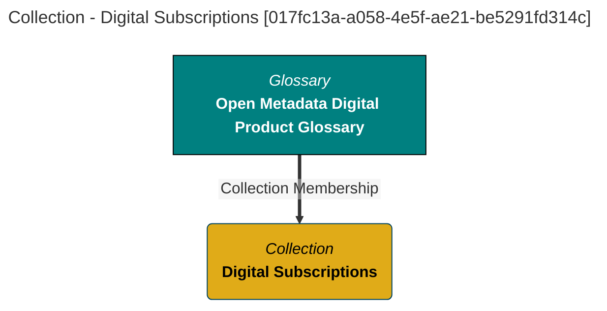

# Common Collection Information
Attributes generic to all Collections.

# Collection Report - created at 2025-09-21 21:00
	Collection  found from the search string:  `All`

<a id="017fc13a-a058-4e5f-ae21-be5291fd314c"></a>
# Collection Name: Digital Subscriptions

## Display Name
Digital Subscriptions

## Qualified Name
[OpenMetadataProductCatalog::Folder::Digital Subscriptions](#017fc13a-a058-4e5f-ae21-be5291fd314c)

## Description
Terminology relating to digital subscriptions.

## Type Name
Collection

## Created By
autoprodmgrnpa

## Create Time
2025-09-21T19:03:17.584+00:00

## Member Of
OpenMetadataProductCatalog::RootCollection::Open Metadata Digital Product Glossary

## GUID
017fc13a-a058-4e5f-ae21-be5291fd314c

## Mermaid Graph


[[Commons]]
---

<a id="07ed4a5d-0a34-4724-bd87-8bceea98464b"></a>
# Collection Name: Sustainability Product Catalog

## Display Name
Sustainability Product Catalog

## Qualified Name
[DigProdCatalog::Sustainability-Product-Catalog::2025](#07ed4a5d-0a34-4724-bd87-8bceea98464b)

## Category
Sustainability

## Description
Catalog of Sustainability Assets that includes reference data used in carbon accounting, interim and localized results, aggregated results and finalized sustainability reports.

## Type Name
DigitalProductCatalog

## Created By
autoprodmgrnpa

## Create Time
2025-09-21T19:03:17.584+00:00

## Member Of
OpenMetadataProductCatalog::RootCollection::Open Metadata Digital Product Glossary

## GUID
017fc13a-a058-4e5f-ae21-be5291fd314c

## Mermaid Graph


[[Commons]]
---

<a id="3594dc50-eb40-4936-8ca4-3d45861817c5"></a>
# Collection Name: Governance Observability

## Display Name
Governance Observability

## Qualified Name
[OpenMetadataProductCatalog::Folder::Governance Observability](#3594dc50-eb40-4936-8ca4-3d45861817c5)

## Category
Insight Notification

## Description
Each product in this folder publishes insights about the governance activity observed through the open metadata ecosystem.  The latest insight is published to subscribers on a regular basis.  Subscribers can maintain a history of the insight publications, or treat each on as a trigger to perform specific processing.

## Type Name
Collection

## Created By
autoprodmgrnpa

## Create Time
2025-09-21T19:03:17.584+00:00

## Member Of
OpenMetadataProductCatalog::RootCollection::Open Metadata Digital Product Glossary

## GUID
017fc13a-a058-4e5f-ae21-be5291fd314c

## Mermaid Graph


[[Commons]]
---

<a id="87268f8f-5403-4e0a-8de5-7eccad7f651c"></a>
# Collection Name: Organization Observability

## Display Name
Organization Observability

## Qualified Name
[OpenMetadataProductCatalog::Folder::Organization Observability](#87268f8f-5403-4e0a-8de5-7eccad7f651c)

## Category
Insight Notification

## Description
Each product in this folder publishes insights about the activity of the organization observed through the open metadata ecosystem.  The latest insight is published to subscribers on a regular basis.  Subscribers can maintain a history of the insight publications, or treat each on as a trigger to perform specific processing.

## Type Name
Collection

## Created By
autoprodmgrnpa

## Create Time
2025-09-21T19:03:17.584+00:00

## Member Of
OpenMetadataProductCatalog::RootCollection::Open Metadata Digital Product Glossary

## GUID
017fc13a-a058-4e5f-ae21-be5291fd314c

## Mermaid Graph


[[Commons]]
---

<a id="7120e3aa-4798-43fa-9313-3e9e26d7982b"></a>
# Collection Name: Data Specification for Open Metadata Attributes List

## Display Name
Data Specification for Open Metadata Attributes List

## Qualified Name
[OpenMetadataProductCatalog::DigitalProduct::OPEN-METADATA-ATTRIBUTES::Open Metadata Attributes List_dataSpec](#7120e3aa-4798-43fa-9313-3e9e26d7982b)

## Category
Insight Notification

## Description
The data specification lists the fields in the Open Metadata Attributes List product.

## Type Name
DataSpec

## Created By
autoprodmgrnpa

## Create Time
2025-09-21T19:03:17.584+00:00

## Containing Members
OpenMetadataProductCatalog::DigitalProduct::OPEN-METADATA-ATTRIBUTES::Open Metadata Attributes List_dataSpec.dataStructure

## Member Of
OpenMetadataProductCatalog::RootCollection::Open Metadata Digital Product Glossary

## GUID
017fc13a-a058-4e5f-ae21-be5291fd314c

## Mermaid Graph


[[Commons]]
---

<a id="51248fc9-1ea4-4a64-95d8-d46f7c6cb107"></a>
# Collection Name: Open Metadata Digital Product Catalog

## Display Name
Open Metadata Digital Product Catalog

## Qualified Name
[OpenMetadataProductCatalog::RootCollection::Open Metadata Digital Product Catalog](#51248fc9-1ea4-4a64-95d8-d46f7c6cb107)

## Category
Insight Notification

## Description
Extracts of open metadata organized into useful data sets.  These digital products support a variety of subscription choices.  Data can be delivered either as a CSV file, or as a PostGreSQL table.  Updates to the subscriber''s copy typically occur within 1 hour of receiving the metadata update.

## Type Name
DigitalProductCatalog

## Created By
autoprodmgrnpa

## Create Time
2025-09-21T19:03:17.584+00:00

## Containing Members
OpenMetadataProductCatalog::DigitalProduct::OPEN-METADATA-ATTRIBUTES::Open Metadata Attributes List_dataSpec.dataStructure

## Member Of
OpenMetadataProductCatalog::RootCollection::Open Metadata Digital Product Glossary

## GUID
017fc13a-a058-4e5f-ae21-be5291fd314c

## Mermaid Graph


[[Commons]]
---

<a id="e7e79f68-31d1-4dfd-b34f-b12217568736"></a>
# Collection Name: Open Metadata Types

## Display Name
Open Metadata Types

## Qualified Name
[OpenMetadataProductCatalog::Folder::Open Metadata Types](#e7e79f68-31d1-4dfd-b34f-b12217568736)

## Category
Metadata

## Description
Each product in this folder provides a perspective on the open metadata types.

## Type Name
Collection

## Created By
autoprodmgrnpa

## Create Time
2025-09-21T19:03:17.584+00:00

## Containing Members
OpenMetadataProductCatalog::DigitalProduct::OPEN-METADATA-ATTRIBUTES::Open Metadata Attributes List_dataSpec.dataStructure

## Member Of
OpenMetadataProductCatalog::RootCollection::Open Metadata Digital Product Glossary

## GUID
017fc13a-a058-4e5f-ae21-be5291fd314c

## Mermaid Graph


[[Commons]]
---

<a id="3f7f6e8f-ef97-4a90-bc6f-f1990831cb0d"></a>
# Collection Name: Data Specification for Valid Value Sets List

## Display Name
Data Specification for Valid Value Sets List

## Qualified Name
[OpenMetadataProductCatalog::DigitalProduct::OPEN-METADATA-ValidValueDefinition-with-members::Valid Value Sets List_dataSpec](#3f7f6e8f-ef97-4a90-bc6f-f1990831cb0d)

## Category
Metadata

## Description
The data specification lists the fields in the Valid Value Sets List product.

## Type Name
DataSpec

## Created By
autoprodmgrnpa

## Create Time
2025-09-21T19:03:17.584+00:00

## Containing Members
OpenMetadataProductCatalog::DigitalProduct::OPEN-METADATA-ATTRIBUTES::Open Metadata Attributes List_dataSpec.dataStructure

## Member Of
OpenMetadataProductCatalog::RootCollection::Open Metadata Digital Product Glossary

## GUID
017fc13a-a058-4e5f-ae21-be5291fd314c

## Mermaid Graph


[[Commons]]
---

<a id="5494fd0c-530e-4e45-883a-5ce4f3b55067"></a>
# Collection Name: Open Metadata Attributes List

## Display Name
Open Metadata Attributes List

## Qualified Name
[OpenMetadataProductCatalog::DigitalProduct::OPEN-METADATA-ATTRIBUTES::Open Metadata Attributes List](#5494fd0c-530e-4e45-883a-5ce4f3b55067)

## Category
Reference Data

## Description
A tabular data set where each record describes a type of attribute defined in the open metadata types.

## Type Name
DigitalProduct

## Created By
autoprodmgrnpa

## Create Time
2025-09-21T19:03:17.584+00:00

## Containing Members
OpenMetadataProductCatalog::DigitalProduct::OPEN-METADATA-ATTRIBUTES::Open Metadata Attributes List_dataSpec.dataStructure

## Member Of
OpenMetadataProductCatalog::RootCollection::Open Metadata Digital Product Glossary

## GUID
017fc13a-a058-4e5f-ae21-be5291fd314c

## Mermaid Graph


[[Commons]]
---

<a id="533a0346-b047-485a-82ea-05db671ab485"></a>
# Collection Name: Open Metadata Connector Type Directory

## Display Name
Open Metadata Connector Type Directory

## Qualified Name
OpenMetadataConnectorTypeDirectory_09450b83-20ff-4a8b-a8fb-f9b527bbcba6

## Category
Reference Data

## Description
Open Metadata standard connector categories and connector types.

## Type Name
Collection

## Created By
autoprodmgrnpa

## Create Time
2025-09-21T19:03:17.584+00:00

## Updated By
Egeria Project

## Containing Members
OpenMetadataProductCatalog::DigitalProduct::OPEN-METADATA-ATTRIBUTES::Open Metadata Attributes List_dataSpec.dataStructure

## Member Of
OpenMetadataProductCatalog::RootCollection::Open Metadata Digital Product Glossary

## GUID
017fc13a-a058-4e5f-ae21-be5291fd314c

## Mermaid Graph


[[Commons]]
---

<a id="dcec6ddb-317e-4c64-907e-be508ceba6d9"></a>
# Collection Name: Digital Product Catalogs Root

## Display Name
Digital Product Catalogs Root

## Qualified Name
[Egeria::DigitalProductCatalogsRoot](#dcec6ddb-317e-4c64-907e-be508ceba6d9)

## Category
Reference Data

## Description
Root collection linking the digital product catalogs together.

## Type Name
Collection

## Created By
autoprodmgrnpa

## Create Time
2025-09-21T19:03:17.584+00:00

## Updated By
Egeria Project

## Containing Members
OpenMetadataProductCatalog::DigitalProduct::OPEN-METADATA-ATTRIBUTES::Open Metadata Attributes List_dataSpec.dataStructure

## Member Of
OpenMetadataProductCatalog::RootCollection::Open Metadata Digital Product Glossary

## GUID
017fc13a-a058-4e5f-ae21-be5291fd314c

## Mermaid Graph


[[Commons]]
---

<a id="f86dd9ac-6175-4c21-87b6-93a0a749f2f5"></a>
# Collection Name: Party, Places and Products

## Display Name
Party, Places and Products

## Qualified Name
[OpenMetadataProductCatalog::Folder::Party, Places and Products](#f86dd9ac-6175-4c21-87b6-93a0a749f2f5)

## Category
Master Data

## Description
Each product in this folder consolidates information held in the open metadata about people, organizations, users, teams, locations and digital products.  This type of data is called master data because it describes the key entities that the organization operates around.  As such, some form of this data appears in most data sets.  Each product in this folder is organized into a tabular data set, where each row is a specific (master data) entity.   These are designed to be used as standard values that can be used for validation or to ensure that data in digital products is consistent making it easier to join data from multiple products.

## Type Name
Collection

## Created By
autoprodmgrnpa

## Create Time
2025-09-21T19:03:17.584+00:00

## Updated By
Egeria Project

## Containing Members
OpenMetadataProductCatalog::DigitalProduct::OPEN-METADATA-ATTRIBUTES::Open Metadata Attributes List_dataSpec.dataStructure

## Member Of
OpenMetadataProductCatalog::RootCollection::Open Metadata Digital Product Glossary

## GUID
017fc13a-a058-4e5f-ae21-be5291fd314c

## Mermaid Graph


[[Commons]]
---

<a id="322dd4ec-423e-4088-89a8-3e15d11c53c9"></a>
# Collection Name: Data Specification for Open Metadata Types List

## Display Name
Data Specification for Open Metadata Types List

## Qualified Name
[OpenMetadataProductCatalog::DigitalProduct::OPEN-METADATA-TYPES::Open Metadata Types List_dataSpec](#322dd4ec-423e-4088-89a8-3e15d11c53c9)

## Category
Master Data

## Description
The data specification lists the fields in the Open Metadata Types List product.

## Type Name
DataSpec

## Created By
autoprodmgrnpa

## Create Time
2025-09-21T19:03:17.584+00:00

## Updated By
Egeria Project

## Containing Members
OpenMetadataProductCatalog::DigitalProduct::OPEN-METADATA-ATTRIBUTES::Open Metadata Attributes List_dataSpec.dataStructure

## Member Of
OpenMetadataProductCatalog::RootCollection::Open Metadata Digital Product Glossary

## GUID
017fc13a-a058-4e5f-ae21-be5291fd314c

## Mermaid Graph


[[Commons]]
---

<a id="32dd65ef-948e-499d-9faf-dabec869f053"></a>
# Collection Name: Valid Value Sets List

## Display Name
Valid Value Sets List

## Qualified Name
[OpenMetadataProductCatalog::DigitalProduct::OPEN-METADATA-ValidValueDefinition-with-members::Valid Value Sets List](#32dd65ef-948e-499d-9faf-dabec869f053)

## Category
Reference Data

## Description
A tabular data set where each record describes an open metadata valid value set.

## Type Name
DigitalProduct

## Created By
autoprodmgrnpa

## Create Time
2025-09-21T19:03:17.584+00:00

## Updated By
Egeria Project

## Containing Members
OpenMetadataProductCatalog::DigitalProduct::OPEN-METADATA-ATTRIBUTES::Open Metadata Attributes List_dataSpec.dataStructure

## Member Of
OpenMetadataProductCatalog::RootCollection::Open Metadata Digital Product Glossary

## GUID
017fc13a-a058-4e5f-ae21-be5291fd314c

## Mermaid Graph


[[Commons]]
---

<a id="75a5f3ae-c1ca-4d6b-a08b-0ff49b76dc97"></a>
# Collection Name: Open Metadata Digital Product Glossary

## Display Name
Open Metadata Digital Product Glossary

## Qualified Name
[OpenMetadataProductCatalog::RootCollection::Open Metadata Digital Product Glossary](#75a5f3ae-c1ca-4d6b-a08b-0ff49b76dc97)

## Category
Reference Data

## Description
Terminology used in the open metadata digital product catalog.

## Type Name
Glossary

## Created By
autoprodmgrnpa

## Create Time
2025-09-21T19:03:17.584+00:00

## Updated By
Egeria Project

## Containing Members
OpenMetadataProductCatalog::DigitalProduct::OPEN-METADATA-ATTRIBUTES::Open Metadata Attributes List_dataSpec.dataStructure

## Member Of
OpenMetadataProductCatalog::RootCollection::Open Metadata Digital Product Glossary

## GUID
017fc13a-a058-4e5f-ae21-be5291fd314c

## Mermaid Graph


[[Commons]]
---

<a id="efed6dbe-e6fd-46e4-8243-27ed6635e607"></a>
# Collection Name: Digital Product Basics

## Display Name
Digital Product Basics

## Qualified Name
[OpenMetadataProductCatalog::Folder::Digital Product Basics](#efed6dbe-e6fd-46e4-8243-27ed6635e607)

## Category
Reference Data

## Description
Basic terminology relating to digital products in general, and the open metadata digital products in particular.

## Type Name
Collection

## Created By
autoprodmgrnpa

## Create Time
2025-09-21T19:03:17.584+00:00

## Updated By
Egeria Project

## Containing Members
OpenMetadataProductCatalog::DigitalProduct::OPEN-METADATA-ATTRIBUTES::Open Metadata Attributes List_dataSpec.dataStructure

## Member Of
OpenMetadataProductCatalog::RootCollection::Open Metadata Digital Product Glossary

## GUID
017fc13a-a058-4e5f-ae21-be5291fd314c

## Mermaid Graph


[[Commons]]
---

<a id="fe0ca8a5-d4d6-4ed9-9a27-0c64b493551d"></a>
# Collection Name: Open Metadata Types List

## Display Name
Open Metadata Types List

## Qualified Name
[OpenMetadataProductCatalog::DigitalProduct::OPEN-METADATA-TYPES::Open Metadata Types List](#fe0ca8a5-d4d6-4ed9-9a27-0c64b493551d)

## Category
Reference Data

## Description
A tabular data set where each record describes an open metadata type.

## Type Name
DigitalProduct

## Created By
autoprodmgrnpa

## Create Time
2025-09-21T19:03:17.584+00:00

## Updated By
Egeria Project

## Containing Members
OpenMetadataProductCatalog::DigitalProduct::OPEN-METADATA-ATTRIBUTES::Open Metadata Attributes List_dataSpec.dataStructure

## Member Of
OpenMetadataProductCatalog::RootCollection::Open Metadata Digital Product Glossary

## GUID
017fc13a-a058-4e5f-ae21-be5291fd314c

## Mermaid Graph


[[Commons]]
---

<a id="fef7df95-2239-40d1-b31d-5f7354d008ae"></a>
# Collection Name: IT Operations Observability

## Display Name
IT Operations Observability

## Qualified Name
[OpenMetadataProductCatalog::Folder::IT Operations Observability](#fef7df95-2239-40d1-b31d-5f7354d008ae)

## Category
Insight Notification

## Description
Each product in this folder publishes insights about the operational health of the IT infrastructure supporting the open metadata ecosystem.  The latest insight is published to subscribers on a regular basis.  Subscribers can maintain a history of the insight publications, or treat each on as a trigger to perform specific processing.

## Type Name
Collection

## Created By
autoprodmgrnpa

## Create Time
2025-09-21T19:03:17.584+00:00

## Updated By
Egeria Project

## Containing Members
OpenMetadataProductCatalog::DigitalProduct::OPEN-METADATA-ATTRIBUTES::Open Metadata Attributes List_dataSpec.dataStructure

## Member Of
OpenMetadataProductCatalog::RootCollection::Open Metadata Digital Product Glossary

## GUID
017fc13a-a058-4e5f-ae21-be5291fd314c

## Mermaid Graph


[[Commons]]
---

<a id="556f6bcd-0644-445a-b892-ff3b2f0c623d"></a>
# Collection Name: Data Item Semantics

## Display Name
Data Item Semantics

## Qualified Name
[OpenMetadataProductCatalog::Folder::Data Item Semantics](#556f6bcd-0644-445a-b892-ff3b2f0c623d)

## Category
Insight Notification

## Description
Descriptions of the data found in data items of the digital products.

## Type Name
Collection

## Created By
autoprodmgrnpa

## Create Time
2025-09-21T19:03:17.584+00:00

## Updated By
Egeria Project

## Containing Members
OpenMetadataProductCatalog::DigitalProduct::OPEN-METADATA-ATTRIBUTES::Open Metadata Attributes List_dataSpec.dataStructure

## Member Of
OpenMetadataProductCatalog::RootCollection::Open Metadata Digital Product Glossary

## GUID
017fc13a-a058-4e5f-ae21-be5291fd314c

## Mermaid Graph


[[Commons]]
---

<a id="c422e78d-2d2f-4f1f-bdc3-3ca2ef0e3d8f"></a>
# Collection Name: Open Metadata Digital Product Data Dictionary

## Display Name
Open Metadata Digital Product Data Dictionary

## Qualified Name
[OpenMetadataProductCatalog::RootCollection::Open Metadata Digital Product Data Dictionary](#c422e78d-2d2f-4f1f-bdc3-3ca2ef0e3d8f)

## Category
Insight Notification

## Description
Details of the types of data fields used in the open metadata digital products.

## Type Name
DataDictionary

## Created By
autoprodmgrnpa

## Create Time
2025-09-21T19:03:17.584+00:00

## Updated By
Egeria Project

## Containing Members
OpenMetadataProductCatalog::DigitalProduct::OPEN-METADATA-ATTRIBUTES::Open Metadata Attributes List_dataSpec.dataStructure

## Member Of
OpenMetadataProductCatalog::RootCollection::Open Metadata Digital Product Glossary

## GUID
017fc13a-a058-4e5f-ae21-be5291fd314c

## Mermaid Graph


[[Commons]]
---

<a id="d3e38709-2646-4535-914f-6382901deb65"></a>
# Collection Name: Valid Value Sets

## Display Name
Valid Value Sets

## Qualified Name
[OpenMetadataProductCatalog::Folder::Valid Value Sets](#d3e38709-2646-4535-914f-6382901deb65)

## Category
Reference Data

## Description
Each product in this folder is an extract of the valid values associated with a valid value set.  The valid values are organized into a tabular data set, where each row is a specific valid value.  These products can be used as standard reference values when building other digital products to help consumers join data from multiple products together.

## Type Name
Collection

## Created By
autoprodmgrnpa

## Create Time
2025-09-21T19:03:17.584+00:00

## Updated By
Egeria Project

## Containing Members
OpenMetadataProductCatalog::DigitalProduct::OPEN-METADATA-ATTRIBUTES::Open Metadata Attributes List_dataSpec.dataStructure

## Member Of
OpenMetadataProductCatalog::RootCollection::Open Metadata Digital Product Glossary

## GUID
017fc13a-a058-4e5f-ae21-be5291fd314c

## Mermaid Graph

```mermaid
---
title: Collection - Digital Subscriptions [017fc13a-a058-4e5f-ae21-be5291fd314c]
---
flowchart TD
%%{init: {"flowchart": {"htmlLabels": false}} }%%

1@{ shape: rounded, label: "*Collection*
**Digital Subscriptions**"}
2@{ shape: rect, label: "*Glossary*
**Open Metadata Digital Product Glossary**"}
2==>|"Collection Membership"|1
style 1 color:#000000, fill:#e0ab18, stroke:#004563
style 2 color:#FFFFFF, fill:#008080, stroke:#000000
```
[[Commons]]
---

<a id="e32b2866-df89-4323-ab50-b113b3b1b9c4"></a>
# Collection Name: Open Metadata Digital Products

## Display Name
Open Metadata Digital Products

## Qualified Name
[OpenMetadataProductCatalog::Folder::Open Metadata Digital Products](#e32b2866-df89-4323-ab50-b113b3b1b9c4)

## Category
Reference Data

## Description
Extracts of open metadata organized into useful data sets.  These digital products support a variety of subscription choices.  Data can be delivered either as a CSV file, or as a PostGreSQL table.  Updates to the subscriber''s copy typically occur within 1 hour of receiving the metadata update.

## Type Name
Collection

## Created By
autoprodmgrnpa

## Create Time
2025-09-21T19:03:17.584+00:00

## Updated By
Egeria Project

## Containing Members
OpenMetadataProductCatalog::DigitalProduct::OPEN-METADATA-ATTRIBUTES::Open Metadata Attributes List_dataSpec.dataStructure

## Member Of
OpenMetadataProductCatalog::RootCollection::Open Metadata Digital Product Glossary

## GUID
017fc13a-a058-4e5f-ae21-be5291fd314c

## Mermaid Graph

```mermaid
---
title: Collection - Digital Subscriptions [017fc13a-a058-4e5f-ae21-be5291fd314c]
---
flowchart TD
%%{init: {"flowchart": {"htmlLabels": false}} }%%

1@{ shape: rounded, label: "*Collection*
**Digital Subscriptions**"}
2@{ shape: rect, label: "*Glossary*
**Open Metadata Digital Product Glossary**"}
2==>|"Collection Membership"|1
style 1 color:#000000, fill:#e0ab18, stroke:#004563
style 2 color:#FFFFFF, fill:#008080, stroke:#000000
```
[[Commons]]