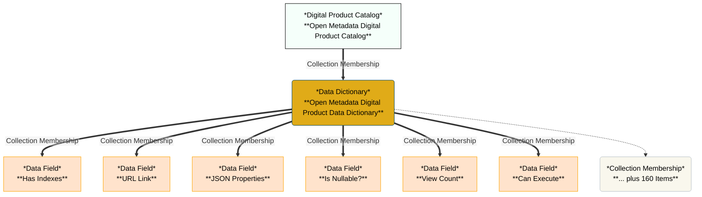

# DataDictionary Name: Open Metadata Digital Product Data Dictionary 

- Qualified Name: `DataDictionary::OpenMetadataDigitalProductCatalog::Open Metadata Digital Product Data Dictionary`
- GUID: `6382c627-6912-452c-9a36-3ba0d6753861`

### Properties
- class: ElementHeader
- contentStatus: ACTIVE
- description: Details of the types of data fields used in the open metadata digital products.
- headerVersion: 0

### Mermaid Graph

### Peers
- [Open Metadata Digital Product Catalog](#d074f816-289a-4b7c-8e15-f08bee4c6eb7) — CollectionMembership
- [Has Indexes](#1f456cb9-ad18-4ab1-b65e-b8259a6dca3e) — CollectionMembership
- [URL Link](#43cea7f7-bb01-4418-a8b8-ac125bb8318d) — CollectionMembership
- [JSON Properties](#3540d3c6-0ab1-4a34-8227-394904af8ae0) — CollectionMembership
- [Is Nullable?](#e8d640f8-1680-41d6-abfb-c3a93d13b79b) — CollectionMembership
- [View Count](#62f527c2-694b-4a52-9061-028851ac7da7) — CollectionMembership
- [Can Execute](#4a2a464d-56df-4540-bfe0-521b6feda507) — CollectionMembership
- [Property Name](#1eac2e43-cf7a-436b-8bd9-f572c04abcd1) — CollectionMembership
- [Is Symbolic Link](#409b351f-1a3a-45a8-9a58-0debeb7f2c9a) — CollectionMembership
- [Open Metadata Type Name](#be09963b-62f1-48df-b1ec-048046381938) — CollectionMembership
- [Writeable File Count](#20631363-da8b-472c-81cf-465f38502366) — CollectionMembership
- [Owner Type Name](#c772c1ee-e0d2-4ae3-b3ac-9f7930afb57f) — CollectionMembership
- [Sub Directory Count](#3ef9f07b-29e3-41d7-9f42-5c5e177a9988) — CollectionMembership
- [Activity Status](#dde827cc-92ab-4778-aa39-33c2f11f9e5a) — CollectionMembership
- [Mission](#75e9da6b-dd2f-41fc-9b42-f66a2044473a) — CollectionMembership
- [Measurement Name](#e5ee67f1-dccd-4b01-ad80-6a0401d799a7) — CollectionMembership
- [NamespacePath](#161b3077-1378-4985-82d0-fcdbb18648f2) — CollectionMembership
- [Request Type](#34bf0ad8-6b72-436a-956a-3edfc81c1366) — CollectionMembership
- [Asset Type Count](#e6e47700-6cf5-4c0f-b0df-319fa6653410) — CollectionMembership
- [Engine Host User Identifier (userId)](#410f0c7f-65ae-4e7b-803f-0a8e7dcb7ab0) — CollectionMembership
- [Table Count](#0435569d-42e1-4134-a14c-8c29b55d3c01) — CollectionMembership
- [LocationArena Unique Identifier (GUID)](#8a882bd1-a3a7-4761-8fbf-47b808129ea2) — CollectionMembership
- [Rows Fetched](#4439f0f7-99ab-43a4-9c07-03f9384ed78b) — CollectionMembership
- [File Creation Time](#54736fc7-2496-48c4-9867-586d213b1c01) — CollectionMembership
- [Survey Report Unique Identifier (GUID)](#a3bb50c3-a467-40c0-a045-9ae8061a22b0) — CollectionMembership
- [Source](#b4ea5d46-2d4b-44b0-b24a-224a9a014186) — CollectionMembership
- [Data Size](#bf2c88db-b065-4b46-b68a-33cf86e2577f) — CollectionMembership
- [Preferred Value](#44ce3d42-a44e-4b7f-8192-588bcd9b869d) — CollectionMembership
- [Element Status](#2357174b-718d-4695-a1a7-9898ac2c76ce) — CollectionMembership
- [Has Triggers](#77901ed4-091a-4c94-a19f-a7e924a0760c) — CollectionMembership
- [Distinguished Name](#842640d0-fe9b-453a-ae37-6ff161ea5d16) — CollectionMembership
- [Query Definition](#caafbcff-7fd6-400a-916e-b55f216ec799) — CollectionMembership
- [Executable File Count](#35a24962-8085-437c-ace3-b16ab0c28cbb) — CollectionMembership
- [Search Keywords](#c8468e16-56b3-43b0-b7af-d4f91c4873ea) — CollectionMembership
- [Is Hidden](#7d1f9398-c99b-4937-8d68-f6bf92a8aecf) — CollectionMembership
- [Action Target Type Name](#33373e20-bfd5-4247-b23b-c03895c94157) — CollectionMembership
- [Survey Subject Type Name](#9e2bdcbd-825e-47ed-a6e8-42fe6f0114ba) — CollectionMembership
- [Engine Action Unique Identifier (GUID)](#bbe8c7c1-4dfc-4707-89ed-b2fbf48116ca) — CollectionMembership
- [Measurement String Value](#edda574c-0437-4c12-a1ca-637aaba32a34) — CollectionMembership
- [Resource Owner](#40d933e7-8406-49c8-8550-23680444de8b) — CollectionMembership
- [Pathname](#e41b1f00-1343-4e82-966d-c7f491983462) — CollectionMembership
- [Element Last Update Time](#ccae1c6e-590d-4533-9d01-e1837b2c49c5) — CollectionMembership
- [Metadata Collection Id](#1b855986-8d2e-4ed1-89c5-12a2fa55499c) — CollectionMembership
- [Resource Creation Time](#3cd544b5-9bbf-46ce-b805-7ea33f72c0d2) — CollectionMembership
- [Can Read](#02b54db0-2fcb-441e-8cb6-a0db27e323ed) — CollectionMembership
- [Measurement Numeric Value](#99339c69-5795-42d4-a5d8-6d2d25072369) — CollectionMembership
- [Identifier](#6c977ea2-5aad-4511-a270-9de526c2b9f5) — CollectionMembership
- [File Size](#9f04d1bd-291c-4f9b-b04c-d1b3268d9977) — CollectionMembership
- [Abbreviation](#495690d5-b5cc-4dd7-867b-d4af2cb194f0) — CollectionMembership
- [LocationArena Classification Name](#c119fb8c-cdc6-4207-92d5-f3faf6ffffe0) — CollectionMembership
- [Symbolic Link File Count](#3059be98-14af-4379-964b-108e4f3c43d5) — CollectionMembership
- [Origin Organization Unique Identifier (GUID)](#cbb16a69-6cc6-4291-8706-39efc5bafe03) — CollectionMembership
- [Materialized View Count](#69187d9f-c0d5-4774-82dc-74b850e13a4c) — CollectionMembership
- [File Extension Count](#38e1e000-1943-4509-a999-fdc7dab8d8d8) — CollectionMembership
- [Version Identifier](#6c4e5c85-d9a7-440e-a355-fd5c19eff186) — CollectionMembership
- [Total File Size](#781f60d1-d007-445b-8ea8-99d15a2b450a) — CollectionMembership
- [Archive Date](#9b9f998e-ae27-469d-ad2a-bf12b32985c1) — CollectionMembership
- [Data Width](#5abf40bf-822b-423d-8478-8377d6e36fc2) — CollectionMembership
- [Action Target Name](#4efef318-6865-47a9-89a7-125107b8ab0a) — CollectionMembership
- [Expression](#c6f72c06-6441-445b-9b78-bb298be30e84) — CollectionMembership
- [Project Unique Identifier (GUID)](#0d4511e4-44ea-450d-afe8-e6d362b64423) — CollectionMembership
- [Is Default Value?](#3a15c845-708f-42ae-bc07-93b21462a3cf) — CollectionMembership
- [Survey Annotation Unique Identifier (GUID)](#bac73c96-5ba5-4629-9dfc-bb560e63be16) — CollectionMembership
- [LocationArena Map Projection](#53a43d62-fd5e-476a-b972-39f972558f5f) — CollectionMembership
- [Filename](#13425e92-25ef-468b-a164-16154f477f32) — CollectionMembership
- [File Name Count](#06e95d52-2fd7-4259-8f64-d2f6c8a125ed) — CollectionMembership
- [Start Timestamp](#fd340a63-f6ca-46b1-85d2-218291939a72) — CollectionMembership
- [Origin Business Capability Unique Identifier (GUID)](#4c8c1ac0-46c3-4b81-b132-8ac91e66a85e) — CollectionMembership
- [Rows Inserted](#e92e1fa7-03ad-43bf-989c-c06fbdd16f74) — CollectionMembership
- [Distinct Value Count](#65431eb1-7d94-4dae-ba9a-7ddd600c710b) — CollectionMembership
- [Annotation Type Name](#3103de90-156a-4591-9dd5-aec020377f51) — CollectionMembership
- [File Type Count](#039b2c41-4736-4f84-b27c-d30d9d5c117c) — CollectionMembership
- [Most Common Values](#8789efed-9d7a-4d0b-854d-d8e29f6f948c) — CollectionMembership
- [Deployed Implementation Type Count](#4fdd1335-bc21-408f-98e5-7693abb7ef1f) — CollectionMembership
- [Rows Updated](#60233ba4-65ae-4649-914f-93a70fd1e458) — CollectionMembership
- [Additional Properties](#d48572ed-b418-4e0e-adf1-fcd0af7bbfa1) — CollectionMembership
- [Resource Properties](#a836b02e-626a-4f0d-947a-fa7e64a3efde) — CollectionMembership
- [Certification Unique Identifier (GUID)](#93aa61cf-e6bb-48db-b034-a9ac53084f1e) — CollectionMembership
- [Maintained By User Identifiers (userIds)](#a79b34f6-562b-4b6c-b1ad-67ea80ffec92) — CollectionMembership
- [Open Metadata Type Status](#070ec48f-ccdc-44dd-9dac-2086fbfd7526) — CollectionMembership
- [User Identifier (userId)](#dc73a859-b80a-49fa-953c-b3c4b77af9f6) — CollectionMembership
- [Action Target Unique Identifier (GUID)](#20518fb4-dfa3-47f0-a8e4-9d98d71a533b) — CollectionMembership
- [Measurement Category](#11f5d7cc-e268-40e3-b7b3-172861783df6) — CollectionMembership
- [Metadata Collection Name](#39b33f90-cdae-4036-b7ba-6d485766b897) — CollectionMembership
- [Readable File Count](#f64bd9bc-f887-4eac-b417-37e7a2bfac98) — CollectionMembership
- [Resource Name](#2628e600-770d-4e02-9285-9680566c7d94) — CollectionMembership
- [Open Metadata Attribute Status](#7291bced-0304-4c33-bd5f-78237fd1136a) — CollectionMembership
- [Record Count](#ff48769a-68fe-4b67-9a6f-f51b723eda4f) — CollectionMembership
- [Element Create Time](#7983b9b9-4bb1-4fea-b838-0e137dd7fcbb) — CollectionMembership
- [Profile Unique Identifier (GUID)](#c54b21e9-d0f8-466b-9af6-9032e98cd3e9) — CollectionMembership
- [End Timestamp](#8069b35b-94ee-4ecc-a380-5acfa950db96) — CollectionMembership
- [Action Request Name](#d8cdf860-cf62-4714-9447-861b71594d04) — CollectionMembership
- [Analysis Step](#c6585085-10cd-47f2-a6b1-156de58f0217) — CollectionMembership
- [Open Metadata Attribute Type Name](#a853602d-51f5-4fca-b9e7-613c4195e7a7) — CollectionMembership
- [Data Type](#4c7f39e5-56e9-4a9e-9b18-3e9d489cdc1e) — CollectionMembership
- [Confidentiality Level](#f54bff10-187c-44d4-95a9-28bc58f636a6) — CollectionMembership
- [Governance Engine Name](#fffb02c7-2183-41cf-8208-b57f9ccf4da8) — CollectionMembership
- [Initiator User Identifier (userId)](#3ad26ad4-0753-467c-a54d-01fad0462630) — CollectionMembership
- [License Type Unique Identifier (GUID)](#4fba86fb-8b1c-4231-a7d2-e07580439e11) — CollectionMembership
- [Last Statistics Reset](#9520ffa4-5134-4ab8-bd08-2db798411f83) — CollectionMembership
- [Survey Subject Unique Identifier (GUID)](#bb5cf60f-d683-4f32-9407-e0244e870098) — CollectionMembership
- [Active Time](#2659e54a-b305-46aa-a259-64b0237135b9) — CollectionMembership
- [Directory Name](#e43040ea-944b-4eaf-b0dc-2cc4e1617912) — CollectionMembership
- [Session Time](#8534e86a-acfa-4f43-bc1b-e98a8f978068) — CollectionMembership
- [Last File Accessed Time](#9ee4b1b2-c44e-4578-b2d8-4e8da2f56471) — CollectionMembership
- [Not Null](#021624e2-153b-4060-8d78-cc4293e90ca8) — CollectionMembership
- [File Type](#7b2735d2-1692-4f7d-a528-f748ea886fa2) — CollectionMembership
- [File Count](#85a8eb94-6d47-4b2c-baed-78127a468764) — CollectionMembership
- [License Unique Identifier (GUID)](#a3f4fd6f-f0cc-434e-80c3-01acaeea0d07) — CollectionMembership
- [Last Accessed Time](#94e48190-dc59-4640-98a8-572830a91867) — CollectionMembership
- [File Extension](#54eb8a37-7fb1-4cee-a378-2ace5a7ed989) — CollectionMembership
- [Most Common Values Frequency](#3b3f2c65-3882-4994-9aeb-e718a5737b5e) — CollectionMembership
- [Measurement Display Value](#00d0983a-b58c-4f16-abbf-93ad176ff885) — CollectionMembership
- [Is Case Sensitive?](#5ef12fb6-deb6-48d0-8a1c-b2176f07b69b) — CollectionMembership
- [Inaccessible File Count](#b4c19f6c-927c-43ef-ab49-c5ac0810d006) — CollectionMembership
- [Table Type](#1e830731-c2ec-44f6-91e1-961b430b41d2) — CollectionMembership
- [Category](#2ce518af-100a-409a-9f9a-2f434cf5efa4) — CollectionMembership
- [Usage](#9dbcd05c-2ad6-4d5e-9465-60c6d6a42884) — CollectionMembership
- [Description](#0cdadf27-41ba-4ff6-97af-46a40fce829f) — CollectionMembership
- [Open Metadata Subtypes](#ed7fe751-ad01-4e43-b585-001da7a05c87) — CollectionMembership
- [Created By User Identifier (userId)](#15654ab2-eeeb-4a39-bb3d-a1c8e3f35b7d) — CollectionMembership
- [Is Populated](#fafb79eb-a479-4c45-99b1-6c9d538b4e44) — CollectionMembership
- [Has Rules](#8c4abdc8-c83f-4dce-901e-a08964affe55) — CollectionMembership
- [LocationArena Coordinates](#808b3e0a-cba8-49e1-ac75-e8be53154860) — CollectionMembership
- [Open Metadata Super Types](#b4595f4d-96ae-48b3-9fde-708d88911de8) — CollectionMembership
- [Last Updated By User Identifier (userId)](#e3337f19-a792-479d-8af6-6e141f4ad033) — CollectionMembership
- [Authors](#99c13e38-eb11-4d5a-9e48-9c5106cf8bc5) — CollectionMembership
- [Unclassified File Count](#f9773816-23e7-4513-980e-35d7d3523f34) — CollectionMembership
- [Sync Time](#cdf60ecc-1b1d-4a5c-8ba9-fb15ab77df88) — CollectionMembership
- [Network Address](#3a8ebc38-69cb-4495-b8cc-a94ca2071417) — CollectionMembership
- [Deployed Implementation Type (Technology Type)](#875baca7-4634-4e4c-b387-2de84f0c2df8) — CollectionMembership
- [Can Write](#a58ffbad-589e-4e9f-8012-522c10c52d2e) — CollectionMembership
- [Confidence Level](#4653db93-640e-4e56-9b73-46404bab277c) — CollectionMembership
- [Bean Class Name](#05424daa-bfcc-46bc-8a84-0d743875f123) — CollectionMembership
- [Governance Zone Names](#af7b0cdf-511c-4692-ac7c-bb4d86d3ce6a) — CollectionMembership
- [Asset Type Name](#619f786c-3bdf-4d98-b856-0851cb5cb258) — CollectionMembership
- [Action Request Unique Identifier (GUID)](#5941d5e6-98b9-4c77-bcac-e3882cee4d7f) — CollectionMembership
- [Rows Deleted](#1458dc0b-0524-4d0e-a302-0e6543af5346) — CollectionMembership
- [LocationArena Postal Address](#02afbea9-e8b0-4e58-90a7-6bd57655d70f) — CollectionMembership
- [Informal Tags](#fba88f44-7c5f-4cc5-ab6f-fe4f11205e85) — CollectionMembership
- [Last File Modification Time](#0e9473a0-c6d2-44f9-a9ab-a17b1ff6820f) — CollectionMembership
- [Display Name](#60371b0c-bf94-4dcf-b806-da253c178228) — CollectionMembership
- [Resource Size](#9ba67218-4d75-4535-8348-74fab3f8714d) — CollectionMembership
- [Has Row Security](#ee4768b0-ebd7-43b9-82f9-f23f32fa2dc6) — CollectionMembership
- [Qualified Name](#21e968f9-8bdc-4f76-a120-f9db6a5155d3) — CollectionMembership
- [Column Count](#bdd7c7d9-aca5-4171-9709-d9252669e2ab) — CollectionMembership
- [Hidden File Count](#e8a5b867-5b0f-470c-a797-63e8f06b1e56) — CollectionMembership
- [Asset Unique Identifier (GUID)](#3d59327a-c859-4b25-a73e-b046523e7943) — CollectionMembership
- [Expected Behaviour](#c5650c31-525a-41e8-8734-34fee55f7117) — CollectionMembership
- [Last Modified Time](#09e8e45e-5898-4847-84fb-ee620112a4d9) — CollectionMembership
- [Globally Unique Identifier (GUID)](#87676d46-3bc9-4d8a-9bd7-454c751bcc07) — CollectionMembership
- [Purpose](#2e83d62c-b42c-4552-af0d-d425612f244e) — CollectionMembership
- [Content Status](#b65f8ce3-6a92-45d4-be5f-8926992ff7fe) — CollectionMembership
- [Criticality Level](#94682407-47c5-41cd-95e1-bfa8ad5dc390) — CollectionMembership
- [Certification Type Unique Identifier (GUID)](#9f7134ea-3961-4e17-8bc6-4f350b5ec858) — CollectionMembership
- [Open Metadata Attribute Name](#294ede5c-861a-4476-b9a0-b01c97ba23ad) — CollectionMembership
- [Scope](#99cfc1be-302b-4681-a3db-c2c35b7af424) — CollectionMembership
- [Action Target Relationship Unique Identifier (GUID)](#fa7f284b-2c48-4bb0-b636-0d44b41247de) — CollectionMembership
- [Owner Unique Identifier (GUID)](#3fa029a1-266f-45f8-ad84-a9aa19145bb7) — CollectionMembership
- [Explanation](#6e4ebd04-f00b-4204-99c1-c6655cabb506) — CollectionMembership
- [Data Encoding](#076c4653-b5b3-4c63-8374-8929b59adde3) — CollectionMembership
- [Last File Creation Time](#550530f5-00a1-4827-bba1-76490a88eaac) — CollectionMembership
- [Summary](#b48b1d4e-db52-419b-a69b-d98a238fdcaf) — CollectionMembership
- [Deployment Status](#842b1ff2-eaf6-4cd5-b05e-a8969729ffa7) — CollectionMembership
- [Semantic Assignment Glossary Term Unique Identifier (GUID)](#682405f9-a691-45d2-8bfa-1fb71651b989) — CollectionMembership
- [Example](#9c6bd93b-3601-4141-b6ae-de5d1528720e) — CollectionMembership
- [Schema Count](#2f6e60e3-5fc1-40da-9ac0-af41523db4b3) — CollectionMembership

---

# DigitalProductCatalog Name: Open Metadata Digital Product Catalog 

- Qualified Name: `DigitalProductCatalog::OpenMetadataDigitalProductCatalog::Open Metadata Digital Product Catalog`
- GUID: `d074f816-289a-4b7c-8e15-f08bee4c6eb7`

### Properties
- contentStatus: ACTIVE
- description: Extracts of open metadata organized into useful data sets.  These digital products support a variety of subscription choices.  Data can be delivered either as a CSV file, or as a PostGreSQL table.  Updates to the subscriber''s copy typically occur within 1 hour of receiving the metadata update.
- headerVersion: 0
- relatedElementAtEnd1: True

---

# DataField Name: Has Indexes 

- Qualified Name: `DataField::OpenMetadataDigitalProduct::Has Indexes`
- GUID: `1f456cb9-ad18-4ab1-b65e-b8259a6dca3e`

### Properties
- contentStatus: ACTIVE
- dataType: boolean
- description: Is this table indexed?
- headerVersion: 0
- isNullable: True
- length: 0
- minimumLength: 0
- orderedValues: False
- precision: 0
- relatedElementAtEnd1: False
- sortOrder: UNSORTED

---

# DataField Name: URL Link 

- Qualified Name: `DataField::OpenMetadataDigitalProduct::URL Link`
- GUID: `43cea7f7-bb01-4418-a8b8-ac125bb8318d`

### Properties
- contentStatus: ACTIVE
- dataType: string
- description: The url link to documentation.
- headerVersion: 0
- isNullable: True
- length: 0
- minimumLength: 0
- orderedValues: False
- precision: 0
- relatedElementAtEnd1: False
- sortOrder: UNSORTED

---

# DataField Name: JSON Properties 

- Qualified Name: `DataField::OpenMetadataDigitalProduct::JSON Properties`
- GUID: `3540d3c6-0ab1-4a34-8227-394904af8ae0`

### Properties
- contentStatus: ACTIVE
- dataType: string
- description: Optional JSON properties associated with the annotation.
- headerVersion: 0
- isNullable: True
- length: 0
- minimumLength: 0
- orderedValues: False
- precision: 0
- relatedElementAtEnd1: False
- sortOrder: UNSORTED

---

# DataField Name: Is Nullable? 

- Qualified Name: `DataField::OpenMetadataDigitalProduct::Is Nullable?`
- GUID: `e8d640f8-1680-41d6-abfb-c3a93d13b79b`

### Properties
- contentStatus: ACTIVE
- dataType: boolean
- description: Accepts null values or not.
- headerVersion: 0
- isNullable: True
- length: 0
- minimumLength: 0
- orderedValues: False
- precision: 0
- relatedElementAtEnd1: False
- sortOrder: UNSORTED

---

# DataField Name: View Count 

- Qualified Name: `DataField::OpenMetadataDigitalProduct::View Count`
- GUID: `62f527c2-694b-4a52-9061-028851ac7da7`

### Properties
- contentStatus: ACTIVE
- dataType: long
- description: Count of views in the database.
- headerVersion: 0
- isNullable: True
- length: 0
- minimumLength: 0
- orderedValues: False
- precision: 0
- relatedElementAtEnd1: False
- sortOrder: UNSORTED

---

# DataField Name: Can Execute 

- Qualified Name: `DataField::OpenMetadataDigitalProduct::Can Execute`
- GUID: `4a2a464d-56df-4540-bfe0-521b6feda507`

### Properties
- contentStatus: ACTIVE
- dataType: boolean
- description: Can this file be executed as a program?
- headerVersion: 0
- isNullable: True
- length: 0
- minimumLength: 0
- orderedValues: False
- precision: 0
- relatedElementAtEnd1: False
- sortOrder: UNSORTED

---

# DataField Name: Property Name 

- Qualified Name: `DataField::OpenMetadataDigitalProduct::Property Name`
- GUID: `1eac2e43-cf7a-436b-8bd9-f572c04abcd1`

### Properties
- contentStatus: ACTIVE
- dataType: string
- description: The name of the property that the valid value represents.
- headerVersion: 0
- isNullable: True
- length: 0
- minimumLength: 0
- orderedValues: False
- precision: 0
- relatedElementAtEnd1: False
- sortOrder: UNSORTED

---

# DataField Name: Is Symbolic Link 

- Qualified Name: `DataField::OpenMetadataDigitalProduct::Is Symbolic Link`
- GUID: `409b351f-1a3a-45a8-9a58-0debeb7f2c9a`

### Properties
- contentStatus: ACTIVE
- dataType: boolean
- description: Is this file a symbolic link to a file in another location?
- headerVersion: 0
- isNullable: True
- length: 0
- minimumLength: 0
- orderedValues: False
- precision: 0
- relatedElementAtEnd1: False
- sortOrder: UNSORTED

---

# DataField Name: Open Metadata Type Name 

- Qualified Name: `DataField::OpenMetadataDigitalProduct::Open Metadata Type Name`
- GUID: `be09963b-62f1-48df-b1ec-048046381938`

### Properties
- contentStatus: ACTIVE
- dataType: string
- description: The unique name of an open metadata type.
- headerVersion: 0
- isNullable: True
- length: 0
- minimumLength: 0
- orderedValues: False
- precision: 0
- relatedElementAtEnd1: False
- sortOrder: UNSORTED

---

# DataField Name: Writeable File Count 

- Qualified Name: `DataField::OpenMetadataDigitalProduct::Writeable File Count`
- GUID: `20631363-da8b-472c-81cf-465f38502366`

### Properties
- contentStatus: ACTIVE
- dataType: int
- description: Number of files and directories found under the surveyed directory that can be written to.
- headerVersion: 0
- isNullable: True
- length: 0
- minimumLength: 0
- orderedValues: False
- precision: 0
- relatedElementAtEnd1: False
- sortOrder: UNSORTED

---

# DataField Name: Owner Type Name 

- Qualified Name: `DataField::OpenMetadataDigitalProduct::Owner Type Name`
- GUID: `c772c1ee-e0d2-4ae3-b3ac-9f7930afb57f`

### Properties
- contentStatus: ACTIVE
- dataType: string
- description: The unique type name of the owner of the associated element.
- headerVersion: 0
- isNullable: True
- length: 0
- minimumLength: 0
- orderedValues: False
- precision: 0
- relatedElementAtEnd1: False
- sortOrder: UNSORTED

---

# DataField Name: Sub Directory Count 

- Qualified Name: `DataField::OpenMetadataDigitalProduct::Sub Directory Count`
- GUID: `3ef9f07b-29e3-41d7-9f42-5c5e177a9988`

### Properties
- contentStatus: ACTIVE
- dataType: int
- description: Number of subdirectories found under the surveyed directory.
- headerVersion: 0
- isNullable: True
- length: 0
- minimumLength: 0
- orderedValues: False
- precision: 0
- relatedElementAtEnd1: False
- sortOrder: UNSORTED

---

# DataField Name: Activity Status 

- Qualified Name: `DataField::OpenMetadataDigitalProduct::Activity Status`
- GUID: `dde827cc-92ab-4778-aa39-33c2f11f9e5a`

### Properties
- contentStatus: ACTIVE
- dataType: string
- description: Defines the current execution status of a process.
- headerVersion: 0
- isNullable: True
- length: 0
- minimumLength: 0
- orderedValues: False
- precision: 0
- relatedElementAtEnd1: False
- sortOrder: UNSORTED

---

# DataField Name: Mission 

- Qualified Name: `DataField::OpenMetadataDigitalProduct::Mission`
- GUID: `75e9da6b-dd2f-41fc-9b42-f66a2044473a`

### Properties
- contentStatus: ACTIVE
- dataType: string
- description: The high-level goal of the activity.
- headerVersion: 0
- isNullable: True
- length: 0
- minimumLength: 0
- orderedValues: False
- precision: 0
- relatedElementAtEnd1: False
- sortOrder: UNSORTED

---

# DataField Name: Measurement Name 

- Qualified Name: `DataField::OpenMetadataDigitalProduct::Measurement Name`
- GUID: `e5ee67f1-dccd-4b01-ad80-6a0401d799a7`

### Properties
- contentStatus: ACTIVE
- dataType: string
- description: The name of the measurement, aka annotation type.
- headerVersion: 0
- isNullable: True
- length: 0
- minimumLength: 0
- orderedValues: False
- precision: 0
- relatedElementAtEnd1: False
- sortOrder: UNSORTED

---

# DataField Name: NamespacePath 

- Qualified Name: `DataField::OpenMetadataDigitalProduct::NamespacePath`
- GUID: `161b3077-1378-4985-82d0-fcdbb18648f2`

### Properties
- contentStatus: ACTIVE
- dataType: string
- description: Prefix for element names to ensure uniqueness.
- headerVersion: 0
- isNullable: True
- length: 0
- minimumLength: 0
- orderedValues: False
- precision: 0
- relatedElementAtEnd1: False
- sortOrder: UNSORTED

---

# DataField Name: Request Type 

- Qualified Name: `DataField::OpenMetadataDigitalProduct::Request Type`
- GUID: `34bf0ad8-6b72-436a-956a-3edfc81c1366`

### Properties
- contentStatus: ACTIVE
- dataType: string
- description: The request type of an engine action.
- headerVersion: 0
- isNullable: True
- length: 0
- minimumLength: 0
- orderedValues: False
- precision: 0
- relatedElementAtEnd1: False
- sortOrder: UNSORTED

---

# DataField Name: Asset Type Count 

- Qualified Name: `DataField::OpenMetadataDigitalProduct::Asset Type Count`
- GUID: `e6e47700-6cf5-4c0f-b0df-319fa6653410`

### Properties
- contentStatus: ACTIVE
- dataType: int
- description: Number of different file asset types detected when classifying the files under the surveyed directory.
- headerVersion: 0
- isNullable: True
- length: 0
- minimumLength: 0
- orderedValues: False
- precision: 0
- relatedElementAtEnd1: False
- sortOrder: UNSORTED

---

# DataField Name: Engine Host User Identifier (userId) 

- Qualified Name: `DataField::OpenMetadataDigitalProduct::Engine Host User Identifier (userId)`
- GUID: `410f0c7f-65ae-4e7b-803f-0a8e7dcb7ab0`

### Properties
- contentStatus: ACTIVE
- dataType: string
- description: User that ran the survey
- headerVersion: 0
- isNullable: True
- length: 0
- minimumLength: 0
- orderedValues: False
- precision: 0
- relatedElementAtEnd1: False
- sortOrder: UNSORTED

---

# DataField Name: Table Count 

- Qualified Name: `DataField::OpenMetadataDigitalProduct::Table Count`
- GUID: `0435569d-42e1-4134-a14c-8c29b55d3c01`

### Properties
- contentStatus: ACTIVE
- dataType: long
- description: Number of tables found in the database.
- headerVersion: 0
- isNullable: True
- length: 0
- minimumLength: 0
- orderedValues: False
- precision: 0
- relatedElementAtEnd1: False
- sortOrder: UNSORTED

---

# DataField Name: LocationArena Unique Identifier (GUID) 

- Qualified Name: `DataField::OpenMetadataDigitalProduct::LocationArena Unique Identifier (GUID)`
- GUID: `8a882bd1-a3a7-4761-8fbf-47b808129ea2`

### Properties
- contentStatus: ACTIVE
- dataType: string
- description: The unique identifier of a location.
- headerVersion: 0
- isNullable: True
- length: 0
- minimumLength: 0
- orderedValues: False
- precision: 0
- relatedElementAtEnd1: False
- sortOrder: UNSORTED

---

# DataField Name: Rows Fetched 

- Qualified Name: `DataField::OpenMetadataDigitalProduct::Rows Fetched`
- GUID: `4439f0f7-99ab-43a4-9c07-03f9384ed78b`

### Properties
- contentStatus: ACTIVE
- dataType: long
- description: Number of rows retrieved from any table in the database.
- headerVersion: 0
- isNullable: True
- length: 0
- minimumLength: 0
- orderedValues: False
- precision: 0
- relatedElementAtEnd1: False
- sortOrder: UNSORTED

---

# DataField Name: File Creation Time 

- Qualified Name: `DataField::OpenMetadataDigitalProduct::File Creation Time`
- GUID: `54736fc7-2496-48c4-9867-586d213b1c01`

### Properties
- contentStatus: ACTIVE
- dataType: date
- description: The time that the file was created.
- headerVersion: 0
- isNullable: True
- length: 0
- minimumLength: 0
- orderedValues: False
- precision: 0
- relatedElementAtEnd1: False
- sortOrder: UNSORTED

---

# DataField Name: Survey Report Unique Identifier (GUID) 

- Qualified Name: `DataField::OpenMetadataDigitalProduct::Survey Report Unique Identifier (GUID)`
- GUID: `a3bb50c3-a467-40c0-a045-9ae8061a22b0`

### Properties
- contentStatus: ACTIVE
- dataType: string
- description: Unique identifier of a survey report for an asset.
- headerVersion: 0
- isNullable: True
- length: 0
- minimumLength: 0
- orderedValues: False
- precision: 0
- relatedElementAtEnd1: False
- sortOrder: UNSORTED

---

# DataField Name: Source 

- Qualified Name: `DataField::OpenMetadataDigitalProduct::Source`
- GUID: `b4ea5d46-2d4b-44b0-b24a-224a9a014186`

### Properties
- contentStatus: ACTIVE
- dataType: string
- description: Details of the organization, person or process that created the element, or provided the information used to create the element.
- headerVersion: 0
- isNullable: True
- length: 0
- minimumLength: 0
- orderedValues: False
- precision: 0
- relatedElementAtEnd1: False
- sortOrder: UNSORTED

---

# DataField Name: Data Size 

- Qualified Name: `DataField::OpenMetadataDigitalProduct::Data Size`
- GUID: `bf2c88db-b065-4b46-b68a-33cf86e2577f`

### Properties
- contentStatus: ACTIVE
- dataType: long
- description: Number of stored bytes of data in the surveyed resource.
- headerVersion: 0
- isNullable: True
- length: 0
- minimumLength: 0
- orderedValues: False
- precision: 0
- relatedElementAtEnd1: False
- sortOrder: UNSORTED

---

# DataField Name: Preferred Value 

- Qualified Name: `DataField::OpenMetadataDigitalProduct::Preferred Value`
- GUID: `44ce3d42-a44e-4b7f-8192-588bcd9b869d`

### Properties
- contentStatus: ACTIVE
- dataType: string
- description: The value to use for this field in data sets.
- headerVersion: 0
- isNullable: True
- length: 0
- minimumLength: 0
- orderedValues: False
- precision: 0
- relatedElementAtEnd1: False
- sortOrder: UNSORTED

---

# DataField Name: Element Status 

- Qualified Name: `DataField::OpenMetadataDigitalProduct::Element Status`
- GUID: `2357174b-718d-4695-a1a7-9898ac2c76ce`

### Properties
- contentStatus: ACTIVE
- dataType: string
- description: Status of this instance. Values from the Instance Status enum.
- headerVersion: 0
- isNullable: True
- length: 0
- minimumLength: 0
- orderedValues: False
- precision: 0
- relatedElementAtEnd1: False
- sortOrder: UNSORTED

---

# DataField Name: Has Triggers 

- Qualified Name: `DataField::OpenMetadataDigitalProduct::Has Triggers`
- GUID: `77901ed4-091a-4c94-a19f-a7e924a0760c`

### Properties
- contentStatus: ACTIVE
- dataType: boolean
- description: Does this table have triggers attached?
- headerVersion: 0
- isNullable: True
- length: 0
- minimumLength: 0
- orderedValues: False
- precision: 0
- relatedElementAtEnd1: False
- sortOrder: UNSORTED

---

# DataField Name: Distinguished Name 

- Qualified Name: `DataField::OpenMetadataDigitalProduct::Distinguished Name`
- GUID: `842640d0-fe9b-453a-ae37-6ff161ea5d16`

### Properties
- contentStatus: ACTIVE
- dataType: string
- description: The LDAP distinguished name (DN) that gives a unique positional name in the LDAP DIT.
- headerVersion: 0
- isNullable: True
- length: 0
- minimumLength: 0
- orderedValues: False
- precision: 0
- relatedElementAtEnd1: False
- sortOrder: UNSORTED

---

# DataField Name: Query Definition 

- Qualified Name: `DataField::OpenMetadataDigitalProduct::Query Definition`
- GUID: `caafbcff-7fd6-400a-916e-b55f216ec799`

### Properties
- contentStatus: ACTIVE
- dataType: string
- description: Which query, if any, is used to create this view or materialized view?
- headerVersion: 0
- isNullable: True
- length: 0
- minimumLength: 0
- orderedValues: False
- precision: 0
- relatedElementAtEnd1: False
- sortOrder: UNSORTED

---

# DataField Name: Executable File Count 

- Qualified Name: `DataField::OpenMetadataDigitalProduct::Executable File Count`
- GUID: `35a24962-8085-437c-ace3-b16ab0c28cbb`

### Properties
- contentStatus: ACTIVE
- dataType: int
- description: Number of files and directories found under the surveyed that can be executed.
- headerVersion: 0
- isNullable: True
- length: 0
- minimumLength: 0
- orderedValues: False
- precision: 0
- relatedElementAtEnd1: False
- sortOrder: UNSORTED

---

# DataField Name: Search Keywords 

- Qualified Name: `DataField::OpenMetadataDigitalProduct::Search Keywords`
- GUID: `c8468e16-56b3-43b0-b7af-d4f91c4873ea`

### Properties
- contentStatus: ACTIVE
- dataType: array<string>
- description: List of search keywords attached to this element.
- headerVersion: 0
- isNullable: True
- length: 0
- minimumLength: 0
- orderedValues: False
- precision: 0
- relatedElementAtEnd1: False
- sortOrder: UNSORTED

---

# DataField Name: Is Hidden 

- Qualified Name: `DataField::OpenMetadataDigitalProduct::Is Hidden`
- GUID: `7d1f9398-c99b-4937-8d68-f6bf92a8aecf`

### Properties
- contentStatus: ACTIVE
- dataType: boolean
- description: Is this file hidden from standard users?
- headerVersion: 0
- isNullable: True
- length: 0
- minimumLength: 0
- orderedValues: False
- precision: 0
- relatedElementAtEnd1: False
- sortOrder: UNSORTED

---

# DataField Name: Action Target Type Name 

- Qualified Name: `DataField::OpenMetadataDigitalProduct::Action Target Type Name`
- GUID: `33373e20-bfd5-4247-b23b-c03895c94157`

### Properties
- contentStatus: ACTIVE
- dataType: string
- description: The unique type name of an an element that is the target of an action.
- headerVersion: 0
- isNullable: True
- length: 0
- minimumLength: 0
- orderedValues: False
- precision: 0
- relatedElementAtEnd1: False
- sortOrder: UNSORTED

---

# DataField Name: Survey Subject Type Name 

- Qualified Name: `DataField::OpenMetadataDigitalProduct::Survey Subject Type Name`
- GUID: `9e2bdcbd-825e-47ed-a6e8-42fe6f0114ba`

### Properties
- contentStatus: ACTIVE
- dataType: string
- description: The unique type name of the subject of a survey report (typically an asset).
- headerVersion: 0
- isNullable: True
- length: 0
- minimumLength: 0
- orderedValues: False
- precision: 0
- relatedElementAtEnd1: False
- sortOrder: UNSORTED

---

# DataField Name: Engine Action Unique Identifier (GUID) 

- Qualified Name: `DataField::OpenMetadataDigitalProduct::Engine Action Unique Identifier (GUID)`
- GUID: `bbe8c7c1-4dfc-4707-89ed-b2fbf48116ca`

### Properties
- contentStatus: ACTIVE
- dataType: string
- description: Unique identifier of an engine action.
- headerVersion: 0
- isNullable: True
- length: 0
- minimumLength: 0
- orderedValues: False
- precision: 0
- relatedElementAtEnd1: False
- sortOrder: UNSORTED

---

# DataField Name: Measurement String Value 

- Qualified Name: `DataField::OpenMetadataDigitalProduct::Measurement String Value`
- GUID: `edda574c-0437-4c12-a1ca-637aaba32a34`

### Properties
- contentStatus: ACTIVE
- dataType: string
- description: The value of the measurement.
- headerVersion: 0
- isNullable: True
- length: 0
- minimumLength: 0
- orderedValues: False
- precision: 0
- relatedElementAtEnd1: False
- sortOrder: UNSORTED

---

# DataField Name: Resource Owner 

- Qualified Name: `DataField::OpenMetadataDigitalProduct::Resource Owner`
- GUID: `40d933e7-8406-49c8-8550-23680444de8b`

### Properties
- contentStatus: ACTIVE
- dataType: string
- description: Who owns this resource?
- headerVersion: 0
- isNullable: True
- length: 0
- minimumLength: 0
- orderedValues: False
- precision: 0
- relatedElementAtEnd1: False
- sortOrder: UNSORTED

---

# DataField Name: Pathname 

- Qualified Name: `DataField::OpenMetadataDigitalProduct::Pathname`
- GUID: `e41b1f00-1343-4e82-966d-c7f491983462`

### Properties
- contentStatus: ACTIVE
- dataType: string
- description: The fully qualified physical location of the data store.
- headerVersion: 0
- isNullable: True
- length: 0
- minimumLength: 0
- orderedValues: False
- precision: 0
- relatedElementAtEnd1: False
- sortOrder: UNSORTED

---

# DataField Name: Element Last Update Time 

- Qualified Name: `DataField::OpenMetadataDigitalProduct::Element Last Update Time`
- GUID: `ccae1c6e-590d-4533-9d01-e1837b2c49c5`

### Properties
- contentStatus: ACTIVE
- dataType: date
- description: Time when this instance was last updated.
- headerVersion: 0
- isNullable: True
- length: 0
- minimumLength: 0
- orderedValues: False
- precision: 0
- relatedElementAtEnd1: False
- sortOrder: UNSORTED

---

# DataField Name: Metadata Collection Id 

- Qualified Name: `DataField::OpenMetadataDigitalProduct::Metadata Collection Id`
- GUID: `1b855986-8d2e-4ed1-89c5-12a2fa55499c`

### Properties
- contentStatus: ACTIVE
- dataType: string
- description: Unique identifier of the home metadata collection for an element.
- headerVersion: 0
- isNullable: True
- length: 0
- minimumLength: 0
- orderedValues: False
- precision: 0
- relatedElementAtEnd1: False
- sortOrder: UNSORTED

---

# DataField Name: Resource Creation Time 

- Qualified Name: `DataField::OpenMetadataDigitalProduct::Resource Creation Time`
- GUID: `3cd544b5-9bbf-46ce-b805-7ea33f72c0d2`

### Properties
- contentStatus: ACTIVE
- dataType: date
- description: The creation time of the surveyed digital resource.
- headerVersion: 0
- isNullable: True
- length: 0
- minimumLength: 0
- orderedValues: False
- precision: 0
- relatedElementAtEnd1: False
- sortOrder: UNSORTED

---

# DataField Name: Can Read 

- Qualified Name: `DataField::OpenMetadataDigitalProduct::Can Read`
- GUID: `02b54db0-2fcb-441e-8cb6-a0db27e323ed`

### Properties
- contentStatus: ACTIVE
- dataType: boolean
- description: Can this file be read?
- headerVersion: 0
- isNullable: True
- length: 0
- minimumLength: 0
- orderedValues: False
- precision: 0
- relatedElementAtEnd1: False
- sortOrder: UNSORTED

---

# DataField Name: Measurement Numeric Value 

- Qualified Name: `DataField::OpenMetadataDigitalProduct::Measurement Numeric Value`
- GUID: `99339c69-5795-42d4-a5d8-6d2d25072369`

### Properties
- contentStatus: ACTIVE
- dataType: int
- description: The value of the measurement.
- headerVersion: 0
- isNullable: True
- length: 0
- minimumLength: 0
- orderedValues: False
- precision: 0
- relatedElementAtEnd1: False
- sortOrder: UNSORTED

---

# DataField Name: Identifier 

- Qualified Name: `DataField::OpenMetadataDigitalProduct::Identifier`
- GUID: `6c977ea2-5aad-4511-a270-9de526c2b9f5`

### Properties
- contentStatus: ACTIVE
- dataType: string
- description: Identifier used in an external system.
- headerVersion: 0
- isNullable: True
- length: 0
- minimumLength: 0
- orderedValues: False
- precision: 0
- relatedElementAtEnd1: False
- sortOrder: UNSORTED

---

# DataField Name: File Size 

- Qualified Name: `DataField::OpenMetadataDigitalProduct::File Size`
- GUID: `9f04d1bd-291c-4f9b-b04c-d1b3268d9977`

### Properties
- contentStatus: ACTIVE
- dataType: int
- description: How many bytes are in the file.
- headerVersion: 0
- isNullable: True
- length: 0
- minimumLength: 0
- orderedValues: False
- precision: 0
- relatedElementAtEnd1: False
- sortOrder: UNSORTED

---

# DataField Name: Abbreviation 

- Qualified Name: `DataField::OpenMetadataDigitalProduct::Abbreviation`
- GUID: `495690d5-b5cc-4dd7-867b-d4af2cb194f0`

### Properties
- contentStatus: ACTIVE
- dataType: string
- description: How this glossary term is abbreviated.
- headerVersion: 0
- isNullable: True
- length: 0
- minimumLength: 0
- orderedValues: False
- precision: 0
- relatedElementAtEnd1: False
- sortOrder: UNSORTED

---

# DataField Name: LocationArena Classification Name 

- Qualified Name: `DataField::OpenMetadataDigitalProduct::LocationArena Classification Name`
- GUID: `c119fb8c-cdc6-4207-92d5-f3faf6ffffe0`

### Properties
- contentStatus: ACTIVE
- dataType: string
- description: The classification assigned to the location that describes the type of location.
- headerVersion: 0
- isNullable: True
- length: 0
- minimumLength: 0
- orderedValues: False
- precision: 0
- relatedElementAtEnd1: False
- sortOrder: UNSORTED

---

# DataField Name: Symbolic Link File Count 

- Qualified Name: `DataField::OpenMetadataDigitalProduct::Symbolic Link File Count`
- GUID: `3059be98-14af-4379-964b-108e4f3c43d5`

### Properties
- contentStatus: ACTIVE
- dataType: int
- description: Number of files under the surveyed directory that are symbolic links to files in other locations.
- headerVersion: 0
- isNullable: True
- length: 0
- minimumLength: 0
- orderedValues: False
- precision: 0
- relatedElementAtEnd1: False
- sortOrder: UNSORTED

---

# DataField Name: Origin Organization Unique Identifier (GUID) 

- Qualified Name: `DataField::OpenMetadataDigitalProduct::Origin Organization Unique Identifier (GUID)`
- GUID: `cbb16a69-6cc6-4291-8706-39efc5bafe03`

### Properties
- contentStatus: ACTIVE
- dataType: string
- description: The unique identifier of an organization where this digital resource originated.
- headerVersion: 0
- isNullable: True
- length: 0
- minimumLength: 0
- orderedValues: False
- precision: 0
- relatedElementAtEnd1: False
- sortOrder: UNSORTED

---

# DataField Name: Materialized View Count 

- Qualified Name: `DataField::OpenMetadataDigitalProduct::Materialized View Count`
- GUID: `69187d9f-c0d5-4774-82dc-74b850e13a4c`

### Properties
- contentStatus: ACTIVE
- dataType: long
- description: Count of materialized views in the database.
- headerVersion: 0
- isNullable: True
- length: 0
- minimumLength: 0
- orderedValues: False
- precision: 0
- relatedElementAtEnd1: False
- sortOrder: UNSORTED

---

# DataField Name: File Extension Count 

- Qualified Name: `DataField::OpenMetadataDigitalProduct::File Extension Count`
- GUID: `38e1e000-1943-4509-a999-fdc7dab8d8d8`

### Properties
- contentStatus: ACTIVE
- dataType: int
- description: Number of different file extensions found under the surveyed directory.
- headerVersion: 0
- isNullable: True
- length: 0
- minimumLength: 0
- orderedValues: False
- precision: 0
- relatedElementAtEnd1: False
- sortOrder: UNSORTED

---

# DataField Name: Version Identifier 

- Qualified Name: `DataField::OpenMetadataDigitalProduct::Version Identifier`
- GUID: `6c4e5c85-d9a7-440e-a355-fd5c19eff186`

### Properties
- contentStatus: ACTIVE
- dataType: string
- description: Version identifier to allow different versions of the same resource to appear in the catalog as separate assets.
- headerVersion: 0
- isNullable: True
- length: 0
- minimumLength: 0
- orderedValues: False
- precision: 0
- relatedElementAtEnd1: False
- sortOrder: UNSORTED

---

# DataField Name: Total File Size 

- Qualified Name: `DataField::OpenMetadataDigitalProduct::Total File Size`
- GUID: `781f60d1-d007-445b-8ea8-99d15a2b450a`

### Properties
- contentStatus: ACTIVE
- dataType: long
- description: Total number of bytes from all files found under the surveyed directory (and all subdirectories).
- headerVersion: 0
- isNullable: True
- length: 0
- minimumLength: 0
- orderedValues: False
- precision: 0
- relatedElementAtEnd1: False
- sortOrder: UNSORTED

---

# DataField Name: Archive Date 

- Qualified Name: `DataField::OpenMetadataDigitalProduct::Archive Date`
- GUID: `9b9f998e-ae27-469d-ad2a-bf12b32985c1`

### Properties
- contentStatus: ACTIVE
- dataType: date
- description: Timestamp when the archive occurred or was detected.
- headerVersion: 0
- isNullable: True
- length: 0
- minimumLength: 0
- orderedValues: False
- precision: 0
- relatedElementAtEnd1: False
- sortOrder: UNSORTED

---

# DataField Name: Data Width 

- Qualified Name: `DataField::OpenMetadataDigitalProduct::Data Width`
- GUID: `5abf40bf-822b-423d-8478-8377d6e36fc2`

### Properties
- contentStatus: ACTIVE
- dataType: int
- description: Average width of the values in this column.
- headerVersion: 0
- isNullable: True
- length: 0
- minimumLength: 0
- orderedValues: False
- precision: 0
- relatedElementAtEnd1: False
- sortOrder: UNSORTED

---

# DataField Name: Action Target Name 

- Qualified Name: `DataField::OpenMetadataDigitalProduct::Action Target Name`
- GUID: `4efef318-6865-47a9-89a7-125107b8ab0a`

### Properties
- contentStatus: ACTIVE
- dataType: string
- description: Name of an engine action''s target element to process.
- headerVersion: 0
- isNullable: True
- length: 0
- minimumLength: 0
- orderedValues: False
- precision: 0
- relatedElementAtEnd1: False
- sortOrder: UNSORTED

---

# DataField Name: Expression 

- Qualified Name: `DataField::OpenMetadataDigitalProduct::Expression`
- GUID: `c6f72c06-6441-445b-9b78-bb298be30e84`

### Properties
- contentStatus: ACTIVE
- dataType: string
- description: Formula used to create the annotation (optional).
- headerVersion: 0
- isNullable: True
- length: 0
- minimumLength: 0
- orderedValues: False
- precision: 0
- relatedElementAtEnd1: False
- sortOrder: UNSORTED

---

# DataField Name: Project Unique Identifier (GUID) 

- Qualified Name: `DataField::OpenMetadataDigitalProduct::Project Unique Identifier (GUID)`
- GUID: `0d4511e4-44ea-450d-afe8-e6d362b64423`

### Properties
- contentStatus: ACTIVE
- dataType: string
- description: Unique identifier of a project.
- headerVersion: 0
- isNullable: True
- length: 0
- minimumLength: 0
- orderedValues: False
- precision: 0
- relatedElementAtEnd1: False
- sortOrder: UNSORTED

---

# DataField Name: Is Default Value? 

- Qualified Name: `DataField::OpenMetadataDigitalProduct::Is Default Value?`
- GUID: `3a15c845-708f-42ae-bc07-93b21462a3cf`

### Properties
- contentStatus: ACTIVE
- dataType: boolean
- description: Is the member the default value in the set?
- headerVersion: 0
- isNullable: True
- length: 0
- minimumLength: 0
- orderedValues: False
- precision: 0
- relatedElementAtEnd1: False
- sortOrder: UNSORTED

---

# DataField Name: Survey Annotation Unique Identifier (GUID) 

- Qualified Name: `DataField::OpenMetadataDigitalProduct::Survey Annotation Unique Identifier (GUID)`
- GUID: `bac73c96-5ba5-4629-9dfc-bb560e63be16`

### Properties
- contentStatus: ACTIVE
- dataType: string
- description: Unique identifier of a survey annotation.
- headerVersion: 0
- isNullable: True
- length: 0
- minimumLength: 0
- orderedValues: False
- precision: 0
- relatedElementAtEnd1: False
- sortOrder: UNSORTED

---

# DataField Name: LocationArena Map Projection 

- Qualified Name: `DataField::OpenMetadataDigitalProduct::LocationArena Map Projection`
- GUID: `53a43d62-fd5e-476a-b972-39f972558f5f`

### Properties
- contentStatus: ACTIVE
- dataType: string
- description: The scheme used to define the meaning of the coordinates.
- headerVersion: 0
- isNullable: True
- length: 0
- minimumLength: 0
- orderedValues: False
- precision: 0
- relatedElementAtEnd1: False
- sortOrder: UNSORTED

---

# DataField Name: Filename 

- Qualified Name: `DataField::OpenMetadataDigitalProduct::Filename`
- GUID: `13425e92-25ef-468b-a164-16154f477f32`

### Properties
- contentStatus: ACTIVE
- dataType: string
- description: The name of the file with extension.
- headerVersion: 0
- isNullable: True
- length: 0
- minimumLength: 0
- orderedValues: False
- precision: 0
- relatedElementAtEnd1: False
- sortOrder: UNSORTED

---

# DataField Name: File Name Count 

- Qualified Name: `DataField::OpenMetadataDigitalProduct::File Name Count`
- GUID: `06e95d52-2fd7-4259-8f64-d2f6c8a125ed`

### Properties
- contentStatus: ACTIVE
- dataType: int
- description: Number of different file names found under the surveyed directory.
- headerVersion: 0
- isNullable: True
- length: 0
- minimumLength: 0
- orderedValues: False
- precision: 0
- relatedElementAtEnd1: False
- sortOrder: UNSORTED

---

# DataField Name: Start Timestamp 

- Qualified Name: `DataField::OpenMetadataDigitalProduct::Start Timestamp`
- GUID: `fd340a63-f6ca-46b1-85d2-218291939a72`

### Properties
- contentStatus: ACTIVE
- dataType: date
- description: The start time of the survey.
- headerVersion: 0
- isNullable: True
- length: 0
- minimumLength: 0
- orderedValues: False
- precision: 0
- relatedElementAtEnd1: False
- sortOrder: UNSORTED

---

# DataField Name: Origin Business Capability Unique Identifier (GUID) 

- Qualified Name: `DataField::OpenMetadataDigitalProduct::Origin Business Capability Unique Identifier (GUID)`
- GUID: `4c8c1ac0-46c3-4b81-b132-8ac91e66a85e`

### Properties
- contentStatus: ACTIVE
- dataType: string
- description: The unique identifier of a business capability where this digital resource originated.
- headerVersion: 0
- isNullable: True
- length: 0
- minimumLength: 0
- orderedValues: False
- precision: 0
- relatedElementAtEnd1: False
- sortOrder: UNSORTED

---

# DataField Name: Rows Inserted 

- Qualified Name: `DataField::OpenMetadataDigitalProduct::Rows Inserted`
- GUID: `e92e1fa7-03ad-43bf-989c-c06fbdd16f74`

### Properties
- contentStatus: ACTIVE
- dataType: long
- description: Number of rows inserted from any table in the database.
- headerVersion: 0
- isNullable: True
- length: 0
- minimumLength: 0
- orderedValues: False
- precision: 0
- relatedElementAtEnd1: False
- sortOrder: UNSORTED

---

# DataField Name: Distinct Value Count 

- Qualified Name: `DataField::OpenMetadataDigitalProduct::Distinct Value Count`
- GUID: `65431eb1-7d94-4dae-ba9a-7ddd600c710b`

### Properties
- contentStatus: ACTIVE
- dataType: long
- description: Number of distinct values stored in this column.
- headerVersion: 0
- isNullable: True
- length: 0
- minimumLength: 0
- orderedValues: False
- precision: 0
- relatedElementAtEnd1: False
- sortOrder: UNSORTED

---

# DataField Name: Annotation Type Name 

- Qualified Name: `DataField::OpenMetadataDigitalProduct::Annotation Type Name`
- GUID: `3103de90-156a-4591-9dd5-aec020377f51`

### Properties
- contentStatus: ACTIVE
- dataType: string
- description: The unique type name of an annotation from a survey report.
- headerVersion: 0
- isNullable: True
- length: 0
- minimumLength: 0
- orderedValues: False
- precision: 0
- relatedElementAtEnd1: False
- sortOrder: UNSORTED

---

# DataField Name: File Type Count 

- Qualified Name: `DataField::OpenMetadataDigitalProduct::File Type Count`
- GUID: `039b2c41-4736-4f84-b27c-d30d9d5c117c`

### Properties
- contentStatus: ACTIVE
- dataType: int
- description: Number of different file types detected when classifying the files under the surveyed directory.
- headerVersion: 0
- isNullable: True
- length: 0
- minimumLength: 0
- orderedValues: False
- precision: 0
- relatedElementAtEnd1: False
- sortOrder: UNSORTED

---

# DataField Name: Most Common Values 

- Qualified Name: `DataField::OpenMetadataDigitalProduct::Most Common Values`
- GUID: `8789efed-9d7a-4d0b-854d-d8e29f6f948c`

### Properties
- contentStatus: ACTIVE
- dataType: string
- description: List of the most common values stored in this column.
- headerVersion: 0
- isNullable: True
- length: 0
- minimumLength: 0
- orderedValues: False
- precision: 0
- relatedElementAtEnd1: False
- sortOrder: UNSORTED

---

# DataField Name: Deployed Implementation Type Count 

- Qualified Name: `DataField::OpenMetadataDigitalProduct::Deployed Implementation Type Count`
- GUID: `4fdd1335-bc21-408f-98e5-7693abb7ef1f`

### Properties
- contentStatus: ACTIVE
- dataType: int
- description: Number of different file deployed implementation types detected when classifying the files under the surveyed directory.
- headerVersion: 0
- isNullable: True
- length: 0
- minimumLength: 0
- orderedValues: False
- precision: 0
- relatedElementAtEnd1: False
- sortOrder: UNSORTED

---

# DataField Name: Rows Updated 

- Qualified Name: `DataField::OpenMetadataDigitalProduct::Rows Updated`
- GUID: `60233ba4-65ae-4649-914f-93a70fd1e458`

### Properties
- contentStatus: ACTIVE
- dataType: long
- description: Number of rows updated from any table in the database.
- headerVersion: 0
- isNullable: True
- length: 0
- minimumLength: 0
- orderedValues: False
- precision: 0
- relatedElementAtEnd1: False
- sortOrder: UNSORTED

---

# DataField Name: Additional Properties 

- Qualified Name: `DataField::OpenMetadataDigitalProduct::Additional Properties`
- GUID: `d48572ed-b418-4e0e-adf1-fcd0af7bbfa1`

### Properties
- contentStatus: ACTIVE
- dataType: map<string,string>
- description: Additional properties for the element.
- headerVersion: 0
- isNullable: True
- length: 0
- minimumLength: 0
- orderedValues: False
- precision: 0
- relatedElementAtEnd1: False
- sortOrder: UNSORTED

---

# DataField Name: Resource Properties 

- Qualified Name: `DataField::OpenMetadataDigitalProduct::Resource Properties`
- GUID: `a836b02e-626a-4f0d-947a-fa7e64a3efde`

### Properties
- contentStatus: ACTIVE
- dataType: string
- description: JSON encoded map of properties describing the digital resource.
- headerVersion: 0
- isNullable: True
- length: 0
- minimumLength: 0
- orderedValues: False
- precision: 0
- relatedElementAtEnd1: False
- sortOrder: UNSORTED

---

# DataField Name: Certification Unique Identifier (GUID) 

- Qualified Name: `DataField::OpenMetadataDigitalProduct::Certification Unique Identifier (GUID)`
- GUID: `93aa61cf-e6bb-48db-b034-a9ac53084f1e`

### Properties
- contentStatus: ACTIVE
- dataType: string
- description: Unique identifier of a certification relationship.
- headerVersion: 0
- isNullable: True
- length: 0
- minimumLength: 0
- orderedValues: False
- precision: 0
- relatedElementAtEnd1: False
- sortOrder: UNSORTED

---

# DataField Name: Maintained By User Identifiers (userIds) 

- Qualified Name: `DataField::OpenMetadataDigitalProduct::Maintained By User Identifiers (userIds)`
- GUID: `a79b34f6-562b-4b6c-b1ad-67ea80ffec92`

### Properties
- contentStatus: ACTIVE
- dataType: string
- description: UserIds for users that have updated this instance since creation.
- headerVersion: 0
- isNullable: True
- length: 0
- minimumLength: 0
- orderedValues: False
- precision: 0
- relatedElementAtEnd1: False
- sortOrder: UNSORTED

---

# DataField Name: Open Metadata Type Status 

- Qualified Name: `DataField::OpenMetadataDigitalProduct::Open Metadata Type Status`
- GUID: `070ec48f-ccdc-44dd-9dac-2086fbfd7526`

### Properties
- contentStatus: ACTIVE
- dataType: string
- description: The status of an open metadata type.
- headerVersion: 0
- isNullable: True
- length: 0
- minimumLength: 0
- orderedValues: False
- precision: 0
- relatedElementAtEnd1: False
- sortOrder: UNSORTED

---

# DataField Name: User Identifier (userId) 

- Qualified Name: `DataField::OpenMetadataDigitalProduct::User Identifier (userId)`
- GUID: `dc73a859-b80a-49fa-953c-b3c4b77af9f6`

### Properties
- contentStatus: ACTIVE
- dataType: string
- description: The user identifier for the person/system executing the request.
- headerVersion: 0
- isNullable: True
- length: 0
- minimumLength: 0
- orderedValues: False
- precision: 0
- relatedElementAtEnd1: False
- sortOrder: UNSORTED

---

# DataField Name: Action Target Unique Identifier (GUID) 

- Qualified Name: `DataField::OpenMetadataDigitalProduct::Action Target Unique Identifier (GUID)`
- GUID: `20518fb4-dfa3-47f0-a8e4-9d98d71a533b`

### Properties
- contentStatus: ACTIVE
- dataType: string
- description: Unique identifier of an engine action''s target element to process.
- headerVersion: 0
- isNullable: True
- length: 0
- minimumLength: 0
- orderedValues: False
- precision: 0
- relatedElementAtEnd1: False
- sortOrder: UNSORTED

---

# DataField Name: Measurement Category 

- Qualified Name: `DataField::OpenMetadataDigitalProduct::Measurement Category`
- GUID: `11f5d7cc-e268-40e3-b7b3-172861783df6`

### Properties
- contentStatus: ACTIVE
- dataType: string
- description: The category of the measurement.
- headerVersion: 0
- isNullable: True
- length: 0
- minimumLength: 0
- orderedValues: False
- precision: 0
- relatedElementAtEnd1: False
- sortOrder: UNSORTED

---

# DataField Name: Metadata Collection Name 

- Qualified Name: `DataField::OpenMetadataDigitalProduct::Metadata Collection Name`
- GUID: `39b33f90-cdae-4036-b7ba-6d485766b897`

### Properties
- contentStatus: ACTIVE
- dataType: string
- description: Name of the home metadata collection for an element.
- headerVersion: 0
- isNullable: True
- length: 0
- minimumLength: 0
- orderedValues: False
- precision: 0
- relatedElementAtEnd1: False
- sortOrder: UNSORTED

---

# DataField Name: Readable File Count 

- Qualified Name: `DataField::OpenMetadataDigitalProduct::Readable File Count`
- GUID: `f64bd9bc-f887-4eac-b417-37e7a2bfac98`

### Properties
- contentStatus: ACTIVE
- dataType: int
- description: Number of files and directories found under the surveyed directory.
- headerVersion: 0
- isNullable: True
- length: 0
- minimumLength: 0
- orderedValues: False
- precision: 0
- relatedElementAtEnd1: False
- sortOrder: UNSORTED

---

# DataField Name: Resource Name 

- Qualified Name: `DataField::OpenMetadataDigitalProduct::Resource Name`
- GUID: `2628e600-770d-4e02-9285-9680566c7d94`

### Properties
- contentStatus: ACTIVE
- dataType: string
- description: Full name that the element is known as in the owning deployed technology.  This name is typically unique within the scope of the owing technology
- headerVersion: 0
- isNullable: True
- length: 0
- minimumLength: 0
- orderedValues: False
- precision: 0
- relatedElementAtEnd1: False
- sortOrder: UNSORTED

---

# DataField Name: Open Metadata Attribute Status 

- Qualified Name: `DataField::OpenMetadataDigitalProduct::Open Metadata Attribute Status`
- GUID: `7291bced-0304-4c33-bd5f-78237fd1136a`

### Properties
- contentStatus: ACTIVE
- dataType: string
- description: The status of an open metadata attribute.
- headerVersion: 0
- isNullable: True
- length: 0
- minimumLength: 0
- orderedValues: False
- precision: 0
- relatedElementAtEnd1: False
- sortOrder: UNSORTED

---

# DataField Name: Record Count 

- Qualified Name: `DataField::OpenMetadataDigitalProduct::Record Count`
- GUID: `ff48769a-68fe-4b67-9a6f-f51b723eda4f`

### Properties
- contentStatus: ACTIVE
- dataType: int
- description: How many record does this data file contain?
- headerVersion: 0
- isNullable: True
- length: 0
- minimumLength: 0
- orderedValues: False
- precision: 0
- relatedElementAtEnd1: False
- sortOrder: UNSORTED

---

# DataField Name: Element Create Time 

- Qualified Name: `DataField::OpenMetadataDigitalProduct::Element Create Time`
- GUID: `7983b9b9-4bb1-4fea-b838-0e137dd7fcbb`

### Properties
- contentStatus: ACTIVE
- dataType: date
- description: Time when this instance was created.
- headerVersion: 0
- isNullable: True
- length: 0
- minimumLength: 0
- orderedValues: False
- precision: 0
- relatedElementAtEnd1: False
- sortOrder: UNSORTED

---

# DataField Name: Profile Unique Identifier (GUID) 

- Qualified Name: `DataField::OpenMetadataDigitalProduct::Profile Unique Identifier (GUID)`
- GUID: `c54b21e9-d0f8-466b-9af6-9032e98cd3e9`

### Properties
- contentStatus: ACTIVE
- dataType: string
- description: Unique identifier of a profile.
- headerVersion: 0
- isNullable: True
- length: 0
- minimumLength: 0
- orderedValues: False
- precision: 0
- relatedElementAtEnd1: False
- sortOrder: UNSORTED

---

# DataField Name: End Timestamp 

- Qualified Name: `DataField::OpenMetadataDigitalProduct::End Timestamp`
- GUID: `8069b35b-94ee-4ecc-a380-5acfa950db96`

### Properties
- contentStatus: ACTIVE
- dataType: date
- description: The end time of the survey.
- headerVersion: 0
- isNullable: True
- length: 0
- minimumLength: 0
- orderedValues: False
- precision: 0
- relatedElementAtEnd1: False
- sortOrder: UNSORTED

---

# DataField Name: Action Request Name 

- Qualified Name: `DataField::OpenMetadataDigitalProduct::Action Request Name`
- GUID: `d8cdf860-cf62-4714-9447-861b71594d04`

### Properties
- contentStatus: ACTIVE
- dataType: string
- description: The type of action requested.
- headerVersion: 0
- isNullable: True
- length: 0
- minimumLength: 0
- orderedValues: False
- precision: 0
- relatedElementAtEnd1: False
- sortOrder: UNSORTED

---

# DataField Name: Analysis Step 

- Qualified Name: `DataField::OpenMetadataDigitalProduct::Analysis Step`
- GUID: `c6585085-10cd-47f2-a6b1-156de58f0217`

### Properties
- contentStatus: ACTIVE
- dataType: string
- description: Which phase of the analysis produced the annotation.
- headerVersion: 0
- isNullable: True
- length: 0
- minimumLength: 0
- orderedValues: False
- precision: 0
- relatedElementAtEnd1: False
- sortOrder: UNSORTED

---

# DataField Name: Open Metadata Attribute Type Name 

- Qualified Name: `DataField::OpenMetadataDigitalProduct::Open Metadata Attribute Type Name`
- GUID: `a853602d-51f5-4fca-b9e7-613c4195e7a7`

### Properties
- contentStatus: ACTIVE
- dataType: string
- description: The unique name of a type that can be assigned to an open metadata attribute.
- headerVersion: 0
- isNullable: True
- length: 0
- minimumLength: 0
- orderedValues: False
- precision: 0
- relatedElementAtEnd1: False
- sortOrder: UNSORTED

---

# DataField Name: Data Type 

- Qualified Name: `DataField::OpenMetadataDigitalProduct::Data Type`
- GUID: `4c7f39e5-56e9-4a9e-9b18-3e9d489cdc1e`

### Properties
- contentStatus: ACTIVE
- dataType: string
- defaultValue: string
- description: The name of a primitive data type.
- headerVersion: 0
- isNullable: True
- length: 0
- minimumLength: 0
- orderedValues: False
- precision: 0
- relatedElementAtEnd1: False
- sortOrder: UNSORTED

---

# DataField Name: Confidentiality Level 

- Qualified Name: `DataField::OpenMetadataDigitalProduct::Confidentiality Level`
- GUID: `f54bff10-187c-44d4-95a9-28bc58f636a6`

### Properties
- contentStatus: ACTIVE
- dataType: int
- description: Identifier in the confidentiality classification
- headerVersion: 0
- isNullable: True
- length: 0
- minimumLength: 0
- orderedValues: False
- precision: 0
- relatedElementAtEnd1: False
- sortOrder: UNSORTED

---

# DataField Name: Governance Engine Name 

- Qualified Name: `DataField::OpenMetadataDigitalProduct::Governance Engine Name`
- GUID: `fffb02c7-2183-41cf-8208-b57f9ccf4da8`

### Properties
- contentStatus: ACTIVE
- dataType: string
- description: Name of the engine that ran the survey.
- headerVersion: 0
- isNullable: True
- length: 0
- minimumLength: 0
- orderedValues: False
- precision: 0
- relatedElementAtEnd1: False
- sortOrder: UNSORTED

---

# DataField Name: Initiator User Identifier (userId) 

- Qualified Name: `DataField::OpenMetadataDigitalProduct::Initiator User Identifier (userId)`
- GUID: `3ad26ad4-0753-467c-a54d-01fad0462630`

### Properties
- contentStatus: ACTIVE
- dataType: string
- description: User that requested the action.
- headerVersion: 0
- isNullable: True
- length: 0
- minimumLength: 0
- orderedValues: False
- precision: 0
- relatedElementAtEnd1: False
- sortOrder: UNSORTED

---

# DataField Name: License Type Unique Identifier (GUID) 

- Qualified Name: `DataField::OpenMetadataDigitalProduct::License Type Unique Identifier (GUID)`
- GUID: `4fba86fb-8b1c-4231-a7d2-e07580439e11`

### Properties
- contentStatus: ACTIVE
- dataType: string
- description: Unique identifier of a license type.
- headerVersion: 0
- isNullable: True
- length: 0
- minimumLength: 0
- orderedValues: False
- precision: 0
- relatedElementAtEnd1: False
- sortOrder: UNSORTED

---

# DataField Name: Last Statistics Reset 

- Qualified Name: `DataField::OpenMetadataDigitalProduct::Last Statistics Reset`
- GUID: `9520ffa4-5134-4ab8-bd08-2db798411f83`

### Properties
- contentStatus: ACTIVE
- dataType: date
- description: Last time that the statistics were reset in the database.
- headerVersion: 0
- isNullable: True
- length: 0
- minimumLength: 0
- orderedValues: False
- precision: 0
- relatedElementAtEnd1: False
- sortOrder: UNSORTED

---

# DataField Name: Survey Subject Unique Identifier (GUID) 

- Qualified Name: `DataField::OpenMetadataDigitalProduct::Survey Subject Unique Identifier (GUID)`
- GUID: `bb5cf60f-d683-4f32-9407-e0244e870098`

### Properties
- contentStatus: ACTIVE
- dataType: string
- description: Unique identifier of a survey subject (typically an asset).
- headerVersion: 0
- isNullable: True
- length: 0
- minimumLength: 0
- orderedValues: False
- precision: 0
- relatedElementAtEnd1: False
- sortOrder: UNSORTED

---

# DataField Name: Active Time 

- Qualified Name: `DataField::OpenMetadataDigitalProduct::Active Time`
- GUID: `2659e54a-b305-46aa-a259-64b0237135b9`

### Properties
- contentStatus: ACTIVE
- dataType: int
- description: The length of time (milliseconds) that the database was being actively queried.
- headerVersion: 0
- isNullable: True
- length: 0
- minimumLength: 0
- orderedValues: False
- precision: 0
- relatedElementAtEnd1: False
- sortOrder: UNSORTED

---

# DataField Name: Directory Name 

- Qualified Name: `DataField::OpenMetadataDigitalProduct::Directory Name`
- GUID: `e43040ea-944b-4eaf-b0dc-2cc4e1617912`

### Properties
- contentStatus: ACTIVE
- dataType: string
- description: Name of a file system directory.
- headerVersion: 0
- isNullable: True
- length: 0
- minimumLength: 0
- orderedValues: False
- precision: 0
- relatedElementAtEnd1: False
- sortOrder: UNSORTED

---

# DataField Name: Session Time 

- Qualified Name: `DataField::OpenMetadataDigitalProduct::Session Time`
- GUID: `8534e86a-acfa-4f43-bc1b-e98a8f978068`

### Properties
- contentStatus: ACTIVE
- dataType: int
- description: The length of time (milliseconds) that the database had at least one open session from an external client.
- headerVersion: 0
- isNullable: True
- length: 0
- minimumLength: 0
- orderedValues: False
- precision: 0
- relatedElementAtEnd1: False
- sortOrder: UNSORTED

---

# DataField Name: Last File Accessed Time 

- Qualified Name: `DataField::OpenMetadataDigitalProduct::Last File Accessed Time`
- GUID: `9ee4b1b2-c44e-4578-b2d8-4e8da2f56471`

### Properties
- contentStatus: ACTIVE
- dataType: date
- description: The last time that a file was accessed in the surveyed directory (or any subdirectory).
- headerVersion: 0
- isNullable: True
- length: 0
- minimumLength: 0
- orderedValues: False
- precision: 0
- relatedElementAtEnd1: False
- sortOrder: UNSORTED

---

# DataField Name: Not Null 

- Qualified Name: `DataField::OpenMetadataDigitalProduct::Not Null`
- GUID: `021624e2-153b-4060-8d78-cc4293e90ca8`

### Properties
- contentStatus: ACTIVE
- dataType: boolean
- description: Is a null value prohibited in this column?
- headerVersion: 0
- isNullable: True
- length: 0
- minimumLength: 0
- orderedValues: False
- precision: 0
- relatedElementAtEnd1: False
- sortOrder: UNSORTED

---

# DataField Name: File Type 

- Qualified Name: `DataField::OpenMetadataDigitalProduct::File Type`
- GUID: `7b2735d2-1692-4f7d-a528-f748ea886fa2`

### Properties
- contentStatus: ACTIVE
- dataType: string
- description: File type descriptor (or logical file type) typically extracted from the file name.
- headerVersion: 0
- isNullable: True
- length: 0
- minimumLength: 0
- orderedValues: False
- precision: 0
- relatedElementAtEnd1: False
- sortOrder: UNSORTED

---

# DataField Name: File Count 

- Qualified Name: `DataField::OpenMetadataDigitalProduct::File Count`
- GUID: `85a8eb94-6d47-4b2c-baed-78127a468764`

### Properties
- contentStatus: ACTIVE
- dataType: int
- description: Number of files found under the surveyed directory (and all subdirectories).
- headerVersion: 0
- isNullable: True
- length: 0
- minimumLength: 0
- orderedValues: False
- precision: 0
- relatedElementAtEnd1: False
- sortOrder: UNSORTED

---

# DataField Name: License Unique Identifier (GUID) 

- Qualified Name: `DataField::OpenMetadataDigitalProduct::License Unique Identifier (GUID)`
- GUID: `a3f4fd6f-f0cc-434e-80c3-01acaeea0d07`

### Properties
- contentStatus: ACTIVE
- dataType: string
- description: Unique identifier of a license relationship.
- headerVersion: 0
- isNullable: True
- length: 0
- minimumLength: 0
- orderedValues: False
- precision: 0
- relatedElementAtEnd1: False
- sortOrder: UNSORTED

---

# DataField Name: Last Accessed Time 

- Qualified Name: `DataField::OpenMetadataDigitalProduct::Last Accessed Time`
- GUID: `94e48190-dc59-4640-98a8-572830a91867`

### Properties
- contentStatus: ACTIVE
- dataType: date
- description: The time that the file was last accessed.
- headerVersion: 0
- isNullable: True
- length: 0
- minimumLength: 0
- orderedValues: False
- precision: 0
- relatedElementAtEnd1: False
- sortOrder: UNSORTED

---

# DataField Name: File Extension 

- Qualified Name: `DataField::OpenMetadataDigitalProduct::File Extension`
- GUID: `54eb8a37-7fb1-4cee-a378-2ace5a7ed989`

### Properties
- contentStatus: ACTIVE
- dataType: string
- description: The file extension used at the end of the file''s name.  This identifies the format of the file.
- headerVersion: 0
- isNullable: True
- length: 0
- minimumLength: 0
- orderedValues: False
- precision: 0
- relatedElementAtEnd1: False
- sortOrder: UNSORTED

---

# DataField Name: Most Common Values Frequency 

- Qualified Name: `DataField::OpenMetadataDigitalProduct::Most Common Values Frequency`
- GUID: `3b3f2c65-3882-4994-9aeb-e718a5737b5e`

### Properties
- contentStatus: ACTIVE
- dataType: string
- description: The frequency that each of the most common values occur.
- headerVersion: 0
- isNullable: True
- length: 0
- minimumLength: 0
- orderedValues: False
- precision: 0
- relatedElementAtEnd1: False
- sortOrder: UNSORTED

---

# DataField Name: Measurement Display Value 

- Qualified Name: `DataField::OpenMetadataDigitalProduct::Measurement Display Value`
- GUID: `00d0983a-b58c-4f16-abbf-93ad176ff885`

### Properties
- contentStatus: ACTIVE
- dataType: string
- description: The measurement display description.
- headerVersion: 0
- isNullable: True
- length: 0
- minimumLength: 0
- orderedValues: False
- precision: 0
- relatedElementAtEnd1: False
- sortOrder: UNSORTED

---

# DataField Name: Is Case Sensitive? 

- Qualified Name: `DataField::OpenMetadataDigitalProduct::Is Case Sensitive?`
- GUID: `5ef12fb6-deb6-48d0-8a1c-b2176f07b69b`

### Properties
- contentStatus: ACTIVE
- dataType: boolean
- description: Is this valid value case-sensitive, or should the values match irrespective of case?
- headerVersion: 0
- isNullable: True
- length: 0
- minimumLength: 0
- orderedValues: False
- precision: 0
- relatedElementAtEnd1: False
- sortOrder: UNSORTED

---

# DataField Name: Inaccessible File Count 

- Qualified Name: `DataField::OpenMetadataDigitalProduct::Inaccessible File Count`
- GUID: `b4c19f6c-927c-43ef-ab49-c5ac0810d006`

### Properties
- contentStatus: ACTIVE
- dataType: int
- description: Number of files under the surveyed folder that could not be accessed even to extract their basic properties.
- headerVersion: 0
- isNullable: True
- length: 0
- minimumLength: 0
- orderedValues: False
- precision: 0
- relatedElementAtEnd1: False
- sortOrder: UNSORTED

---

# DataField Name: Table Type 

- Qualified Name: `DataField::OpenMetadataDigitalProduct::Table Type`
- GUID: `1e830731-c2ec-44f6-91e1-961b430b41d2`

### Properties
- contentStatus: ACTIVE
- dataType: string
- description: Is this a standard table, view or materialized view?
- headerVersion: 0
- isNullable: True
- length: 0
- minimumLength: 0
- orderedValues: False
- precision: 0
- relatedElementAtEnd1: False
- sortOrder: UNSORTED

---

# DataField Name: Category 

- Qualified Name: `DataField::OpenMetadataDigitalProduct::Category`
- GUID: `2ce518af-100a-409a-9f9a-2f434cf5efa4`

### Properties
- contentStatus: ACTIVE
- dataType: string
- description: Descriptive name of the concept that this element applies to.
- headerVersion: 0
- isNullable: True
- length: 0
- minimumLength: 0
- orderedValues: False
- precision: 0
- relatedElementAtEnd1: False
- sortOrder: UNSORTED

---

# DataField Name: Usage 

- Qualified Name: `DataField::OpenMetadataDigitalProduct::Usage`
- GUID: `9dbcd05c-2ad6-4d5e-9465-60c6d6a42884`

### Properties
- contentStatus: ACTIVE
- dataType: string
- description: Guidance on how the element should be used.
- headerVersion: 0
- isNullable: True
- length: 0
- minimumLength: 0
- orderedValues: False
- precision: 0
- relatedElementAtEnd1: False
- sortOrder: UNSORTED

---

# DataField Name: Description 

- Qualified Name: `DataField::OpenMetadataDigitalProduct::Description`
- GUID: `0cdadf27-41ba-4ff6-97af-46a40fce829f`

### Properties
- contentStatus: ACTIVE
- dataType: string
- description: Description of the element or associated resource in free-text.
- headerVersion: 0
- isNullable: True
- length: 0
- minimumLength: 0
- orderedValues: False
- precision: 0
- relatedElementAtEnd1: False
- sortOrder: UNSORTED

---

# DataField Name: Open Metadata Subtypes 

- Qualified Name: `DataField::OpenMetadataDigitalProduct::Open Metadata Subtypes`
- GUID: `ed7fe751-ad01-4e43-b585-001da7a05c87`

### Properties
- contentStatus: ACTIVE
- dataType: array<string>
- description: A list of subtypes for the open metadata type
- headerVersion: 0
- isNullable: True
- length: 0
- minimumLength: 0
- orderedValues: False
- precision: 0
- relatedElementAtEnd1: False
- sortOrder: UNSORTED

---

# DataField Name: Created By User Identifier (userId) 

- Qualified Name: `DataField::OpenMetadataDigitalProduct::Created By User Identifier (userId)`
- GUID: `15654ab2-eeeb-4a39-bb3d-a1c8e3f35b7d`

### Properties
- contentStatus: ACTIVE
- dataType: string
- description: UserId that created this instance.
- headerVersion: 0
- isNullable: True
- length: 0
- minimumLength: 0
- orderedValues: False
- precision: 0
- relatedElementAtEnd1: False
- sortOrder: UNSORTED

---

# DataField Name: Is Populated 

- Qualified Name: `DataField::OpenMetadataDigitalProduct::Is Populated`
- GUID: `fafb79eb-a479-4c45-99b1-6c9d538b4e44`

### Properties
- contentStatus: ACTIVE
- dataType: boolean
- description: Is this table populated (typically true)?
- headerVersion: 0
- isNullable: True
- length: 0
- minimumLength: 0
- orderedValues: False
- precision: 0
- relatedElementAtEnd1: False
- sortOrder: UNSORTED

---

# DataField Name: Has Rules 

- Qualified Name: `DataField::OpenMetadataDigitalProduct::Has Rules`
- GUID: `8c4abdc8-c83f-4dce-901e-a08964affe55`

### Properties
- contentStatus: ACTIVE
- dataType: boolean
- description: Does this table have rules attached?
- headerVersion: 0
- isNullable: True
- length: 0
- minimumLength: 0
- orderedValues: False
- precision: 0
- relatedElementAtEnd1: False
- sortOrder: UNSORTED

---

# DataField Name: LocationArena Coordinates 

- Qualified Name: `DataField::OpenMetadataDigitalProduct::LocationArena Coordinates`
- GUID: `808b3e0a-cba8-49e1-ac75-e8be53154860`

### Properties
- contentStatus: ACTIVE
- dataType: string
- description: Geographical coordinates of this location.
- headerVersion: 0
- isNullable: True
- length: 0
- minimumLength: 0
- orderedValues: False
- precision: 0
- relatedElementAtEnd1: False
- sortOrder: UNSORTED

---

# DataField Name: Open Metadata Super Types 

- Qualified Name: `DataField::OpenMetadataDigitalProduct::Open Metadata Super Types`
- GUID: `b4595f4d-96ae-48b3-9fde-708d88911de8`

### Properties
- contentStatus: ACTIVE
- dataType: array<string>
- description: A list of the types that this open metadata type inherits from.
- headerVersion: 0
- isNullable: True
- length: 0
- minimumLength: 0
- orderedValues: False
- precision: 0
- relatedElementAtEnd1: False
- sortOrder: UNSORTED

---

# DataField Name: Last Updated By User Identifier (userId) 

- Qualified Name: `DataField::OpenMetadataDigitalProduct::Last Updated By User Identifier (userId)`
- GUID: `e3337f19-a792-479d-8af6-6e141f4ad033`

### Properties
- contentStatus: ACTIVE
- dataType: string
- description: UserId that updated this instance.
- headerVersion: 0
- isNullable: True
- length: 0
- minimumLength: 0
- orderedValues: False
- precision: 0
- relatedElementAtEnd1: False
- sortOrder: UNSORTED

---

# DataField Name: Authors 

- Qualified Name: `DataField::OpenMetadataDigitalProduct::Authors`
- GUID: `99c13e38-eb11-4d5a-9e48-9c5106cf8bc5`

### Properties
- contentStatus: ACTIVE
- dataType: array<string>
- description: List of authors for the external source.
- headerVersion: 0
- isNullable: True
- length: 0
- minimumLength: 0
- orderedValues: False
- precision: 0
- relatedElementAtEnd1: False
- sortOrder: UNSORTED

---

# DataField Name: Unclassified File Count 

- Qualified Name: `DataField::OpenMetadataDigitalProduct::Unclassified File Count`
- GUID: `f9773816-23e7-4513-980e-35d7d3523f34`

### Properties
- contentStatus: ACTIVE
- dataType: int
- description: Number of files under the surveyed directory that could not be classified using the existing reference data.
- headerVersion: 0
- isNullable: True
- length: 0
- minimumLength: 0
- orderedValues: False
- precision: 0
- relatedElementAtEnd1: False
- sortOrder: UNSORTED

---

# DataField Name: Sync Time 

- Qualified Name: `DataField::OpenMetadataDigitalProduct::Sync Time`
- GUID: `cdf60ecc-1b1d-4a5c-8ba9-fb15ab77df88`

### Properties
- contentStatus: ACTIVE
- dataType: date
- description: The time when this record was last synchronized.
- headerVersion: 0
- isNullable: True
- length: 0
- minimumLength: 0
- orderedValues: False
- precision: 0
- relatedElementAtEnd1: False
- sortOrder: UNSORTED

---

# DataField Name: Network Address 

- Qualified Name: `DataField::OpenMetadataDigitalProduct::Network Address`
- GUID: `3a8ebc38-69cb-4495-b8cc-a94ca2071417`

### Properties
- contentStatus: ACTIVE
- dataType: string
- description: Network address used to connect to the endpoint.
- headerVersion: 0
- isNullable: True
- length: 0
- minimumLength: 0
- orderedValues: False
- precision: 0
- relatedElementAtEnd1: False
- sortOrder: UNSORTED

---

# DataField Name: Deployed Implementation Type (Technology Type) 

- Qualified Name: `DataField::OpenMetadataDigitalProduct::Deployed Implementation Type (Technology Type)`
- GUID: `875baca7-4634-4e4c-b387-2de84f0c2df8`

### Properties
- contentStatus: ACTIVE
- dataType: string
- description: Name of a particular type of technology.  It is more specific than the open metadata types and increases the precision in which technology is catalogued.  This helps human understanding and enables connectors and other actions to be targeted to the right technology.
- headerVersion: 0
- isNullable: True
- length: 0
- minimumLength: 0
- orderedValues: False
- precision: 0
- relatedElementAtEnd1: False
- sortOrder: UNSORTED

---

# DataField Name: Can Write 

- Qualified Name: `DataField::OpenMetadataDigitalProduct::Can Write`
- GUID: `a58ffbad-589e-4e9f-8012-522c10c52d2e`

### Properties
- contentStatus: ACTIVE
- dataType: boolean
- description: Can this file be updated?
- headerVersion: 0
- isNullable: True
- length: 0
- minimumLength: 0
- orderedValues: False
- precision: 0
- relatedElementAtEnd1: False
- sortOrder: UNSORTED

---

# DataField Name: Confidence Level 

- Qualified Name: `DataField::OpenMetadataDigitalProduct::Confidence Level`
- GUID: `4653db93-640e-4e56-9b73-46404bab277c`

### Properties
- contentStatus: ACTIVE
- dataType: int
- description: How confident (0-100) that the data is correct.
- headerVersion: 0
- isNullable: True
- length: 0
- minimumLength: 0
- orderedValues: False
- precision: 0
- relatedElementAtEnd1: False
- sortOrder: UNSORTED

---

# DataField Name: Bean Class Name 

- Qualified Name: `DataField::OpenMetadataDigitalProduct::Bean Class Name`
- GUID: `05424daa-bfcc-46bc-8a84-0d743875f123`

### Properties
- contentStatus: ACTIVE
- dataType: string
- description: The name of the properties bean class to use in REST API calls.
- headerVersion: 0
- isNullable: True
- length: 0
- minimumLength: 0
- orderedValues: False
- precision: 0
- relatedElementAtEnd1: False
- sortOrder: UNSORTED

---

# DataField Name: Governance Zone Names 

- Qualified Name: `DataField::OpenMetadataDigitalProduct::Governance Zone Names`
- GUID: `af7b0cdf-511c-4692-ac7c-bb4d86d3ce6a`

### Properties
- contentStatus: ACTIVE
- dataType: string
- description: A list of governance zone names that controls visibility to the associated metadata element.
- headerVersion: 0
- isNullable: True
- length: 0
- minimumLength: 0
- orderedValues: False
- precision: 0
- relatedElementAtEnd1: False
- sortOrder: UNSORTED

---

# DataField Name: Asset Type Name 

- Qualified Name: `DataField::OpenMetadataDigitalProduct::Asset Type Name`
- GUID: `619f786c-3bdf-4d98-b856-0851cb5cb258`

### Properties
- contentStatus: ACTIVE
- dataType: string
- description: The unique type name of an asset.
- headerVersion: 0
- isNullable: True
- length: 0
- minimumLength: 0
- orderedValues: False
- precision: 0
- relatedElementAtEnd1: False
- sortOrder: UNSORTED

---

# DataField Name: Action Request Unique Identifier (GUID) 

- Qualified Name: `DataField::OpenMetadataDigitalProduct::Action Request Unique Identifier (GUID)`
- GUID: `5941d5e6-98b9-4c77-bcac-e3882cee4d7f`

### Properties
- contentStatus: ACTIVE
- dataType: string
- description: Unique identifier of a request for action target relationship.
- headerVersion: 0
- isNullable: True
- length: 0
- minimumLength: 0
- orderedValues: False
- precision: 0
- relatedElementAtEnd1: False
- sortOrder: UNSORTED

---

# DataField Name: Rows Deleted 

- Qualified Name: `DataField::OpenMetadataDigitalProduct::Rows Deleted`
- GUID: `1458dc0b-0524-4d0e-a302-0e6543af5346`

### Properties
- contentStatus: ACTIVE
- dataType: long
- description: Number of rows deleted from any table in the database.
- headerVersion: 0
- isNullable: True
- length: 0
- minimumLength: 0
- orderedValues: False
- precision: 0
- relatedElementAtEnd1: False
- sortOrder: UNSORTED

---

# DataField Name: LocationArena Postal Address 

- Qualified Name: `DataField::OpenMetadataDigitalProduct::LocationArena Postal Address`
- GUID: `02afbea9-e8b0-4e58-90a7-6bd57655d70f`

### Properties
- contentStatus: ACTIVE
- dataType: string
- description: Postal address of the location.
- headerVersion: 0
- isNullable: True
- length: 0
- minimumLength: 0
- orderedValues: False
- precision: 0
- relatedElementAtEnd1: False
- sortOrder: UNSORTED

---

# DataField Name: Informal Tags 

- Qualified Name: `DataField::OpenMetadataDigitalProduct::Informal Tags`
- GUID: `fba88f44-7c5f-4cc5-ab6f-fe4f11205e85`

### Properties
- contentStatus: ACTIVE
- dataType: array<string>
- description: List of informal tags attached to this element.
- headerVersion: 0
- isNullable: True
- length: 0
- minimumLength: 0
- orderedValues: False
- precision: 0
- relatedElementAtEnd1: False
- sortOrder: UNSORTED

---

# DataField Name: Last File Modification Time 

- Qualified Name: `DataField::OpenMetadataDigitalProduct::Last File Modification Time`
- GUID: `0e9473a0-c6d2-44f9-a9ab-a17b1ff6820f`

### Properties
- contentStatus: ACTIVE
- dataType: date
- description: The last time that a file was updated in the surveyed directory (or any subdirectory).
- headerVersion: 0
- isNullable: True
- length: 0
- minimumLength: 0
- orderedValues: False
- precision: 0
- relatedElementAtEnd1: False
- sortOrder: UNSORTED

---

# DataField Name: Display Name 

- Qualified Name: `DataField::OpenMetadataDigitalProduct::Display Name`
- GUID: `60371b0c-bf94-4dcf-b806-da253c178228`

### Properties
- contentStatus: ACTIVE
- dataType: string
- description: Display name of the element used for summary tables and titles.
- headerVersion: 0
- isNullable: True
- length: 0
- minimumLength: 0
- orderedValues: False
- precision: 0
- relatedElementAtEnd1: False
- sortOrder: UNSORTED

---

# DataField Name: Resource Size 

- Qualified Name: `DataField::OpenMetadataDigitalProduct::Resource Size`
- GUID: `9ba67218-4d75-4535-8348-74fab3f8714d`

### Properties
- contentStatus: ACTIVE
- dataType: int
- description: The size of the surveyed digital resource.
- headerVersion: 0
- isNullable: True
- length: 0
- minimumLength: 0
- orderedValues: False
- precision: 0
- relatedElementAtEnd1: False
- sortOrder: UNSORTED

---

# DataField Name: Has Row Security 

- Qualified Name: `DataField::OpenMetadataDigitalProduct::Has Row Security`
- GUID: `ee4768b0-ebd7-43b9-82f9-f23f32fa2dc6`

### Properties
- contentStatus: ACTIVE
- dataType: boolean
- description: Is this table configured for row-based security?
- headerVersion: 0
- isNullable: True
- length: 0
- minimumLength: 0
- orderedValues: False
- precision: 0
- relatedElementAtEnd1: False
- sortOrder: UNSORTED

---

# DataField Name: Qualified Name 

- Qualified Name: `DataField::OpenMetadataDigitalProduct::Qualified Name`
- GUID: `21e968f9-8bdc-4f76-a120-f9db6a5155d3`

### Properties
- contentStatus: ACTIVE
- dataType: string
- description: Unique name for the element.
- headerVersion: 0
- isNullable: True
- length: 0
- minimumLength: 0
- orderedValues: False
- precision: 0
- relatedElementAtEnd1: False
- sortOrder: UNSORTED

---

# DataField Name: Column Count 

- Qualified Name: `DataField::OpenMetadataDigitalProduct::Column Count`
- GUID: `bdd7c7d9-aca5-4171-9709-d9252669e2ab`

### Properties
- contentStatus: ACTIVE
- dataType: long
- description: Count of all columns in the tables/views.
- headerVersion: 0
- isNullable: True
- length: 0
- minimumLength: 0
- orderedValues: False
- precision: 0
- relatedElementAtEnd1: False
- sortOrder: UNSORTED

---

# DataField Name: Hidden File Count 

- Qualified Name: `DataField::OpenMetadataDigitalProduct::Hidden File Count`
- GUID: `e8a5b867-5b0f-470c-a797-63e8f06b1e56`

### Properties
- contentStatus: ACTIVE
- dataType: int
- description: Number of files under the surveyed directory are hidden from standard users.
- headerVersion: 0
- isNullable: True
- length: 0
- minimumLength: 0
- orderedValues: False
- precision: 0
- relatedElementAtEnd1: False
- sortOrder: UNSORTED

---

# DataField Name: Asset Unique Identifier (GUID) 

- Qualified Name: `DataField::OpenMetadataDigitalProduct::Asset Unique Identifier (GUID)`
- GUID: `3d59327a-c859-4b25-a73e-b046523e7943`

### Properties
- contentStatus: ACTIVE
- dataType: string
- description: Unique identifier of the asset
- headerVersion: 0
- isNullable: True
- length: 0
- minimumLength: 0
- orderedValues: False
- precision: 0
- relatedElementAtEnd1: False
- sortOrder: UNSORTED

---

# DataField Name: Expected Behaviour 

- Qualified Name: `DataField::OpenMetadataDigitalProduct::Expected Behaviour`
- GUID: `c5650c31-525a-41e8-8734-34fee55f7117`

### Properties
- contentStatus: ACTIVE
- dataType: string
- description: The action that the person or automated process should perform.
- headerVersion: 0
- isNullable: True
- length: 0
- minimumLength: 0
- orderedValues: False
- precision: 0
- relatedElementAtEnd1: False
- sortOrder: UNSORTED

---

# DataField Name: Last Modified Time 

- Qualified Name: `DataField::OpenMetadataDigitalProduct::Last Modified Time`
- GUID: `09e8e45e-5898-4847-84fb-ee620112a4d9`

### Properties
- contentStatus: ACTIVE
- dataType: date
- description: The time that the file was last modified.
- headerVersion: 0
- isNullable: True
- length: 0
- minimumLength: 0
- orderedValues: False
- precision: 0
- relatedElementAtEnd1: False
- sortOrder: UNSORTED

---

# DataField Name: Globally Unique Identifier (GUID) 

- Qualified Name: `DataField::OpenMetadataDigitalProduct::Globally Unique Identifier (GUID)`
- GUID: `87676d46-3bc9-4d8a-9bd7-454c751bcc07`

### Properties
- contentStatus: ACTIVE
- dataType: string
- description: Unique identifier of an open metadata entity or relationship.
- headerVersion: 0
- isNullable: True
- length: 0
- minimumLength: 0
- orderedValues: False
- precision: 0
- relatedElementAtEnd1: False
- sortOrder: UNSORTED

---

# DataField Name: Purpose 

- Qualified Name: `DataField::OpenMetadataDigitalProduct::Purpose`
- GUID: `2e83d62c-b42c-4552-af0d-d425612f244e`

### Properties
- contentStatus: ACTIVE
- dataType: string
- description: Provides additional reasons, or expectations from the results.  This is typically expressed in business terms
- headerVersion: 0
- isNullable: True
- length: 0
- minimumLength: 0
- orderedValues: False
- precision: 0
- relatedElementAtEnd1: False
- sortOrder: UNSORTED

---

# DataField Name: Content Status 

- Qualified Name: `DataField::OpenMetadataDigitalProduct::Content Status`
- GUID: `b65f8ce3-6a92-45d4-be5f-8926992ff7fe`

### Properties
- contentStatus: ACTIVE
- dataType: string
- defaultValue: Active
- description: Defines the current status of an authored referenceable.
- headerVersion: 0
- isNullable: True
- length: 0
- minimumLength: 0
- orderedValues: False
- precision: 0
- relatedElementAtEnd1: False
- sortOrder: UNSORTED

---

# DataField Name: Criticality Level 

- Qualified Name: `DataField::OpenMetadataDigitalProduct::Criticality Level`
- GUID: `94682407-47c5-41cd-95e1-bfa8ad5dc390`

### Properties
- contentStatus: ACTIVE
- dataType: int
- description: Identifier in the criticality classification
- headerVersion: 0
- isNullable: True
- length: 0
- minimumLength: 0
- orderedValues: False
- precision: 0
- relatedElementAtEnd1: False
- sortOrder: UNSORTED

---

# DataField Name: Certification Type Unique Identifier (GUID) 

- Qualified Name: `DataField::OpenMetadataDigitalProduct::Certification Type Unique Identifier (GUID)`
- GUID: `9f7134ea-3961-4e17-8bc6-4f350b5ec858`

### Properties
- contentStatus: ACTIVE
- dataType: string
- description: Unique identifier of a certification type.
- headerVersion: 0
- isNullable: True
- length: 0
- minimumLength: 0
- orderedValues: False
- precision: 0
- relatedElementAtEnd1: False
- sortOrder: UNSORTED

---

# DataField Name: Open Metadata Attribute Name 

- Qualified Name: `DataField::OpenMetadataDigitalProduct::Open Metadata Attribute Name`
- GUID: `294ede5c-861a-4476-b9a0-b01c97ba23ad`

### Properties
- contentStatus: ACTIVE
- dataType: string
- description: The property name of an open metadata attribute within a type.
- headerVersion: 0
- isNullable: True
- length: 0
- minimumLength: 0
- orderedValues: False
- precision: 0
- relatedElementAtEnd1: False
- sortOrder: UNSORTED

---

# DataField Name: Scope 

- Qualified Name: `DataField::OpenMetadataDigitalProduct::Scope`
- GUID: `99cfc1be-302b-4681-a3db-c2c35b7af424`

### Properties
- contentStatus: ACTIVE
- dataType: string
- description: Breadth of responsibility or coverage.
- headerVersion: 0
- isNullable: True
- length: 0
- minimumLength: 0
- orderedValues: False
- precision: 0
- relatedElementAtEnd1: False
- sortOrder: UNSORTED

---

# DataField Name: Action Target Relationship Unique Identifier (GUID) 

- Qualified Name: `DataField::OpenMetadataDigitalProduct::Action Target Relationship Unique Identifier (GUID)`
- GUID: `fa7f284b-2c48-4bb0-b636-0d44b41247de`

### Properties
- contentStatus: ACTIVE
- dataType: string
- description: Unique identifier of the relationship linking an engine action to one of its target elements to process.
- headerVersion: 0
- isNullable: True
- length: 0
- minimumLength: 0
- orderedValues: False
- precision: 0
- relatedElementAtEnd1: False
- sortOrder: UNSORTED

---

# DataField Name: Owner Unique Identifier (GUID) 

- Qualified Name: `DataField::OpenMetadataDigitalProduct::Owner Unique Identifier (GUID)`
- GUID: `3fa029a1-266f-45f8-ad84-a9aa19145bb7`

### Properties
- contentStatus: ACTIVE
- dataType: string
- description: The unique identifier of an owner of the attached element.
- headerVersion: 0
- isNullable: True
- length: 0
- minimumLength: 0
- orderedValues: False
- precision: 0
- relatedElementAtEnd1: False
- sortOrder: UNSORTED

---

# DataField Name: Explanation 

- Qualified Name: `DataField::OpenMetadataDigitalProduct::Explanation`
- GUID: `6e4ebd04-f00b-4204-99c1-c6655cabb506`

### Properties
- contentStatus: ACTIVE
- dataType: string
- description: What does this annotation represent/contain.
- headerVersion: 0
- isNullable: True
- length: 0
- minimumLength: 0
- orderedValues: False
- precision: 0
- relatedElementAtEnd1: False
- sortOrder: UNSORTED

---

# DataField Name: Data Encoding 

- Qualified Name: `DataField::OpenMetadataDigitalProduct::Data Encoding`
- GUID: `076c4653-b5b3-4c63-8374-8929b59adde3`

### Properties
- contentStatus: ACTIVE
- dataType: string
- description: Type of encoding scheme used on the data.
- headerVersion: 0
- isNullable: True
- length: 0
- minimumLength: 0
- orderedValues: False
- precision: 0
- relatedElementAtEnd1: False
- sortOrder: UNSORTED

---

# DataField Name: Last File Creation Time 

- Qualified Name: `DataField::OpenMetadataDigitalProduct::Last File Creation Time`
- GUID: `550530f5-00a1-4827-bba1-76490a88eaac`

### Properties
- contentStatus: ACTIVE
- dataType: date
- description: The last time that a file was created in the surveyed directory (or any subdirectory).
- headerVersion: 0
- isNullable: True
- length: 0
- minimumLength: 0
- orderedValues: False
- precision: 0
- relatedElementAtEnd1: False
- sortOrder: UNSORTED

---

# DataField Name: Summary 

- Qualified Name: `DataField::OpenMetadataDigitalProduct::Summary`
- GUID: `b48b1d4e-db52-419b-a69b-d98a238fdcaf`

### Properties
- contentStatus: ACTIVE
- dataType: string
- description: Short description for summary tables.
- headerVersion: 0
- isNullable: True
- length: 0
- minimumLength: 0
- orderedValues: False
- precision: 0
- relatedElementAtEnd1: False
- sortOrder: UNSORTED

---

# DataField Name: Deployment Status 

- Qualified Name: `DataField::OpenMetadataDigitalProduct::Deployment Status`
- GUID: `842b1ff2-eaf6-4cd5-b05e-a8969729ffa7`

### Properties
- contentStatus: ACTIVE
- dataType: string
- defaultValue: Active
- description: Defines the current status of an infrastructure element.
- headerVersion: 0
- isNullable: True
- length: 0
- minimumLength: 0
- orderedValues: False
- precision: 0
- relatedElementAtEnd1: False
- sortOrder: UNSORTED

---

# DataField Name: Semantic Assignment Glossary Term Unique Identifier (GUID) 

- Qualified Name: `DataField::OpenMetadataDigitalProduct::Semantic Assignment Glossary Term Unique Identifier (GUID)`
- GUID: `682405f9-a691-45d2-8bfa-1fb71651b989`

### Properties
- contentStatus: ACTIVE
- dataType: string
- description: Unique identifier of the glossary term linked to the element using semantic assignment.
- headerVersion: 0
- isNullable: True
- length: 0
- minimumLength: 0
- orderedValues: False
- precision: 0
- relatedElementAtEnd1: False
- sortOrder: UNSORTED

---

# DataField Name: Example 

- Qualified Name: `DataField::OpenMetadataDigitalProduct::Example`
- GUID: `9c6bd93b-3601-4141-b6ae-de5d1528720e`

### Properties
- contentStatus: ACTIVE
- dataType: string
- description: An example of the described concept, element or value.
- headerVersion: 0
- isNullable: True
- length: 0
- minimumLength: 0
- orderedValues: False
- precision: 0
- relatedElementAtEnd1: False
- sortOrder: UNSORTED

---

# DataField Name: Schema Count 

- Qualified Name: `DataField::OpenMetadataDigitalProduct::Schema Count`
- GUID: `2f6e60e3-5fc1-40da-9ac0-af41523db4b3`

### Properties
- contentStatus: ACTIVE
- dataType: int
- description: Number of schemas found in the database.
- headerVersion: 0
- isNullable: True
- length: 0
- minimumLength: 0
- orderedValues: False
- precision: 0
- relatedElementAtEnd1: False
- sortOrder: UNSORTED
