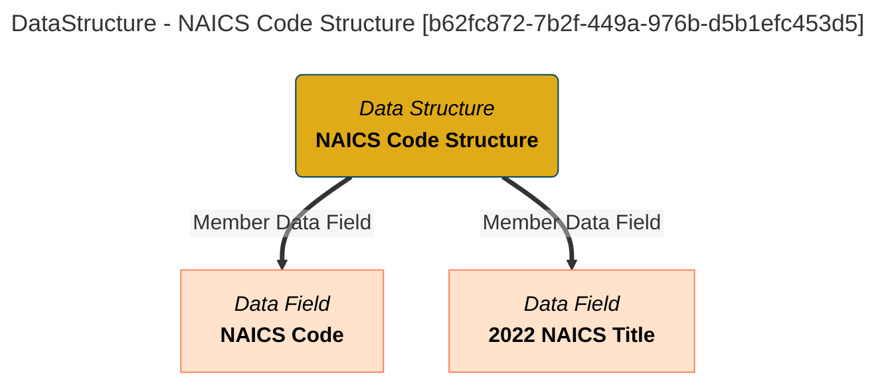

# Data Structure Information
Information used with Dr. Egeria to describe Data Structures.

# Data Structure Report - created at 2025-09-19 22:35
	Data Structure  found from the search string:  `All`

# Data Structure Name: NAICS Code Structure

## Display Name
NAICS Code Structure

## Qualified Name
[DataStruct::NAICS Code Structure](#b62fc872-7b2f-449a-976b-d5b1efc453d5)

## Category
Standard Reference Data

## Description
Each NAICS code entry consists of a unique six digit code and a corresponding name or title that describes a particular economic activity.

## Mermaid Graph

## GUID
b62fc872-7b2f-449a-976b-d5b1efc453d5

[[Data Structure]]