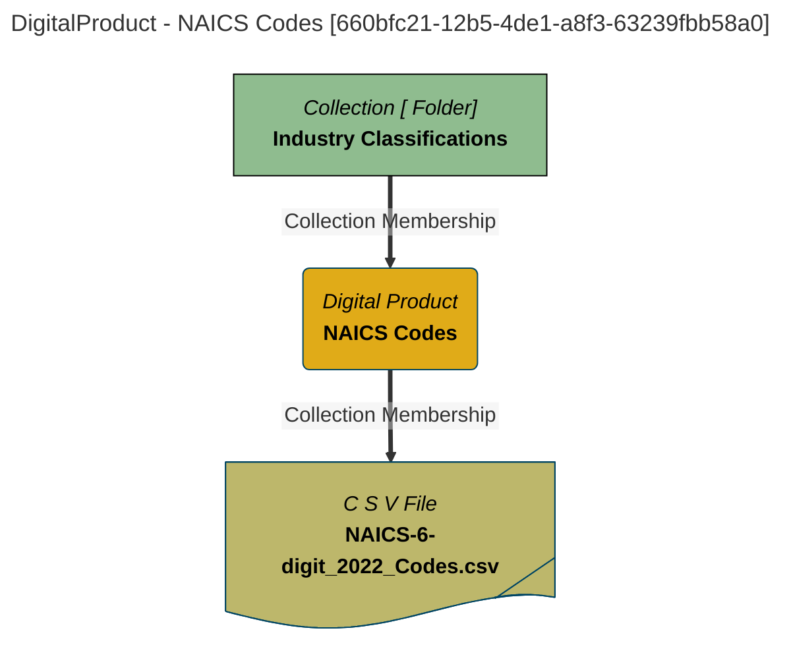

# Digital Product Information
Attributes useful to Digital Products.

# DigitalProduct Report - created at 2025-09-21 16:52
	DigitalProduct  found from the search string:  `All`

# DigitalProduct Name: NAICS Codes

## Display Name
NAICS Codes

## Qualified Name
[DigitalProduct::NAICS-Codes::2022](#660bfc21-12b5-4de1-a8f3-63239fbb58a0)

## Category
General Reference Data

## Description
NAICS Codes classify different kinds of businesses based on what they produce. They are organized hierarchically with more digits providing finer granularity in the kind of economic activity.

## Product Name
NAICS Codes - Industry Classifications

## Identifier
NAICS

## Maturity
Mature

## Mermaid Graph

