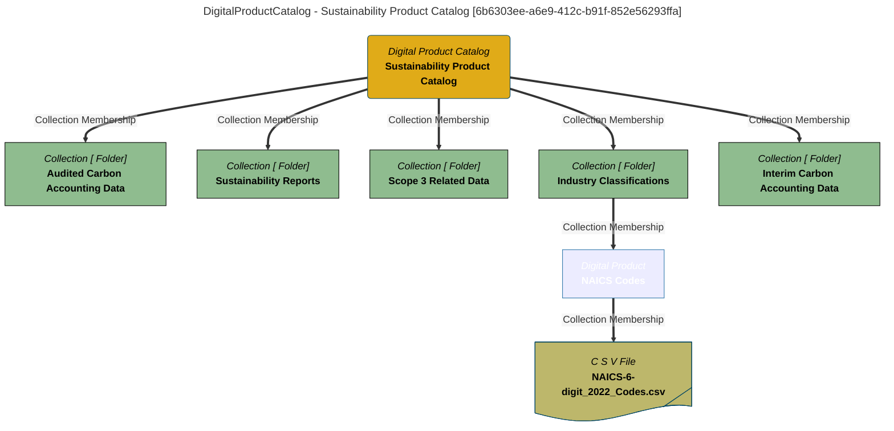

# Catalogs for Digital Products
Attributes generic to all Digital Product Catalogs..

# DigitalProductCatalog Report - created at 2025-09-21 16:55
	DigitalProductCatalog  found from the search string:  `All`

# DigitalProductCatalog Name: Sustainability Product Catalog

## Display Name
Sustainability Product Catalog

## Qualified Name
[DigProdCatalog::Sustainability-Product-Catalog::2025](#6b6303ee-a6e9-412c-b91f-852e56293ffa)

## Category
Sustainability

## Description
Catalog of Sustainability Assets that includes reference data used in carbon accounting, interim and localized results, aggregated results and finalized sustainability reports.

## Type Name
DigitalProductCatalog

## Created By
erinoverview

## Create Time
2025-09-20T18:57:09.670+00:00

## Containing Members
Collection::Audited-Carbon-Accounting-Data, Collection::Sustainability-Reports, Collection::Scope-3-Related-Data, Collection::Industry-Classifications, Collection::Interim-Carbon-Accounting-Data

## GUID
6b6303ee-a6e9-412c-b91f-852e56293ffa

## Mermaid Graph

