```mermaid
---
title: DigitalProductCatalog - Open Metadata Digital Product Catalog [51248fc9-1ea4-4a64-95d8-d46f7c6cb107]
---
flowchart TD
%%{init: {"flowchart": {"htmlLabels": false}} }%%

1@{ shape: rounded, label: "*Digital Product Catalog*
**Open Metadata Digital Product Catalog**"}
2@{ shape: rect, label: "*Collection [ Root Collection]*
**Digital Product Catalogs Root**"}
2==>|"Collection Membership"|1
3@{ shape: rect, label: "*Collection*
**Open Metadata Digital Products**"}
1==>|"Collection Membership"|3
4@{ shape: rect, label: "*Collection*
**Valid Value Sets**"}
3==>|"Collection Membership"|4
5@{ shape: rect, label: "*Digital Product*
**Valid Value Sets List**"}
4==>|"Collection Membership"|5
6@{ shape: cyl, label: "*Reference Code Table*
**Reference data set for Valid Value Sets List**"}
5==>|"Collection Membership"|6
7@{ shape: rect, label: "*Collection*
**IT Operations Observability**"}
3==>|"Collection Membership"|7
8@{ shape: rect, label: "*Collection*
**Organization Observability**"}
3==>|"Collection Membership"|8
9@{ shape: rect, label: "*Collection*
**Party, Places and Products**"}
3==>|"Collection Membership"|9
10@{ shape: rect, label: "*Collection*
**Governance Observability**"}
3==>|"Collection Membership"|10
11@{ shape: rect, label: "*Collection*
**Open Metadata Types**"}
3==>|"Collection Membership"|11
12@{ shape: rect, label: "*Digital Product*
**Open Metadata Types List**"}
11==>|"Collection Membership"|12
13@{ shape: cyl, label: "*Reference Code Table*
**Reference data set for Open Metadata Types List**"}
12==>|"Collection Membership"|13
14@{ shape: rect, label: "*Digital Product*
**Open Metadata Attributes List**"}
11==>|"Collection Membership"|14
15@{ shape: cyl, label: "*Reference Code Table*
**Reference data set for Open Metadata Attributes List**"}
14==>|"Collection Membership"|15
16@{ shape: rect, label: "*Data Dictionary*
**Open Metadata Digital Product Data Dictionary**"}
1==>|"Collection Membership"|16
17@{ shape: rect, label: "*Data Field*
**Qualified Name**"}
16==>|"Collection Membership"|17
18@{ shape: rect, label: "*Data Field*
**Preferred Value**"}
16==>|"Collection Membership"|18
19@{ shape: rect, label: "*Data Field*
**Data Type**"}
16==>|"Collection Membership"|19
20@{ shape: rect, label: "*Data Field*
**Element Create Time**"}
16==>|"Collection Membership"|20
21@{ shape: rect, label: "*Data Field*
**Description**"}
16==>|"Collection Membership"|21
22@{ shape: rect, label: "*Data Field*
**Namespace**"}
16==>|"Collection Membership"|22
23@{ shape: stadium, label: "*Plus 7  Items*
**...**"}
16-.->23
24@{ shape: rect, label: "*Glossary*
**Open Metadata Digital Product Glossary**"}
1==>|"Collection Membership"|24
25@{ shape: rect, label: "*Collection*
**Data Item Semantics**"}
24==>|"Collection Membership"|25
26@{ shape: rect, label: "*Collection*
**Digital Product Basics**"}
24==>|"Collection Membership"|26
27@{ shape: rect, label: "*Glossary Term*
**Digital Product**"}
26==>|"Collection Membership"|27
28@{ shape: rect, label: "*Collection*
**Digital Subscriptions**"}
24==>|"Collection Membership"|28
29@{ shape: doc, label: "*Governance Approach*
**Digital Products**"}
1==>|"More Information"|29
style 22 color:#000000, fill:#ffe3cc, stroke:#f9845b
style 23 color:#000000, fill:#F9F7ED, stroke:#b7c0c7
style 24 color:#FFFFFF, fill:#008080, stroke:#000000
style 25 color:#000000, fill:#f5fffa, stroke:#000000
style 26 color:#000000, fill:#f5fffa, stroke:#000000
style 27 color:#000000, fill:#66cdaa, stroke:#008080
style 28 color:#000000, fill:#f5fffa, stroke:#000000
style 29 color:#FFFFFF, fill:#006400, stroke:#000000
style 10 color:#000000, fill:#f5fffa, stroke:#000000
style 11 color:#000000, fill:#f5fffa, stroke:#000000
style 12 color:#000000, fill:#838cc7, stroke:#3079ab
style 13 color:#000000, fill:#bdb76b, stroke:#004563
style 14 color:#000000, fill:#838cc7, stroke:#3079ab
style 15 color:#000000, fill:#bdb76b, stroke:#004563
style 16 color:#000000, fill:#d2691e, stroke:#000000
style 17 color:#000000, fill:#ffe3cc, stroke:#f9845b
style 18 color:#000000, fill:#ffe3cc, stroke:#f9845b
style 19 color:#000000, fill:#ffe3cc, stroke:#f9845b
style 1 color:#000000, fill:#e0ab18, stroke:#004563
style 2 color:#000000, fill:#2e8b57, stroke:#000000
style 3 color:#000000, fill:#f5fffa, stroke:#000000
style 4 color:#000000, fill:#f5fffa, stroke:#000000
style 5 color:#000000, fill:#838cc7, stroke:#3079ab
style 6 color:#000000, fill:#bdb76b, stroke:#004563
style 7 color:#000000, fill:#f5fffa, stroke:#000000
style 8 color:#000000, fill:#f5fffa, stroke:#000000
style 9 color:#000000, fill:#f5fffa, stroke:#000000
style 20 color:#000000, fill:#ffe3cc, stroke:#f9845b
style 21 color:#000000, fill:#ffe3cc, stroke:#f9845b
```

# Catalogs for Digital Products
Attributes generic to all Digital Product Catalogs..

# DigitalProductCatalog Report - created at 2025-09-22 20:07
	DigitalProductCatalog  found from the search string:  `All`

# DigitalProductCatalog Name: Open Metadata Digital Product Catalog

## Display Name
Open Metadata Digital Product Catalog

## Qualified Name
[OpenMetadataProductCatalog::RootCollection::Open Metadata Digital Product Catalog](#51248fc9-1ea4-4a64-95d8-d46f7c6cb107)

## Description
Extracts of open metadata organized into useful data sets.  These digital products support a variety of subscription choices.  Data can be delivered either as a CSV file, or as a PostGreSQL table.  Updates to the subscriber''s copy typically occur within 1 hour of receiving the metadata update.

## Type Name
DigitalProductCatalog

## Created By
autoprodmgrnpa

## Create Time
2025-09-21T19:03:17.307+00:00

## Containing Members
OpenMetadataProductCatalog::Folder::Open Metadata Digital Products, OpenMetadataProductCatalog::RootCollection::Open Metadata Digital Product Data Dictionary, OpenMetadataProductCatalog::RootCollection::Open Metadata Digital Product Glossary

## Member Of
Egeria::DigitalProductCatalogsRoot

## GUID
51248fc9-1ea4-4a64-95d8-d46f7c6cb107

## Mermaid Graph

---

# DigitalProductCatalog Name: Sustainability Product Catalog

## Display Name
Sustainability Product Catalog

## Qualified Name
[DigProdCatalog::Sustainability-Product-Catalog::2025](#07ed4a5d-0a34-4724-bd87-8bceea98464b)

## Category
Sustainability

## Description
Catalog of Sustainability Assets that includes reference data used in carbon accounting, interim and localized results, aggregated results and finalized sustainability reports.

## Type Name
DigitalProductCatalog

## Created By
autoprodmgrnpa

## Create Time
2025-09-21T19:03:17.307+00:00

## Updated By
erinoverview

## Containing Members
OpenMetadataProductCatalog::Folder::Open Metadata Digital Products, OpenMetadataProductCatalog::RootCollection::Open Metadata Digital Product Data Dictionary, OpenMetadataProductCatalog::RootCollection::Open Metadata Digital Product Glossary

## Member Of
Egeria::DigitalProductCatalogsRoot

## GUID
51248fc9-1ea4-4a64-95d8-d46f7c6cb107

## Mermaid Graph

