# DigitalProductCatalog Name: Open Metadata Digital Product Catalog 

- Qualified Name: `DigitalProductCatalog::OpenMetadataDigitalProductCatalog::Open Metadata Digital Product Catalog`
- GUID: `236bab44-8c5c-4cdb-aad6-c4e8174386ab`

### Properties
- class: ElementHeader
- contentStatus: ACTIVE
- description: Extracts of open metadata organized into useful data sets.  These digital products support a variety of subscription choices.  Data can be delivered either as a CSV file, or as a PostGreSQL table.  Updates to the subscriber''s copy typically occur within 1 hour of receiving the metadata update.
- headerVersion: 0

### Mermaid Graph

```mermaid
---
title: DigitalProductCatalog - Open Metadata Digital Product Catalog [236bab44-8c5c-4cdb-aad6-c4e8174386ab]
---
flowchart TD
%%{init: {"flowchart": {"htmlLabels": false}} }%%

1@{ shape: rounded, label: "*Digital Product Catalog*
**Open Metadata Digital Product Catalog**"}
2@{ shape: trap-t, label: "*Engine Action*
**baudot-subscription-manager (EgeriaWatchdog)**"}
1==>|"Actions"|2
3@{ shape: rect, label: "*Root Collection*
**Digital Product Catalogs Root**"}
3==>|"Collection Membership"|1
4@{ shape: rect, label: "*Data Dictionary*
**Open Metadata Digital Product Data Dictionary**"}
1==>|"Collection Membership"|4
5@{ shape: rect, label: "*Data Field*
**Profile Unique Identifier (GUID)**"}
4==>|"Collection Membership"|5
6@{ shape: rect, label: "*Data Field*
**Open Metadata Attribute Name**"}
4==>|"Collection Membership"|6
7@{ shape: rect, label: "*Data Field*
**Location Classification Name**"}
4==>|"Collection Membership"|7
8@{ shape: rect, label: "*Data Field*
**Resource Creation Time**"}
4==>|"Collection Membership"|8
9@{ shape: rect, label: "*Data Field*
**Measurement Name**"}
4==>|"Collection Membership"|9
10@{ shape: rect, label: "*Data Field*
**Display Name**"}
4==>|"Collection Membership"|10
11@{ shape: stadium, label: "*Collection Membership*
**... plus 160 Items**"}
4-.->11
12@{ shape: rect, label: "*Digital Product Family*
**Open Metadata Digital Products**"}
1==>|"Collection Membership"|12
13@{ shape: rect, label: "*Digital Product Family*
**Actor, Places and Product Master Data**"}
12==>|"Collection Membership"|13
14@{ shape: rect, label: "*Digital Product*
**People List**"}
13==>|"includes product [Collection Membership]"|14
15@{ shape: rect, label: "*Digital Product*
**Digital Product List**"}
13==>|"includes product [Collection Membership]"|15
16@{ shape: rect, label: "*Digital Product*
**List of Locations**"}
13==>|"includes product [Collection Membership]"|16
17@{ shape: rect, label: "*Digital Product*
**Organization List**"}
13==>|"includes product [Collection Membership]"|17
18@{ shape: rect, label: "*Digital Product Family*
**Survey Reports**"}
12==>|"Collection Membership"|18
19@{ shape: rect, label: "*Digital Product*
**Resource measurement annotations for surveyed resources**"}
18==>|"includes product [Collection Membership]"|19
20@{ shape: rect, label: "*Digital Product*
**Resource measurement annotations for surveyed Files**"}
18==>|"includes product [Collection Membership]"|20
21@{ shape: rect, label: "*Digital Product*
**Resource measurement annotations for surveyed Relational Schemas**"}
18==>|"includes product [Collection Membership]"|21
22@{ shape: rect, label: "*Digital Product*
**Resource measurement annotations for surveyed Relational Tables**"}
18==>|"includes product [Collection Membership]"|22
23@{ shape: rect, label: "*Digital Product*
**List of Request For Action Annotations from all Survey Reports**"}
18==>|"includes product [Collection Membership]"|23
24@{ shape: rect, label: "*Digital Product*
**Missing File Classifiers**"}
18==>|"includes product [Collection Membership]"|24
25@{ shape: stadium, label: "*Collection Membership*
**... plus 7 Items**"}
18-.->25
26@{ shape: rect, label: "*Digital Product Family*
**Open Metadata Types**"}
12==>|"Collection Membership"|26
27@{ shape: rect, label: "*Digital Product*
**Open Metadata Attributes List**"}
26==>|"includes product [Collection Membership]"|27
28@{ shape: rect, label: "*Digital Product*
**Open Metadata Types List**"}
26==>|"includes product [Collection Membership]"|28
29@{ shape: rect, label: "*Digital Product*
**Open Metadata Data Types List**"}
26==>|"includes product [Collection Membership]"|29
30@{ shape: rect, label: "*Digital Product*
**Open Metadata Attributes For Types List**"}
26==>|"includes product [Collection Membership]"|30
31@{ shape: rect, label: "*Digital Product Family*
**Governance Observability**"}
12==>|"Collection Membership"|31
32@{ shape: rect, label: "*Digital Product Family*
**Reference Data Sets**"}
12==>|"Collection Membership"|32
33@{ shape: rect, label: "*Digital Product*
**Reference Data Set List**"}
32==>|"includes product [Collection Membership]"|33
34@{ shape: rect, label: "*Digital Product Family*
**IT Operations Observability**"}
12==>|"Collection Membership"|34
35@{ shape: stadium, label: "*Collection Membership*
**... plus 2 Items**"}
12-.->35
36@{ shape: rect, label: "*Glossary*
**Open Metadata Digital Product Glossary**"}
1==>|"Collection Membership"|36
37@{ shape: rect, label: "*Collection Folder*
**Digital Subscriptions**"}
36==>|"Collection Membership"|37
38@{ shape: rect, label: "*Glossary Term*
**Evaluation Subscription**"}
37==>|"Collection Membership"|38
39@{ shape: rect, label: "*Glossary Term*
**Ongoing Update Subscription**"}
37==>|"Collection Membership"|39
40@{ shape: rect, label: "*Collection Folder*
**Data Item Semantics**"}
36==>|"Collection Membership"|40
41@{ shape: rect, label: "*Glossary Term*
**Unique Identifier**"}
40==>|"Collection Membership"|41
42@{ shape: rect, label: "*Glossary Term*
**Open Metadata Type Name**"}
40==>|"Collection Membership"|42
43@{ shape: rect, label: "*Collection Folder*
**Digital Product Basics**"}
36==>|"Collection Membership"|43
44@{ shape: rect, label: "*Glossary Term*
**Digital Product**"}
43==>|"Collection Membership"|44
45@{ shape: rect, label: "*Solution Blueprint*
**Open Metadata Digital Product Catalog Solution**"}
1==>|"Solution Design"|45
style 22 color:#000000, fill:#838cc7, stroke:#3079ab
style 44 color:#000000, fill:#66CDAA, stroke:#008080
style 23 color:#000000, fill:#838cc7, stroke:#3079ab
style 45 color:#000000, fill:#f5fffa, stroke:#000000
style 24 color:#000000, fill:#838cc7, stroke:#3079ab
style 25 color:#000000, fill:#F9F7ED, stroke:#b7c0c7
style 26 color:#000000, fill:#838cc7, stroke:#3079ab
style 27 color:#000000, fill:#838cc7, stroke:#3079ab
style 28 color:#000000, fill:#838cc7, stroke:#3079ab
style 29 color:#000000, fill:#838cc7, stroke:#3079ab
style 30 color:#000000, fill:#838cc7, stroke:#3079ab
style 31 color:#000000, fill:#838cc7, stroke:#3079ab
style 10 color:#000000, fill:#ffe3cc, stroke:#FFA500
style 32 color:#000000, fill:#838cc7, stroke:#3079ab
style 11 color:#000000, fill:#F9F7ED, stroke:#b7c0c7
style 33 color:#000000, fill:#838cc7, stroke:#3079ab
style 12 color:#000000, fill:#838cc7, stroke:#3079ab
style 34 color:#000000, fill:#838cc7, stroke:#3079ab
style 13 color:#000000, fill:#838cc7, stroke:#3079ab
style 35 color:#000000, fill:#F9F7ED, stroke:#b7c0c7
style 14 color:#000000, fill:#838cc7, stroke:#3079ab
style 36 color:#FFFFFF, fill:#008080, stroke:#000000
style 15 color:#000000, fill:#838cc7, stroke:#3079ab
style 37 color:#000000, fill:#8fbc8f, stroke:#000000
style 16 color:#000000, fill:#838cc7, stroke:#3079ab
style 38 color:#000000, fill:#66CDAA, stroke:#008080
style 17 color:#000000, fill:#838cc7, stroke:#3079ab
style 39 color:#000000, fill:#66CDAA, stroke:#008080
style 18 color:#000000, fill:#838cc7, stroke:#3079ab
style 19 color:#000000, fill:#838cc7, stroke:#3079ab
style 1 color:#000000, fill:#e0ab18, stroke:#004563
style 2 color:#000000, fill:#7fffd4, stroke:#000000
style 3 color:#000000, fill:#2e8b57, stroke:#000000
style 4 color:#000000, fill:#d2691e, stroke:#000000
style 5 color:#000000, fill:#ffe3cc, stroke:#FFA500
style 6 color:#000000, fill:#ffe3cc, stroke:#FFA500
style 7 color:#000000, fill:#ffe3cc, stroke:#FFA500
style 8 color:#000000, fill:#ffe3cc, stroke:#FFA500
style 9 color:#000000, fill:#ffe3cc, stroke:#FFA500
style 40 color:#000000, fill:#8fbc8f, stroke:#000000
style 41 color:#000000, fill:#66CDAA, stroke:#008080
style 20 color:#000000, fill:#838cc7, stroke:#3079ab
style 42 color:#000000, fill:#66CDAA, stroke:#008080
style 21 color:#000000, fill:#838cc7, stroke:#3079ab
style 43 color:#000000, fill:#8fbc8f, stroke:#000000

```

### Peers
- [baudot-subscription-manager (EgeriaWatchdog)](#314b9614-1152-4e77-9eff-9e577fbf9640) — Actions
- [Digital Products](#8e40be82-826f-4dc7-8bb6-fc5a25878305) — MoreInformation
- [Digital Product Catalogs Root](#dcec6ddb-317e-4c64-907e-be508ceba6d9) — CollectionMembership
- [Open Metadata Digital Product Data Dictionary](#62b482b1-7138-4975-b880-ac56ccf922e1) — CollectionMembership
- [Open Metadata Digital Products](#9f39821f-b29f-4710-ac5e-1dc4963387b5) — CollectionMembership
- [Open Metadata Digital Product Glossary](#41a484d2-3031-427c-a906-5c1751597512) — CollectionMembership
- [Open Metadata Digital Product Catalog Solution](#458b39b2-d376-4414-959d-55b0ebd9e8a1) — SolutionDesign

---

# EngineAction Name: baudot-subscription-manager (EgeriaWatchdog) 

- Qualified Name: `EgeriaWatchdog::baudot-subscription-manager::2d4e95c8-c595-4ab9-b1b8-4aefdd3a9207`
- GUID: `314b9614-1152-4e77-9eff-9e577fbf9640`

### Properties
- activityStatus: IN_PROGRESS
- description: Manages the notifications used to fulfill digital product subscriptions obligations.
- domainIdentifier: 0
- executorEngineGUID: 23ec5cb2-e0a2-412c-9c2e-deefbe3d6459
- executorEngineName: EgeriaWatchdog
- governanceActionTypeGUID: 5910a207-0da0-4694-afcb-9037c82fef33
- governanceActionTypeName: EgeriaWatchdog::baudot-subscription-manager
- headerVersion: 0
- priority: 0
- processingEngineUserId: egeriawatchdogengine
- relatedElementAtEnd1: False
- requestedStartTime: 2026-02-26T13:15:57.890+00:00
- requesterUserId: jacquardnpa
- requestType: baudot-subscription-manager
- startTime: 2026-02-26T13:16:54.799+00:00

---

# GovernanceApproach Name: Digital Products 

- Qualified Name: `GovernanceApproach::OpenMetadataDigitalProduct::POLICY-731-1::Digital Products`
- GUID: `8e40be82-826f-4dc7-8bb6-fc5a25878305`

### Properties
- contentStatus: ACTIVE
- description: Our new business initiatives and our acquisition strategy makes it imperative that valuable data is trusted, shared and used across all divisions of the organization.  Digital products provide a well-defined approach to packaging data in a way that maximizes its potential uses.  Organizing digital products into one or more digital product catalogs helps data consumers find the data that need.  Digital subscriptions create a formal contract between the team providing the data and the teams consuming it.  This ensures data is delivered with the appropriate reliability and quality, and the consumers properly manage the data they have received.
- domainIdentifier: 0
- headerVersion: 0
- identifier: POLICY-731-1
- importance: High
- relatedElementAtEnd1: False
- summary: The use of digital products organized in catalogs will improve our ability to share data across the organization.

---

# RootCollection Name: Digital Product Catalogs Root 

- Qualified Name: `Egeria::DigitalProductCatalogsRoot`
- GUID: `dcec6ddb-317e-4c64-907e-be508ceba6d9`

### Properties
- description: Root collection linking the digital product catalogs together.
- headerVersion: 0
- relatedElementAtEnd1: True
- versionIdentifier: 6.0-SNAPSHOT

---

# DataDictionary Name: Open Metadata Digital Product Data Dictionary 

- Qualified Name: `DataDictionary::OpenMetadataDigitalProductCatalog::Open Metadata Digital Product Data Dictionary`
- GUID: `62b482b1-7138-4975-b880-ac56ccf922e1`

### Properties
- contentStatus: ACTIVE
- description: Details of the types of data fields used in the open metadata digital products.
- headerVersion: 0
- relatedElementAtEnd1: False

### Children
- [Profile Unique Identifier (GUID)](#06f291a3-4c53-44f5-8bec-502eafa2531e)
- [Open Metadata Attribute Name](#64d58f97-49e5-4924-82dc-67cf305515ae)
- [Location Classification Name](#92882022-d596-4f23-beb2-497fd93133fe)
- [Resource Creation Time](#a2a0e09f-755e-43e7-ac75-cc3731a24b7d)
- [Measurement Name](#31f1ee2b-a879-4c60-9367-d40964d2a97c)
- [Display Name](#31bed55c-231c-4270-96a9-d4bb30415ee4)
- [NamespacePath](#a6c87a4b-7937-4b20-947f-a0102632ed63)
- [Open Metadata Type Status](#c4462507-67b8-455e-bebe-0f3155e358c7)
- [Annotation Type Name](#7012673a-5ed7-4475-a327-caa642ca313c)
- [File Name Count](#0aee6836-2d0a-48c3-b5de-bf9934582ae2)
- [Is Default Value?](#735aadad-89fc-4f78-9607-5acb72fa8bff)
- [Sync Time](#a603e46e-3be2-4d1d-922f-b75397ca3ebf)
- [Deployed Implementation Type Count](#13a73c59-c81d-4307-a350-89a31d20645b)
- [Rows Fetched](#8233a047-8dcd-4edf-81fd-a2ed636e4ae3)
- [Is Populated](#2c87e5ec-d3ea-41bf-a14b-c0c19e8e7d56)
- [Total File Size](#3a4f7f59-e9db-49a4-ba04-a27942ad59f5)
- [Last File Accessed Time](#f45347f0-9d72-4455-917d-50e011fa5464)
- [Certification Type Unique Identifier (GUID)](#45f5b322-9c5c-4037-bf23-b956ee9904f1)
- [Bean Class Name](#69697ddf-e2a6-4376-9aaf-a952cfd8d6e6)
- [Column Count](#11db1fac-db79-40dd-b1fb-a82f83f7939c)
- [File Size](#a3cfce61-f195-443d-ae82-459741cff6fa)
- [Engine Action Unique Identifier (GUID)](#a90e2d23-a8da-4edb-bfb8-f434f7cca174)
- [Action Target Relationship Unique Identifier (GUID)](#d1240288-693e-44ff-963e-d793aee59f07)
- [Has Indexes](#7b97a6c9-8930-4d20-9348-691b66dce692)
- [Table Type](#5859a411-5e1d-451c-8048-d9370206d42e)
- [Rows Updated](#3273278c-1e9a-4eb3-8b97-62a93167c497)
- [Asset Type Count](#e77607f2-98c4-41bb-b53f-204696c5a218)
- [Initiator User Identifier (userId)](#23a0a7ab-d11d-434b-bb8c-1cca7075ac70)
- [Analysis Step](#7b69f571-3ad1-48b6-b071-3395d9771648)
- [Action Target Type Name](#c6dbdd0f-b101-4778-ac11-f78c9f8c2c9e)
- [Open Metadata Type Name](#432635fe-3ead-4977-a77f-59d527841b45)
- [Data Encoding](#5974fcf1-b7b6-4a2c-b040-aa80df7f8c7f)
- [Rows Inserted](#c8bfdc05-c38a-4996-9f74-c580292c7928)
- [File Count](#337194a6-3f36-4b4c-a3de-0ee3c6c2b2ea)
- [Readable File Count](#a7321177-fffb-4252-afeb-42e1aa34b281)
- [Can Read](#29e588bc-f933-4651-8327-90b2c73a4e44)
- [Location Coordinates](#e47cd9fd-6ff3-48b7-8496-6d62d4e8b593)
- [Owner Unique Identifier (GUID)](#b836e647-b8bd-424c-aa80-0626940c9c6c)
- [File Extension Count](#617489c2-a789-4ed5-a7dc-f37304f89745)
- [Origin Business Capability Unique Identifier (GUID)](#0ce83159-b92f-468c-932c-16a1ffc9c4a7)
- [Open Metadata Super Types](#18a031ea-7248-40d7-b347-25c665f2eb4c)
- [License Type Unique Identifier (GUID)](#6a940be9-5ff6-48c8-9e09-f0b55deb1a1d)
- [Last Statistics Reset](#0d51b91b-c6a7-4bae-bfa6-3894c8c489b4)
- [Last Modified Time](#0843e9ef-98b6-43ad-aa68-ddaf026d2ce9)
- [Can Write](#697c47d2-fdb6-4c21-b04e-76671329dc93)
- [Description](#d8f6d53d-f361-4a0b-b44f-b4b956d88f8b)
- [Expression](#29fdc5e3-65ef-4062-a15c-eaa4c4339af6)
- [View Count](#ddb7f5ce-16bd-4c05-81a4-59b144777b31)
- [Identifier](#358299c6-1e61-44f7-9389-b16315be4167)
- [Most Common Values](#402dde6e-53fa-4454-a76d-e6d99f185832)
- [Has Rules](#58f33a3c-75b9-46df-a87a-925c328c55b7)
- [Asset Unique Identifier (GUID)](#f1d67168-6b1d-4038-b2e3-00ab5628cc20)
- [License Unique Identifier (GUID)](#4b2cb844-a322-41af-8f80-0a02dc95595c)
- [Start Timestamp](#544049c9-d241-4825-8f70-6a4fb5d34077)
- [File Creation Time](#831b348f-7997-4eb2-9375-f212d4fead52)
- [Location Unique Identifier (GUID)](#9ae0547c-78d1-412b-9d86-44a0799f9e99)
- [Measurement Numeric Value](#199b2292-3e38-42b4-8fb0-27b60f857c69)
- [Resource Properties](#a49e4fbc-47b3-46f9-8004-7ac4262d3404)
- [Origin Organization Unique Identifier (GUID)](#a868bd78-a193-4d83-90e1-c5d5b9bc503e)
- [Metadata Collection Id](#4d3bd973-c560-4639-814b-49e9ad09b2c5)
- [Last Accessed Time](#1e8aeab0-afde-433d-b862-ce96f34d15d6)
- [Is Symbolic Link](#4f518be7-a02a-42d5-b998-272376a0ae1e)
- [Distinguished Name](#a4538b86-8269-478b-a3c1-fd69b5e32319)
- [Preferred Value](#a1431eef-c152-4213-8026-c76dd015f5a2)
- [Element Create Time](#24b03da8-faa3-4f98-be91-45bbebf5b0bf)
- [Executable File Count](#bba12e82-b34a-4cba-ab58-6f45bad3b8ae)
- [Has Triggers](#ae1d59a2-0b8e-4898-b865-4c576ba51c2d)
- [Authors](#7e539f5f-dee3-41e6-b5fe-d0efaec1db3f)
- [Is Nullable?](#f507ae59-1734-481f-9f49-db140da09f32)
- [Summary](#8882cb13-ffba-49c1-9a84-a8c40f1f90c3)
- [File Type Count](#e3d869a5-c5a0-47f6-a51d-fdea050f99ce)
- [Metadata Collection Name](#dabd6766-bfc6-40ff-a45f-d8ca824edabc)
- [End Timestamp](#f69e69d2-43f5-4fcf-8464-ebfccd2cadb6)
- [Category](#f9fac128-a791-40c9-b6e2-27daa0492f32)
- [Governance Engine Name](#94e3d28c-f7e6-4882-b2b2-b181722ae2fd)
- [Location Map Projection](#80aa8d0e-1f02-437f-988f-ba845de545e8)
- [JSON Properties](#792f7e8f-12b1-45e1-b72c-440f2b18db32)
- [Maintained By User Identifiers (userIds)](#040a31c1-6a82-4f4c-8261-fd44df219539)
- [Confidentiality Level](#c6b6a363-47f9-4356-94a5-97d1ad9b0a2c)
- [Filename](#485f4f0d-587b-4d89-8883-3311638a8af3)
- [Survey Subject Type Name](#265dfed5-1493-4012-979d-3490b32fd997)
- [Expected Behaviour](#c02220b7-7514-4a9c-bc49-faac6e3a99a5)
- [Pathname](#4f84f670-bdb6-499d-84c6-28c5aaf57bc4)
- [Purpose](#49f04a11-c2a0-4f7e-8b45-5ad53b61984a)
- [File Type](#f20931bc-b20b-46d1-9afa-f8b26f3fd575)
- [Writeable File Count](#ad5c68fd-43b5-4301-93ba-558123cae50d)
- [Measurement String Value](#fd2857da-4e2c-4e6c-9c10-fb8ca88eeaff)
- [File Extension](#d2a906ec-eba1-45dc-bf70-c3f5c7ae0808)
- [Network Address](#a4019eed-45f2-4ab6-bbc0-4a37c48625f9)
- [Semantic Assignment Glossary Term Unique Identifier (GUID)](#d6e2d13a-a77e-4977-9526-61d2aaa1bfb8)
- [Active Time](#070a69d0-fefd-46f7-b5e1-c1a35db612a1)
- [Unclassified File Count](#fdfa7c96-7bb4-4f93-80c2-aadcb940936b)
- [Request Type](#26bc082b-5f10-4e65-acb5-da01d5a456e3)
- [Created By User Identifier (userId)](#d4df2fbe-ed47-4fae-af52-8d49b14949b6)
- [Data Width](#f9256e01-cf56-42dc-976b-ee435f44cda3)
- [Informal Tags](#c1492eba-537b-48a1-9aae-3aa0cbfb98fe)
- [Rows Deleted](#5d142e73-6980-45c5-a72c-2f72c7e89a6d)
- [Element Status](#5af68cc8-a80c-4ca4-95e9-8f1c711f87f7)
- [Owner Type Name](#d2dacf43-b71e-43b9-9bdd-7baadf5f0782)
- [Distinct Value Count](#2d8ba4ba-2e9a-4077-8ccd-429fb1870b87)
- [Resource Name](#f1423d16-4c02-4dee-8f15-03e3cd05a9f6)
- [Data Type](#4524a290-b1a3-467d-b1ab-6c13430445e8)
- [Resource Owner](#e208441f-0b16-4253-83e3-32c532b8b252)
- [Is Hidden](#f1387fc6-2b74-45ca-8bf9-41dd6316ca4a)
- [Action Request Unique Identifier (GUID)](#e5492ec6-e347-448c-b297-372ed8c158e2)
- [Hidden File Count](#059f4956-6288-4751-a613-aa07da0082df)
- [Qualified Name](#7860c578-c4e3-4e5f-baf5-9f0ce38bee40)
- [Can Execute](#bdce074a-df50-44c8-b8bd-d3b57baf305d)
- [Globally Unique Identifier (GUID)](#fe016c1d-f0a3-4f95-b39b-181b5bf01a56)
- [Action Target Unique Identifier (GUID)](#3a9520b7-a18a-43b0-9c7a-3bbf1362c9bb)
- [Last File Creation Time](#3423fa38-c624-40b2-83d0-b1a8577bdeb7)
- [Open Metadata Attribute Status](#0ccaca30-da02-40e2-ab7b-28776d8f14fd)
- [Location Postal Address](#7874f3f2-b8a6-48cf-9796-a484a9f1a342)
- [Measurement Display Value](#14b9d378-753b-4937-a1ad-2ac25dd85903)
- [Symbolic Link File Count](#9c4568d2-b4ea-4ccb-a10f-87188fe5ff34)
- [Materialized View Count](#68f365e2-274a-4427-aae1-e5ec6da46974)
- [Example](#f40620ea-b702-4fb2-817b-2665eab036b6)
- [Scope](#ec90ce1b-6d56-41cd-826c-404cb0bdae94)
- [Last Updated By User Identifier (userId)](#39795505-4b58-46dd-aafd-aed6da998c67)
- [Last File Modification Time](#ed4d4e9f-f1ec-4734-b620-92447c7d51fb)
- [Abbreviation](#3ca41460-cd21-4f9d-a083-7f1d22496a89)
- [Governance Zone Names](#b1738733-dbad-4ccc-88fe-257cca6185d4)
- [Has Row Security](#ccbba5cd-17a3-40d1-aee1-97955583e532)
- [Content Status](#fcde79af-1d6e-46d1-a9bf-518ccbc05981)
- [Survey Subject Unique Identifier (GUID)](#4012967c-3c51-4f1b-9249-bb4edffdf121)
- [Session Time](#b9a38aa2-9099-453f-8905-18df320dbab9)
- [Open Metadata Attribute Type Name](#69ddeeac-e3fe-4cc9-9019-1e4ac890d342)
- [Asset Type Name](#180fc7bf-e569-4ddf-93e9-f7934100c6f5)
- [Directory Name](#f95c3684-3602-4d1c-a10b-7d9533002172)
- [URL Link](#d61b54ec-76f6-48f9-85c4-02a22af039ad)
- [Sub Directory Count](#15c30e22-4aea-4888-b4bd-ae1e1ff98021)
- [Confidence Level](#2f77bdcf-a0e7-4124-9188-bf39646ceeb0)
- [Activity Status](#23c8273f-12ff-49de-bae0-e25af5266eb5)
- [Explanation](#7aef1fe8-98dc-4177-840b-463d048e3db2)
- [Deployment Status](#c7097ab1-9e2c-4c8d-b1a0-4bf9d74bd2fb)
- [Query Definition](#2d5d16ab-5e4a-4b67-a4b4-497e5d22b9d9)
- [Additional Properties](#37bc39ed-f7a4-461c-a112-61771be986b6)
- [Version Identifier](#286b5df8-c250-4ab1-8ccb-c635a20a74b0)
- [Schema Count](#2f88d496-e138-4931-9f59-e5a74fa2ccf1)
- [Engine Host User Identifier (userId)](#46266193-301e-4619-b32b-b8ae357c80e8)
- [Data Size](#87e98595-76d1-4226-bb12-f61b650dd79f)
- [Open Metadata Subtypes](#96d0365c-9573-479c-89c5-36ff338a2466)
- [Element Last Update Time](#c144c1d7-3acb-4f31-ba6e-f7b12fbf110b)
- [Project Unique Identifier (GUID)](#5341c0fb-137d-4b57-bc87-9f4226849a85)
- [Deployed Implementation Type (Technology Type)](#b3e6b005-5cf3-4ad9-b94b-fffb40479226)
- [Usage](#bd8a10aa-308b-429f-9828-6ee082c996e3)
- [Search Keywords](#03b189f3-baeb-44b3-b198-29584737c9c8)
- [Survey Report Unique Identifier (GUID)](#b3e60cf4-9975-46b7-a986-d7941c7803bd)
- [Source](#56e07340-c354-4705-b8c4-6bcd28c027a2)
- [Inaccessible File Count](#0e433f12-a7bc-470b-80ba-67d7cd8f8aea)
- [Table Count](#be73d837-418a-4adc-9749-f4f2398f181e)
- [Action Request Name](#9b086279-313d-49eb-a378-d079d1c37b5a)
- [Not Null](#40fa8426-ee52-4bea-a52f-b1b56d06ca61)
- [Resource Size](#143a51a7-a5c9-40a2-981c-d3f1c0bdd909)
- [Measurement Category](#4b82db3c-17a5-4d79-a78c-cebbdd20c5fb)
- [Certification Unique Identifier (GUID)](#e801f565-0280-42a1-bcfb-521261b73dcc)
- [Mission](#0ea66728-e6ed-47c0-8d49-02b864f0d770)
- [Is Case Sensitive?](#3ccfaec6-8306-4897-92f6-d5b2c65699f2)
- [User Identifier (userId)](#3e8852e8-7bf7-4673-99e4-b2f4d12dfe79)
- [Action Target Name](#5b06baa1-b1bb-425b-94f3-7a6d20a735b4)
- [Record Count](#0cb4442b-3095-4638-9b5b-9626eecb3698)
- [Archive Date](#dfc12ecf-ad08-40c3-b7b6-77660a0a7e2a)
- [Most Common Values Frequency](#67095056-72dd-4e26-9bee-234b8e8baa6e)
- [Survey Annotation Unique Identifier (GUID)](#7c01bf02-d62c-4da2-8bba-8fcbe881863e)
- [Criticality Level](#2b4eeef2-946d-4276-87ab-6fe54c3538c6)
- [Property Name](#d075c33d-b8ac-48de-9f39-b903145b673a)

---

# DataField Name: Profile Unique Identifier (GUID) 

- Qualified Name: `DataField::OpenMetadataDigitalProduct::Profile Unique Identifier (GUID)`
- GUID: `06f291a3-4c53-44f5-8bec-502eafa2531e`

### Properties
- contentStatus: ACTIVE
- dataType: string
- description: Unique identifier of a profile.
- headerVersion: 0
- isNullable: True
- length: 0
- minimumLength: 0
- orderedValues: False
- precision: 0
- relatedElementAtEnd1: False
- sortOrder: UNSORTED

---

# DataField Name: Open Metadata Attribute Name 

- Qualified Name: `DataField::OpenMetadataDigitalProduct::Open Metadata Attribute Name`
- GUID: `64d58f97-49e5-4924-82dc-67cf305515ae`

### Properties
- contentStatus: ACTIVE
- dataType: string
- description: The property name of an open metadata attribute within a type.
- headerVersion: 0
- isNullable: True
- length: 0
- minimumLength: 0
- orderedValues: False
- precision: 0
- relatedElementAtEnd1: False
- sortOrder: UNSORTED

---

# DataField Name: Location Classification Name 

- Qualified Name: `DataField::OpenMetadataDigitalProduct::Location Classification Name`
- GUID: `92882022-d596-4f23-beb2-497fd93133fe`

### Properties
- contentStatus: ACTIVE
- dataType: string
- description: The classification assigned to the location that describes the type of location.
- headerVersion: 0
- isNullable: True
- length: 0
- minimumLength: 0
- orderedValues: False
- precision: 0
- relatedElementAtEnd1: False
- sortOrder: UNSORTED

---

# DataField Name: Resource Creation Time 

- Qualified Name: `DataField::OpenMetadataDigitalProduct::Resource Creation Time`
- GUID: `a2a0e09f-755e-43e7-ac75-cc3731a24b7d`

### Properties
- contentStatus: ACTIVE
- dataType: date
- description: The creation time of the surveyed digital resource.
- headerVersion: 0
- isNullable: True
- length: 0
- minimumLength: 0
- orderedValues: False
- precision: 0
- relatedElementAtEnd1: False
- sortOrder: UNSORTED

---

# DataField Name: Measurement Name 

- Qualified Name: `DataField::OpenMetadataDigitalProduct::Measurement Name`
- GUID: `31f1ee2b-a879-4c60-9367-d40964d2a97c`

### Properties
- contentStatus: ACTIVE
- dataType: string
- description: The name of the measurement, aka annotation type.
- headerVersion: 0
- isNullable: True
- length: 0
- minimumLength: 0
- orderedValues: False
- precision: 0
- relatedElementAtEnd1: False
- sortOrder: UNSORTED

---

# DataField Name: Display Name 

- Qualified Name: `DataField::OpenMetadataDigitalProduct::Display Name`
- GUID: `31bed55c-231c-4270-96a9-d4bb30415ee4`

### Properties
- contentStatus: ACTIVE
- dataType: string
- description: Display name of the element used for summary tables and titles.
- headerVersion: 0
- isNullable: True
- length: 0
- minimumLength: 0
- orderedValues: False
- precision: 0
- relatedElementAtEnd1: False
- sortOrder: UNSORTED

---

# DataField Name: NamespacePath 

- Qualified Name: `DataField::OpenMetadataDigitalProduct::NamespacePath`
- GUID: `a6c87a4b-7937-4b20-947f-a0102632ed63`

### Properties
- contentStatus: ACTIVE
- dataType: string
- description: Prefix for element names to ensure uniqueness.
- headerVersion: 0
- isNullable: True
- length: 0
- minimumLength: 0
- orderedValues: False
- precision: 0
- relatedElementAtEnd1: False
- sortOrder: UNSORTED

---

# DataField Name: Open Metadata Type Status 

- Qualified Name: `DataField::OpenMetadataDigitalProduct::Open Metadata Type Status`
- GUID: `c4462507-67b8-455e-bebe-0f3155e358c7`

### Properties
- contentStatus: ACTIVE
- dataType: string
- description: The status of an open metadata type.
- headerVersion: 0
- isNullable: True
- length: 0
- minimumLength: 0
- orderedValues: False
- precision: 0
- relatedElementAtEnd1: False
- sortOrder: UNSORTED

---

# DataField Name: Annotation Type Name 

- Qualified Name: `DataField::OpenMetadataDigitalProduct::Annotation Type Name`
- GUID: `7012673a-5ed7-4475-a327-caa642ca313c`

### Properties
- contentStatus: ACTIVE
- dataType: string
- description: The unique type name of an annotation from a survey report.
- headerVersion: 0
- isNullable: True
- length: 0
- minimumLength: 0
- orderedValues: False
- precision: 0
- relatedElementAtEnd1: False
- sortOrder: UNSORTED

---

# DataField Name: File Name Count 

- Qualified Name: `DataField::OpenMetadataDigitalProduct::File Name Count`
- GUID: `0aee6836-2d0a-48c3-b5de-bf9934582ae2`

### Properties
- contentStatus: ACTIVE
- dataType: int
- description: Number of different file names found under the surveyed directory.
- headerVersion: 0
- isNullable: True
- length: 0
- minimumLength: 0
- orderedValues: False
- precision: 0
- relatedElementAtEnd1: False
- sortOrder: UNSORTED

---

# DataField Name: Is Default Value? 

- Qualified Name: `DataField::OpenMetadataDigitalProduct::Is Default Value?`
- GUID: `735aadad-89fc-4f78-9607-5acb72fa8bff`

### Properties
- contentStatus: ACTIVE
- dataType: boolean
- description: Is the member the default value in the set?
- headerVersion: 0
- isNullable: True
- length: 0
- minimumLength: 0
- orderedValues: False
- precision: 0
- relatedElementAtEnd1: False
- sortOrder: UNSORTED

---

# DataField Name: Sync Time 

- Qualified Name: `DataField::OpenMetadataDigitalProduct::Sync Time`
- GUID: `a603e46e-3be2-4d1d-922f-b75397ca3ebf`

### Properties
- contentStatus: ACTIVE
- dataType: date
- description: The time when this record was last synchronized.
- headerVersion: 0
- isNullable: True
- length: 0
- minimumLength: 0
- orderedValues: False
- precision: 0
- relatedElementAtEnd1: False
- sortOrder: UNSORTED

---

# DataField Name: Deployed Implementation Type Count 

- Qualified Name: `DataField::OpenMetadataDigitalProduct::Deployed Implementation Type Count`
- GUID: `13a73c59-c81d-4307-a350-89a31d20645b`

### Properties
- contentStatus: ACTIVE
- dataType: int
- description: Number of different file deployed implementation types detected when classifying the files under the surveyed directory.
- headerVersion: 0
- isNullable: True
- length: 0
- minimumLength: 0
- orderedValues: False
- precision: 0
- relatedElementAtEnd1: False
- sortOrder: UNSORTED

---

# DataField Name: Rows Fetched 

- Qualified Name: `DataField::OpenMetadataDigitalProduct::Rows Fetched`
- GUID: `8233a047-8dcd-4edf-81fd-a2ed636e4ae3`

### Properties
- contentStatus: ACTIVE
- dataType: long
- description: Number of rows retrieved from any table in the database.
- headerVersion: 0
- isNullable: True
- length: 0
- minimumLength: 0
- orderedValues: False
- precision: 0
- relatedElementAtEnd1: False
- sortOrder: UNSORTED

---

# DataField Name: Is Populated 

- Qualified Name: `DataField::OpenMetadataDigitalProduct::Is Populated`
- GUID: `2c87e5ec-d3ea-41bf-a14b-c0c19e8e7d56`

### Properties
- contentStatus: ACTIVE
- dataType: boolean
- description: Is this table populated (typically true)?
- headerVersion: 0
- isNullable: True
- length: 0
- minimumLength: 0
- orderedValues: False
- precision: 0
- relatedElementAtEnd1: False
- sortOrder: UNSORTED

---

# DataField Name: Total File Size 

- Qualified Name: `DataField::OpenMetadataDigitalProduct::Total File Size`
- GUID: `3a4f7f59-e9db-49a4-ba04-a27942ad59f5`

### Properties
- contentStatus: ACTIVE
- dataType: long
- description: Total number of bytes from all files found under the surveyed directory (and all subdirectories).
- headerVersion: 0
- isNullable: True
- length: 0
- minimumLength: 0
- orderedValues: False
- precision: 0
- relatedElementAtEnd1: False
- sortOrder: UNSORTED

---

# DataField Name: Last File Accessed Time 

- Qualified Name: `DataField::OpenMetadataDigitalProduct::Last File Accessed Time`
- GUID: `f45347f0-9d72-4455-917d-50e011fa5464`

### Properties
- contentStatus: ACTIVE
- dataType: date
- description: The last time that a file was accessed in the surveyed directory (or any subdirectory).
- headerVersion: 0
- isNullable: True
- length: 0
- minimumLength: 0
- orderedValues: False
- precision: 0
- relatedElementAtEnd1: False
- sortOrder: UNSORTED

---

# DataField Name: Certification Type Unique Identifier (GUID) 

- Qualified Name: `DataField::OpenMetadataDigitalProduct::Certification Type Unique Identifier (GUID)`
- GUID: `45f5b322-9c5c-4037-bf23-b956ee9904f1`

### Properties
- contentStatus: ACTIVE
- dataType: string
- description: Unique identifier of a certification type.
- headerVersion: 0
- isNullable: True
- length: 0
- minimumLength: 0
- orderedValues: False
- precision: 0
- relatedElementAtEnd1: False
- sortOrder: UNSORTED

---

# DataField Name: Bean Class Name 

- Qualified Name: `DataField::OpenMetadataDigitalProduct::Bean Class Name`
- GUID: `69697ddf-e2a6-4376-9aaf-a952cfd8d6e6`

### Properties
- contentStatus: ACTIVE
- dataType: string
- description: The name of the properties bean class to use in REST API calls.
- headerVersion: 0
- isNullable: True
- length: 0
- minimumLength: 0
- orderedValues: False
- precision: 0
- relatedElementAtEnd1: False
- sortOrder: UNSORTED

---

# DataField Name: Column Count 

- Qualified Name: `DataField::OpenMetadataDigitalProduct::Column Count`
- GUID: `11db1fac-db79-40dd-b1fb-a82f83f7939c`

### Properties
- contentStatus: ACTIVE
- dataType: long
- description: Count of all columns in the tables/views.
- headerVersion: 0
- isNullable: True
- length: 0
- minimumLength: 0
- orderedValues: False
- precision: 0
- relatedElementAtEnd1: False
- sortOrder: UNSORTED

---

# DataField Name: File Size 

- Qualified Name: `DataField::OpenMetadataDigitalProduct::File Size`
- GUID: `a3cfce61-f195-443d-ae82-459741cff6fa`

### Properties
- contentStatus: ACTIVE
- dataType: int
- description: How many bytes are in the file.
- headerVersion: 0
- isNullable: True
- length: 0
- minimumLength: 0
- orderedValues: False
- precision: 0
- relatedElementAtEnd1: False
- sortOrder: UNSORTED

---

# DataField Name: Engine Action Unique Identifier (GUID) 

- Qualified Name: `DataField::OpenMetadataDigitalProduct::Engine Action Unique Identifier (GUID)`
- GUID: `a90e2d23-a8da-4edb-bfb8-f434f7cca174`

### Properties
- contentStatus: ACTIVE
- dataType: string
- description: Unique identifier of an engine action.
- headerVersion: 0
- isNullable: True
- length: 0
- minimumLength: 0
- orderedValues: False
- precision: 0
- relatedElementAtEnd1: False
- sortOrder: UNSORTED

---

# DataField Name: Action Target Relationship Unique Identifier (GUID) 

- Qualified Name: `DataField::OpenMetadataDigitalProduct::Action Target Relationship Unique Identifier (GUID)`
- GUID: `d1240288-693e-44ff-963e-d793aee59f07`

### Properties
- contentStatus: ACTIVE
- dataType: string
- description: Unique identifier of the relationship linking an engine action to one of its target elements to process.
- headerVersion: 0
- isNullable: True
- length: 0
- minimumLength: 0
- orderedValues: False
- precision: 0
- relatedElementAtEnd1: False
- sortOrder: UNSORTED

---

# DataField Name: Has Indexes 

- Qualified Name: `DataField::OpenMetadataDigitalProduct::Has Indexes`
- GUID: `7b97a6c9-8930-4d20-9348-691b66dce692`

### Properties
- contentStatus: ACTIVE
- dataType: boolean
- description: Is this table indexed?
- headerVersion: 0
- isNullable: True
- length: 0
- minimumLength: 0
- orderedValues: False
- precision: 0
- relatedElementAtEnd1: False
- sortOrder: UNSORTED

---

# DataField Name: Table Type 

- Qualified Name: `DataField::OpenMetadataDigitalProduct::Table Type`
- GUID: `5859a411-5e1d-451c-8048-d9370206d42e`

### Properties
- contentStatus: ACTIVE
- dataType: string
- description: Is this a standard table, view or materialized view?
- headerVersion: 0
- isNullable: True
- length: 0
- minimumLength: 0
- orderedValues: False
- precision: 0
- relatedElementAtEnd1: False
- sortOrder: UNSORTED

---

# DataField Name: Rows Updated 

- Qualified Name: `DataField::OpenMetadataDigitalProduct::Rows Updated`
- GUID: `3273278c-1e9a-4eb3-8b97-62a93167c497`

### Properties
- contentStatus: ACTIVE
- dataType: long
- description: Number of rows updated from any table in the database.
- headerVersion: 0
- isNullable: True
- length: 0
- minimumLength: 0
- orderedValues: False
- precision: 0
- relatedElementAtEnd1: False
- sortOrder: UNSORTED

---

# DataField Name: Asset Type Count 

- Qualified Name: `DataField::OpenMetadataDigitalProduct::Asset Type Count`
- GUID: `e77607f2-98c4-41bb-b53f-204696c5a218`

### Properties
- contentStatus: ACTIVE
- dataType: int
- description: Number of different file asset types detected when classifying the files under the surveyed directory.
- headerVersion: 0
- isNullable: True
- length: 0
- minimumLength: 0
- orderedValues: False
- precision: 0
- relatedElementAtEnd1: False
- sortOrder: UNSORTED

---

# DataField Name: Initiator User Identifier (userId) 

- Qualified Name: `DataField::OpenMetadataDigitalProduct::Initiator User Identifier (userId)`
- GUID: `23a0a7ab-d11d-434b-bb8c-1cca7075ac70`

### Properties
- contentStatus: ACTIVE
- dataType: string
- description: User that requested the action.
- headerVersion: 0
- isNullable: True
- length: 0
- minimumLength: 0
- orderedValues: False
- precision: 0
- relatedElementAtEnd1: False
- sortOrder: UNSORTED

---

# DataField Name: Analysis Step 

- Qualified Name: `DataField::OpenMetadataDigitalProduct::Analysis Step`
- GUID: `7b69f571-3ad1-48b6-b071-3395d9771648`

### Properties
- contentStatus: ACTIVE
- dataType: string
- description: Which phase of the analysis produced the annotation.
- headerVersion: 0
- isNullable: True
- length: 0
- minimumLength: 0
- orderedValues: False
- precision: 0
- relatedElementAtEnd1: False
- sortOrder: UNSORTED

---

# DataField Name: Action Target Type Name 

- Qualified Name: `DataField::OpenMetadataDigitalProduct::Action Target Type Name`
- GUID: `c6dbdd0f-b101-4778-ac11-f78c9f8c2c9e`

### Properties
- contentStatus: ACTIVE
- dataType: string
- description: The unique type name of an an element that is the target of an action.
- headerVersion: 0
- isNullable: True
- length: 0
- minimumLength: 0
- orderedValues: False
- precision: 0
- relatedElementAtEnd1: False
- sortOrder: UNSORTED

---

# DataField Name: Open Metadata Type Name 

- Qualified Name: `DataField::OpenMetadataDigitalProduct::Open Metadata Type Name`
- GUID: `432635fe-3ead-4977-a77f-59d527841b45`

### Properties
- contentStatus: ACTIVE
- dataType: string
- description: The unique name of an open metadata type.
- headerVersion: 0
- isNullable: True
- length: 0
- minimumLength: 0
- orderedValues: False
- precision: 0
- relatedElementAtEnd1: False
- sortOrder: UNSORTED

---

# DataField Name: Data Encoding 

- Qualified Name: `DataField::OpenMetadataDigitalProduct::Data Encoding`
- GUID: `5974fcf1-b7b6-4a2c-b040-aa80df7f8c7f`

### Properties
- contentStatus: ACTIVE
- dataType: string
- description: Type of encoding scheme used on the data.
- headerVersion: 0
- isNullable: True
- length: 0
- minimumLength: 0
- orderedValues: False
- precision: 0
- relatedElementAtEnd1: False
- sortOrder: UNSORTED

---

# DataField Name: Rows Inserted 

- Qualified Name: `DataField::OpenMetadataDigitalProduct::Rows Inserted`
- GUID: `c8bfdc05-c38a-4996-9f74-c580292c7928`

### Properties
- contentStatus: ACTIVE
- dataType: long
- description: Number of rows inserted from any table in the database.
- headerVersion: 0
- isNullable: True
- length: 0
- minimumLength: 0
- orderedValues: False
- precision: 0
- relatedElementAtEnd1: False
- sortOrder: UNSORTED

---

# DataField Name: File Count 

- Qualified Name: `DataField::OpenMetadataDigitalProduct::File Count`
- GUID: `337194a6-3f36-4b4c-a3de-0ee3c6c2b2ea`

### Properties
- contentStatus: ACTIVE
- dataType: int
- description: Number of files found under the surveyed directory (and all subdirectories).
- headerVersion: 0
- isNullable: True
- length: 0
- minimumLength: 0
- orderedValues: False
- precision: 0
- relatedElementAtEnd1: False
- sortOrder: UNSORTED

---

# DataField Name: Readable File Count 

- Qualified Name: `DataField::OpenMetadataDigitalProduct::Readable File Count`
- GUID: `a7321177-fffb-4252-afeb-42e1aa34b281`

### Properties
- contentStatus: ACTIVE
- dataType: int
- description: Number of files and directories found under the surveyed directory.
- headerVersion: 0
- isNullable: True
- length: 0
- minimumLength: 0
- orderedValues: False
- precision: 0
- relatedElementAtEnd1: False
- sortOrder: UNSORTED

---

# DataField Name: Can Read 

- Qualified Name: `DataField::OpenMetadataDigitalProduct::Can Read`
- GUID: `29e588bc-f933-4651-8327-90b2c73a4e44`

### Properties
- contentStatus: ACTIVE
- dataType: boolean
- description: Can this file be read?
- headerVersion: 0
- isNullable: True
- length: 0
- minimumLength: 0
- orderedValues: False
- precision: 0
- relatedElementAtEnd1: False
- sortOrder: UNSORTED

---

# DataField Name: Location Coordinates 

- Qualified Name: `DataField::OpenMetadataDigitalProduct::Location Coordinates`
- GUID: `e47cd9fd-6ff3-48b7-8496-6d62d4e8b593`

### Properties
- contentStatus: ACTIVE
- dataType: string
- description: Geographical coordinates of this location.
- headerVersion: 0
- isNullable: True
- length: 0
- minimumLength: 0
- orderedValues: False
- precision: 0
- relatedElementAtEnd1: False
- sortOrder: UNSORTED

---

# DataField Name: Owner Unique Identifier (GUID) 

- Qualified Name: `DataField::OpenMetadataDigitalProduct::Owner Unique Identifier (GUID)`
- GUID: `b836e647-b8bd-424c-aa80-0626940c9c6c`

### Properties
- contentStatus: ACTIVE
- dataType: string
- description: The unique identifier of an owner of the attached element.
- headerVersion: 0
- isNullable: True
- length: 0
- minimumLength: 0
- orderedValues: False
- precision: 0
- relatedElementAtEnd1: False
- sortOrder: UNSORTED

---

# DataField Name: File Extension Count 

- Qualified Name: `DataField::OpenMetadataDigitalProduct::File Extension Count`
- GUID: `617489c2-a789-4ed5-a7dc-f37304f89745`

### Properties
- contentStatus: ACTIVE
- dataType: int
- description: Number of different file extensions found under the surveyed directory.
- headerVersion: 0
- isNullable: True
- length: 0
- minimumLength: 0
- orderedValues: False
- precision: 0
- relatedElementAtEnd1: False
- sortOrder: UNSORTED

---

# DataField Name: Origin Business Capability Unique Identifier (GUID) 

- Qualified Name: `DataField::OpenMetadataDigitalProduct::Origin Business Capability Unique Identifier (GUID)`
- GUID: `0ce83159-b92f-468c-932c-16a1ffc9c4a7`

### Properties
- contentStatus: ACTIVE
- dataType: string
- description: The unique identifier of a business capability where this digital resource originated.
- headerVersion: 0
- isNullable: True
- length: 0
- minimumLength: 0
- orderedValues: False
- precision: 0
- relatedElementAtEnd1: False
- sortOrder: UNSORTED

---

# DataField Name: Open Metadata Super Types 

- Qualified Name: `DataField::OpenMetadataDigitalProduct::Open Metadata Super Types`
- GUID: `18a031ea-7248-40d7-b347-25c665f2eb4c`

### Properties
- contentStatus: ACTIVE
- dataType: array<string>
- description: A list of the types that this open metadata type inherits from.
- headerVersion: 0
- isNullable: True
- length: 0
- minimumLength: 0
- orderedValues: False
- precision: 0
- relatedElementAtEnd1: False
- sortOrder: UNSORTED

---

# DataField Name: License Type Unique Identifier (GUID) 

- Qualified Name: `DataField::OpenMetadataDigitalProduct::License Type Unique Identifier (GUID)`
- GUID: `6a940be9-5ff6-48c8-9e09-f0b55deb1a1d`

### Properties
- contentStatus: ACTIVE
- dataType: string
- description: Unique identifier of a license type.
- headerVersion: 0
- isNullable: True
- length: 0
- minimumLength: 0
- orderedValues: False
- precision: 0
- relatedElementAtEnd1: False
- sortOrder: UNSORTED

---

# DataField Name: Last Statistics Reset 

- Qualified Name: `DataField::OpenMetadataDigitalProduct::Last Statistics Reset`
- GUID: `0d51b91b-c6a7-4bae-bfa6-3894c8c489b4`

### Properties
- contentStatus: ACTIVE
- dataType: date
- description: Last time that the statistics were reset in the database.
- headerVersion: 0
- isNullable: True
- length: 0
- minimumLength: 0
- orderedValues: False
- precision: 0
- relatedElementAtEnd1: False
- sortOrder: UNSORTED

---

# DataField Name: Last Modified Time 

- Qualified Name: `DataField::OpenMetadataDigitalProduct::Last Modified Time`
- GUID: `0843e9ef-98b6-43ad-aa68-ddaf026d2ce9`

### Properties
- contentStatus: ACTIVE
- dataType: date
- description: The time that the file was last modified.
- headerVersion: 0
- isNullable: True
- length: 0
- minimumLength: 0
- orderedValues: False
- precision: 0
- relatedElementAtEnd1: False
- sortOrder: UNSORTED

---

# DataField Name: Can Write 

- Qualified Name: `DataField::OpenMetadataDigitalProduct::Can Write`
- GUID: `697c47d2-fdb6-4c21-b04e-76671329dc93`

### Properties
- contentStatus: ACTIVE
- dataType: boolean
- description: Can this file be updated?
- headerVersion: 0
- isNullable: True
- length: 0
- minimumLength: 0
- orderedValues: False
- precision: 0
- relatedElementAtEnd1: False
- sortOrder: UNSORTED

---

# DataField Name: Description 

- Qualified Name: `DataField::OpenMetadataDigitalProduct::Description`
- GUID: `d8f6d53d-f361-4a0b-b44f-b4b956d88f8b`

### Properties
- contentStatus: ACTIVE
- dataType: string
- description: Description of the element or associated resource in free-text.
- headerVersion: 0
- isNullable: True
- length: 0
- minimumLength: 0
- orderedValues: False
- precision: 0
- relatedElementAtEnd1: False
- sortOrder: UNSORTED

---

# DataField Name: Expression 

- Qualified Name: `DataField::OpenMetadataDigitalProduct::Expression`
- GUID: `29fdc5e3-65ef-4062-a15c-eaa4c4339af6`

### Properties
- contentStatus: ACTIVE
- dataType: string
- description: Formula used to create the annotation (optional).
- headerVersion: 0
- isNullable: True
- length: 0
- minimumLength: 0
- orderedValues: False
- precision: 0
- relatedElementAtEnd1: False
- sortOrder: UNSORTED

---

# DataField Name: View Count 

- Qualified Name: `DataField::OpenMetadataDigitalProduct::View Count`
- GUID: `ddb7f5ce-16bd-4c05-81a4-59b144777b31`

### Properties
- contentStatus: ACTIVE
- dataType: long
- description: Count of views in the database.
- headerVersion: 0
- isNullable: True
- length: 0
- minimumLength: 0
- orderedValues: False
- precision: 0
- relatedElementAtEnd1: False
- sortOrder: UNSORTED

---

# DataField Name: Identifier 

- Qualified Name: `DataField::OpenMetadataDigitalProduct::Identifier`
- GUID: `358299c6-1e61-44f7-9389-b16315be4167`

### Properties
- contentStatus: ACTIVE
- dataType: string
- description: Identifier used in an external system.
- headerVersion: 0
- isNullable: True
- length: 0
- minimumLength: 0
- orderedValues: False
- precision: 0
- relatedElementAtEnd1: False
- sortOrder: UNSORTED

---

# DataField Name: Most Common Values 

- Qualified Name: `DataField::OpenMetadataDigitalProduct::Most Common Values`
- GUID: `402dde6e-53fa-4454-a76d-e6d99f185832`

### Properties
- contentStatus: ACTIVE
- dataType: string
- description: List of the most common values stored in this column.
- headerVersion: 0
- isNullable: True
- length: 0
- minimumLength: 0
- orderedValues: False
- precision: 0
- relatedElementAtEnd1: False
- sortOrder: UNSORTED

---

# DataField Name: Has Rules 

- Qualified Name: `DataField::OpenMetadataDigitalProduct::Has Rules`
- GUID: `58f33a3c-75b9-46df-a87a-925c328c55b7`

### Properties
- contentStatus: ACTIVE
- dataType: boolean
- description: Does this table have rules attached?
- headerVersion: 0
- isNullable: True
- length: 0
- minimumLength: 0
- orderedValues: False
- precision: 0
- relatedElementAtEnd1: False
- sortOrder: UNSORTED

---

# DataField Name: Asset Unique Identifier (GUID) 

- Qualified Name: `DataField::OpenMetadataDigitalProduct::Asset Unique Identifier (GUID)`
- GUID: `f1d67168-6b1d-4038-b2e3-00ab5628cc20`

### Properties
- contentStatus: ACTIVE
- dataType: string
- description: Unique identifier of the asset
- headerVersion: 0
- isNullable: True
- length: 0
- minimumLength: 0
- orderedValues: False
- precision: 0
- relatedElementAtEnd1: False
- sortOrder: UNSORTED

---

# DataField Name: License Unique Identifier (GUID) 

- Qualified Name: `DataField::OpenMetadataDigitalProduct::License Unique Identifier (GUID)`
- GUID: `4b2cb844-a322-41af-8f80-0a02dc95595c`

### Properties
- contentStatus: ACTIVE
- dataType: string
- description: Unique identifier of a license relationship.
- headerVersion: 0
- isNullable: True
- length: 0
- minimumLength: 0
- orderedValues: False
- precision: 0
- relatedElementAtEnd1: False
- sortOrder: UNSORTED

---

# DataField Name: Start Timestamp 

- Qualified Name: `DataField::OpenMetadataDigitalProduct::Start Timestamp`
- GUID: `544049c9-d241-4825-8f70-6a4fb5d34077`

### Properties
- contentStatus: ACTIVE
- dataType: date
- description: The start time of the survey.
- headerVersion: 0
- isNullable: True
- length: 0
- minimumLength: 0
- orderedValues: False
- precision: 0
- relatedElementAtEnd1: False
- sortOrder: UNSORTED

---

# DataField Name: File Creation Time 

- Qualified Name: `DataField::OpenMetadataDigitalProduct::File Creation Time`
- GUID: `831b348f-7997-4eb2-9375-f212d4fead52`

### Properties
- contentStatus: ACTIVE
- dataType: date
- description: The time that the file was created.
- headerVersion: 0
- isNullable: True
- length: 0
- minimumLength: 0
- orderedValues: False
- precision: 0
- relatedElementAtEnd1: False
- sortOrder: UNSORTED

---

# DataField Name: Location Unique Identifier (GUID) 

- Qualified Name: `DataField::OpenMetadataDigitalProduct::Location Unique Identifier (GUID)`
- GUID: `9ae0547c-78d1-412b-9d86-44a0799f9e99`

### Properties
- contentStatus: ACTIVE
- dataType: string
- description: The unique identifier of a location.
- headerVersion: 0
- isNullable: True
- length: 0
- minimumLength: 0
- orderedValues: False
- precision: 0
- relatedElementAtEnd1: False
- sortOrder: UNSORTED

---

# DataField Name: Measurement Numeric Value 

- Qualified Name: `DataField::OpenMetadataDigitalProduct::Measurement Numeric Value`
- GUID: `199b2292-3e38-42b4-8fb0-27b60f857c69`

### Properties
- contentStatus: ACTIVE
- dataType: int
- description: The value of the measurement.
- headerVersion: 0
- isNullable: True
- length: 0
- minimumLength: 0
- orderedValues: False
- precision: 0
- relatedElementAtEnd1: False
- sortOrder: UNSORTED

---

# DataField Name: Resource Properties 

- Qualified Name: `DataField::OpenMetadataDigitalProduct::Resource Properties`
- GUID: `a49e4fbc-47b3-46f9-8004-7ac4262d3404`

### Properties
- contentStatus: ACTIVE
- dataType: string
- description: JSON encoded map of properties describing the digital resource.
- headerVersion: 0
- isNullable: True
- length: 0
- minimumLength: 0
- orderedValues: False
- precision: 0
- relatedElementAtEnd1: False
- sortOrder: UNSORTED

---

# DataField Name: Origin Organization Unique Identifier (GUID) 

- Qualified Name: `DataField::OpenMetadataDigitalProduct::Origin Organization Unique Identifier (GUID)`
- GUID: `a868bd78-a193-4d83-90e1-c5d5b9bc503e`

### Properties
- contentStatus: ACTIVE
- dataType: string
- description: The unique identifier of an organization where this digital resource originated.
- headerVersion: 0
- isNullable: True
- length: 0
- minimumLength: 0
- orderedValues: False
- precision: 0
- relatedElementAtEnd1: False
- sortOrder: UNSORTED

---

# DataField Name: Metadata Collection Id 

- Qualified Name: `DataField::OpenMetadataDigitalProduct::Metadata Collection Id`
- GUID: `4d3bd973-c560-4639-814b-49e9ad09b2c5`

### Properties
- contentStatus: ACTIVE
- dataType: string
- description: Unique identifier of the home metadata collection for an element.
- headerVersion: 0
- isNullable: True
- length: 0
- minimumLength: 0
- orderedValues: False
- precision: 0
- relatedElementAtEnd1: False
- sortOrder: UNSORTED

---

# DataField Name: Last Accessed Time 

- Qualified Name: `DataField::OpenMetadataDigitalProduct::Last Accessed Time`
- GUID: `1e8aeab0-afde-433d-b862-ce96f34d15d6`

### Properties
- contentStatus: ACTIVE
- dataType: date
- description: The time that the file was last accessed.
- headerVersion: 0
- isNullable: True
- length: 0
- minimumLength: 0
- orderedValues: False
- precision: 0
- relatedElementAtEnd1: False
- sortOrder: UNSORTED

---

# DataField Name: Is Symbolic Link 

- Qualified Name: `DataField::OpenMetadataDigitalProduct::Is Symbolic Link`
- GUID: `4f518be7-a02a-42d5-b998-272376a0ae1e`

### Properties
- contentStatus: ACTIVE
- dataType: boolean
- description: Is this file a symbolic link to a file in another location?
- headerVersion: 0
- isNullable: True
- length: 0
- minimumLength: 0
- orderedValues: False
- precision: 0
- relatedElementAtEnd1: False
- sortOrder: UNSORTED

---

# DataField Name: Distinguished Name 

- Qualified Name: `DataField::OpenMetadataDigitalProduct::Distinguished Name`
- GUID: `a4538b86-8269-478b-a3c1-fd69b5e32319`

### Properties
- contentStatus: ACTIVE
- dataType: string
- description: The LDAP distinguished name (DN) that gives a unique positional name in the LDAP DIT.
- headerVersion: 0
- isNullable: True
- length: 0
- minimumLength: 0
- orderedValues: False
- precision: 0
- relatedElementAtEnd1: False
- sortOrder: UNSORTED

---

# DataField Name: Preferred Value 

- Qualified Name: `DataField::OpenMetadataDigitalProduct::Preferred Value`
- GUID: `a1431eef-c152-4213-8026-c76dd015f5a2`

### Properties
- contentStatus: ACTIVE
- dataType: string
- description: The value to use for this field in data sets.
- headerVersion: 0
- isNullable: True
- length: 0
- minimumLength: 0
- orderedValues: False
- precision: 0
- relatedElementAtEnd1: False
- sortOrder: UNSORTED

---

# DataField Name: Element Create Time 

- Qualified Name: `DataField::OpenMetadataDigitalProduct::Element Create Time`
- GUID: `24b03da8-faa3-4f98-be91-45bbebf5b0bf`

### Properties
- contentStatus: ACTIVE
- dataType: date
- description: Time when this instance was created.
- headerVersion: 0
- isNullable: True
- length: 0
- minimumLength: 0
- orderedValues: False
- precision: 0
- relatedElementAtEnd1: False
- sortOrder: UNSORTED

---

# DataField Name: Executable File Count 

- Qualified Name: `DataField::OpenMetadataDigitalProduct::Executable File Count`
- GUID: `bba12e82-b34a-4cba-ab58-6f45bad3b8ae`

### Properties
- contentStatus: ACTIVE
- dataType: int
- description: Number of files and directories found under the surveyed that can be executed.
- headerVersion: 0
- isNullable: True
- length: 0
- minimumLength: 0
- orderedValues: False
- precision: 0
- relatedElementAtEnd1: False
- sortOrder: UNSORTED

---

# DataField Name: Has Triggers 

- Qualified Name: `DataField::OpenMetadataDigitalProduct::Has Triggers`
- GUID: `ae1d59a2-0b8e-4898-b865-4c576ba51c2d`

### Properties
- contentStatus: ACTIVE
- dataType: boolean
- description: Does this table have triggers attached?
- headerVersion: 0
- isNullable: True
- length: 0
- minimumLength: 0
- orderedValues: False
- precision: 0
- relatedElementAtEnd1: False
- sortOrder: UNSORTED

---

# DataField Name: Authors 

- Qualified Name: `DataField::OpenMetadataDigitalProduct::Authors`
- GUID: `7e539f5f-dee3-41e6-b5fe-d0efaec1db3f`

### Properties
- contentStatus: ACTIVE
- dataType: array<string>
- description: List of authors for the external source.
- headerVersion: 0
- isNullable: True
- length: 0
- minimumLength: 0
- orderedValues: False
- precision: 0
- relatedElementAtEnd1: False
- sortOrder: UNSORTED

---

# DataField Name: Is Nullable? 

- Qualified Name: `DataField::OpenMetadataDigitalProduct::Is Nullable?`
- GUID: `f507ae59-1734-481f-9f49-db140da09f32`

### Properties
- contentStatus: ACTIVE
- dataType: boolean
- description: Accepts null values or not.
- headerVersion: 0
- isNullable: True
- length: 0
- minimumLength: 0
- orderedValues: False
- precision: 0
- relatedElementAtEnd1: False
- sortOrder: UNSORTED

---

# DataField Name: Summary 

- Qualified Name: `DataField::OpenMetadataDigitalProduct::Summary`
- GUID: `8882cb13-ffba-49c1-9a84-a8c40f1f90c3`

### Properties
- contentStatus: ACTIVE
- dataType: string
- description: Short description for summary tables.
- headerVersion: 0
- isNullable: True
- length: 0
- minimumLength: 0
- orderedValues: False
- precision: 0
- relatedElementAtEnd1: False
- sortOrder: UNSORTED

---

# DataField Name: File Type Count 

- Qualified Name: `DataField::OpenMetadataDigitalProduct::File Type Count`
- GUID: `e3d869a5-c5a0-47f6-a51d-fdea050f99ce`

### Properties
- contentStatus: ACTIVE
- dataType: int
- description: Number of different file types detected when classifying the files under the surveyed directory.
- headerVersion: 0
- isNullable: True
- length: 0
- minimumLength: 0
- orderedValues: False
- precision: 0
- relatedElementAtEnd1: False
- sortOrder: UNSORTED

---

# DataField Name: Metadata Collection Name 

- Qualified Name: `DataField::OpenMetadataDigitalProduct::Metadata Collection Name`
- GUID: `dabd6766-bfc6-40ff-a45f-d8ca824edabc`

### Properties
- contentStatus: ACTIVE
- dataType: string
- description: Name of the home metadata collection for an element.
- headerVersion: 0
- isNullable: True
- length: 0
- minimumLength: 0
- orderedValues: False
- precision: 0
- relatedElementAtEnd1: False
- sortOrder: UNSORTED

---

# DataField Name: End Timestamp 

- Qualified Name: `DataField::OpenMetadataDigitalProduct::End Timestamp`
- GUID: `f69e69d2-43f5-4fcf-8464-ebfccd2cadb6`

### Properties
- contentStatus: ACTIVE
- dataType: date
- description: The end time of the survey.
- headerVersion: 0
- isNullable: True
- length: 0
- minimumLength: 0
- orderedValues: False
- precision: 0
- relatedElementAtEnd1: False
- sortOrder: UNSORTED

---

# DataField Name: Category 

- Qualified Name: `DataField::OpenMetadataDigitalProduct::Category`
- GUID: `f9fac128-a791-40c9-b6e2-27daa0492f32`

### Properties
- contentStatus: ACTIVE
- dataType: string
- description: Descriptive name of the concept that this element applies to.
- headerVersion: 0
- isNullable: True
- length: 0
- minimumLength: 0
- orderedValues: False
- precision: 0
- relatedElementAtEnd1: False
- sortOrder: UNSORTED

---

# DataField Name: Governance Engine Name 

- Qualified Name: `DataField::OpenMetadataDigitalProduct::Governance Engine Name`
- GUID: `94e3d28c-f7e6-4882-b2b2-b181722ae2fd`

### Properties
- contentStatus: ACTIVE
- dataType: string
- description: Name of the engine that ran the survey.
- headerVersion: 0
- isNullable: True
- length: 0
- minimumLength: 0
- orderedValues: False
- precision: 0
- relatedElementAtEnd1: False
- sortOrder: UNSORTED

---

# DataField Name: Location Map Projection 

- Qualified Name: `DataField::OpenMetadataDigitalProduct::Location Map Projection`
- GUID: `80aa8d0e-1f02-437f-988f-ba845de545e8`

### Properties
- contentStatus: ACTIVE
- dataType: string
- description: The scheme used to define the meaning of the coordinates.
- headerVersion: 0
- isNullable: True
- length: 0
- minimumLength: 0
- orderedValues: False
- precision: 0
- relatedElementAtEnd1: False
- sortOrder: UNSORTED

---

# DataField Name: JSON Properties 

- Qualified Name: `DataField::OpenMetadataDigitalProduct::JSON Properties`
- GUID: `792f7e8f-12b1-45e1-b72c-440f2b18db32`

### Properties
- contentStatus: ACTIVE
- dataType: string
- description: Optional JSON properties associated with the annotation.
- headerVersion: 0
- isNullable: True
- length: 0
- minimumLength: 0
- orderedValues: False
- precision: 0
- relatedElementAtEnd1: False
- sortOrder: UNSORTED

---

# DataField Name: Maintained By User Identifiers (userIds) 

- Qualified Name: `DataField::OpenMetadataDigitalProduct::Maintained By User Identifiers (userIds)`
- GUID: `040a31c1-6a82-4f4c-8261-fd44df219539`

### Properties
- contentStatus: ACTIVE
- dataType: string
- description: UserIds for users that have updated this instance since creation.
- headerVersion: 0
- isNullable: True
- length: 0
- minimumLength: 0
- orderedValues: False
- precision: 0
- relatedElementAtEnd1: False
- sortOrder: UNSORTED

---

# DataField Name: Confidentiality Level 

- Qualified Name: `DataField::OpenMetadataDigitalProduct::Confidentiality Level`
- GUID: `c6b6a363-47f9-4356-94a5-97d1ad9b0a2c`

### Properties
- contentStatus: ACTIVE
- dataType: int
- description: Identifier in the confidentiality classification
- headerVersion: 0
- isNullable: True
- length: 0
- minimumLength: 0
- orderedValues: False
- precision: 0
- relatedElementAtEnd1: False
- sortOrder: UNSORTED

---

# DataField Name: Filename 

- Qualified Name: `DataField::OpenMetadataDigitalProduct::Filename`
- GUID: `485f4f0d-587b-4d89-8883-3311638a8af3`

### Properties
- contentStatus: ACTIVE
- dataType: string
- description: The name of the file with extension.
- headerVersion: 0
- isNullable: True
- length: 0
- minimumLength: 0
- orderedValues: False
- precision: 0
- relatedElementAtEnd1: False
- sortOrder: UNSORTED

---

# DataField Name: Survey Subject Type Name 

- Qualified Name: `DataField::OpenMetadataDigitalProduct::Survey Subject Type Name`
- GUID: `265dfed5-1493-4012-979d-3490b32fd997`

### Properties
- contentStatus: ACTIVE
- dataType: string
- description: The unique type name of the subject of a survey report (typically an asset).
- headerVersion: 0
- isNullable: True
- length: 0
- minimumLength: 0
- orderedValues: False
- precision: 0
- relatedElementAtEnd1: False
- sortOrder: UNSORTED

---

# DataField Name: Expected Behaviour 

- Qualified Name: `DataField::OpenMetadataDigitalProduct::Expected Behaviour`
- GUID: `c02220b7-7514-4a9c-bc49-faac6e3a99a5`

### Properties
- contentStatus: ACTIVE
- dataType: string
- description: The action that the person or automated process should perform.
- headerVersion: 0
- isNullable: True
- length: 0
- minimumLength: 0
- orderedValues: False
- precision: 0
- relatedElementAtEnd1: False
- sortOrder: UNSORTED

---

# DataField Name: Pathname 

- Qualified Name: `DataField::OpenMetadataDigitalProduct::Pathname`
- GUID: `4f84f670-bdb6-499d-84c6-28c5aaf57bc4`

### Properties
- contentStatus: ACTIVE
- dataType: string
- description: The fully qualified physical location of the data store.
- headerVersion: 0
- isNullable: True
- length: 0
- minimumLength: 0
- orderedValues: False
- precision: 0
- relatedElementAtEnd1: False
- sortOrder: UNSORTED

---

# DataField Name: Purpose 

- Qualified Name: `DataField::OpenMetadataDigitalProduct::Purpose`
- GUID: `49f04a11-c2a0-4f7e-8b45-5ad53b61984a`

### Properties
- contentStatus: ACTIVE
- dataType: string
- description: Provides additional reasons, or expectations from the results.  This is typically expressed in business terms
- headerVersion: 0
- isNullable: True
- length: 0
- minimumLength: 0
- orderedValues: False
- precision: 0
- relatedElementAtEnd1: False
- sortOrder: UNSORTED

---

# DataField Name: File Type 

- Qualified Name: `DataField::OpenMetadataDigitalProduct::File Type`
- GUID: `f20931bc-b20b-46d1-9afa-f8b26f3fd575`

### Properties
- contentStatus: ACTIVE
- dataType: string
- description: File type descriptor (or logical file type) typically extracted from the file name.
- headerVersion: 0
- isNullable: True
- length: 0
- minimumLength: 0
- orderedValues: False
- precision: 0
- relatedElementAtEnd1: False
- sortOrder: UNSORTED

---

# DataField Name: Writeable File Count 

- Qualified Name: `DataField::OpenMetadataDigitalProduct::Writeable File Count`
- GUID: `ad5c68fd-43b5-4301-93ba-558123cae50d`

### Properties
- contentStatus: ACTIVE
- dataType: int
- description: Number of files and directories found under the surveyed directory that can be written to.
- headerVersion: 0
- isNullable: True
- length: 0
- minimumLength: 0
- orderedValues: False
- precision: 0
- relatedElementAtEnd1: False
- sortOrder: UNSORTED

---

# DataField Name: Measurement String Value 

- Qualified Name: `DataField::OpenMetadataDigitalProduct::Measurement String Value`
- GUID: `fd2857da-4e2c-4e6c-9c10-fb8ca88eeaff`

### Properties
- contentStatus: ACTIVE
- dataType: string
- description: The value of the measurement.
- headerVersion: 0
- isNullable: True
- length: 0
- minimumLength: 0
- orderedValues: False
- precision: 0
- relatedElementAtEnd1: False
- sortOrder: UNSORTED

---

# DataField Name: File Extension 

- Qualified Name: `DataField::OpenMetadataDigitalProduct::File Extension`
- GUID: `d2a906ec-eba1-45dc-bf70-c3f5c7ae0808`

### Properties
- contentStatus: ACTIVE
- dataType: string
- description: The file extension used at the end of the file''s name.  This identifies the format of the file.
- headerVersion: 0
- isNullable: True
- length: 0
- minimumLength: 0
- orderedValues: False
- precision: 0
- relatedElementAtEnd1: False
- sortOrder: UNSORTED

---

# DataField Name: Network Address 

- Qualified Name: `DataField::OpenMetadataDigitalProduct::Network Address`
- GUID: `a4019eed-45f2-4ab6-bbc0-4a37c48625f9`

### Properties
- contentStatus: ACTIVE
- dataType: string
- description: Network address used to connect to the endpoint.
- headerVersion: 0
- isNullable: True
- length: 0
- minimumLength: 0
- orderedValues: False
- precision: 0
- relatedElementAtEnd1: False
- sortOrder: UNSORTED

---

# DataField Name: Semantic Assignment Glossary Term Unique Identifier (GUID) 

- Qualified Name: `DataField::OpenMetadataDigitalProduct::Semantic Assignment Glossary Term Unique Identifier (GUID)`
- GUID: `d6e2d13a-a77e-4977-9526-61d2aaa1bfb8`

### Properties
- contentStatus: ACTIVE
- dataType: string
- description: Unique identifier of the glossary term linked to the element using semantic assignment.
- headerVersion: 0
- isNullable: True
- length: 0
- minimumLength: 0
- orderedValues: False
- precision: 0
- relatedElementAtEnd1: False
- sortOrder: UNSORTED

---

# DataField Name: Active Time 

- Qualified Name: `DataField::OpenMetadataDigitalProduct::Active Time`
- GUID: `070a69d0-fefd-46f7-b5e1-c1a35db612a1`

### Properties
- contentStatus: ACTIVE
- dataType: int
- description: The length of time (milliseconds) that the database was being actively queried.
- headerVersion: 0
- isNullable: True
- length: 0
- minimumLength: 0
- orderedValues: False
- precision: 0
- relatedElementAtEnd1: False
- sortOrder: UNSORTED

---

# DataField Name: Unclassified File Count 

- Qualified Name: `DataField::OpenMetadataDigitalProduct::Unclassified File Count`
- GUID: `fdfa7c96-7bb4-4f93-80c2-aadcb940936b`

### Properties
- contentStatus: ACTIVE
- dataType: int
- description: Number of files under the surveyed directory that could not be classified using the existing reference data.
- headerVersion: 0
- isNullable: True
- length: 0
- minimumLength: 0
- orderedValues: False
- precision: 0
- relatedElementAtEnd1: False
- sortOrder: UNSORTED

---

# DataField Name: Request Type 

- Qualified Name: `DataField::OpenMetadataDigitalProduct::Request Type`
- GUID: `26bc082b-5f10-4e65-acb5-da01d5a456e3`

### Properties
- contentStatus: ACTIVE
- dataType: string
- description: The request type of an engine action.
- headerVersion: 0
- isNullable: True
- length: 0
- minimumLength: 0
- orderedValues: False
- precision: 0
- relatedElementAtEnd1: False
- sortOrder: UNSORTED

---

# DataField Name: Created By User Identifier (userId) 

- Qualified Name: `DataField::OpenMetadataDigitalProduct::Created By User Identifier (userId)`
- GUID: `d4df2fbe-ed47-4fae-af52-8d49b14949b6`

### Properties
- contentStatus: ACTIVE
- dataType: string
- description: UserId that created this instance.
- headerVersion: 0
- isNullable: True
- length: 0
- minimumLength: 0
- orderedValues: False
- precision: 0
- relatedElementAtEnd1: False
- sortOrder: UNSORTED

---

# DataField Name: Data Width 

- Qualified Name: `DataField::OpenMetadataDigitalProduct::Data Width`
- GUID: `f9256e01-cf56-42dc-976b-ee435f44cda3`

### Properties
- contentStatus: ACTIVE
- dataType: int
- description: Average width of the values in this column.
- headerVersion: 0
- isNullable: True
- length: 0
- minimumLength: 0
- orderedValues: False
- precision: 0
- relatedElementAtEnd1: False
- sortOrder: UNSORTED

---

# DataField Name: Informal Tags 

- Qualified Name: `DataField::OpenMetadataDigitalProduct::Informal Tags`
- GUID: `c1492eba-537b-48a1-9aae-3aa0cbfb98fe`

### Properties
- contentStatus: ACTIVE
- dataType: array<string>
- description: List of informal tags attached to this element.
- headerVersion: 0
- isNullable: True
- length: 0
- minimumLength: 0
- orderedValues: False
- precision: 0
- relatedElementAtEnd1: False
- sortOrder: UNSORTED

---

# DataField Name: Rows Deleted 

- Qualified Name: `DataField::OpenMetadataDigitalProduct::Rows Deleted`
- GUID: `5d142e73-6980-45c5-a72c-2f72c7e89a6d`

### Properties
- contentStatus: ACTIVE
- dataType: long
- description: Number of rows deleted from any table in the database.
- headerVersion: 0
- isNullable: True
- length: 0
- minimumLength: 0
- orderedValues: False
- precision: 0
- relatedElementAtEnd1: False
- sortOrder: UNSORTED

---

# DataField Name: Element Status 

- Qualified Name: `DataField::OpenMetadataDigitalProduct::Element Status`
- GUID: `5af68cc8-a80c-4ca4-95e9-8f1c711f87f7`

### Properties
- contentStatus: ACTIVE
- dataType: string
- description: Status of this instance. Values from the Instance Status enum.
- headerVersion: 0
- isNullable: True
- length: 0
- minimumLength: 0
- orderedValues: False
- precision: 0
- relatedElementAtEnd1: False
- sortOrder: UNSORTED

---

# DataField Name: Owner Type Name 

- Qualified Name: `DataField::OpenMetadataDigitalProduct::Owner Type Name`
- GUID: `d2dacf43-b71e-43b9-9bdd-7baadf5f0782`

### Properties
- contentStatus: ACTIVE
- dataType: string
- description: The unique type name of the owner of the associated element.
- headerVersion: 0
- isNullable: True
- length: 0
- minimumLength: 0
- orderedValues: False
- precision: 0
- relatedElementAtEnd1: False
- sortOrder: UNSORTED

---

# DataField Name: Distinct Value Count 

- Qualified Name: `DataField::OpenMetadataDigitalProduct::Distinct Value Count`
- GUID: `2d8ba4ba-2e9a-4077-8ccd-429fb1870b87`

### Properties
- contentStatus: ACTIVE
- dataType: long
- description: Number of distinct values stored in this column.
- headerVersion: 0
- isNullable: True
- length: 0
- minimumLength: 0
- orderedValues: False
- precision: 0
- relatedElementAtEnd1: False
- sortOrder: UNSORTED

---

# DataField Name: Resource Name 

- Qualified Name: `DataField::OpenMetadataDigitalProduct::Resource Name`
- GUID: `f1423d16-4c02-4dee-8f15-03e3cd05a9f6`

### Properties
- contentStatus: ACTIVE
- dataType: string
- description: Full name that the element is known as in the owning deployed technology.  This name is typically unique within the scope of the owing technology
- headerVersion: 0
- isNullable: True
- length: 0
- minimumLength: 0
- orderedValues: False
- precision: 0
- relatedElementAtEnd1: False
- sortOrder: UNSORTED

---

# DataField Name: Data Type 

- Qualified Name: `DataField::OpenMetadataDigitalProduct::Data Type`
- GUID: `4524a290-b1a3-467d-b1ab-6c13430445e8`

### Properties
- contentStatus: ACTIVE
- dataType: string
- defaultValue: string
- description: The name of a primitive data type.
- headerVersion: 0
- isNullable: True
- length: 0
- minimumLength: 0
- orderedValues: False
- precision: 0
- relatedElementAtEnd1: False
- sortOrder: UNSORTED

---

# DataField Name: Resource Owner 

- Qualified Name: `DataField::OpenMetadataDigitalProduct::Resource Owner`
- GUID: `e208441f-0b16-4253-83e3-32c532b8b252`

### Properties
- contentStatus: ACTIVE
- dataType: string
- description: Who owns this resource?
- headerVersion: 0
- isNullable: True
- length: 0
- minimumLength: 0
- orderedValues: False
- precision: 0
- relatedElementAtEnd1: False
- sortOrder: UNSORTED

---

# DataField Name: Is Hidden 

- Qualified Name: `DataField::OpenMetadataDigitalProduct::Is Hidden`
- GUID: `f1387fc6-2b74-45ca-8bf9-41dd6316ca4a`

### Properties
- contentStatus: ACTIVE
- dataType: boolean
- description: Is this file hidden from standard users?
- headerVersion: 0
- isNullable: True
- length: 0
- minimumLength: 0
- orderedValues: False
- precision: 0
- relatedElementAtEnd1: False
- sortOrder: UNSORTED

---

# DataField Name: Action Request Unique Identifier (GUID) 

- Qualified Name: `DataField::OpenMetadataDigitalProduct::Action Request Unique Identifier (GUID)`
- GUID: `e5492ec6-e347-448c-b297-372ed8c158e2`

### Properties
- contentStatus: ACTIVE
- dataType: string
- description: Unique identifier of a request for action target relationship.
- headerVersion: 0
- isNullable: True
- length: 0
- minimumLength: 0
- orderedValues: False
- precision: 0
- relatedElementAtEnd1: False
- sortOrder: UNSORTED

---

# DataField Name: Hidden File Count 

- Qualified Name: `DataField::OpenMetadataDigitalProduct::Hidden File Count`
- GUID: `059f4956-6288-4751-a613-aa07da0082df`

### Properties
- contentStatus: ACTIVE
- dataType: int
- description: Number of files under the surveyed directory are hidden from standard users.
- headerVersion: 0
- isNullable: True
- length: 0
- minimumLength: 0
- orderedValues: False
- precision: 0
- relatedElementAtEnd1: False
- sortOrder: UNSORTED

---

# DataField Name: Qualified Name 

- Qualified Name: `DataField::OpenMetadataDigitalProduct::Qualified Name`
- GUID: `7860c578-c4e3-4e5f-baf5-9f0ce38bee40`

### Properties
- contentStatus: ACTIVE
- dataType: string
- description: Unique name for the element.
- headerVersion: 0
- isNullable: True
- length: 0
- minimumLength: 0
- orderedValues: False
- precision: 0
- relatedElementAtEnd1: False
- sortOrder: UNSORTED

---

# DataField Name: Can Execute 

- Qualified Name: `DataField::OpenMetadataDigitalProduct::Can Execute`
- GUID: `bdce074a-df50-44c8-b8bd-d3b57baf305d`

### Properties
- contentStatus: ACTIVE
- dataType: boolean
- description: Can this file be executed as a program?
- headerVersion: 0
- isNullable: True
- length: 0
- minimumLength: 0
- orderedValues: False
- precision: 0
- relatedElementAtEnd1: False
- sortOrder: UNSORTED

---

# DataField Name: Globally Unique Identifier (GUID) 

- Qualified Name: `DataField::OpenMetadataDigitalProduct::Globally Unique Identifier (GUID)`
- GUID: `fe016c1d-f0a3-4f95-b39b-181b5bf01a56`

### Properties
- contentStatus: ACTIVE
- dataType: string
- description: Unique identifier of an open metadata entity or relationship.
- headerVersion: 0
- isNullable: True
- length: 0
- minimumLength: 0
- orderedValues: False
- precision: 0
- relatedElementAtEnd1: False
- sortOrder: UNSORTED

---

# DataField Name: Action Target Unique Identifier (GUID) 

- Qualified Name: `DataField::OpenMetadataDigitalProduct::Action Target Unique Identifier (GUID)`
- GUID: `3a9520b7-a18a-43b0-9c7a-3bbf1362c9bb`

### Properties
- contentStatus: ACTIVE
- dataType: string
- description: Unique identifier of an engine action''s target element to process.
- headerVersion: 0
- isNullable: True
- length: 0
- minimumLength: 0
- orderedValues: False
- precision: 0
- relatedElementAtEnd1: False
- sortOrder: UNSORTED

---

# DataField Name: Last File Creation Time 

- Qualified Name: `DataField::OpenMetadataDigitalProduct::Last File Creation Time`
- GUID: `3423fa38-c624-40b2-83d0-b1a8577bdeb7`

### Properties
- contentStatus: ACTIVE
- dataType: date
- description: The last time that a file was created in the surveyed directory (or any subdirectory).
- headerVersion: 0
- isNullable: True
- length: 0
- minimumLength: 0
- orderedValues: False
- precision: 0
- relatedElementAtEnd1: False
- sortOrder: UNSORTED

---

# DataField Name: Open Metadata Attribute Status 

- Qualified Name: `DataField::OpenMetadataDigitalProduct::Open Metadata Attribute Status`
- GUID: `0ccaca30-da02-40e2-ab7b-28776d8f14fd`

### Properties
- contentStatus: ACTIVE
- dataType: string
- description: The status of an open metadata attribute.
- headerVersion: 0
- isNullable: True
- length: 0
- minimumLength: 0
- orderedValues: False
- precision: 0
- relatedElementAtEnd1: False
- sortOrder: UNSORTED

---

# DataField Name: Location Postal Address 

- Qualified Name: `DataField::OpenMetadataDigitalProduct::Location Postal Address`
- GUID: `7874f3f2-b8a6-48cf-9796-a484a9f1a342`

### Properties
- contentStatus: ACTIVE
- dataType: string
- description: Postal address of the location.
- headerVersion: 0
- isNullable: True
- length: 0
- minimumLength: 0
- orderedValues: False
- precision: 0
- relatedElementAtEnd1: False
- sortOrder: UNSORTED

---

# DataField Name: Measurement Display Value 

- Qualified Name: `DataField::OpenMetadataDigitalProduct::Measurement Display Value`
- GUID: `14b9d378-753b-4937-a1ad-2ac25dd85903`

### Properties
- contentStatus: ACTIVE
- dataType: string
- description: The measurement display description.
- headerVersion: 0
- isNullable: True
- length: 0
- minimumLength: 0
- orderedValues: False
- precision: 0
- relatedElementAtEnd1: False
- sortOrder: UNSORTED

---

# DataField Name: Symbolic Link File Count 

- Qualified Name: `DataField::OpenMetadataDigitalProduct::Symbolic Link File Count`
- GUID: `9c4568d2-b4ea-4ccb-a10f-87188fe5ff34`

### Properties
- contentStatus: ACTIVE
- dataType: int
- description: Number of files under the surveyed directory that are symbolic links to files in other locations.
- headerVersion: 0
- isNullable: True
- length: 0
- minimumLength: 0
- orderedValues: False
- precision: 0
- relatedElementAtEnd1: False
- sortOrder: UNSORTED

---

# DataField Name: Materialized View Count 

- Qualified Name: `DataField::OpenMetadataDigitalProduct::Materialized View Count`
- GUID: `68f365e2-274a-4427-aae1-e5ec6da46974`

### Properties
- contentStatus: ACTIVE
- dataType: long
- description: Count of materialized views in the database.
- headerVersion: 0
- isNullable: True
- length: 0
- minimumLength: 0
- orderedValues: False
- precision: 0
- relatedElementAtEnd1: False
- sortOrder: UNSORTED

---

# DataField Name: Example 

- Qualified Name: `DataField::OpenMetadataDigitalProduct::Example`
- GUID: `f40620ea-b702-4fb2-817b-2665eab036b6`

### Properties
- contentStatus: ACTIVE
- dataType: string
- description: An example of the described concept, element or value.
- headerVersion: 0
- isNullable: True
- length: 0
- minimumLength: 0
- orderedValues: False
- precision: 0
- relatedElementAtEnd1: False
- sortOrder: UNSORTED

---

# DataField Name: Scope 

- Qualified Name: `DataField::OpenMetadataDigitalProduct::Scope`
- GUID: `ec90ce1b-6d56-41cd-826c-404cb0bdae94`

### Properties
- contentStatus: ACTIVE
- dataType: string
- description: Breadth of responsibility or coverage.
- headerVersion: 0
- isNullable: True
- length: 0
- minimumLength: 0
- orderedValues: False
- precision: 0
- relatedElementAtEnd1: False
- sortOrder: UNSORTED

---

# DataField Name: Last Updated By User Identifier (userId) 

- Qualified Name: `DataField::OpenMetadataDigitalProduct::Last Updated By User Identifier (userId)`
- GUID: `39795505-4b58-46dd-aafd-aed6da998c67`

### Properties
- contentStatus: ACTIVE
- dataType: string
- description: UserId that updated this instance.
- headerVersion: 0
- isNullable: True
- length: 0
- minimumLength: 0
- orderedValues: False
- precision: 0
- relatedElementAtEnd1: False
- sortOrder: UNSORTED

---

# DataField Name: Last File Modification Time 

- Qualified Name: `DataField::OpenMetadataDigitalProduct::Last File Modification Time`
- GUID: `ed4d4e9f-f1ec-4734-b620-92447c7d51fb`

### Properties
- contentStatus: ACTIVE
- dataType: date
- description: The last time that a file was updated in the surveyed directory (or any subdirectory).
- headerVersion: 0
- isNullable: True
- length: 0
- minimumLength: 0
- orderedValues: False
- precision: 0
- relatedElementAtEnd1: False
- sortOrder: UNSORTED

---

# DataField Name: Abbreviation 

- Qualified Name: `DataField::OpenMetadataDigitalProduct::Abbreviation`
- GUID: `3ca41460-cd21-4f9d-a083-7f1d22496a89`

### Properties
- contentStatus: ACTIVE
- dataType: string
- description: How this glossary term is abbreviated.
- headerVersion: 0
- isNullable: True
- length: 0
- minimumLength: 0
- orderedValues: False
- precision: 0
- relatedElementAtEnd1: False
- sortOrder: UNSORTED

---

# DataField Name: Governance Zone Names 

- Qualified Name: `DataField::OpenMetadataDigitalProduct::Governance Zone Names`
- GUID: `b1738733-dbad-4ccc-88fe-257cca6185d4`

### Properties
- contentStatus: ACTIVE
- dataType: string
- description: A list of governance zone names that controls visibility to the associated metadata element.
- headerVersion: 0
- isNullable: True
- length: 0
- minimumLength: 0
- orderedValues: False
- precision: 0
- relatedElementAtEnd1: False
- sortOrder: UNSORTED

---

# DataField Name: Has Row Security 

- Qualified Name: `DataField::OpenMetadataDigitalProduct::Has Row Security`
- GUID: `ccbba5cd-17a3-40d1-aee1-97955583e532`

### Properties
- contentStatus: ACTIVE
- dataType: boolean
- description: Is this table configured for row-based security?
- headerVersion: 0
- isNullable: True
- length: 0
- minimumLength: 0
- orderedValues: False
- precision: 0
- relatedElementAtEnd1: False
- sortOrder: UNSORTED

---

# DataField Name: Content Status 

- Qualified Name: `DataField::OpenMetadataDigitalProduct::Content Status`
- GUID: `fcde79af-1d6e-46d1-a9bf-518ccbc05981`

### Properties
- contentStatus: ACTIVE
- dataType: string
- defaultValue: Active
- description: Defines the current status of an authored referenceable.
- headerVersion: 0
- isNullable: True
- length: 0
- minimumLength: 0
- orderedValues: False
- precision: 0
- relatedElementAtEnd1: False
- sortOrder: UNSORTED

---

# DataField Name: Survey Subject Unique Identifier (GUID) 

- Qualified Name: `DataField::OpenMetadataDigitalProduct::Survey Subject Unique Identifier (GUID)`
- GUID: `4012967c-3c51-4f1b-9249-bb4edffdf121`

### Properties
- contentStatus: ACTIVE
- dataType: string
- description: Unique identifier of a survey subject (typically an asset).
- headerVersion: 0
- isNullable: True
- length: 0
- minimumLength: 0
- orderedValues: False
- precision: 0
- relatedElementAtEnd1: False
- sortOrder: UNSORTED

---

# DataField Name: Session Time 

- Qualified Name: `DataField::OpenMetadataDigitalProduct::Session Time`
- GUID: `b9a38aa2-9099-453f-8905-18df320dbab9`

### Properties
- contentStatus: ACTIVE
- dataType: int
- description: The length of time (milliseconds) that the database had at least one open session from an external client.
- headerVersion: 0
- isNullable: True
- length: 0
- minimumLength: 0
- orderedValues: False
- precision: 0
- relatedElementAtEnd1: False
- sortOrder: UNSORTED

---

# DataField Name: Open Metadata Attribute Type Name 

- Qualified Name: `DataField::OpenMetadataDigitalProduct::Open Metadata Attribute Type Name`
- GUID: `69ddeeac-e3fe-4cc9-9019-1e4ac890d342`

### Properties
- contentStatus: ACTIVE
- dataType: string
- description: The unique name of a type that can be assigned to an open metadata attribute.
- headerVersion: 0
- isNullable: True
- length: 0
- minimumLength: 0
- orderedValues: False
- precision: 0
- relatedElementAtEnd1: False
- sortOrder: UNSORTED

---

# DataField Name: Asset Type Name 

- Qualified Name: `DataField::OpenMetadataDigitalProduct::Asset Type Name`
- GUID: `180fc7bf-e569-4ddf-93e9-f7934100c6f5`

### Properties
- contentStatus: ACTIVE
- dataType: string
- description: The unique type name of an asset.
- headerVersion: 0
- isNullable: True
- length: 0
- minimumLength: 0
- orderedValues: False
- precision: 0
- relatedElementAtEnd1: False
- sortOrder: UNSORTED

---

# DataField Name: Directory Name 

- Qualified Name: `DataField::OpenMetadataDigitalProduct::Directory Name`
- GUID: `f95c3684-3602-4d1c-a10b-7d9533002172`

### Properties
- contentStatus: ACTIVE
- dataType: string
- description: Name of a file system directory.
- headerVersion: 0
- isNullable: True
- length: 0
- minimumLength: 0
- orderedValues: False
- precision: 0
- relatedElementAtEnd1: False
- sortOrder: UNSORTED

---

# DataField Name: URL Link 

- Qualified Name: `DataField::OpenMetadataDigitalProduct::URL Link`
- GUID: `d61b54ec-76f6-48f9-85c4-02a22af039ad`

### Properties
- contentStatus: ACTIVE
- dataType: string
- description: The url link to documentation.
- headerVersion: 0
- isNullable: True
- length: 0
- minimumLength: 0
- orderedValues: False
- precision: 0
- relatedElementAtEnd1: False
- sortOrder: UNSORTED

---

# DataField Name: Sub Directory Count 

- Qualified Name: `DataField::OpenMetadataDigitalProduct::Sub Directory Count`
- GUID: `15c30e22-4aea-4888-b4bd-ae1e1ff98021`

### Properties
- contentStatus: ACTIVE
- dataType: int
- description: Number of subdirectories found under the surveyed directory.
- headerVersion: 0
- isNullable: True
- length: 0
- minimumLength: 0
- orderedValues: False
- precision: 0
- relatedElementAtEnd1: False
- sortOrder: UNSORTED

---

# DataField Name: Confidence Level 

- Qualified Name: `DataField::OpenMetadataDigitalProduct::Confidence Level`
- GUID: `2f77bdcf-a0e7-4124-9188-bf39646ceeb0`

### Properties
- contentStatus: ACTIVE
- dataType: int
- description: How confident (0-100) that the data is correct.
- headerVersion: 0
- isNullable: True
- length: 0
- minimumLength: 0
- orderedValues: False
- precision: 0
- relatedElementAtEnd1: False
- sortOrder: UNSORTED

---

# DataField Name: Activity Status 

- Qualified Name: `DataField::OpenMetadataDigitalProduct::Activity Status`
- GUID: `23c8273f-12ff-49de-bae0-e25af5266eb5`

### Properties
- contentStatus: ACTIVE
- dataType: string
- description: Defines the current execution status of a process.
- headerVersion: 0
- isNullable: True
- length: 0
- minimumLength: 0
- orderedValues: False
- precision: 0
- relatedElementAtEnd1: False
- sortOrder: UNSORTED

---

# DataField Name: Explanation 

- Qualified Name: `DataField::OpenMetadataDigitalProduct::Explanation`
- GUID: `7aef1fe8-98dc-4177-840b-463d048e3db2`

### Properties
- contentStatus: ACTIVE
- dataType: string
- description: What does this annotation represent/contain.
- headerVersion: 0
- isNullable: True
- length: 0
- minimumLength: 0
- orderedValues: False
- precision: 0
- relatedElementAtEnd1: False
- sortOrder: UNSORTED

---

# DataField Name: Deployment Status 

- Qualified Name: `DataField::OpenMetadataDigitalProduct::Deployment Status`
- GUID: `c7097ab1-9e2c-4c8d-b1a0-4bf9d74bd2fb`

### Properties
- contentStatus: ACTIVE
- dataType: string
- defaultValue: Active
- description: Defines the current status of an infrastructure element.
- headerVersion: 0
- isNullable: True
- length: 0
- minimumLength: 0
- orderedValues: False
- precision: 0
- relatedElementAtEnd1: False
- sortOrder: UNSORTED

---

# DataField Name: Query Definition 

- Qualified Name: `DataField::OpenMetadataDigitalProduct::Query Definition`
- GUID: `2d5d16ab-5e4a-4b67-a4b4-497e5d22b9d9`

### Properties
- contentStatus: ACTIVE
- dataType: string
- description: Which query, if any, is used to create this view or materialized view?
- headerVersion: 0
- isNullable: True
- length: 0
- minimumLength: 0
- orderedValues: False
- precision: 0
- relatedElementAtEnd1: False
- sortOrder: UNSORTED

---

# DataField Name: Additional Properties 

- Qualified Name: `DataField::OpenMetadataDigitalProduct::Additional Properties`
- GUID: `37bc39ed-f7a4-461c-a112-61771be986b6`

### Properties
- contentStatus: ACTIVE
- dataType: map<string,string>
- description: Additional properties for the element.
- headerVersion: 0
- isNullable: True
- length: 0
- minimumLength: 0
- orderedValues: False
- precision: 0
- relatedElementAtEnd1: False
- sortOrder: UNSORTED

---

# DataField Name: Version Identifier 

- Qualified Name: `DataField::OpenMetadataDigitalProduct::Version Identifier`
- GUID: `286b5df8-c250-4ab1-8ccb-c635a20a74b0`

### Properties
- contentStatus: ACTIVE
- dataType: string
- description: Version identifier to allow different versions of the same resource to appear in the catalog as separate assets.
- headerVersion: 0
- isNullable: True
- length: 0
- minimumLength: 0
- orderedValues: False
- precision: 0
- relatedElementAtEnd1: False
- sortOrder: UNSORTED

---

# DataField Name: Schema Count 

- Qualified Name: `DataField::OpenMetadataDigitalProduct::Schema Count`
- GUID: `2f88d496-e138-4931-9f59-e5a74fa2ccf1`

### Properties
- contentStatus: ACTIVE
- dataType: int
- description: Number of schemas found in the database.
- headerVersion: 0
- isNullable: True
- length: 0
- minimumLength: 0
- orderedValues: False
- precision: 0
- relatedElementAtEnd1: False
- sortOrder: UNSORTED

---

# DataField Name: Engine Host User Identifier (userId) 

- Qualified Name: `DataField::OpenMetadataDigitalProduct::Engine Host User Identifier (userId)`
- GUID: `46266193-301e-4619-b32b-b8ae357c80e8`

### Properties
- contentStatus: ACTIVE
- dataType: string
- description: User that ran the survey
- headerVersion: 0
- isNullable: True
- length: 0
- minimumLength: 0
- orderedValues: False
- precision: 0
- relatedElementAtEnd1: False
- sortOrder: UNSORTED

---

# DataField Name: Data Size 

- Qualified Name: `DataField::OpenMetadataDigitalProduct::Data Size`
- GUID: `87e98595-76d1-4226-bb12-f61b650dd79f`

### Properties
- contentStatus: ACTIVE
- dataType: long
- description: Number of stored bytes of data in the surveyed resource.
- headerVersion: 0
- isNullable: True
- length: 0
- minimumLength: 0
- orderedValues: False
- precision: 0
- relatedElementAtEnd1: False
- sortOrder: UNSORTED

---

# DataField Name: Open Metadata Subtypes 

- Qualified Name: `DataField::OpenMetadataDigitalProduct::Open Metadata Subtypes`
- GUID: `96d0365c-9573-479c-89c5-36ff338a2466`

### Properties
- contentStatus: ACTIVE
- dataType: array<string>
- description: A list of subtypes for the open metadata type
- headerVersion: 0
- isNullable: True
- length: 0
- minimumLength: 0
- orderedValues: False
- precision: 0
- relatedElementAtEnd1: False
- sortOrder: UNSORTED

---

# DataField Name: Element Last Update Time 

- Qualified Name: `DataField::OpenMetadataDigitalProduct::Element Last Update Time`
- GUID: `c144c1d7-3acb-4f31-ba6e-f7b12fbf110b`

### Properties
- contentStatus: ACTIVE
- dataType: date
- description: Time when this instance was last updated.
- headerVersion: 0
- isNullable: True
- length: 0
- minimumLength: 0
- orderedValues: False
- precision: 0
- relatedElementAtEnd1: False
- sortOrder: UNSORTED

---

# DataField Name: Project Unique Identifier (GUID) 

- Qualified Name: `DataField::OpenMetadataDigitalProduct::Project Unique Identifier (GUID)`
- GUID: `5341c0fb-137d-4b57-bc87-9f4226849a85`

### Properties
- contentStatus: ACTIVE
- dataType: string
- description: Unique identifier of a project.
- headerVersion: 0
- isNullable: True
- length: 0
- minimumLength: 0
- orderedValues: False
- precision: 0
- relatedElementAtEnd1: False
- sortOrder: UNSORTED

---

# DataField Name: Deployed Implementation Type (Technology Type) 

- Qualified Name: `DataField::OpenMetadataDigitalProduct::Deployed Implementation Type (Technology Type)`
- GUID: `b3e6b005-5cf3-4ad9-b94b-fffb40479226`

### Properties
- contentStatus: ACTIVE
- dataType: string
- description: Name of a particular type of technology.  It is more specific than the open metadata types and increases the precision in which technology is catalogued.  This helps human understanding and enables connectors and other actions to be targeted to the right technology.
- headerVersion: 0
- isNullable: True
- length: 0
- minimumLength: 0
- orderedValues: False
- precision: 0
- relatedElementAtEnd1: False
- sortOrder: UNSORTED

---

# DataField Name: Usage 

- Qualified Name: `DataField::OpenMetadataDigitalProduct::Usage`
- GUID: `bd8a10aa-308b-429f-9828-6ee082c996e3`

### Properties
- contentStatus: ACTIVE
- dataType: string
- description: Guidance on how the element should be used.
- headerVersion: 0
- isNullable: True
- length: 0
- minimumLength: 0
- orderedValues: False
- precision: 0
- relatedElementAtEnd1: False
- sortOrder: UNSORTED

---

# DataField Name: Search Keywords 

- Qualified Name: `DataField::OpenMetadataDigitalProduct::Search Keywords`
- GUID: `03b189f3-baeb-44b3-b198-29584737c9c8`

### Properties
- contentStatus: ACTIVE
- dataType: array<string>
- description: List of search keywords attached to this element.
- headerVersion: 0
- isNullable: True
- length: 0
- minimumLength: 0
- orderedValues: False
- precision: 0
- relatedElementAtEnd1: False
- sortOrder: UNSORTED

---

# DataField Name: Survey Report Unique Identifier (GUID) 

- Qualified Name: `DataField::OpenMetadataDigitalProduct::Survey Report Unique Identifier (GUID)`
- GUID: `b3e60cf4-9975-46b7-a986-d7941c7803bd`

### Properties
- contentStatus: ACTIVE
- dataType: string
- description: Unique identifier of a survey report for an asset.
- headerVersion: 0
- isNullable: True
- length: 0
- minimumLength: 0
- orderedValues: False
- precision: 0
- relatedElementAtEnd1: False
- sortOrder: UNSORTED

---

# DataField Name: Source 

- Qualified Name: `DataField::OpenMetadataDigitalProduct::Source`
- GUID: `56e07340-c354-4705-b8c4-6bcd28c027a2`

### Properties
- contentStatus: ACTIVE
- dataType: string
- description: Details of the organization, person or process that created the element, or provided the information used to create the element.
- headerVersion: 0
- isNullable: True
- length: 0
- minimumLength: 0
- orderedValues: False
- precision: 0
- relatedElementAtEnd1: False
- sortOrder: UNSORTED

---

# DataField Name: Inaccessible File Count 

- Qualified Name: `DataField::OpenMetadataDigitalProduct::Inaccessible File Count`
- GUID: `0e433f12-a7bc-470b-80ba-67d7cd8f8aea`

### Properties
- contentStatus: ACTIVE
- dataType: int
- description: Number of files under the surveyed folder that could not be accessed even to extract their basic properties.
- headerVersion: 0
- isNullable: True
- length: 0
- minimumLength: 0
- orderedValues: False
- precision: 0
- relatedElementAtEnd1: False
- sortOrder: UNSORTED

---

# DataField Name: Table Count 

- Qualified Name: `DataField::OpenMetadataDigitalProduct::Table Count`
- GUID: `be73d837-418a-4adc-9749-f4f2398f181e`

### Properties
- contentStatus: ACTIVE
- dataType: long
- description: Number of tables found in the database.
- headerVersion: 0
- isNullable: True
- length: 0
- minimumLength: 0
- orderedValues: False
- precision: 0
- relatedElementAtEnd1: False
- sortOrder: UNSORTED

---

# DataField Name: Action Request Name 

- Qualified Name: `DataField::OpenMetadataDigitalProduct::Action Request Name`
- GUID: `9b086279-313d-49eb-a378-d079d1c37b5a`

### Properties
- contentStatus: ACTIVE
- dataType: string
- description: The type of action requested.
- headerVersion: 0
- isNullable: True
- length: 0
- minimumLength: 0
- orderedValues: False
- precision: 0
- relatedElementAtEnd1: False
- sortOrder: UNSORTED

---

# DataField Name: Not Null 

- Qualified Name: `DataField::OpenMetadataDigitalProduct::Not Null`
- GUID: `40fa8426-ee52-4bea-a52f-b1b56d06ca61`

### Properties
- contentStatus: ACTIVE
- dataType: boolean
- description: Is a null value prohibited in this column?
- headerVersion: 0
- isNullable: True
- length: 0
- minimumLength: 0
- orderedValues: False
- precision: 0
- relatedElementAtEnd1: False
- sortOrder: UNSORTED

---

# DataField Name: Resource Size 

- Qualified Name: `DataField::OpenMetadataDigitalProduct::Resource Size`
- GUID: `143a51a7-a5c9-40a2-981c-d3f1c0bdd909`

### Properties
- contentStatus: ACTIVE
- dataType: int
- description: The size of the surveyed digital resource.
- headerVersion: 0
- isNullable: True
- length: 0
- minimumLength: 0
- orderedValues: False
- precision: 0
- relatedElementAtEnd1: False
- sortOrder: UNSORTED

---

# DataField Name: Measurement Category 

- Qualified Name: `DataField::OpenMetadataDigitalProduct::Measurement Category`
- GUID: `4b82db3c-17a5-4d79-a78c-cebbdd20c5fb`

### Properties
- contentStatus: ACTIVE
- dataType: string
- description: The category of the measurement.
- headerVersion: 0
- isNullable: True
- length: 0
- minimumLength: 0
- orderedValues: False
- precision: 0
- relatedElementAtEnd1: False
- sortOrder: UNSORTED

---

# DataField Name: Certification Unique Identifier (GUID) 

- Qualified Name: `DataField::OpenMetadataDigitalProduct::Certification Unique Identifier (GUID)`
- GUID: `e801f565-0280-42a1-bcfb-521261b73dcc`

### Properties
- contentStatus: ACTIVE
- dataType: string
- description: Unique identifier of a certification relationship.
- headerVersion: 0
- isNullable: True
- length: 0
- minimumLength: 0
- orderedValues: False
- precision: 0
- relatedElementAtEnd1: False
- sortOrder: UNSORTED

---

# DataField Name: Mission 

- Qualified Name: `DataField::OpenMetadataDigitalProduct::Mission`
- GUID: `0ea66728-e6ed-47c0-8d49-02b864f0d770`

### Properties
- contentStatus: ACTIVE
- dataType: string
- description: The high-level goal of the activity.
- headerVersion: 0
- isNullable: True
- length: 0
- minimumLength: 0
- orderedValues: False
- precision: 0
- relatedElementAtEnd1: False
- sortOrder: UNSORTED

---

# DataField Name: Is Case Sensitive? 

- Qualified Name: `DataField::OpenMetadataDigitalProduct::Is Case Sensitive?`
- GUID: `3ccfaec6-8306-4897-92f6-d5b2c65699f2`

### Properties
- contentStatus: ACTIVE
- dataType: boolean
- description: Is this valid value case-sensitive, or should the values match irrespective of case?
- headerVersion: 0
- isNullable: True
- length: 0
- minimumLength: 0
- orderedValues: False
- precision: 0
- relatedElementAtEnd1: False
- sortOrder: UNSORTED

---

# DataField Name: User Identifier (userId) 

- Qualified Name: `DataField::OpenMetadataDigitalProduct::User Identifier (userId)`
- GUID: `3e8852e8-7bf7-4673-99e4-b2f4d12dfe79`

### Properties
- contentStatus: ACTIVE
- dataType: string
- description: The user identifier for the person/system executing the request.
- headerVersion: 0
- isNullable: True
- length: 0
- minimumLength: 0
- orderedValues: False
- precision: 0
- relatedElementAtEnd1: False
- sortOrder: UNSORTED

---

# DataField Name: Action Target Name 

- Qualified Name: `DataField::OpenMetadataDigitalProduct::Action Target Name`
- GUID: `5b06baa1-b1bb-425b-94f3-7a6d20a735b4`

### Properties
- contentStatus: ACTIVE
- dataType: string
- description: Name of an engine action''s target element to process.
- headerVersion: 0
- isNullable: True
- length: 0
- minimumLength: 0
- orderedValues: False
- precision: 0
- relatedElementAtEnd1: False
- sortOrder: UNSORTED

---

# DataField Name: Record Count 

- Qualified Name: `DataField::OpenMetadataDigitalProduct::Record Count`
- GUID: `0cb4442b-3095-4638-9b5b-9626eecb3698`

### Properties
- contentStatus: ACTIVE
- dataType: int
- description: How many record does this data file contain?
- headerVersion: 0
- isNullable: True
- length: 0
- minimumLength: 0
- orderedValues: False
- precision: 0
- relatedElementAtEnd1: False
- sortOrder: UNSORTED

---

# DataField Name: Archive Date 

- Qualified Name: `DataField::OpenMetadataDigitalProduct::Archive Date`
- GUID: `dfc12ecf-ad08-40c3-b7b6-77660a0a7e2a`

### Properties
- contentStatus: ACTIVE
- dataType: date
- description: Timestamp when the archive occurred or was detected.
- headerVersion: 0
- isNullable: True
- length: 0
- minimumLength: 0
- orderedValues: False
- precision: 0
- relatedElementAtEnd1: False
- sortOrder: UNSORTED

---

# DataField Name: Most Common Values Frequency 

- Qualified Name: `DataField::OpenMetadataDigitalProduct::Most Common Values Frequency`
- GUID: `67095056-72dd-4e26-9bee-234b8e8baa6e`

### Properties
- contentStatus: ACTIVE
- dataType: string
- description: The frequency that each of the most common values occur.
- headerVersion: 0
- isNullable: True
- length: 0
- minimumLength: 0
- orderedValues: False
- precision: 0
- relatedElementAtEnd1: False
- sortOrder: UNSORTED

---

# DataField Name: Survey Annotation Unique Identifier (GUID) 

- Qualified Name: `DataField::OpenMetadataDigitalProduct::Survey Annotation Unique Identifier (GUID)`
- GUID: `7c01bf02-d62c-4da2-8bba-8fcbe881863e`

### Properties
- contentStatus: ACTIVE
- dataType: string
- description: Unique identifier of a survey annotation.
- headerVersion: 0
- isNullable: True
- length: 0
- minimumLength: 0
- orderedValues: False
- precision: 0
- relatedElementAtEnd1: False
- sortOrder: UNSORTED

---

# DataField Name: Criticality Level 

- Qualified Name: `DataField::OpenMetadataDigitalProduct::Criticality Level`
- GUID: `2b4eeef2-946d-4276-87ab-6fe54c3538c6`

### Properties
- contentStatus: ACTIVE
- dataType: int
- description: Identifier in the criticality classification
- headerVersion: 0
- isNullable: True
- length: 0
- minimumLength: 0
- orderedValues: False
- precision: 0
- relatedElementAtEnd1: False
- sortOrder: UNSORTED

---

# DataField Name: Property Name 

- Qualified Name: `DataField::OpenMetadataDigitalProduct::Property Name`
- GUID: `d075c33d-b8ac-48de-9f39-b903145b673a`

### Properties
- contentStatus: ACTIVE
- dataType: string
- description: The name of the property that the valid value represents.
- headerVersion: 0
- isNullable: True
- length: 0
- minimumLength: 0
- orderedValues: False
- precision: 0
- relatedElementAtEnd1: False
- sortOrder: UNSORTED

---

# DigitalProductFamily Name: Open Metadata Digital Products 

- Qualified Name: `DigitalProductFamily::OpenMetadataDigitalProductCatalog::Open Metadata Digital Products`
- GUID: `9f39821f-b29f-4710-ac5e-1dc4963387b5`

### Properties
- contentStatus: ACTIVE
- description: Extracts of open metadata organized into useful data sets.  These digital products support a variety of subscription choices.  Data can be delivered either as a CSV file, or as a PostGreSQL table.  Updates to the subscriber''s copy typically occur within 1 hour of receiving the metadata update.
- headerVersion: 0
- relatedElementAtEnd1: False

### Children
- [Actor, Places and Product Master Data](#3166a1fd-87ba-4556-a9eb-105688203bd7)
- [Survey Reports](#f449c6e5-0066-4690-9990-7fdd5a19dbbc)
- [Open Metadata Types](#ba5b9eab-453c-486e-b9c8-eaf07a6aa78e)
- [Governance Observability](#92c58bc5-d13f-437e-b5e3-c8a95927d517)
- [Reference Data Sets](#3bbab949-4926-4190-aeb3-4c875371b463)
- [IT Operations Observability](#ffb94ca1-86e2-4b34-b3c0-77d1a3abce84)
- [Valid Metadata Value Sets](#2702541e-5ef9-49de-9fc7-fac77f1c3eb8)
- [Organization Observability](#9a49a278-3dc9-4c9f-bdce-c026017c1fb9)

---

# DigitalProductFamily Name: Actor, Places and Product Master Data 

- Qualified Name: `DigitalProductFamily::OpenMetadataDigitalProduct::MASTER-DATA-FAMILY::Actor, Places and Product Master Data`
- GUID: `3166a1fd-87ba-4556-a9eb-105688203bd7`

### Properties
- category: Master Data
- contentStatus: ACTIVE
- deploymentStatus: ACTIVE
- description: Each product in this folder lists information held in the open metadata about people, organizations, users, teams, locations and digital products.  This type of data is called master data because it describes the key entities that the organization operates around.  As such, some form of this data appears in most data sets.  Each product in this folder is organized into a tabular data set, where each row is a specific (master data) entity.   These are designed to be used as standard values that can be used for validation or to ensure that data in digital products is consistent making it easier to join data from multiple products.
- headerVersion: 0
- introductionDate: 2026-02-26T13:17:53.292+00:00
- productName: Actor, Places and Products
- relatedElementAtEnd1: False
- versionIdentifier: 6.0-SNAPSHOT

### Children
- [People List](#fa0a3c96-28e3-4bb2-a68b-e5163511d59c)
- [Digital Product List](#a2d3e7e4-4f02-41b0-8571-0a3fd6c666e3)
- [List of Locations](#33e3ea22-cb0a-4599-aae4-f0bcfa68e3b4)
- [Organization List](#ea42f392-6c81-49da-b658-cdf5eb51b646)

---

# DigitalProduct Name: People List 

- Qualified Name: `DigitalProduct::OpenMetadataDigitalProduct::People List::People List`
- GUID: `fa0a3c96-28e3-4bb2-a68b-e5163511d59c`

### Properties
- category: Master Data
- confidence: 0
- contentStatus: APPROVED
- deploymentStatus: UNDER_DEVELOPMENT
- description: A tabular data set where each record describes a person interacting with open metadata.
- headerVersion: 0
- introductionDate: 2026-02-26T13:18:07.684+00:00
- membershipType: includes product
- productName: List of People
- relatedElementAtEnd1: False
- versionIdentifier: 6.0-SNAPSHOT

---

# DigitalProduct Name: Digital Product List 

- Qualified Name: `DigitalProduct::OpenMetadataDigitalProduct::DIGITAL-PRODUCTS-LIST::Digital Product List`
- GUID: `a2d3e7e4-4f02-41b0-8571-0a3fd6c666e3`

### Properties
- category: Master Data
- confidence: 0
- contentStatus: APPROVED
- deploymentStatus: UNDER_DEVELOPMENT
- description: A tabular data set where each record describes a digital product.
- headerVersion: 0
- introductionDate: 2026-02-26T13:18:21.178+00:00
- membershipType: includes product
- productName: Digital Product List
- relatedElementAtEnd1: False
- versionIdentifier: 6.0-SNAPSHOT

---

# DigitalProduct Name: List of Locations 

- Qualified Name: `DigitalProduct::OpenMetadataDigitalProduct::LOCATIONS-LIST::List of Locations`
- GUID: `33e3ea22-cb0a-4599-aae4-f0bcfa68e3b4`

### Properties
- category: Master Data
- confidence: 0
- contentStatus: APPROVED
- deploymentStatus: UNDER_DEVELOPMENT
- description: A tabular data set where each record describes a location.  This could be a site, or a facility within a site.
- headerVersion: 0
- introductionDate: 2026-02-26T13:18:33.665+00:00
- membershipType: includes product
- productName: Location List
- relatedElementAtEnd1: False
- versionIdentifier: 6.0-SNAPSHOT

---

# DigitalProduct Name: Organization List 

- Qualified Name: `DigitalProduct::OpenMetadataDigitalProduct::Organizations::Organization List`
- GUID: `ea42f392-6c81-49da-b658-cdf5eb51b646`

### Properties
- category: Master Data
- confidence: 0
- contentStatus: APPROVED
- deploymentStatus: UNDER_DEVELOPMENT
- description: A tabular data set where each record describes an organization interacting with open metadata.
- headerVersion: 0
- introductionDate: 2026-02-26T13:17:53.787+00:00
- membershipType: includes product
- productName: Organization List
- relatedElementAtEnd1: False
- versionIdentifier: 6.0-SNAPSHOT

---

# DigitalProductFamily Name: Survey Reports 

- Qualified Name: `DigitalProductFamily::OpenMetadataDigitalProduct::SURVEY-REPORTS::Survey Reports`
- GUID: `f449c6e5-0066-4690-9990-7fdd5a19dbbc`

### Properties
- category: Survey Reports
- contentStatus: ACTIVE
- deploymentStatus: ACTIVE
- description: Each product in this folder publishes insights from the surveys published through the open survey framework.  These surveys may be run as engine actions in the Engine Host, or run in an external surveying process that published results through the Data Discovery API.
- headerVersion: 0
- introductionDate: 2026-02-26T13:18:44.934+00:00
- productName: Survey Reports
- relatedElementAtEnd1: False
- versionIdentifier: 6.0-SNAPSHOT

### Children
- [Resource measurement annotations for surveyed resources](#93bae6f9-cc65-484a-a06c-b2fffd825d5e)
- [Resource measurement annotations for surveyed Files](#a745ea15-4707-42e9-b6f5-588085308cbb)
- [Resource measurement annotations for surveyed Relational Schemas](#6f344dd6-a813-477d-97b0-f6bf52c3035f)
- [Resource measurement annotations for surveyed Relational Tables](#46e79841-9d61-47c8-90b2-0357013e15de)
- [List of Request For Action Annotations from all Survey Reports](#1765eea6-70c0-4747-b63c-1e4c0666a187)
- [Missing File Classifiers](#519292d0-6b51-4f67-910f-732d35918848)
- [List of Request For Action Annotations from all Survey Reports](#4d441798-70f5-4c2d-9712-48f81870963e)
- [Resource measurement annotations for surveyed Relational Columns](#eddc554d-9b02-4cd4-b48f-f3d42dd0f683)
- [List of Survey Reports](#e8000bbb-3fa4-458f-9730-13142b550f5b)
- [Profile measurement annotations for surveyed resources](#dbf27f06-4d2e-4af8-aba3-ad8c3b6d8872)
- [List of Annotations from all Survey Reports](#808ed8c8-e2b4-4790-9e9e-55f0e742aeb8)
- [Resource measurement annotations for surveyed Relational Data Managers](#ffc4e2f5-1efa-40e9-83aa-62915527b6d8)
- [Resource measurement annotations for surveyed directories (folders)](#26ffbf25-b336-4be3-afe4-a0366dbfdcf0)

---

# DigitalProduct Name: Resource measurement annotations for surveyed resources 

- Qualified Name: `DigitalProduct::OpenMetadataDigitalProduct::RESOURCE-MEASUREMENTS::Resource measurement annotations for surveyed resources`
- GUID: `93bae6f9-cc65-484a-a06c-b2fffd825d5e`

### Properties
- category: Survey Reports
- confidence: 0
- contentStatus: APPROVED
- deploymentStatus: UNDER_DEVELOPMENT
- description: Details of individual resources surveyed.  This digital product supplements the main annotation list product (Annotation List).
- headerVersion: 0
- introductionDate: 2026-02-26T13:21:03.282+00:00
- membershipType: includes product
- productName: Resource Measurements
- relatedElementAtEnd1: False
- versionIdentifier: 6.0-SNAPSHOT

---

# DigitalProduct Name: Resource measurement annotations for surveyed Files 

- Qualified Name: `DigitalProduct::OpenMetadataDigitalProduct::FILE-MEASUREMENTS::Resource measurement annotations for surveyed Files`
- GUID: `a745ea15-4707-42e9-b6f5-588085308cbb`

### Properties
- category: Survey Reports
- confidence: 0
- contentStatus: APPROVED
- deploymentStatus: UNDER_DEVELOPMENT
- description: Details of the measurements collected by a survey of files from multiple directories (folders).  This digital product supplements the main annotation list product (Annotation List).
- headerVersion: 0
- introductionDate: 2026-02-26T13:20:34.998+00:00
- membershipType: includes product
- productName: File Measurements
- relatedElementAtEnd1: False
- versionIdentifier: 6.0-SNAPSHOT

---

# DigitalProduct Name: Resource measurement annotations for surveyed Relational Schemas 

- Qualified Name: `DigitalProduct::OpenMetadataDigitalProduct::RELATIONAL-SCHEMA-MEASUREMENTS::Resource measurement annotations for surveyed Relational Schemas`
- GUID: `6f344dd6-a813-477d-97b0-f6bf52c3035f`

### Properties
- category: Survey Reports
- confidence: 0
- contentStatus: APPROVED
- deploymentStatus: UNDER_DEVELOPMENT
- description: Details of the measurements collected by a survey of relational schemas from multiple databases.  This digital product supplements the main annotation list product (Annotation List).
- headerVersion: 0
- introductionDate: 2026-02-26T13:19:52.072+00:00
- membershipType: includes product
- productName: Relational Schema Measurements
- relatedElementAtEnd1: False
- versionIdentifier: 6.0-SNAPSHOT

---

# DigitalProduct Name: Resource measurement annotations for surveyed Relational Tables 

- Qualified Name: `DigitalProduct::OpenMetadataDigitalProduct::RELATIONAL-TABLE-MEASUREMENTS::Resource measurement annotations for surveyed Relational Tables`
- GUID: `46e79841-9d61-47c8-90b2-0357013e15de`

### Properties
- category: Survey Reports
- confidence: 0
- contentStatus: APPROVED
- deploymentStatus: UNDER_DEVELOPMENT
- description: Details of the measurements collected by a survey of relational tables from multiple databases.  This digital product supplements the main annotation list product (Annotation List).
- headerVersion: 0
- introductionDate: 2026-02-26T13:20:06.683+00:00
- membershipType: includes product
- productName: Relational Table Measurements
- relatedElementAtEnd1: False
- versionIdentifier: 6.0-SNAPSHOT

---

# DigitalProduct Name: List of Request For Action Annotations from all Survey Reports 

- Qualified Name: `DigitalProduct::OpenMetadataDigitalProduct::REQUEST-FOR-ACTION-ANNOTATIONS-LIST::List of Request For Action Annotations from all Survey Reports`
- GUID: `1765eea6-70c0-4747-b63c-1e4c0666a187`

### Properties
- category: Survey Reports
- confidence: 0
- contentStatus: APPROVED
- deploymentStatus: UNDER_DEVELOPMENT
- description: A tabular data set where each record describes a request for action annotation from a survey report.  This digital product supplements the main annotation list product (Annotation List).
- headerVersion: 0
- introductionDate: 2026-02-26T13:19:09.569+00:00
- membershipType: includes product
- productName: Request For Action Annotations List
- relatedElementAtEnd1: False
- versionIdentifier: 6.0-SNAPSHOT

---

# DigitalProduct Name: Missing File Classifiers 

- Qualified Name: `DigitalProduct::OpenMetadataDigitalProduct::MISSING-FILE-CLASSIFIERS::Missing File Classifiers`
- GUID: `519292d0-6b51-4f67-910f-732d35918848`

### Properties
- category: Survey Reports
- confidence: 0
- contentStatus: APPROVED
- deploymentStatus: UNDER_DEVELOPMENT
- description: List of files that could not be classified using the file reference data supplied by Core Content Pack.
- headerVersion: 0
- introductionDate: 2026-02-26T13:21:29.587+00:00
- membershipType: includes product
- productName: Missing File Classifiers
- relatedElementAtEnd1: False
- versionIdentifier: 6.0-SNAPSHOT

---

# DigitalProduct Name: List of Request For Action Annotations from all Survey Reports 

- Qualified Name: `DigitalProduct::OpenMetadataDigitalProduct::REQUEST-FOR-ACTION-TARGET-LIST::List of Request For Action Annotations from all Survey Reports`
- GUID: `4d441798-70f5-4c2d-9712-48f81870963e`

### Properties
- category: Survey Reports
- confidence: 0
- contentStatus: APPROVED
- deploymentStatus: UNDER_DEVELOPMENT
- description: A tabular data set where each record describes a request for action annotation from a survey report.  This digital product supplements the main annotation list product (Annotation List).
- headerVersion: 0
- introductionDate: 2026-02-26T13:19:22.935+00:00
- membershipType: includes product
- productName: Request For Action Target List
- relatedElementAtEnd1: False
- versionIdentifier: 6.0-SNAPSHOT

---

# DigitalProduct Name: Resource measurement annotations for surveyed Relational Columns 

- Qualified Name: `DigitalProduct::OpenMetadataDigitalProduct::RELATIONAL-COLUMN-MEASUREMENTS::Resource measurement annotations for surveyed Relational Columns`
- GUID: `eddc554d-9b02-4cd4-b48f-f3d42dd0f683`

### Properties
- category: Survey Reports
- confidence: 0
- contentStatus: APPROVED
- deploymentStatus: UNDER_DEVELOPMENT
- description: Details of the measurements collected by a survey of relational columns from multiple databases.  This digital product supplements the main annotation list product (Annotation List).
- headerVersion: 0
- introductionDate: 2026-02-26T13:20:20.768+00:00
- membershipType: includes product
- productName: Relational Column Measurements
- relatedElementAtEnd1: False
- versionIdentifier: 6.0-SNAPSHOT

---

# DigitalProduct Name: List of Survey Reports 

- Qualified Name: `DigitalProduct::OpenMetadataDigitalProduct::SURVEY-REPORT-LIST::List of Survey Reports`
- GUID: `e8000bbb-3fa4-458f-9730-13142b550f5b`

### Properties
- category: Survey Reports
- confidence: 0
- contentStatus: APPROVED
- deploymentStatus: UNDER_DEVELOPMENT
- description: A tabular data set where each record describes a survey report.  These surveys may be run as engine actions in the Engine Host, or run in an external surveying process that published results through the Data Discovery API.
- headerVersion: 0
- introductionDate: 2026-02-26T13:18:45.266+00:00
- membershipType: includes product
- productName: Survey Report List
- relatedElementAtEnd1: False
- versionIdentifier: 6.0-SNAPSHOT

---

# DigitalProduct Name: Profile measurement annotations for surveyed resources 

- Qualified Name: `DigitalProduct::OpenMetadataDigitalProduct::PROFILE-MEASUREMENTS::Profile measurement annotations for surveyed resources`
- GUID: `dbf27f06-4d2e-4af8-aba3-ad8c3b6d8872`

### Properties
- category: Survey Reports
- confidence: 0
- contentStatus: APPROVED
- deploymentStatus: UNDER_DEVELOPMENT
- description: Details of individual profile measurements.  This digital product supplements the main annotation list product (Annotation List).
- headerVersion: 0
- introductionDate: 2026-02-26T13:21:15.666+00:00
- membershipType: includes product
- productName: Profile Measurements
- relatedElementAtEnd1: False
- versionIdentifier: 6.0-SNAPSHOT

---

# DigitalProduct Name: List of Annotations from all Survey Reports 

- Qualified Name: `DigitalProduct::OpenMetadataDigitalProduct::ANNOTATIONS-LIST::List of Annotations from all Survey Reports`
- GUID: `808ed8c8-e2b4-4790-9e9e-55f0e742aeb8`

### Properties
- category: Survey Reports
- confidence: 0
- contentStatus: APPROVED
- deploymentStatus: UNDER_DEVELOPMENT
- description: A tabular data set where each record describes an annotation from a survey report.
- headerVersion: 0
- introductionDate: 2026-02-26T13:18:57.031+00:00
- membershipType: includes product
- productName: Annotations List
- relatedElementAtEnd1: False
- versionIdentifier: 6.0-SNAPSHOT

---

# DigitalProduct Name: Resource measurement annotations for surveyed Relational Data Managers 

- Qualified Name: `DigitalProduct::OpenMetadataDigitalProduct::RELATIONAL-DATA-MANAGER-MEASUREMENTS::Resource measurement annotations for surveyed Relational Data Managers`
- GUID: `ffc4e2f5-1efa-40e9-83aa-62915527b6d8`

### Properties
- category: Survey Reports
- confidence: 0
- contentStatus: APPROVED
- deploymentStatus: UNDER_DEVELOPMENT
- description: Details of the measurements collected by a survey of a relational data manager.  This digital product supplements the main annotation list product (Annotation List).
- headerVersion: 0
- introductionDate: 2026-02-26T13:19:37.169+00:00
- membershipType: includes product
- productName: Relational Data Manager Measurements
- relatedElementAtEnd1: False
- versionIdentifier: 6.0-SNAPSHOT

---

# DigitalProduct Name: Resource measurement annotations for surveyed directories (folders) 

- Qualified Name: `DigitalProduct::OpenMetadataDigitalProduct::FILE-DIRECTORY-MEASUREMENTS::Resource measurement annotations for surveyed directories (folders)`
- GUID: `26ffbf25-b336-4be3-afe4-a0366dbfdcf0`

### Properties
- category: Survey Reports
- confidence: 0
- contentStatus: APPROVED
- deploymentStatus: UNDER_DEVELOPMENT
- description: Details of files found in a directory (and subdirectories).  This digital product supplements the main annotation list product (Annotation List).
- headerVersion: 0
- introductionDate: 2026-02-26T13:20:50.504+00:00
- membershipType: includes product
- productName: File Directory (Folder) Measurements
- relatedElementAtEnd1: False
- versionIdentifier: 6.0-SNAPSHOT

---

# DigitalProductFamily Name: Open Metadata Types 

- Qualified Name: `DigitalProductFamily::OpenMetadataDigitalProduct::OPEN-METADATA-TYPES-FAMILY::Open Metadata Types`
- GUID: `ba5b9eab-453c-486e-b9c8-eaf07a6aa78e`

### Properties
- category: Open Metadata Types
- contentStatus: ACTIVE
- deploymentStatus: ACTIVE
- description: Each product in this folder provides a perspective on the open metadata types.
- headerVersion: 0
- introductionDate: 2026-02-26T13:16:55.328+00:00
- productName: Open Metadata Types
- relatedElementAtEnd1: False
- versionIdentifier: 6.0-SNAPSHOT

### Children
- [Open Metadata Attributes List](#bc0d64f0-7a0a-4b51-aa3e-e54153664e94)
- [Open Metadata Types List](#d098257e-81ac-4512-bd1c-765227c29429)
- [Open Metadata Data Types List](#5fdb76a9-8afa-45d3-832f-72676e0945e5)
- [Open Metadata Attributes For Types List](#b51020b7-c89b-4228-be22-8ff19f5786b5)

---

# DigitalProduct Name: Open Metadata Attributes List 

- Qualified Name: `DigitalProduct::OpenMetadataDigitalProduct::OPEN-METADATA-ATTRIBUTES-LIST::Open Metadata Attributes List`
- GUID: `bc0d64f0-7a0a-4b51-aa3e-e54153664e94`

### Properties
- category: Reference Data
- confidence: 0
- contentStatus: APPROVED
- deploymentStatus: UNDER_DEVELOPMENT
- description: A tabular data set where each record describes a type of attribute defined in the open metadata types.
- headerVersion: 0
- introductionDate: 2026-02-26T13:17:11.506+00:00
- membershipType: includes product
- productName: Open Metadata Attributes List
- relatedElementAtEnd1: False
- versionIdentifier: 6.0-SNAPSHOT

---

# DigitalProduct Name: Open Metadata Types List 

- Qualified Name: `DigitalProduct::OpenMetadataDigitalProduct::OPEN-METADATA-TYPES-LIST::Open Metadata Types List`
- GUID: `d098257e-81ac-4512-bd1c-765227c29429`

### Properties
- category: Reference Data
- confidence: 0
- contentStatus: ACTIVE
- deploymentStatus: ACTIVE
- description: A tabular data set where each record describes an open metadata type.
- headerVersion: 0
- introductionDate: 2026-02-26T13:17:24.966+00:00
- membershipType: includes product
- productName: Open Metadata Types List
- relatedElementAtEnd1: False
- versionIdentifier: 6.0-SNAPSHOT

---

# DigitalProduct Name: Open Metadata Data Types List 

- Qualified Name: `DigitalProduct::OpenMetadataDigitalProduct::OPEN_METADATA-DATA-TYPES::Open Metadata Data Types List`
- GUID: `5fdb76a9-8afa-45d3-832f-72676e0945e5`

### Properties
- category: Reference Data
- confidence: 0
- contentStatus: APPROVED
- deploymentStatus: UNDER_DEVELOPMENT
- description: A tabular data set where each record describes a type of property defined in the open metadata types.  These types map easily to standard programming languages and are also useful when cataloguing various technologies.
- headerVersion: 0
- introductionDate: 2026-02-26T13:16:55.878+00:00
- membershipType: includes product
- productName: Open Metadata Data Types List
- relatedElementAtEnd1: False
- versionIdentifier: 6.0-SNAPSHOT

---

# DigitalProduct Name: Open Metadata Attributes For Types List 

- Qualified Name: `DigitalProduct::OpenMetadataDigitalProduct::ALL-ATTRIBUTES-FOR-OPEN-METADATA-TYPES::Open Metadata Attributes For Types List`
- GUID: `b51020b7-c89b-4228-be22-8ff19f5786b5`

### Properties
- category: Reference Data
- confidence: 0
- contentStatus: APPROVED
- deploymentStatus: UNDER_DEVELOPMENT
- description: A tabular data set where each record describes an attribute for an open metadata type. There is one row for each defined attribute for each type. This includes attributes inherited from its super type(s).
- headerVersion: 0
- introductionDate: 2026-02-26T13:17:39.712+00:00
- membershipType: includes product
- productName: Open Metadata Attributes For Types List
- relatedElementAtEnd1: False
- versionIdentifier: 6.0-SNAPSHOT

---

# DigitalProductFamily Name: Governance Observability 

- Qualified Name: `DigitalProductFamily::OpenMetadataDigitalProduct::GOVERNANCE-OBSERVABILITY-FAMILY::Governance Observability`
- GUID: `92c58bc5-d13f-437e-b5e3-c8a95927d517`

### Properties
- category: Insight Notifications
- contentStatus: ACTIVE
- deploymentStatus: ACTIVE
- description: Each product in this folder publishes insights about the governance activity observed through the open metadata ecosystem.  The latest insight is published to subscribers on a regular basis.  Subscribers can maintain a history of the insight publications, or treat each on as a trigger to perform specific processing.
- headerVersion: 0
- introductionDate: 2026-02-26T13:21:43.984+00:00
- productName: Governance Observability
- relatedElementAtEnd1: False
- versionIdentifier: 6.0-SNAPSHOT

---

# DigitalProductFamily Name: Reference Data Sets 

- Qualified Name: `DigitalProductFamily::OpenMetadataDigitalProduct::REFERENCE-DATA-SETS-FAMILY::Reference Data Sets`
- GUID: `3bbab949-4926-4190-aeb3-4c875371b463`

### Properties
- category: Reference Data
- contentStatus: ACTIVE
- deploymentStatus: ACTIVE
- description: Each product in this folder is an extract of the reference data values managed by open metadata.  The reference data values are organized into a tabular data set, where each row is a specific valid value.  These products can be used as standard reference values when building other digital products to help consumers join data from multiple products together.
- headerVersion: 0
- introductionDate: 2026-02-26T13:16:38.812+00:00
- productName: Reference Data Sets
- relatedElementAtEnd1: False
- versionIdentifier: 6.0-SNAPSHOT

### Children
- [Reference Data Set List](#7df58770-3076-47f5-b455-008706ebb4fb)

---

# DigitalProduct Name: Reference Data Set List 

- Qualified Name: `DigitalProduct::OpenMetadataDigitalProduct::OPEN-METADATA-ReferenceDataSet-with-members::Reference Data Set List`
- GUID: `7df58770-3076-47f5-b455-008706ebb4fb`

### Properties
- category: Reference Data
- confidence: 0
- contentStatus: ACTIVE
- deploymentStatus: ACTIVE
- description: A tabular data set where each record describes a reference data set stored in open metadata.  There is a digital product for each reference data set in this list.
- headerVersion: 0
- introductionDate: 2026-02-26T13:16:39.192+00:00
- membershipType: includes product
- productName: Reference Data Set List
- relatedElementAtEnd1: False
- versionIdentifier: 6.0-SNAPSHOT

---

# DigitalProductFamily Name: IT Operations Observability 

- Qualified Name: `DigitalProductFamily::OpenMetadataDigitalProduct::IT-OBSERVABILITY-FAMILY::IT Operations Observability`
- GUID: `ffb94ca1-86e2-4b34-b3c0-77d1a3abce84`

### Properties
- category: Insight Notifications
- contentStatus: ACTIVE
- deploymentStatus: ACTIVE
- description: Each product in this group publishes insights about the operational health of the IT infrastructure supporting the open metadata ecosystem.  The latest insight is published to subscribers on a regular basis.  Subscribers can maintain a history of the insight publications, or treat each on as a trigger to perform specific processing.
- headerVersion: 0
- introductionDate: 2026-02-26T13:21:44.450+00:00
- productName: IT Operations Observability
- relatedElementAtEnd1: False
- versionIdentifier: 6.0-SNAPSHOT

---

# DigitalProductFamily Name: Valid Metadata Value Sets 

- Qualified Name: `DigitalProductFamily::OpenMetadataDigitalProduct::OPEN-METADATA-VALID-VALUES-FAMILY::Valid Metadata Value Sets`
- GUID: `2702541e-5ef9-49de-9fc7-fac77f1c3eb8`

### Properties
- category: Reference Data
- contentStatus: ACTIVE
- deploymentStatus: ACTIVE
- description: Each product in this folder is an extract of the valid metadata values.  The valid metadata values are organized into a tabular data set, where each row is a specific valid value.  These products can be used as standard reference values when building other digital products to help consumers join data from multiple products together.
- headerVersion: 0
- introductionDate: 2026-02-26T13:16:20.416+00:00
- productName: Valid Metadata Value Sets
- relatedElementAtEnd1: False
- versionIdentifier: 6.0-SNAPSHOT

### Children
- [status Valid Values](#6c1b3719-4fcd-4370-8c67-882ec61fc25a)
- [fileType Valid Values](#efee9813-7213-4003-abb2-e2c7baa07f63)
- [solutionComponentType Valid Values](#1fcfff1a-f61a-48d3-8b39-a09a0c65e963)
- [propertyName Valid Values](#a1f374eb-a0c0-4909-8471-e9f097d2e8b8)
- [roleType Valid Values](#932e0794-9b20-4103-8066-ac9d40a7f246)
- [Valid Metadata Value Set List](#eab14435-036f-4c5e-b4fd-70b0e8fa1f0e)
- [severityIdentifier Valid Values](#b74ba7a2-93a1-4b4d-bfd1-bdbb9d4c63dc)
- [analysisStep Valid Values](#6cdefbcd-ee05-4e33-91ab-321f51f98eb2)
- [keyPattern Valid Values](#d5aa7f74-dbdc-4a39-b507-4ef42b626b32)
- [annotationType Valid Values](#d2ab3dd6-1d6e-4eda-8c68-ac5197f8915c)
- [fileName Valid Values](#624c1548-c810-4a7b-a5ed-9d8515e3c598)
- [deploymentStatus Valid Values](#cb697a8d-eefb-429c-961e-99749a75199b)
- [contentStatus Valid Values](#4691d3dc-e2e8-4191-9e0f-99f21e818682)
- [category Valid Values](#31e3a8f7-eb37-4b8b-8ac6-5495c18794ae)
- [incidentStatus Valid Values](#5ff5ce0b-068a-4d1e-b7a7-ded331c94935)
- [assignmentStatus Valid Values](#1147fa1d-0940-47bf-85a7-14ca33b9fa66)
- [contactMethodType Valid Values](#491755b1-8b7a-4dc8-a8be-62ca07e06786)
- [domainIdentifier Valid Values](#1b0a3fa1-2e25-4d6c-9e17-dbe0c2b9dc4f)
- [portType Valid Values](#b72580c0-35b9-41e5-83ff-7d072dbf3abb)
- [stars Valid Values](#864e73ae-3ce9-4e1a-b004-34e2305472e4)
- [projectPhase Valid Values](#0c179192-0108-421f-93d6-ce3f219fa87b)
- [decoration Valid Values](#825557f4-668c-4e9b-ad6d-ad0bb0ff3cb6)
- [termAssignmentStatus Valid Values](#0e5e4b65-e9a7-4aa5-b2ca-da60ce9a19f7)
- [permittedSynchronization Valid Values](#d1c4901c-bc48-462c-890a-b0e0dc7936d8)
- [commentType Valid Values](#14275010-37d5-4570-8391-9daa5a8c147b)
- [projectStatus Valid Values](#293dae26-e692-4ded-9d17-39061c159c8f)
- [typeName Valid Values](#73003fd1-d58e-4966-96f0-b8896154473e)
- [coverageCategory Valid Values](#90c60687-cb55-4707-aa60-5817cc3900cd)
- [projectHealth Valid Values](#f5d2bcf8-d1cf-4e26-91eb-ffd9a27d4065)
- [type Valid Values](#ec8b8430-3548-4a14-bbeb-38d51efb720a)
- [assignmentType Valid Values](#93748f7e-fe7e-4696-a236-9f76f24e3196)
- [resourceUse Valid Values](#13ff5ffd-3088-4576-b1ca-85f7ed14e9f3)
- [deployedImplementationType Valid Values](#fca8ff8e-bb80-49ec-9878-f3f9bfb7274d)
- [useType Valid Values](#c3244704-dcca-41e9-9513-97c572751065)
- [activityStatus Valid Values](#5fe48aaa-3b3d-4e47-a3f1-558bb3877a33)
- [direction Valid Values](#f716a1af-9ab6-4a3f-8965-97f4d4154005)
- [byteOrdering Valid Values](#7d792140-7aee-41c4-9fbc-960af15b7782)
- [containmentType Valid Values](#5f5434f4-ff6f-4168-b0fa-8eea077cd269)
- [businessCapabilityType Valid Values](#f3a85137-1b7f-4ea3-ae00-b3d031a15737)
- [mediaType Valid Values](#944f33d0-b58d-4370-9da2-6b7d282d4ccb)
- [deleteMethod Valid Values](#5f733d2d-be63-4125-863f-4860f98f4066)
- [fileExtension Valid Values](#ddd8d4de-4473-4467-80a3-89a622a2cf5a)
- [defaultMediaUsage Valid Values](#f30da289-2643-475e-8b2e-ee7af96f6d29)
- [annotationStatus Valid Values](#219853ee-ff16-4b5b-8575-c4df4887043f)
- [scope Valid Values](#6eaf1dcd-fcd5-4e73-93f6-0b08622f0fd2)
- [statusIdentifier Valid Values](#fd7f7aec-d9a7-460b-9799-a3933f446cd1)
- [additionalProperties Valid Values](#e827d944-754e-4a7c-8806-0772c1c43fac)
- [levelIdentifier Valid Values](#75a2478b-5b05-4835-a309-7090e8b7db1e)
- [membershipStatus Valid Values](#b29082e5-252b-4780-a8be-b0ba644cbd76)
- [basisIdentifier Valid Values](#fb9bb654-49de-4704-8455-47bc3288cf85)
- [sortOrder Valid Values](#9d1fc64f-e43f-471e-a741-09102336dc79)

---

# DigitalProduct Name: status Valid Values 

- Qualified Name: `DigitalProduct::OpenMetadataDigitalProduct::status::status Valid Values`
- GUID: `6c1b3719-4fcd-4370-8c67-882ec61fc25a`

### Properties
- category: Reference Data
- confidence: 0
- contentStatus: ACTIVE
- deploymentStatus: ACTIVE
- description: Defines the confidence in the assigned relationship.
- headerVersion: 0
- introductionDate: 2026-02-26T13:27:59.730+00:00
- membershipType: includes product
- productName: Valid Metadata Value Set: status
- relatedElementAtEnd1: False
- versionIdentifier: 6.0-SNAPSHOT

---

# DigitalProduct Name: fileType Valid Values 

- Qualified Name: `DigitalProduct::OpenMetadataDigitalProduct::fileType::fileType Valid Values`
- GUID: `efee9813-7213-4003-abb2-e2c7baa07f63`

### Properties
- category: Reference Data
- confidence: 0
- contentStatus: ACTIVE
- deploymentStatus: ACTIVE
- description: File type descriptor (or logical file type) typically extracted from the file name.
- headerVersion: 0
- introductionDate: 2026-02-26T13:34:51.891+00:00
- membershipType: includes product
- productName: Valid Metadata Value Set: fileType
- relatedElementAtEnd1: False
- versionIdentifier: 6.0-SNAPSHOT

---

# DigitalProduct Name: solutionComponentType Valid Values 

- Qualified Name: `DigitalProduct::OpenMetadataDigitalProduct::solutionComponentType::solutionComponentType Valid Values`
- GUID: `1fcfff1a-f61a-48d3-8b39-a09a0c65e963`

### Properties
- category: Reference Data
- confidence: 0
- contentStatus: ACTIVE
- deploymentStatus: ACTIVE
- description: The type of solution component - for example, is it a process, of file or database.
- headerVersion: 0
- introductionDate: 2026-02-26T13:31:36.680+00:00
- membershipType: includes product
- productName: Valid Metadata Value Set: solutionComponentType
- relatedElementAtEnd1: False
- versionIdentifier: 6.0-SNAPSHOT

---

# DigitalProduct Name: propertyName Valid Values 

- Qualified Name: `DigitalProduct::OpenMetadataDigitalProduct::propertyName::propertyName Valid Values`
- GUID: `a1f374eb-a0c0-4909-8471-e9f097d2e8b8`

### Properties
- category: Reference Data
- confidence: 0
- contentStatus: ACTIVE
- deploymentStatus: ACTIVE
- description: The name of the property that the valid value represents.
- headerVersion: 0
- introductionDate: 2026-02-26T13:33:51.771+00:00
- membershipType: includes product
- productName: Valid Metadata Value Set: propertyName
- relatedElementAtEnd1: False
- versionIdentifier: 6.0-SNAPSHOT

---

# DigitalProduct Name: roleType Valid Values 

- Qualified Name: `DigitalProduct::OpenMetadataDigitalProduct::roleType::roleType Valid Values`
- GUID: `932e0794-9b20-4103-8066-ac9d40a7f246`

### Properties
- category: Reference Data
- confidence: 0
- contentStatus: ACTIVE
- deploymentStatus: ACTIVE
- description: Role of contributor.
- headerVersion: 0
- introductionDate: 2026-02-26T13:29:01.078+00:00
- membershipType: includes product
- productName: Valid Metadata Value Set: roleType
- relatedElementAtEnd1: False
- versionIdentifier: 6.0-SNAPSHOT

---

# DigitalProduct Name: Valid Metadata Value Set List 

- Qualified Name: `DigitalProduct::OpenMetadataDigitalProduct::OPEN-METADATA-ValidMetadataValue-with-members::Valid Metadata Value Set List`
- GUID: `eab14435-036f-4c5e-b4fd-70b0e8fa1f0e`

### Properties
- category: Reference Data
- confidence: 0
- contentStatus: ACTIVE
- deploymentStatus: ACTIVE
- description: A tabular data set where each record describes an open metadata property that has a valid metadata value set defined.  There is a digital product for each open metadata property in this list.
- headerVersion: 0
- introductionDate: 2026-02-26T13:16:20.874+00:00
- membershipType: includes product
- productName: Valid Metadata Value Set List
- relatedElementAtEnd1: False
- versionIdentifier: 6.0-SNAPSHOT

---

# DigitalProduct Name: severityIdentifier Valid Values 

- Qualified Name: `DigitalProduct::OpenMetadataDigitalProduct::severityIdentifier::severityIdentifier Valid Values`
- GUID: `b74ba7a2-93a1-4b4d-bfd1-bdbb9d4c63dc`

### Properties
- category: Reference Data
- confidence: 0
- contentStatus: ACTIVE
- deploymentStatus: ACTIVE
- description: Defines how important a data item is to the organization.
- headerVersion: 0
- introductionDate: 2026-02-26T13:28:45.860+00:00
- membershipType: includes product
- productName: Valid Metadata Value Set: severityIdentifier
- relatedElementAtEnd1: False
- versionIdentifier: 6.0-SNAPSHOT

---

# DigitalProduct Name: analysisStep Valid Values 

- Qualified Name: `DigitalProduct::OpenMetadataDigitalProduct::analysisStep::analysisStep Valid Values`
- GUID: `6cdefbcd-ee05-4e33-91ab-321f51f98eb2`

### Properties
- category: Reference Data
- confidence: 0
- contentStatus: ACTIVE
- deploymentStatus: ACTIVE
- description: The step in the analysis that produced the annotation.
- headerVersion: 0
- introductionDate: 2026-02-26T13:22:27.396+00:00
- membershipType: includes product
- productName: Valid Metadata Value Set: analysisStep
- relatedElementAtEnd1: False
- versionIdentifier: 6.0-SNAPSHOT

---

# DigitalProduct Name: keyPattern Valid Values 

- Qualified Name: `DigitalProduct::OpenMetadataDigitalProduct::keyPattern::keyPattern Valid Values`
- GUID: `d5aa7f74-dbdc-4a39-b507-4ef42b626b32`

### Properties
- category: Reference Data
- confidence: 0
- contentStatus: ACTIVE
- deploymentStatus: ACTIVE
- description: Type of identifier that identifies its lifecycle, for example, its scope and whether the value is reused.
- headerVersion: 0
- introductionDate: 2026-02-26T13:21:58.260+00:00
- membershipType: includes product
- productName: Valid Metadata Value Set: keyPattern
- relatedElementAtEnd1: False
- versionIdentifier: 6.0-SNAPSHOT

---

# DigitalProduct Name: annotationType Valid Values 

- Qualified Name: `DigitalProduct::OpenMetadataDigitalProduct::annotationType::annotationType Valid Values`
- GUID: `d2ab3dd6-1d6e-4eda-8c68-ac5197f8915c`

### Properties
- category: Reference Data
- confidence: 0
- contentStatus: ACTIVE
- deploymentStatus: ACTIVE
- description: Name of the type of annotation.
- headerVersion: 0
- introductionDate: 2026-02-26T13:25:26.313+00:00
- membershipType: includes product
- productName: Valid Metadata Value Set: annotationType
- relatedElementAtEnd1: False
- versionIdentifier: 6.0-SNAPSHOT

---

# DigitalProduct Name: fileName Valid Values 

- Qualified Name: `DigitalProduct::OpenMetadataDigitalProduct::fileName::fileName Valid Values`
- GUID: `624c1548-c810-4a7b-a5ed-9d8515e3c598`

### Properties
- category: Reference Data
- confidence: 0
- contentStatus: ACTIVE
- deploymentStatus: ACTIVE
- description: The name of the file with extension.
- headerVersion: 0
- introductionDate: 2026-02-26T13:22:12.487+00:00
- membershipType: includes product
- productName: Valid Metadata Value Set: fileName
- relatedElementAtEnd1: False
- versionIdentifier: 6.0-SNAPSHOT

---

# DigitalProduct Name: deploymentStatus Valid Values 

- Qualified Name: `DigitalProduct::OpenMetadataDigitalProduct::deploymentStatus::deploymentStatus Valid Values`
- GUID: `cb697a8d-eefb-429c-961e-99749a75199b`

### Properties
- category: Reference Data
- confidence: 0
- contentStatus: ACTIVE
- deploymentStatus: ACTIVE
- description: Defines the current status of an infrastructure element.
- headerVersion: 0
- introductionDate: 2026-02-26T13:23:58.958+00:00
- membershipType: includes product
- productName: Valid Metadata Value Set: deploymentStatus
- relatedElementAtEnd1: False
- versionIdentifier: 6.0-SNAPSHOT

---

# DigitalProduct Name: contentStatus Valid Values 

- Qualified Name: `DigitalProduct::OpenMetadataDigitalProduct::contentStatus::contentStatus Valid Values`
- GUID: `4691d3dc-e2e8-4191-9e0f-99f21e818682`

### Properties
- category: Reference Data
- confidence: 0
- contentStatus: ACTIVE
- deploymentStatus: ACTIVE
- description: Defines the current status of an authored referenceable.
- headerVersion: 0
- introductionDate: 2026-02-26T13:29:46.831+00:00
- membershipType: includes product
- productName: Valid Metadata Value Set: contentStatus
- relatedElementAtEnd1: False
- versionIdentifier: 6.0-SNAPSHOT

---

# DigitalProduct Name: category Valid Values 

- Qualified Name: `DigitalProduct::OpenMetadataDigitalProduct::category::category Valid Values`
- GUID: `31e3a8f7-eb37-4b8b-8ac6-5495c18794ae`

### Properties
- category: Reference Data
- confidence: 0
- contentStatus: ACTIVE
- deploymentStatus: ACTIVE
- description: Descriptive name of the concept that this element applies to.
- headerVersion: 0
- introductionDate: 2026-02-26T13:34:32.053+00:00
- membershipType: includes product
- productName: Valid Metadata Value Set: category
- relatedElementAtEnd1: False
- versionIdentifier: 6.0-SNAPSHOT

---

# DigitalProduct Name: incidentStatus Valid Values 

- Qualified Name: `DigitalProduct::OpenMetadataDigitalProduct::incidentStatus::incidentStatus Valid Values`
- GUID: `5ff5ce0b-068a-4d1e-b7a7-ded331c94935`

### Properties
- category: Reference Data
- confidence: 0
- contentStatus: ACTIVE
- deploymentStatus: ACTIVE
- description: Defines the status of an incident report.
- headerVersion: 0
- introductionDate: 2026-02-26T13:31:52.542+00:00
- membershipType: includes product
- productName: Valid Metadata Value Set: incidentStatus
- relatedElementAtEnd1: False
- versionIdentifier: 6.0-SNAPSHOT

---

# DigitalProduct Name: assignmentStatus Valid Values 

- Qualified Name: `DigitalProduct::OpenMetadataDigitalProduct::assignmentStatus::assignmentStatus Valid Values`
- GUID: `1147fa1d-0940-47bf-85a7-14ca33b9fa66`

### Properties
- category: Reference Data
- confidence: 0
- contentStatus: ACTIVE
- deploymentStatus: ACTIVE
- description: Defines the provenance and confidence of an assignment of a data definition such as a data class or a data grain to an element.
- headerVersion: 0
- introductionDate: 2026-02-26T13:32:24.229+00:00
- membershipType: includes product
- productName: Valid Metadata Value Set: assignmentStatus
- relatedElementAtEnd1: False
- versionIdentifier: 6.0-SNAPSHOT

---

# DigitalProduct Name: contactMethodType Valid Values 

- Qualified Name: `DigitalProduct::OpenMetadataDigitalProduct::contactMethodType::contactMethodType Valid Values`
- GUID: `491755b1-8b7a-4dc8-a8be-62ca07e06786`

### Properties
- category: Reference Data
- confidence: 0
- contentStatus: ACTIVE
- deploymentStatus: ACTIVE
- description: Type of mechanism to contact an actor.
- headerVersion: 0
- introductionDate: 2026-02-26T13:23:43.803+00:00
- membershipType: includes product
- productName: Valid Metadata Value Set: contactMethodType
- relatedElementAtEnd1: False
- versionIdentifier: 6.0-SNAPSHOT

---

# DigitalProduct Name: domainIdentifier Valid Values 

- Qualified Name: `DigitalProduct::OpenMetadataDigitalProduct::domainIdentifier::domainIdentifier Valid Values`
- GUID: `1b0a3fa1-2e25-4d6c-9e17-dbe0c2b9dc4f`

### Properties
- category: Reference Data
- confidence: 0
- contentStatus: ACTIVE
- deploymentStatus: ACTIVE
- description: Identifier of the governance domain that recognizes this process. Zero typically means ''any'' domain.
- headerVersion: 0
- introductionDate: 2026-02-26T13:25:11.582+00:00
- membershipType: includes product
- productName: Valid Metadata Value Set: domainIdentifier
- relatedElementAtEnd1: False
- versionIdentifier: 6.0-SNAPSHOT

---

# DigitalProduct Name: portType Valid Values 

- Qualified Name: `DigitalProduct::OpenMetadataDigitalProduct::portType::portType Valid Values`
- GUID: `b72580c0-35b9-41e5-83ff-7d072dbf3abb`

### Properties
- category: Reference Data
- confidence: 0
- contentStatus: ACTIVE
- deploymentStatus: ACTIVE
- description: Descriptor for a port that indicates the direction that data is flowing.
- headerVersion: 0
- introductionDate: 2026-02-26T13:26:43.577+00:00
- membershipType: includes product
- productName: Valid Metadata Value Set: portType
- relatedElementAtEnd1: False
- versionIdentifier: 6.0-SNAPSHOT

---

# DigitalProduct Name: stars Valid Values 

- Qualified Name: `DigitalProduct::OpenMetadataDigitalProduct::stars::stars Valid Values`
- GUID: `864e73ae-3ce9-4e1a-b004-34e2305472e4`

### Properties
- category: Reference Data
- confidence: 0
- contentStatus: ACTIVE
- deploymentStatus: ACTIVE
- description: Rating level provided.
- headerVersion: 0
- introductionDate: 2026-02-26T13:33:12.392+00:00
- membershipType: includes product
- productName: Valid Metadata Value Set: stars
- relatedElementAtEnd1: False
- versionIdentifier: 6.0-SNAPSHOT

---

# DigitalProduct Name: projectPhase Valid Values 

- Qualified Name: `DigitalProduct::OpenMetadataDigitalProduct::projectPhase::projectPhase Valid Values`
- GUID: `0c179192-0108-421f-93d6-ce3f219fa87b`

### Properties
- category: Reference Data
- confidence: 0
- contentStatus: ACTIVE
- deploymentStatus: ACTIVE
- description: The phase in the lifecycle of the project.
- headerVersion: 0
- introductionDate: 2026-02-26T13:28:14.845+00:00
- membershipType: includes product
- productName: Valid Metadata Value Set: projectPhase
- relatedElementAtEnd1: False
- versionIdentifier: 6.0-SNAPSHOT

---

# DigitalProduct Name: decoration Valid Values 

- Qualified Name: `DigitalProduct::OpenMetadataDigitalProduct::decoration::decoration Valid Values`
- GUID: `825557f4-668c-4e9b-ad6d-ad0bb0ff3cb6`

### Properties
- category: Reference Data
- confidence: 0
- contentStatus: ACTIVE
- deploymentStatus: ACTIVE
- description: Usage and lifecycle for this connection between the concept bead and the link.
- headerVersion: 0
- introductionDate: 2026-02-26T13:24:41.557+00:00
- membershipType: includes product
- productName: Valid Metadata Value Set: decoration
- relatedElementAtEnd1: False
- versionIdentifier: 6.0-SNAPSHOT

---

# DigitalProduct Name: termAssignmentStatus Valid Values 

- Qualified Name: `DigitalProduct::OpenMetadataDigitalProduct::termAssignmentStatus::termAssignmentStatus Valid Values`
- GUID: `0e5e4b65-e9a7-4aa5-b2ca-da60ce9a19f7`

### Properties
- category: Reference Data
- confidence: 0
- contentStatus: ACTIVE
- deploymentStatus: ACTIVE
- description: Defines the provenance and confidence of a term assignment.
- headerVersion: 0
- introductionDate: 2026-02-26T13:26:28.635+00:00
- membershipType: includes product
- productName: Valid Metadata Value Set: termAssignmentStatus
- relatedElementAtEnd1: False
- versionIdentifier: 6.0-SNAPSHOT

---

# DigitalProduct Name: permittedSynchronization Valid Values 

- Qualified Name: `DigitalProduct::OpenMetadataDigitalProduct::permittedSynchronization::permittedSynchronization Valid Values`
- GUID: `d1c4901c-bc48-462c-890a-b0e0dc7936d8`

### Properties
- category: Reference Data
- confidence: 0
- contentStatus: ACTIVE
- deploymentStatus: ACTIVE
- description: Defines the permitted directions of flow of metadata updates between open metadata and a third party technology.
- headerVersion: 0
- introductionDate: 2026-02-26T13:32:40.582+00:00
- membershipType: includes product
- productName: Valid Metadata Value Set: permittedSynchronization
- relatedElementAtEnd1: False
- versionIdentifier: 6.0-SNAPSHOT

---

# DigitalProduct Name: commentType Valid Values 

- Qualified Name: `DigitalProduct::OpenMetadataDigitalProduct::commentType::commentType Valid Values`
- GUID: `14275010-37d5-4570-8391-9daa5a8c147b`

### Properties
- category: Reference Data
- confidence: 0
- contentStatus: ACTIVE
- deploymentStatus: ACTIVE
- description: Defines the sequential order in which bytes are arranged into larger numerical values when stored in memory or when transmitted over digital links.
- headerVersion: 0
- introductionDate: 2026-02-26T13:31:21.129+00:00
- membershipType: includes product
- productName: Valid Metadata Value Set: commentType
- relatedElementAtEnd1: False
- versionIdentifier: 6.0-SNAPSHOT

---

# DigitalProduct Name: projectStatus Valid Values 

- Qualified Name: `DigitalProduct::OpenMetadataDigitalProduct::projectStatus::projectStatus Valid Values`
- GUID: `293dae26-e692-4ded-9d17-39061c159c8f`

### Properties
- category: Reference Data
- confidence: 0
- contentStatus: ACTIVE
- deploymentStatus: ACTIVE
- description: Short description on current status of the project.
- headerVersion: 0
- introductionDate: 2026-02-26T13:33:31.517+00:00
- membershipType: includes product
- productName: Valid Metadata Value Set: projectStatus
- relatedElementAtEnd1: False
- versionIdentifier: 6.0-SNAPSHOT

---

# DigitalProduct Name: typeName Valid Values 

- Qualified Name: `DigitalProduct::OpenMetadataDigitalProduct::typeName::typeName Valid Values`
- GUID: `73003fd1-d58e-4966-96f0-b8896154473e`

### Properties
- category: Reference Data
- confidence: 0
- contentStatus: ACTIVE
- deploymentStatus: ACTIVE
- description: Name of an open metadata type.
- headerVersion: 0
- introductionDate: 2026-02-26T13:28:30.125+00:00
- membershipType: includes product
- productName: Valid Metadata Value Set: typeName
- relatedElementAtEnd1: False
- versionIdentifier: 6.0-SNAPSHOT

---

# DigitalProduct Name: coverageCategory Valid Values 

- Qualified Name: `DigitalProduct::OpenMetadataDigitalProduct::coverageCategory::coverageCategory Valid Values`
- GUID: `90c60687-cb55-4707-aa60-5817cc3900cd`

### Properties
- category: Reference Data
- confidence: 0
- contentStatus: ACTIVE
- deploymentStatus: ACTIVE
- description: Used to describe how a collection of data values for an attribute covers the domain of the possible values to the linked attribute.
- headerVersion: 0
- introductionDate: 2026-02-26T13:24:56.701+00:00
- membershipType: includes product
- productName: Valid Metadata Value Set: coverageCategory
- relatedElementAtEnd1: False
- versionIdentifier: 6.0-SNAPSHOT

---

# DigitalProduct Name: projectHealth Valid Values 

- Qualified Name: `DigitalProduct::OpenMetadataDigitalProduct::projectHealth::projectHealth Valid Values`
- GUID: `f5d2bcf8-d1cf-4e26-91eb-ffd9a27d4065`

### Properties
- category: Reference Data
- confidence: 0
- contentStatus: ACTIVE
- deploymentStatus: ACTIVE
- description: Indicator on how well the project is tracking to plan.
- headerVersion: 0
- introductionDate: 2026-02-26T13:30:33.678+00:00
- membershipType: includes product
- productName: Valid Metadata Value Set: projectHealth
- relatedElementAtEnd1: False
- versionIdentifier: 6.0-SNAPSHOT

---

# DigitalProduct Name: type Valid Values 

- Qualified Name: `DigitalProduct::OpenMetadataDigitalProduct::type::type Valid Values`
- GUID: `ec8b8430-3548-4a14-bbeb-38d51efb720a`

### Properties
- category: Reference Data
- confidence: 0
- contentStatus: ACTIVE
- deploymentStatus: ACTIVE
- description: Different types of activities.
- headerVersion: 0
- introductionDate: 2026-02-26T13:23:13.583+00:00
- membershipType: includes product
- productName: Valid Metadata Value Set: type
- relatedElementAtEnd1: False
- versionIdentifier: 6.0-SNAPSHOT

---

# DigitalProduct Name: assignmentType Valid Values 

- Qualified Name: `DigitalProduct::OpenMetadataDigitalProduct::assignmentType::assignmentType Valid Values`
- GUID: `93748f7e-fe7e-4696-a236-9f76f24e3196`

### Properties
- category: Reference Data
- confidence: 0
- contentStatus: ACTIVE
- deploymentStatus: ACTIVE
- description: What is the scope or nature of the assignment.
- headerVersion: 0
- introductionDate: 2026-02-26T13:29:31.165+00:00
- membershipType: includes product
- productName: Valid Metadata Value Set: assignmentType
- relatedElementAtEnd1: False
- versionIdentifier: 6.0-SNAPSHOT

---

# DigitalProduct Name: resourceUse Valid Values 

- Qualified Name: `DigitalProduct::OpenMetadataDigitalProduct::resourceUse::resourceUse Valid Values`
- GUID: `13ff5ffd-3088-4576-b1ca-85f7ed14e9f3`

### Properties
- category: Reference Data
- confidence: 0
- contentStatus: ACTIVE
- deploymentStatus: ACTIVE
- description: Identifier that describes the type of resource use.
- headerVersion: 0
- introductionDate: 2026-02-26T13:22:57.660+00:00
- membershipType: includes product
- productName: Valid Metadata Value Set: resourceUse
- relatedElementAtEnd1: False
- versionIdentifier: 6.0-SNAPSHOT

---

# DigitalProduct Name: deployedImplementationType Valid Values 

- Qualified Name: `DigitalProduct::OpenMetadataDigitalProduct::deployedImplementationType::deployedImplementationType Valid Values`
- GUID: `fca8ff8e-bb80-49ec-9878-f3f9bfb7274d`

### Properties
- category: Reference Data
- confidence: 0
- contentStatus: ACTIVE
- deploymentStatus: ACTIVE
- description: Name of a particular type of technology.  It is more specific than the open metadata types and increases the precision in which technology is catalogued.  This helps human understanding and enables connectors and other actions to be targeted to the right technology.
- headerVersion: 0
- introductionDate: 2026-02-26T13:23:28.684+00:00
- membershipType: includes product
- productName: Valid Metadata Value Set: deployedImplementationType
- relatedElementAtEnd1: False
- versionIdentifier: 6.0-SNAPSHOT

---

# DigitalProduct Name: useType Valid Values 

- Qualified Name: `DigitalProduct::OpenMetadataDigitalProduct::useType::useType Valid Values`
- GUID: `c3244704-dcca-41e9-9513-97c572751065`

### Properties
- category: Reference Data
- confidence: 0
- contentStatus: ACTIVE
- deploymentStatus: ACTIVE
- description: Describes how the software capability uses the asset.
- headerVersion: 0
- introductionDate: 2026-02-26T13:29:16.058+00:00
- membershipType: includes product
- productName: Valid Metadata Value Set: useType
- relatedElementAtEnd1: False
- versionIdentifier: 6.0-SNAPSHOT

---

# DigitalProduct Name: activityStatus Valid Values 

- Qualified Name: `DigitalProduct::OpenMetadataDigitalProduct::activityStatus::activityStatus Valid Values`
- GUID: `5fe48aaa-3b3d-4e47-a3f1-558bb3877a33`

### Properties
- category: Reference Data
- confidence: 0
- contentStatus: ACTIVE
- deploymentStatus: ACTIVE
- description: Defines the current execution status of a process.
- headerVersion: 0
- introductionDate: 2026-02-26T13:24:14.109+00:00
- membershipType: includes product
- productName: Valid Metadata Value Set: activityStatus
- relatedElementAtEnd1: False
- versionIdentifier: 6.0-SNAPSHOT

---

# DigitalProduct Name: direction Valid Values 

- Qualified Name: `DigitalProduct::OpenMetadataDigitalProduct::direction::direction Valid Values`
- GUID: `f716a1af-9ab6-4a3f-8965-97f4d4154005`

### Properties
- category: Reference Data
- confidence: 0
- contentStatus: ACTIVE
- deploymentStatus: ACTIVE
- description: Which way is data flowing?
- headerVersion: 0
- introductionDate: 2026-02-26T13:32:08.198+00:00
- membershipType: includes product
- productName: Valid Metadata Value Set: direction
- relatedElementAtEnd1: False
- versionIdentifier: 6.0-SNAPSHOT

---

# DigitalProduct Name: byteOrdering Valid Values 

- Qualified Name: `DigitalProduct::OpenMetadataDigitalProduct::byteOrdering::byteOrdering Valid Values`
- GUID: `7d792140-7aee-41c4-9fbc-960af15b7782`

### Properties
- category: Reference Data
- confidence: 0
- contentStatus: ACTIVE
- deploymentStatus: ACTIVE
- description: Defines the sequential order in which bytes are arranged into larger numerical values when stored in memory or when transmitted over digital links.
- headerVersion: 0
- introductionDate: 2026-02-26T13:26:58.797+00:00
- membershipType: includes product
- productName: Valid Metadata Value Set: byteOrdering
- relatedElementAtEnd1: False
- versionIdentifier: 6.0-SNAPSHOT

---

# DigitalProduct Name: containmentType Valid Values 

- Qualified Name: `DigitalProduct::OpenMetadataDigitalProduct::containmentType::containmentType Valid Values`
- GUID: `5f5434f4-ff6f-4168-b0fa-8eea077cd269`

### Properties
- category: Reference Data
- confidence: 0
- contentStatus: ACTIVE
- deploymentStatus: ACTIVE
- description: The containment relationship between two processes: the parent and one of its children.
- headerVersion: 0
- introductionDate: 2026-02-26T13:34:11.579+00:00
- membershipType: includes product
- productName: Valid Metadata Value Set: containmentType
- relatedElementAtEnd1: False
- versionIdentifier: 6.0-SNAPSHOT

---

# DigitalProduct Name: businessCapabilityType Valid Values 

- Qualified Name: `DigitalProduct::OpenMetadataDigitalProduct::businessCapabilityType::businessCapabilityType Valid Values`
- GUID: `f3a85137-1b7f-4ea3-ae00-b3d031a15737`

### Properties
- category: Reference Data
- confidence: 0
- contentStatus: ACTIVE
- deploymentStatus: ACTIVE
- description: Defines the type or category of a business capability.
- headerVersion: 0
- introductionDate: 2026-02-26T13:27:28.955+00:00
- membershipType: includes product
- productName: Valid Metadata Value Set: businessCapabilityType
- relatedElementAtEnd1: False
- versionIdentifier: 6.0-SNAPSHOT

---

# DigitalProduct Name: mediaType Valid Values 

- Qualified Name: `DigitalProduct::OpenMetadataDigitalProduct::mediaType::mediaType Valid Values`
- GUID: `944f33d0-b58d-4370-9da2-6b7d282d4ccb`

### Properties
- category: Reference Data
- confidence: 0
- contentStatus: ACTIVE
- deploymentStatus: ACTIVE
- description: Type of media.
- headerVersion: 0
- introductionDate: 2026-02-26T13:25:41.586+00:00
- membershipType: includes product
- productName: Valid Metadata Value Set: mediaType
- relatedElementAtEnd1: False
- versionIdentifier: 6.0-SNAPSHOT

---

# DigitalProduct Name: deleteMethod Valid Values 

- Qualified Name: `DigitalProduct::OpenMetadataDigitalProduct::deleteMethod::deleteMethod Valid Values`
- GUID: `5f733d2d-be63-4125-863f-4860f98f4066`

### Properties
- category: Reference Data
- confidence: 0
- contentStatus: ACTIVE
- deploymentStatus: ACTIVE
- description: Identifies which type of delete to use.
- headerVersion: 0
- introductionDate: 2026-02-26T13:30:02.701+00:00
- membershipType: includes product
- productName: Valid Metadata Value Set: deleteMethod
- relatedElementAtEnd1: False
- versionIdentifier: 6.0-SNAPSHOT

---

# DigitalProduct Name: fileExtension Valid Values 

- Qualified Name: `DigitalProduct::OpenMetadataDigitalProduct::fileExtension::fileExtension Valid Values`
- GUID: `ddd8d4de-4473-4467-80a3-89a622a2cf5a`

### Properties
- category: Reference Data
- confidence: 0
- contentStatus: ACTIVE
- deploymentStatus: ACTIVE
- description: The file extension used at the end of the file''s name.  This identifies the format of the file.
- headerVersion: 0
- introductionDate: 2026-02-26T13:30:49.723+00:00
- membershipType: includes product
- productName: Valid Metadata Value Set: fileExtension
- relatedElementAtEnd1: False
- versionIdentifier: 6.0-SNAPSHOT

---

# DigitalProduct Name: defaultMediaUsage Valid Values 

- Qualified Name: `DigitalProduct::OpenMetadataDigitalProduct::defaultMediaUsage::defaultMediaUsage Valid Values`
- GUID: `f30da289-2643-475e-8b2e-ee7af96f6d29`

### Properties
- category: Reference Data
- confidence: 0
- contentStatus: ACTIVE
- deploymentStatus: ACTIVE
- description: The most common, or expected use of this media resource.
- headerVersion: 0
- introductionDate: 2026-02-26T13:22:42.291+00:00
- membershipType: includes product
- productName: Valid Metadata Value Set: defaultMediaUsage
- relatedElementAtEnd1: False
- versionIdentifier: 6.0-SNAPSHOT

---

# DigitalProduct Name: annotationStatus Valid Values 

- Qualified Name: `DigitalProduct::OpenMetadataDigitalProduct::annotationStatus::annotationStatus Valid Values`
- GUID: `219853ee-ff16-4b5b-8575-c4df4887043f`

### Properties
- category: Reference Data
- confidence: 0
- contentStatus: ACTIVE
- deploymentStatus: ACTIVE
- description: Status of the processing as a result of the annotation.
- headerVersion: 0
- introductionDate: 2026-02-26T13:32:57.039+00:00
- membershipType: includes product
- productName: Valid Metadata Value Set: annotationStatus
- relatedElementAtEnd1: False
- versionIdentifier: 6.0-SNAPSHOT

---

# DigitalProduct Name: scope Valid Values 

- Qualified Name: `DigitalProduct::OpenMetadataDigitalProduct::scope::scope Valid Values`
- GUID: `6eaf1dcd-fcd5-4e73-93f6-0b08622f0fd2`

### Properties
- category: Reference Data
- confidence: 0
- contentStatus: ACTIVE
- deploymentStatus: ACTIVE
- description: Breadth of responsibility or coverage.
- headerVersion: 0
- introductionDate: 2026-02-26T13:31:05.159+00:00
- membershipType: includes product
- productName: Valid Metadata Value Set: scope
- relatedElementAtEnd1: False
- versionIdentifier: 6.0-SNAPSHOT

---

# DigitalProduct Name: statusIdentifier Valid Values 

- Qualified Name: `DigitalProduct::OpenMetadataDigitalProduct::statusIdentifier::statusIdentifier Valid Values`
- GUID: `fd7f7aec-d9a7-460b-9799-a3933f446cd1`

### Properties
- category: Reference Data
- confidence: 0
- contentStatus: ACTIVE
- deploymentStatus: ACTIVE
- description: Defines the status values of a governance action classification.
- headerVersion: 0
- introductionDate: 2026-02-26T13:24:26.818+00:00
- membershipType: includes product
- productName: Valid Metadata Value Set: statusIdentifier
- relatedElementAtEnd1: False
- versionIdentifier: 6.0-SNAPSHOT

---

# DigitalProduct Name: additionalProperties Valid Values 

- Qualified Name: `DigitalProduct::OpenMetadataDigitalProduct::additionalProperties::additionalProperties Valid Values`
- GUID: `e827d944-754e-4a7c-8806-0772c1c43fac`

### Properties
- category: Reference Data
- confidence: 0
- contentStatus: ACTIVE
- deploymentStatus: ACTIVE
- description: Additional properties for the element.
- headerVersion: 0
- introductionDate: 2026-02-26T13:27:44.492+00:00
- membershipType: includes product
- productName: Valid Metadata Value Set: additionalProperties
- relatedElementAtEnd1: False
- versionIdentifier: 6.0-SNAPSHOT

---

# DigitalProduct Name: levelIdentifier Valid Values 

- Qualified Name: `DigitalProduct::OpenMetadataDigitalProduct::levelIdentifier::levelIdentifier Valid Values`
- GUID: `75a2478b-5b05-4835-a309-7090e8b7db1e`

### Properties
- category: Reference Data
- confidence: 0
- contentStatus: ACTIVE
- deploymentStatus: ACTIVE
- description: Defines the level of confidence to place in the accuracy of a data item.
- headerVersion: 0
- introductionDate: 2026-02-26T13:26:13.636+00:00
- membershipType: includes product
- productName: Valid Metadata Value Set: levelIdentifier
- relatedElementAtEnd1: False
- versionIdentifier: 6.0-SNAPSHOT

---

# DigitalProduct Name: membershipStatus Valid Values 

- Qualified Name: `DigitalProduct::OpenMetadataDigitalProduct::membershipStatus::membershipStatus Valid Values`
- GUID: `b29082e5-252b-4780-a8be-b0ba644cbd76`

### Properties
- category: Reference Data
- confidence: 0
- contentStatus: ACTIVE
- deploymentStatus: ACTIVE
- description: Defines the provenance and confidence that a member belongs in a collection.
- headerVersion: 0
- introductionDate: 2026-02-26T13:25:57.337+00:00
- membershipType: includes product
- productName: Valid Metadata Value Set: membershipStatus
- relatedElementAtEnd1: False
- versionIdentifier: 6.0-SNAPSHOT

---

# DigitalProduct Name: basisIdentifier Valid Values 

- Qualified Name: `DigitalProduct::OpenMetadataDigitalProduct::basisIdentifier::basisIdentifier Valid Values`
- GUID: `fb9bb654-49de-4704-8455-47bc3288cf85`

### Properties
- category: Reference Data
- confidence: 0
- contentStatus: ACTIVE
- deploymentStatus: ACTIVE
- description: Defines the retention requirements associated with a data item.
- headerVersion: 0
- introductionDate: 2026-02-26T13:30:18.254+00:00
- membershipType: includes product
- productName: Valid Metadata Value Set: basisIdentifier
- relatedElementAtEnd1: False
- versionIdentifier: 6.0-SNAPSHOT

---

# DigitalProduct Name: sortOrder Valid Values 

- Qualified Name: `DigitalProduct::OpenMetadataDigitalProduct::sortOrder::sortOrder Valid Values`
- GUID: `9d1fc64f-e43f-471e-a741-09102336dc79`

### Properties
- category: Reference Data
- confidence: 0
- contentStatus: ACTIVE
- deploymentStatus: ACTIVE
- description: Defines the suggested order that data values in this data item should be sorted by.
- headerVersion: 0
- introductionDate: 2026-02-26T13:27:13.891+00:00
- membershipType: includes product
- productName: Valid Metadata Value Set: sortOrder
- relatedElementAtEnd1: False
- versionIdentifier: 6.0-SNAPSHOT

---

# DigitalProductFamily Name: Organization Observability 

- Qualified Name: `DigitalProductFamily::OpenMetadataDigitalProduct::ORGANIZATION-OBSERVABILITY::Organization Observability`
- GUID: `9a49a278-3dc9-4c9f-bdce-c026017c1fb9`

### Properties
- category: Insight Notifications
- contentStatus: ACTIVE
- deploymentStatus: ACTIVE
- description: Each product in this folder publishes insights about the activity of the organization observed through the open metadata ecosystem.  The latest insight is published to subscribers on a regular basis.  Subscribers can maintain a history of the insight publications, or treat each one as a trigger to perform specific processing.
- headerVersion: 0
- introductionDate: 2026-02-26T13:21:43.601+00:00
- productName: Organization Observability
- relatedElementAtEnd1: False
- versionIdentifier: 6.0-SNAPSHOT

---

# Glossary Name: Open Metadata Digital Product Glossary 

- Qualified Name: `Glossary::OpenMetadataDigitalProductCatalog::Open Metadata Digital Product Glossary`
- GUID: `41a484d2-3031-427c-a906-5c1751597512`

### Properties
- contentStatus: ACTIVE
- description: Terminology used in the Open Metadata Digital Product Catalog.
- headerVersion: 0
- relatedElementAtEnd1: False

### Children
- [Digital Subscriptions](#8e07b08b-52fc-4d3c-a399-dfff11e0d5f7)
- [Data Item Semantics](#82fb3d93-a68a-4ee9-b8f9-71acda548630)
- [Digital Product Basics](#a95a7d01-8eec-44b8-9b38-1fd25a9c63af)

---

# CollectionFolder Name: Digital Subscriptions 

- Qualified Name: `CollectionFolder::OpenMetadataDigitalProductCatalog::Digital Subscriptions`
- GUID: `8e07b08b-52fc-4d3c-a399-dfff11e0d5f7`

### Properties
- contentStatus: ACTIVE
- description: Terminology relating to digital subscriptions.
- headerVersion: 0
- relatedElementAtEnd1: False

### Children
- [Evaluation Subscription](#4e4b1dc7-eb68-449b-80a6-ff3087c75c00)
- [Ongoing Update Subscription](#f1892671-6bef-4fa4-896f-5adc10356fb8)

---

# GlossaryTerm Name: Evaluation Subscription 

- Qualified Name: `GlossaryTerm::OpenMetadataProductCatalog::Evaluation Subscription`
- GUID: `4e4b1dc7-eb68-449b-80a6-ff3087c75c00`

### Properties
- abbreviation: 
- contentStatus: ACTIVE
- description: A subscription to a digital product that delivers the data to the target destination just once.  It is used when evaluating a product''s data, and also when data delivery needs to be controlled by the subscriber - for example to ensure data values remain constant through a particular processing task (such as training an AI model).
- headerVersion: 0
- relatedElementAtEnd1: False
- summary: A subscription to a digital product that delivers the data to the target destination just once.

---

# GlossaryTerm Name: Ongoing Update Subscription 

- Qualified Name: `GlossaryTerm::OpenMetadataProductCatalog::Ongoing Update Subscription`
- GUID: `f1892671-6bef-4fa4-896f-5adc10356fb8`

### Properties
- abbreviation: 
- contentStatus: ACTIVE
- description: A subscription to a digital product that delivers the data to the target destination within an hour of it changing.  This type of subscription ensures the latest information is always available to the consumer.
- headerVersion: 0
- relatedElementAtEnd1: False
- summary: A subscription to a digital product that delivers the data to the target destination within an hour of it changing.

---

# CollectionFolder Name: Data Item Semantics 

- Qualified Name: `CollectionFolder::OpenMetadataDigitalProductCatalog::Data Item Semantics`
- GUID: `82fb3d93-a68a-4ee9-b8f9-71acda548630`

### Properties
- contentStatus: ACTIVE
- description: Descriptions of the data found in data items of the digital products.
- headerVersion: 0
- relatedElementAtEnd1: False

### Children
- [Unique Identifier](#8170cc07-cd57-4009-82c1-4640a0aacfbe)
- [Open Metadata Type Name](#d0dba678-f789-4bf9-8e21-d9c83616cb05)

---

# GlossaryTerm Name: Unique Identifier 

- Qualified Name: `GlossaryTerm::OpenMetadataProductCatalog::Unique Identifier`
- GUID: `8170cc07-cd57-4009-82c1-4640a0aacfbe`

### Properties
- abbreviation: 
- contentStatus: ACTIVE
- description: A unique identifier for a product or service.  It is used to ensure that each product or service is uniquely identifiable within the system.
- headerVersion: 0
- relatedElementAtEnd1: False
- summary: A unique identifier for a product or service.

---

# GlossaryTerm Name: Open Metadata Type Name 

- Qualified Name: `GlossaryTerm::OpenMetadataProductCatalog::Open Metadata Type Name`
- GUID: `d0dba678-f789-4bf9-8e21-d9c83616cb05`

### Properties
- abbreviation: 
- contentStatus: ACTIVE
- description: The name of the open metadata type for a product or service.  It is used to identify the type of product or service within the system.
- headerVersion: 0
- relatedElementAtEnd1: False
- summary: The name of the open metadata type for a product or service.

---

# CollectionFolder Name: Digital Product Basics 

- Qualified Name: `CollectionFolder::OpenMetadataDigitalProductCatalog::Digital Product Basics`
- GUID: `a95a7d01-8eec-44b8-9b38-1fd25a9c63af`

### Properties
- contentStatus: ACTIVE
- description: Basic terminology relating to digital products in general, and the open metadata digital products in particular.
- headerVersion: 0
- relatedElementAtEnd1: False

### Children
- [Digital Product](#1ab56014-e67b-4f28-83f6-fff2433d666e)

---

# GlossaryTerm Name: Digital Product 

- Qualified Name: `GlossaryTerm::OpenMetadataProductCatalog::Digital Product`
- GUID: `1ab56014-e67b-4f28-83f6-fff2433d666e`

### Properties
- abbreviation: 
- contentStatus: ACTIVE
- description: There are different ways to implement a digital product. For example:

*    A data product is an example of a digital product that delivers a collection of data. Each consumer of the product gets the same data.
*    An insight service is an example of a digital product that provides information based on query values from the consumer. Different consumers may receive different results.
*    An embedded feature, such as a smartphone app, is an example of a digital product that is running in the consumer''s environment/hardware.

Digital products are designed to be shared and may be advertised in a marketplace. They are typically owned and consumed by teams responsible for business capabilities. There is typical a person, or team responsible for development of a digital product.

- headerVersion: 0
- relatedElementAtEnd1: False
- summary: A digital product describes a collection of digital resources that are produced for a specific type of consumer or purpose. They conform to a specification and offer guarantees of service. They may also have terms and conditions associated with their use.

---

# SolutionBlueprint Name: Open Metadata Digital Product Catalog Solution 

- Qualified Name: `SolutionBlueprint::OpenMetadataDigitalProduct::Open Metadata Digital Product Catalog Solution::6.0-SNAPSHOT`
- GUID: `458b39b2-d376-4414-959d-55b0ebd9e8a1`

### Properties
- contentStatus: ACTIVE
- description: The Open Metadata Digital Product Catalog enables the distribution of reference data and context for AI processing from the open metadata ecosystem.  The Product Catalog makes it easy to locate the right data and the subscription manager delivers the data to wherever it needs to be.  Behind the scenes, lineage and statistics on the data consumption are automatically maintained, demonstrating the value chains associated with the data.
- headerVersion: 0
- relatedElementAtEnd1: False
- versionIdentifier: 6.0-SNAPSHOT
