```mermaid
---
title: DigitalProduct - Open Metadata Attributes List [5494fd0c-530e-4e45-883a-5ce4f3b55067]
---
flowchart TD
%%{init: {"flowchart": {"htmlLabels": false}} }%%

1@{ shape: rounded, label: "*Digital Product*
**Open Metadata Attributes List**"}
2@{ shape: rect, label: "*Collection*
**Open Metadata Types**"}
2==>|"Collection Membership"|1
3@{ shape: cyl, label: "*Reference Code Table*
**Reference data set for Open Metadata Attributes List**"}
1==>|"Collection Membership"|3
4@{ shape: doc, label: "*Notification Type*
**Notification type for Evaluation subscription**"}
4==>|"Scoped By"|1
5@{ shape: doc, label: "*Notification Type*
**Notification type for Daily refresh subscription**"}
5==>|"Scoped By"|1
6@{ shape: doc, label: "*Notification Type*
**Notification type for Ongoing update subscription**"}
6==>|"Scoped By"|1
7@{ shape: rounded, label: "*Community*
**Open Metadata Reference Data special interest group**"}
7==>|"Scoped By"|1
8@{ shape: trap-t, label: "*Digital Product Manager*
**Open Metadata Product Manager**"}
8==>|"Assignment Scope"|1
9@{ shape: doc, label: "*License Type*
**Creative Commons Attribution 4.0 International License (CC BY 4.0)**"}
1==>|"subscriber''s license [Governed By]"|9
10@{ shape: tag-rect, label: "*Governance Action Process*
**Create Evaluation subscription for Open Metadata Attributes List**"}
10==>|"Target For Governance Action"|1
11@{ shape: tag-rect, label: "*Governance Action Process*
**Create Daily refresh subscription for Open Metadata Attributes List**"}
11==>|"Target For Governance Action"|1
12@{ shape: tag-rect, label: "*Governance Action Process*
**Create Ongoing update subscription for Open Metadata Attributes List**"}
12==>|"Target For Governance Action"|1
13@{ shape: lin-doc, label: "*Solution Blueprint*
**Open Metadata Digital Product Solution Blueprint**"}
1==>|"Solution Design"|13
14@{ shape: rect, label: "*Data Spec*
**Data Specification for Open Metadata Attributes List**"}
1==>|"data-specification [Data Description]"|14
style 11 color:#000000, fill:#53bbb4, stroke:#000000
style 12 color:#000000, fill:#53bbb4, stroke:#000000
style 13 color:#000000, fill:#00bfff, stroke:#000000
style 14 color:#000000, fill:#deb887, stroke:#000000
style 1 color:#000000, fill:#e0ab18, stroke:#004563
style 2 color:#000000, fill:#f5fffa, stroke:#000000
style 3 color:#000000, fill:#bdb76b, stroke:#004563
style 4 color:#FFFFFF, fill:#006400, stroke:#000000
style 5 color:#FFFFFF, fill:#006400, stroke:#000000
style 6 color:#FFFFFF, fill:#006400, stroke:#000000
style 7 color:#000000, fill:#39add1, stroke:#004563
style 8 color:#000000, fill:#FFE599, stroke:#000000
style 9 color:#FFFFFF, fill:#006400, stroke:#000000
style 10 color:#000000, fill:#53bbb4, stroke:#000000
```

# Digital Product Information
Attributes useful to Digital Products.

# DigitalProduct Report - created at 2025-09-21 22:18
	DigitalProduct  found from the search string:  `All`

# DigitalProduct Name: Open Metadata Attributes List

## Display Name
Open Metadata Attributes List

## Qualified Name
[OpenMetadataProductCatalog::DigitalProduct::OPEN-METADATA-ATTRIBUTES::Open Metadata Attributes List](#5494fd0c-530e-4e45-883a-5ce4f3b55067)

## Category
Reference Data

## Description
A tabular data set where each record describes a type of attribute defined in the open metadata types.

## Product Manager
DigitalProductManager::eca8fc08-224b-462f-ba21-00cb73795c69::OpenMetadataProductManagerRole

## License
LicenseType::LICENSE-TYPE-CC-BY-40::Creative Commons Attribution 4.0 International License (CC BY 4.0)

## Solution Blueprint
SolutionBlueprint::Open Metadata Digital Product Solution Blueprint::V1.0

## Mermaid Graph

---

# DigitalProduct Name: Valid Value Sets List

## Display Name
Valid Value Sets List

## Qualified Name
[OpenMetadataProductCatalog::DigitalProduct::OPEN-METADATA-ValidValueDefinition-with-members::Valid Value Sets List](#32dd65ef-948e-499d-9faf-dabec869f053)

## Category
Reference Data

## Description
A tabular data set where each record describes an open metadata valid value set.

## Product Manager
DigitalProductManager::eca8fc08-224b-462f-ba21-00cb73795c69::OpenMetadataProductManagerRole

## License
LicenseType::LICENSE-TYPE-CC-BY-40::Creative Commons Attribution 4.0 International License (CC BY 4.0)

## Solution Blueprint
SolutionBlueprint::Open Metadata Digital Product Solution Blueprint::V1.0

## Mermaid Graph

---

# DigitalProduct Name: Open Metadata Types List

## Display Name
Open Metadata Types List

## Qualified Name
[OpenMetadataProductCatalog::DigitalProduct::OPEN-METADATA-TYPES::Open Metadata Types List](#fe0ca8a5-d4d6-4ed9-9a27-0c64b493551d)

## Category
Reference Data

## Description
A tabular data set where each record describes an open metadata type.

## Product Manager
DigitalProductManager::eca8fc08-224b-462f-ba21-00cb73795c69::OpenMetadataProductManagerRole

## License
LicenseType::LICENSE-TYPE-CC-BY-40::Creative Commons Attribution 4.0 International License (CC BY 4.0)

## Solution Blueprint
SolutionBlueprint::Open Metadata Digital Product Solution Blueprint::V1.0

## Mermaid Graph

