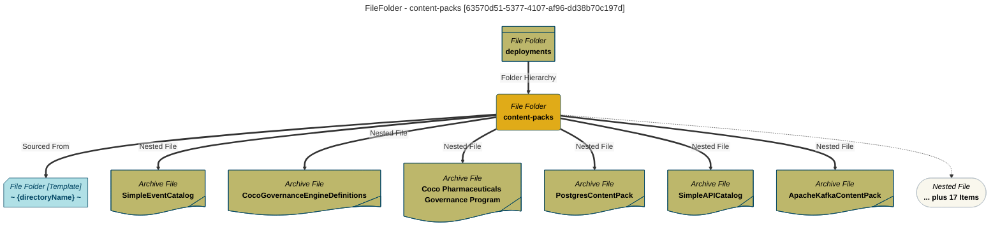

# Technology Type Elements
Elements of a Technology

# TechTypeElements Report - created at 2025-11-11 20:40
	TechTypeElements  found from the search string:  `File System Directory`

<a id="63570d51-5377-4107-af96-dd38b70c197d"></a>
# TechTypeElements Name: content-packs

## Display Name
content-packs

## Qualified Name
File System Directory::ContentPacksCataloguer:/deployments/content-packs

## GUID
63570d51-5377-4107-af96-dd38b70c197d

## Deployed Implementation
File System Directory

## Mermaid Graph


## Specification Mermaid Graph

```mermaid

```

---

<a id="b0eb97fb-f10f-43ef-9f62-d34780173328"></a>
# TechTypeElements Name: deployments/loading-bay/sample-data/oak-dene-drop-foot-weekly-measurements

## Display Name
deployments/loading-bay/sample-data/oak-dene-drop-foot-weekly-measurements

## Qualified Name
FileFolder::/deployments/loading-bay/sample-data/oak-dene-drop-foot-weekly-measurements

## GUID
b0eb97fb-f10f-43ef-9f62-d34780173328

## Deployed Implementation
File System Directory

## Mermaid Graph

```mermaid
---
title: FileFolder - deployments/loading-bay/sample-data/oak-dene-drop-foot-weekly-measurements [b0eb97fb-f10f-43ef-9f62-d34780173328]
---
flowchart TD
%%{init: {"flowchart": {"htmlLabels": false}} }%%

1@{ shape: rounded, label: "*File Folder*
**deployments/loading-bay/sample-data/oak-dene-drop-foot-weekly-measurements**"}
2@{ shape: tag-doc, label: "*C S V File*
**week1.csv**"}
1==>|"Nested File"|2
3@{ shape: tag-doc, label: "*C S V File*
**week3.csv**"}
1==>|"Nested File"|3
4@{ shape: tag-doc, label: "*C S V File*
**week6.restatement.csv**"}
1==>|"Nested File"|4
5@{ shape: tag-doc, label: "*C S V File*
**week7.csv**"}
1==>|"Nested File"|5
6@{ shape: tag-doc, label: "*C S V File*
**week8.csv**"}
1==>|"Nested File"|6
7@{ shape: tag-doc, label: "*C S V File*
**week5.csv**"}
1==>|"Nested File"|7
8@{ shape: stadium, label: "*Nested File*
**... plus 4 Items**"}
1-.->8
9@{ shape: div-rect, label: "*File Folder*
**sample-data**"}
9==>|"Folder Hierarchy"|1
style 1 color:#000000, fill:#e0ab18, stroke:#004563
style 2 color:#000000, fill:#bdb76b, stroke:#004563
style 3 color:#000000, fill:#bdb76b, stroke:#004563
style 4 color:#000000, fill:#bdb76b, stroke:#004563
style 5 color:#000000, fill:#bdb76b, stroke:#004563
style 6 color:#000000, fill:#bdb76b, stroke:#004563
style 7 color:#000000, fill:#bdb76b, stroke:#004563
style 8 color:#000000, fill:#F9F7ED, stroke:#b7c0c7
style 9 color:#000000, fill:#bdb76b, stroke:#004563
```
## Specification Mermaid Graph

```mermaid

```

---

<a id="f5d3d242-85e6-4b24-911b-c5c854458fdb"></a>
# TechTypeElements Name: sample-data

## Display Name
sample-data

## Qualified Name
File System Directory::SampleDataCataloguer:/deployments/loading-bay/sample-data

## GUID
f5d3d242-85e6-4b24-911b-c5c854458fdb

## Deployed Implementation
File System Directory

## Mermaid Graph

```mermaid
---
title: FileFolder - sample-data [f5d3d242-85e6-4b24-911b-c5c854458fdb]
---
flowchart TD
%%{init: {"flowchart": {"htmlLabels": false}} }%%

1@{ shape: rounded, label: "*File Folder*
**sample-data**"}
2@{ shape: card, label: "*File Folder [Template]*
**~ {directoryName} ~**"}
1==>|"Sourced From"|2
3@{ shape: tag-doc, label: "*Data File*
**.DS_Store**"}
1==>|"Nested File"|3
4@{ shape: div-rect, label: "*File Folder*
**deployments/loading-bay/sample-data/old-market-drop-foot-weekly-measurements**"}
1==>|"Folder Hierarchy"|4
5@{ shape: div-rect, label: "*File Folder*
**deployments/loading-bay**"}
5==>|"Folder Hierarchy"|1
style 1 color:#000000, fill:#e0ab18, stroke:#004563
style 2 color:#004563, fill:#b0e0e6, stroke:#004563
style 3 color:#000000, fill:#bdb76b, stroke:#004563
style 4 color:#000000, fill:#bdb76b, stroke:#004563
style 5 color:#000000, fill:#bdb76b, stroke:#004563
```
## Specification Mermaid Graph

```mermaid

```

---

<a id="400796c6-8cd9-4694-92c5-cdf5c3dc5392"></a>
# TechTypeElements Name: deployments

## Display Name
deployments

## Qualified Name
FileFolder::/deployments

## GUID
400796c6-8cd9-4694-92c5-cdf5c3dc5392

## Deployed Implementation
File System Directory

## Mermaid Graph

```mermaid
---
title: FileFolder - deployments [400796c6-8cd9-4694-92c5-cdf5c3dc5392]
---
flowchart TD
%%{init: {"flowchart": {"htmlLabels": false}} }%%

1@{ shape: rounded, label: "*File Folder*
**deployments**"}
2@{ shape: div-rect, label: "*File Folder*
**deployments/loading-bay**"}
1==>|"Folder Hierarchy"|2
style 1 color:#000000, fill:#e0ab18, stroke:#004563
style 2 color:#000000, fill:#bdb76b, stroke:#004563
```
## Specification Mermaid Graph

```mermaid

```

---

<a id="5545ecc8-9050-47ee-aead-b35d00d6f8d0"></a>
# TechTypeElements Name: deployments

## Display Name
deployments

## Qualified Name
FileFolder::/deployments

## GUID
5545ecc8-9050-47ee-aead-b35d00d6f8d0

## Deployed Implementation
File System Directory

## Mermaid Graph

```mermaid
---
title: FileFolder - deployments [5545ecc8-9050-47ee-aead-b35d00d6f8d0]
---
flowchart TD
%%{init: {"flowchart": {"htmlLabels": false}} }%%

1@{ shape: rounded, label: "*File Folder*
**deployments**"}
2@{ shape: div-rect, label: "*File Folder*
**loading-bay**"}
1==>|"Folder Hierarchy"|2
style 1 color:#000000, fill:#e0ab18, stroke:#004563
style 2 color:#000000, fill:#bdb76b, stroke:#004563
```
## Specification Mermaid Graph

```mermaid

```

---

<a id="d35436ee-ba92-46d2-a733-bdb21d337902"></a>
# TechTypeElements Name: loading-bay

## Display Name
loading-bay

## Qualified Name
File System Directory::laz.local:/deployments/loading-bay

## GUID
d35436ee-ba92-46d2-a733-bdb21d337902

## Description
Loading bay folder

## Deployed Implementation
File System Directory

## Mermaid Graph

```mermaid
---
title: FileFolder - loading-bay [d35436ee-ba92-46d2-a733-bdb21d337902]
---
flowchart TD
%%{init: {"flowchart": {"htmlLabels": false}} }%%

1@{ shape: rounded, label: "*File Folder*
**loading-bay**"}
2@{ shape: card, label: "*File Folder [Template]*
**~ {directoryName} ~**"}
1==>|"Sourced From"|2
3@{ shape: div-rect, label: "*File Folder*
**deployments**"}
3==>|"Folder Hierarchy"|1
style 1 color:#000000, fill:#e0ab18, stroke:#004563
style 2 color:#004563, fill:#b0e0e6, stroke:#004563
style 3 color:#000000, fill:#bdb76b, stroke:#004563
```
## Specification Mermaid Graph

```mermaid

```

---

<a id="24427f01-24c2-4860-a9e4-e164ea3c1ee8"></a>
# TechTypeElements Name: deployments/loading-bay/sample-data/old-market-drop-foot-weekly-measurements

## Display Name
deployments/loading-bay/sample-data/old-market-drop-foot-weekly-measurements

## Qualified Name
FileFolder::/deployments/loading-bay/sample-data/old-market-drop-foot-weekly-measurements

## GUID
24427f01-24c2-4860-a9e4-e164ea3c1ee8

## Description
Loading bay folder

## Deployed Implementation
File System Directory

## Mermaid Graph

```mermaid
---
title: FileFolder - deployments/loading-bay/sample-data/old-market-drop-foot-weekly-measurements [24427f01-24c2-4860-a9e4-e164ea3c1ee8]
---
flowchart TD
%%{init: {"flowchart": {"htmlLabels": false}} }%%

1@{ shape: rounded, label: "*File Folder*
**deployments/loading-bay/sample-data/old-market-drop-foot-weekly-measurements**"}
2@{ shape: tag-doc, label: "*C S V File*
**week1.csv**"}
1==>|"Nested File"|2
3@{ shape: tag-doc, label: "*C S V File*
**week5.csv**"}
1==>|"Nested File"|3
4@{ shape: tag-doc, label: "*C S V File*
**week7.csv**"}
1==>|"Nested File"|4
5@{ shape: tag-doc, label: "*C S V File*
**week8.csv**"}
1==>|"Nested File"|5
6@{ shape: tag-doc, label: "*C S V File*
**week2.csv**"}
1==>|"Nested File"|6
7@{ shape: tag-doc, label: "*C S V File*
**week6.csv**"}
1==>|"Nested File"|7
8@{ shape: stadium, label: "*Nested File*
**... plus 4 Items**"}
1-.->8
9@{ shape: div-rect, label: "*File Folder*
**sample-data**"}
9==>|"Folder Hierarchy"|1
style 1 color:#000000, fill:#e0ab18, stroke:#004563
style 2 color:#000000, fill:#bdb76b, stroke:#004563
style 3 color:#000000, fill:#bdb76b, stroke:#004563
style 4 color:#000000, fill:#bdb76b, stroke:#004563
style 5 color:#000000, fill:#bdb76b, stroke:#004563
style 6 color:#000000, fill:#bdb76b, stroke:#004563
style 7 color:#000000, fill:#bdb76b, stroke:#004563
style 8 color:#000000, fill:#F9F7ED, stroke:#b7c0c7
style 9 color:#000000, fill:#bdb76b, stroke:#004563
```
## Specification Mermaid Graph

```mermaid

```

---

<a id="0e0b2d63-eaaf-4c68-a502-9e5ac220c7a2"></a>
# TechTypeElements Name: deployments/loading-bay/sample-data/hampton-drop-foot-weekly-measurements

## Display Name
deployments/loading-bay/sample-data/hampton-drop-foot-weekly-measurements

## Qualified Name
FileFolder::/deployments/loading-bay/sample-data/hampton-drop-foot-weekly-measurements

## GUID
0e0b2d63-eaaf-4c68-a502-9e5ac220c7a2

## Description
Loading bay folder

## Deployed Implementation
File System Directory

## Mermaid Graph

```mermaid
---
title: FileFolder - deployments/loading-bay/sample-data/hampton-drop-foot-weekly-measurements [0e0b2d63-eaaf-4c68-a502-9e5ac220c7a2]
---
flowchart TD
%%{init: {"flowchart": {"htmlLabels": false}} }%%

1@{ shape: rounded, label: "*File Folder*
**deployments/loading-bay/sample-data/hampton-drop-foot-weekly-measurements**"}
2@{ shape: tag-doc, label: "*C S V File*
**week1.restatement.csv**"}
1==>|"Nested File"|2
3@{ shape: tag-doc, label: "*C S V File*
**week6.csv**"}
1==>|"Nested File"|3
4@{ shape: tag-doc, label: "*C S V File*
**week8.csv**"}
1==>|"Nested File"|4
5@{ shape: tag-doc, label: "*C S V File*
**week2.csv**"}
1==>|"Nested File"|5
6@{ shape: tag-doc, label: "*C S V File*
**week4.csv**"}
1==>|"Nested File"|6
7@{ shape: tag-doc, label: "*C S V File*
**week5.csv**"}
1==>|"Nested File"|7
8@{ shape: stadium, label: "*Nested File*
**... plus 4 Items**"}
1-.->8
9@{ shape: div-rect, label: "*File Folder*
**sample-data**"}
9==>|"Folder Hierarchy"|1
style 1 color:#000000, fill:#e0ab18, stroke:#004563
style 2 color:#000000, fill:#bdb76b, stroke:#004563
style 3 color:#000000, fill:#bdb76b, stroke:#004563
style 4 color:#000000, fill:#bdb76b, stroke:#004563
style 5 color:#000000, fill:#bdb76b, stroke:#004563
style 6 color:#000000, fill:#bdb76b, stroke:#004563
style 7 color:#000000, fill:#bdb76b, stroke:#004563
style 8 color:#000000, fill:#F9F7ED, stroke:#b7c0c7
style 9 color:#000000, fill:#bdb76b, stroke:#004563
```
## Specification Mermaid Graph

```mermaid

```

---

<a id="fc1f94e4-54f7-4c08-87f9-67d842003a04"></a>
# TechTypeElements Name: deployments/loading-bay

## Display Name
deployments/loading-bay

## Qualified Name
FileFolder::/deployments/loading-bay

## GUID
fc1f94e4-54f7-4c08-87f9-67d842003a04

## Description
Loading bay folder

## Deployed Implementation
File System Directory

## Mermaid Graph

```mermaid
---
title: FileFolder - deployments/loading-bay [fc1f94e4-54f7-4c08-87f9-67d842003a04]
---
flowchart TD
%%{init: {"flowchart": {"htmlLabels": false}} }%%

1@{ shape: rounded, label: "*File Folder*
**deployments/loading-bay**"}
2@{ shape: div-rect, label: "*File Folder*
**sample-data**"}
1==>|"Folder Hierarchy"|2
3@{ shape: div-rect, label: "*File Folder*
**deployments**"}
3==>|"Folder Hierarchy"|1
style 1 color:#000000, fill:#e0ab18, stroke:#004563
style 2 color:#000000, fill:#bdb76b, stroke:#004563
style 3 color:#000000, fill:#bdb76b, stroke:#004563
```
## Specification Mermaid Graph

```mermaid

```
