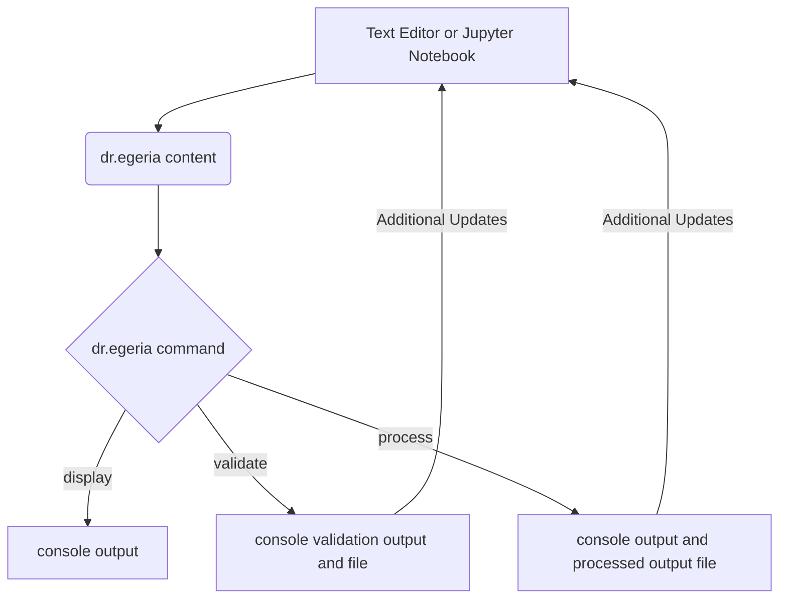

# Introduction to Dr.Egeria - an Egeria Markdown Processor

A constant challenge in managing information is gathering enough metadata about the information to
allow us to manage it. A common approach is to build fancy graphical user interfaces hoping that they
will be attractive enough and easy enough to use that people will do so.

Unfortunately, however, this ignores the fundamental fact that to use one of these nice GUI
applications, you have to step away from the tools and processes that you were in the midst of performing.
You have to leave your world and enter a new, often less familiar one.

Dr.Egeria, is an experiment in turning this around. Its not that fancy graphical user
interfaces don't have a role - but rather, to look at what we can do to support the
tools and approaches people already use. And maybe even make their day job a little
easier and a little more enjoyable.

So this is what we are exploring with Dr.Egeria. An Egeria Markdown language that allows
users to intermix requests to Egeria with other text through the use of standard Markdown. The markdown text
that we process can be in standard markdown (.md) files, in Jupyter notebooks, and perhaps other file formats.

This markdown file is an example. You will see that we intersperse normal narrative text (such as this)
with Commands to Egeria. We introduce a specific vocabulary to make Egeria requests.

In the example below we will create a new Egeria glossary to hold definitions related to Dr.Egeria.
We will then show how we can process this file which will record the information into Egeria and create a new
output file that acts as both a receipt showing what was processed as well as a starting point for making updates.

So here we go! First lets define a new Glossary::

___

# Update Glossary Form - created at 2025-04-24 13:26
	 Glossary found from the search string:  `GUID`

# Update Glossary

## Glossary Name 

Egeria-Markdown

## Description
Glossary to describe the vocabulary of Dr.Egeria - an Egeria Markdown language to support the exchange of metadata in a Markdown form.
Dr.Egeria allows users to create metadata annotations using any text entry system that supports the entry of standard Markdown
notation and, through post-processing
commands, validates the Egeria content and sends the requests to be sent to Egeria.

## Language
English

## Usage
1. (optional) load an example or template for the type of object from Egeria.
2. Create a new document (perhaps from a template) and edit it, adding in the content with the Dr.Egeria controlled Markdown language.
3. Process the document to validate and display it before you submit it, Validation may annotate your document with recommendations and potential issues.
4. Submit the document to Egeria using the Dr.Egeria commands.
5. Review the resulting output document to see what was created and give you a starting point for making updates.

## Qualified Name
Glossary::Egeria-Markdown

## Category Names

## Guid
c14e92e5-95e6-48bf-b37f-5ee5644deeb0

# First Walk-Through
The block of markdown above is a request to create a new Egeria Glossary called `Egeria-Markdown`. Let's briefly walk
through. The command starts when we see `# Create Glossary`. This is a known phrase in Dr.Egeria. When we see this
phrase we recognize that this is an Egeria markdown request block. The request block ends if we encounter another `#` or
`___`, or run out of text. Within this request block we note some **attributes** that begin with a `## `. The first that  we encounter is `## Glossary Name`. Not all attributes need to be filled in. Later, we'll process this file and demonstrate  how to tell - but first, lets look at the attributes shown:

* `## Glossary Name` - this is the display name of the glossary. In this case the name is `Egeria-Markdown` As you can see, the value of the attribute is the plain text that follows it.
* `## Language` - what language will the terms of the glossary be in (yes there are ways to have mixed language but  Dr.Egeria strives to be as simple as possible).
* `## Description` - a description of the glossary and its purpose.
* `## Usage` - how the glossary is meant to be used, and by whom.
* `## Qualified Name` - every element in Egeria must have a unique qualified name that we use to distinguish it from all other elements. The qualified name is meant to be understandable by humans, although it may follow formatting conventions. This attribute can be left blank for now - it will be automatically generated if empty.
* `## GUID` - same story as qualified name except that this is meant for automation and not people.  It is always created for us.

And that's it. That's all we need to do to specify the creation of a new glossary (well - mostly - we'll reveal a few
more details a bit later).

## Great! That was easy!

We now have a nice, clean, new...and empty...glossary - guess we better start filling it. Lets start filling it with terms.

___

# Update Term

## Term Name 

Command

## Aliases

## Summary
Commands are how a user of the Dr.Egeria markdown language request an action.

## Description
Commands are how a user can request Egeria to take an action such as Create or Update an Egeria element. Dr.Egeria
provides a limited (but growing) set of commands. Dr.Egeria commands align with the pyegeria 'hey-egeria'
command line interface and, of course, the underlying Egeria REST API.
The commands currently use the following verbs to act on Egeria elements:
* Create
* Update
* List
* Provenance

## Examples
Create Glossary or
Update Glossary or
Create Term or
Update Term

## Usage
Commands are used in the Dr.Egeria markdown language.

## Version Identifier
0.2

## Qualified Name
Term::Command::0.2

## Status
ACTIVE

## In Glossary
Glossary::Egeria-Markdown

## Categories

## Guid
5be312dd-ca35-4ff4-91aa-a180e3e1716c

# Update Term

## Term Name 

Source

## Aliases

## Summary
Source of the markdown content.

## Description
Source of the markdown content - could be jupter or plain markdown file.

## Examples

## Usage

## Version Identifier
0.2

## Qualified Name
Term::Source::0.2

## Status
ACTIVE

## In Glossary
Glossary::Egeria-Markdown

## Categories

## Guid
79aed6f1-f9e8-4046-9a5d-b9bdac11feb0

# Update Term

## Term Name 

Directive

## Aliases

## Summary
A directive defines how the command is to be processed.

## Description
Directives are one of:
* display - just display what we've found
* validate - check the validity of the requested action
* process - process the requested action

## Examples

## Usage

## Version Identifier
0.1

## Qualified Name
Term::Directive::0.1

## Status
ACTIVE

## In Glossary
Glossary::Egeria-Markdown

## Categories

## Guid
e3f2898c-d3d3-4ce3-b9a6-e998a28a2400

# Some terms specified - Now what?

Ok - we've now defined a glossary and three terms to go into the glossary. A few observations.

* There is a degree of freedom in writing the definitions. The attributes aren't always in the same
order and optional attributes don't need to be specified at all. We try to make things as easy as possible.
* We can run a definition file through a validation process to check our proposed definition and provide feedback.
* When we process a definition we will use the same validation process before trying to update Egeria
with the requested definitions - requests may get rejected or altered - this will be consistent with the feedback we
provide during validation.

Here is what we'll do next.

## Next
> Tip: An easy way to get started is by installing [Egeria Workspaces](https://github.com/odpi/egeria-workspaces) and
> using the hey_egeria command line interface.  Tutorials are available at [Egeria-Workspaces](https://youtu.be/Dc5i5EpRusE).

We will run a small program called `dr_egeria_md.py` to operate on this markdown file.
When we run this program we tell it not just the name of the file to process but also provide a directive on what to do.
Currently we have the choice of:

1. Display - just parse the file, breaking it down into request blocks, and display what we find
2. Validate - parse the file and validate if the commands can be processed - showing information about what we observe.
3. Process - parse the request blocks and execute the commands - and produce a new output file to simplify further processing.

# Great --> let's give it a try!

Ok - its processed the file and generated output to the console that shows us what it has done.
We also now have a new file in the designated outbox (specified by an Environment Variable).
If we review that file, we see that it has similar content to this original file except that
the **Create** statements have been replaced with **Update** statements and
attributes such as **Qualified Name** and **GUID** now contain the known values.

This means that if we want to make changes to the definitions that we have
created, all we need to do is to make changes to the updatable attributes in this
new document and resubmit it - pretty simple.

Here is a diagram of this process from the user perspective:

In the next section we'll see how we can update and extend what we have done by creating
some glossary categories and then assigning categories to the terms.
To do this we will copy the output document that we just created and call the
copy dr_egeria_intro_part2.md. The text of the document has also been updated
to reflect the purpose. Let's open that now!
# Provenance

* Results from processing file dr_egeria_intro_part1.md on 2025-04-24 13:26
