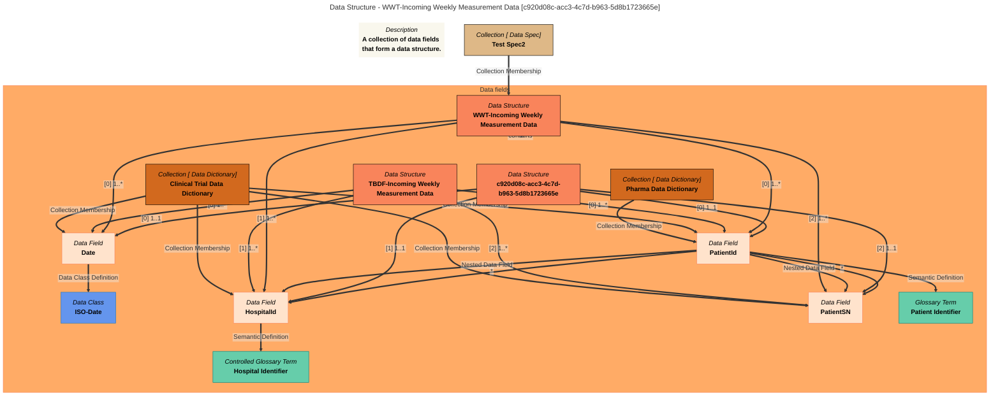
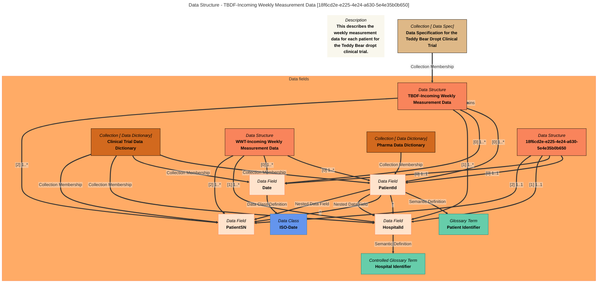

# View Data Classes
## Output Format
DICT

___


# `Data Fields` with filter: `*`

```
[
    {
        "display_name": "HospitalId",
        "description": "Unique identifier for a hospital. Used in forming PatientId.",
        "assigned_meanings": [
            "Term::Hospital Identifier"
        ],
        "qualified_name": "DataField::HospitalId",
        "data_type": "String",
        "data_class": [],
        "GUID": "88f05a4c-6efb-49a2-a4c8-386df5d7c303",
        "is_nullable": true,
        "minimum_length": 0,
        "length": 0,
        "precision": 0,
        "ordered_values": false,
        "sort_order": "UNSORTED",
        "parent_names": [
            "DataField::PatientId"
        ],
        "extended_properties": {},
        "additional_properties": {},
        "data_dictionaries": [
            "DataDict::Clinical Trial Data Dictionary"
        ],
        "data_structures": [
            "DataStruct::TBDF-Incoming Weekly Measurement Data",
            "DataStruct::WWT-Incoming Weekly Measurement Data"
        ],
        "mermaid": "---\ntitle: Data Field - HospitalId [88f05a4c-6efb-49a2-a4c8-386df5d7c303]\n---\nflowchart TD\n%%{init: {\"flowchart\": {\"htmlLabels\": false}} }%%\n\n1@{ shape: text, label: \"*Description*\n**Unique identifier for a hospital. Used in forming PatientId.**\"}\n2@{ shape: rect, label: \"*Data Field*\n**HospitalId**\"}\n3@{ shape: rect, label: \"*Controlled Glossary Term*\n**Hospital Identifier**\"}\n2==>|\"Semantic Definition\"|3\n4@{ shape: rect, label: \"*Collection [ Data Dictionary]*\n**Clinical Trial Data Dictionary**\"}\n4==>|\"Collection Membership\"|2\n5@{ shape: rect, label: \"*Data Structure*\n**TBDF-Incoming Weekly Measurement Data**\"}\n5==>|\"[1] 1..*\"|2\n6@{ shape: rect, label: \"*Data Structure*\n**WWT-Incoming Weekly Measurement Data**\"}\n6==>|\"[1] 1..*\"|2\n7@{ shape: rect, label: \"*Data Field*\n**PatientId**\"}\n7==>|\"Nested Data Field\"|2\nstyle 1 color:#000000, fill:#F9F7ED, stroke:#b7c0c7\nstyle 2 color:#000000, fill:#ffe3cc, stroke:#f9845b\nstyle 3 color:#000000, fill:#66cdaa, stroke:#008080\nstyle 4 color:#000000, fill:#d2691e, stroke:#000000\nstyle 5 color:#000000, fill:#f9845b, stroke:#000000\nstyle 6 color:#000000, fill:#f9845b, stroke:#000000\nstyle 7 color:#000000, fill:#ffe3cc, stroke:#f9845b\n"
    },
    {
        "display_name": "PatientSN",
        "description": "Unique identifier of the patient within a hospital.",
        "assigned_meanings": [],
        "qualified_name": "DataField::PatientSN",
        "data_type": "String",
        "data_class": [],
        "GUID": "15e891db-8b4b-41d7-9f67-d0ed721142e5",
        "is_nullable": true,
        "minimum_length": 0,
        "length": 0,
        "precision": 0,
        "ordered_values": false,
        "sort_order": "UNSORTED",
        "parent_names": [
            "DataField::PatientId"
        ],
        "extended_properties": {},
        "additional_properties": {},
        "data_dictionaries": [
            "DataDict::Clinical Trial Data Dictionary"
        ],
        "data_structures": [
            "DataStruct::TBDF-Incoming Weekly Measurement Data",
            "DataStruct::WWT-Incoming Weekly Measurement Data"
        ],
        "mermaid": "---\ntitle: Data Field - PatientSN [15e891db-8b4b-41d7-9f67-d0ed721142e5]\n---\nflowchart TD\n%%{init: {\"flowchart\": {\"htmlLabels\": false}} }%%\n\n1@{ shape: text, label: \"*Description*\n**Unique identifier of the patient within a hospital.**\"}\n2@{ shape: rect, label: \"*Data Field*\n**PatientSN**\"}\n3@{ shape: rect, label: \"*Collection [ Data Dictionary]*\n**Clinical Trial Data Dictionary**\"}\n3==>|\"Collection Membership\"|2\n4@{ shape: rect, label: \"*Data Structure*\n**TBDF-Incoming Weekly Measurement Data**\"}\n4==>|\"[2] 1..*\"|2\n5@{ shape: rect, label: \"*Data Structure*\n**WWT-Incoming Weekly Measurement Data**\"}\n5==>|\"[2] 1..*\"|2\n6@{ shape: rect, label: \"*Data Field*\n**PatientId**\"}\n6==>|\"Nested Data Field\"|2\nstyle 1 color:#000000, fill:#F9F7ED, stroke:#b7c0c7\nstyle 2 color:#000000, fill:#ffe3cc, stroke:#f9845b\nstyle 3 color:#000000, fill:#d2691e, stroke:#000000\nstyle 4 color:#000000, fill:#f9845b, stroke:#000000\nstyle 5 color:#000000, fill:#f9845b, stroke:#000000\nstyle 6 color:#000000, fill:#ffe3cc, stroke:#f9845b\n"
    },
    {
        "display_name": "Date",
        "description": "A date of the form YYYY-MM-DD",
        "assigned_meanings": [],
        "qualified_name": "DataField::Date",
        "data_type": "Date",
        "data_class": [
            "DataClass::ISO-Date"
        ],
        "GUID": "2ca5f6c9-1c9e-40b7-bffd-0ec440c1673d",
        "is_nullable": true,
        "minimum_length": 0,
        "length": 0,
        "precision": 0,
        "ordered_values": false,
        "sort_order": "UNSORTED",
        "parent_names": [],
        "extended_properties": {},
        "additional_properties": {},
        "data_dictionaries": [
            "DataDict::Clinical Trial Data Dictionary"
        ],
        "data_structures": [
            "DataStruct::TBDF-Incoming Weekly Measurement Data",
            "DataStruct::WWT-Incoming Weekly Measurement Data"
        ],
        "mermaid": "---\ntitle: Data Field - Date [2ca5f6c9-1c9e-40b7-bffd-0ec440c1673d]\n---\nflowchart TD\n%%{init: {\"flowchart\": {\"htmlLabels\": false}} }%%\n\n1@{ shape: text, label: \"*Description*\n**A date of the form YYYY-MM-DD**\"}\n2@{ shape: rect, label: \"*Data Field*\n**Date**\"}\n3@{ shape: rect, label: \"*Data Class*\n**ISO-Date**\"}\n2==>|\"Data Class Definition\"|3\n4@{ shape: rect, label: \"*Collection [ Data Dictionary]*\n**Clinical Trial Data Dictionary**\"}\n4==>|\"Collection Membership\"|2\n5@{ shape: rect, label: \"*Data Structure*\n**TBDF-Incoming Weekly Measurement Data**\"}\n5==>|\"[0] 1..*\"|2\n6@{ shape: rect, label: \"*Data Structure*\n**WWT-Incoming Weekly Measurement Data**\"}\n6==>|\"[0] 1..*\"|2\nstyle 1 color:#000000, fill:#F9F7ED, stroke:#b7c0c7\nstyle 2 color:#000000, fill:#ffe3cc, stroke:#f9845b\nstyle 3 color:#000000, fill:#6495ed, stroke:#3079ab\nstyle 4 color:#000000, fill:#d2691e, stroke:#000000\nstyle 5 color:#000000, fill:#f9845b, stroke:#000000\nstyle 6 color:#000000, fill:#f9845b, stroke:#000000\n"
    },
    {
        "display_name": "PatientId",
        "description": "Unique identifier of the patient",
        "assigned_meanings": [
            "GlossaryTerm::ClinicalTrialTerminology::PatientId"
        ],
        "qualified_name": "DataField::PatientId",
        "data_type": "String",
        "data_class": [],
        "GUID": "e353268d-a125-49a1-9be5-3046b5c13bc3",
        "is_nullable": true,
        "minimum_length": 0,
        "length": 0,
        "precision": 0,
        "ordered_values": false,
        "sort_order": "UNSORTED",
        "parent_names": [],
        "extended_properties": {},
        "additional_properties": {},
        "data_dictionaries": [
            "DataDict::Pharma Data Dictionary",
            "DataDict::Clinical Trial Data Dictionary"
        ],
        "data_structures": [
            "DataStruct::TBDF-Incoming Weekly Measurement Data",
            "DataStruct::WWT-Incoming Weekly Measurement Data"
        ],
        "mermaid": "---\ntitle: Data Field - PatientId [e353268d-a125-49a1-9be5-3046b5c13bc3]\n---\nflowchart TD\n%%{init: {\"flowchart\": {\"htmlLabels\": false}} }%%\n\n1@{ shape: text, label: \"*Description*\n**Unique identifier of the patient**\"}\n2@{ shape: rect, label: \"*Data Field*\n**PatientId**\"}\n3@{ shape: rect, label: \"*Data Field*\n**PatientSN**\"}\n4@{ shape: rect, label: \"*Collection [ Data Dictionary]*\n**Clinical Trial Data Dictionary**\"}\n4==>|\"Collection Membership\"|3\n5@{ shape: rect, label: \"*Data Structure*\n**TBDF-Incoming Weekly Measurement Data**\"}\n5==>|\"[2] 1..*\"|3\n6@{ shape: rect, label: \"*Data Structure*\n**WWT-Incoming Weekly Measurement Data**\"}\n6==>|\"[2] 1..*\"|3\n2==>|\"Nested Data Field\"|3\n2==>|\"*\"|3\n7@{ shape: rect, label: \"*Data Field*\n**HospitalId**\"}\n8@{ shape: rect, label: \"*Controlled Glossary Term*\n**Hospital Identifier**\"}\n7==>|\"Semantic Definition\"|8\n4==>|\"Collection Membership\"|7\n5==>|\"[1] 1..*\"|7\n6==>|\"[1] 1..*\"|7\n2==>|\"Nested Data Field\"|7\n2==>|\"*\"|7\n9@{ shape: rect, label: \"*Glossary Term*\n**Patient Identifier**\"}\n2==>|\"Semantic Definition\"|9\n10@{ shape: rect, label: \"*Collection [ Data Dictionary]*\n**Pharma Data Dictionary**\"}\n10==>|\"Collection Membership\"|2\n4==>|\"Collection Membership\"|2\n5==>|\"[0] 1..*\"|2\n6==>|\"[0] 1..*\"|2\nstyle 1 color:#000000, fill:#F9F7ED, stroke:#b7c0c7\nstyle 2 color:#000000, fill:#ffe3cc, stroke:#f9845b\nstyle 3 color:#000000, fill:#ffe3cc, stroke:#f9845b\nstyle 4 color:#000000, fill:#d2691e, stroke:#000000\nstyle 5 color:#000000, fill:#f9845b, stroke:#000000\nstyle 6 color:#000000, fill:#f9845b, stroke:#000000\nstyle 7 color:#000000, fill:#ffe3cc, stroke:#f9845b\nstyle 8 color:#000000, fill:#66cdaa, stroke:#008080\nstyle 9 color:#000000, fill:#66cdaa, stroke:#008080\nstyle 10 color:#000000, fill:#d2691e, stroke:#000000\n"
    }
]
```


# `DataDictionary` with filter: `Test Spec2`

```
[
    {
        "guid": "3162ac1c-82c0-48b9-86cc-2b5b45aaf63d",
        "display_name": "Test Spec2",
        "description": "A test spec - Meow",
        "qualified_name": "DataSpec::Test Spec2",
        "classifications": "Anchors, DataSpec",
        "members": "DataStruct::WWT-Incoming Weekly Measurement Data",
        "additional_properties": {},
        "extended_properties": {}
    }
]
```


# `DataSpec` with filter: `*`

# DataSpecs Table

DataSpecs found from the search string: `All`

| Name | Qualified Name | Description | Classifications | Members | 
|-------------|-------------|-------------|-------------|-------------|
| Data Specification for the Teddy Bear Dropt Clinical Trial | DataSpec::Data Specification for the Teddy Bear Dropt Clinical Trial | Principle data requirements for Teddy Bear Dropt Clinical Trial. Meow | Anchors, DataSpec | DataStruct::TBDF-Incoming Weekly Measurement Data | 
| Test Spec2 | DataSpec::Test Spec2 | A test spec - Meow | Anchors, DataSpec | DataStruct::WWT-Incoming Weekly Measurement Data | 


# `Data Structures` with filter: `*`

# Data Structure Report - created at 2025-06-19 21:09
	Data Structure  found from the search string:  `All`

# Data Structure Name: WWT-Incoming Weekly Measurement Data

## Qualified Name
DataStruct::WWT-Incoming Weekly Measurement Data

## Description
A collection of data fields that form a data structure.

## Data Fields
DataField::Date,
DataField::HospitalId,
DataField::PatientSN,
DataField::PatientId

## Data Specification
DataSpec::Test Spec2

## GUID
c920d08c-acc3-4c7d-b963-5d8b1723665e

## Mermaid Graph


---

# Data Structure Name: TBDF-Incoming Weekly Measurement Data

## Qualified Name
DataStruct::TBDF-Incoming Weekly Measurement Data

## Description
This describes the weekly measurement data for each patient for the Teddy Bear dropt clinical trial.

## Data Fields
DataField::PatientSN,
DataField::HospitalId,
DataField::Date,
DataField::PatientId

## Data Specification
DataSpec::Data Specification for the Teddy Bear Dropt Clinical Trial

## GUID
18f6cd2e-e225-4e24-a630-5e4e35b0b650

## Mermaid Graph



#  foo Create Glossary
## Glossary Name
Test Glossary
## Description
This glossary is just for testing

___

#  foo Create Term
## In Glossary
Test Glossary
## Term Name
Hospital Identifier
## Description
Identifies each hospital uniquely. Used within the PatientId field.

___

# foo Create Data Dictionary
## Name
Clinical Trial Data Dictionary

## Description
A data dictionary for clinical trial data elements.


#  foo Create Data Dictionary
## Name
Pharma Data Dictionary

## Description
A data dictionary of elements relevant to the Pharma communities.


___

#  foo Create Data Spec

## Data Specification

Data Specification for the Teddy Bear Dropt Clinical Trial

## Description
Principle data requirements for Teddy Bear Dropt Clinical Trial. Meow

## Qualified Name
DataSpec::Data Specification for the Teddy Bear Dropt Clinical Trial

## Classifications

## Guid


___


#  foo Create Data Specification

## Data Specification Name

Test Spec2

## Description
A test spec - Meow

## Qualified Name

## Classifications

## Guid

## Additional Properties
{
"a prop" : "meow",
"another" : "woof"
}
___

# foo Create Data Dictionary

## Dictionary Name

dw

## Description
A data dictionary for dan..
## Qualified Name
DataDict::dw

## Classifications

## GUID


___


#  foo Create Data Structure

## Data Structure Name

TBDF-Incoming Weekly Measurement Data

## Description
This describes the weekly measurement data for each patient for the Teddy Bear dropt clinical trial.

## Qualified Name
DataStruct::TBDF-Incoming Weekly Measurement Data

## Namespace

## In Data Specification
Data Specification for the Teddy Bear Dropt Clinical Trial

## Version Identifier


## Guid


___

#  foo Create Data Structure

## Data Structure Name

WWT-Incoming Weekly Measurement Data

## Description
A collection of data fields that form a data structure.

## Qualified Name
DataStruct::WWT-Incoming Weekly Measurement Data

## In Data Specification
Test Spec2

## Namespace


## Version Identifier


## GUID


___

# foo Create Data Field

## Data Field Name

PatientId

## Description
Unique identifier of the patient

## Qualified Name
DataField::PatientId


## Data Type

String

## Guid

## Data Class

## In Data Dictionary
DataDict::Clinical Trial Data Dictionary, Pharma Data Dictionary

## In Data Structure
TBDF-Incoming Weekly Measurement Data
DataStruct::WWT-Incoming Weekly Measurement Data

## Glossary Term
GlossaryTerm::ClinicalTrialTerminology::PatientId
___


#  foo Create Data Field

## Data Field Name

HospitalId

## Description
Unique identifier for a hospital. Used in forming PatientId.

## Qualified Name
DataField::HospitalId

## Data Type
String

## In Data Dictionary
DataDict::Clinical Trial Data Dictionary

## In Data Structure

DataStruct::TBDF-Incoming Weekly Measurement Data
DataStruct::WWT-Incoming Weekly Measurement Data

## Position
1

## Min Cardinality
0

## Max Cardinality
1

## Glossary Term
Term::Hospital Identifier

## Parent Data Field
DataField::PatientId

## Journal Entry
Just creating this term

___

# foo Create Data Field

## Data Field Name

PatientSN

## Description
Unique identifier of the patient within a hospital.

## Qualified Name
DataField::PatientSN


## Data Type

String
## Position
2

## Min Cardinality
0

## Max Cardinality
1

## In Data Dictionary
DataDict::Clinical Trial Data Dictionary

## In Data Structure
DataStruct::TBDF-Incoming Weekly Measurement Data
DataStruct::WWT-Incoming Weekly Measurement Data

## Parent Data Field
DataField::PatientId

## Journal Entry
Just creating this term

___

#  foo Create Data Class

## Data Class Name

Date

## Description
A date of the form YYYY-MM-DD

## Qualified Name
DataClass::Date

## Data Type
date
## Position
0

## Min Cardinality
0

## Max Cardinality
1

## In Data Dictionary
DataDict::Clinical Trial Data Dictionary


## Containing Data Class

## Specializes Data Class

## Journal Entry
Just creating this date


___

#  foo Update Data Class

## Data Class Name

ISO-Date

## Description
ISO 8601 standard date. A date of the form YYYY-MM-DD

## Qualified Name
DataClass::ISO-Date

## Data Type
date
## Position
0

## Min Cardinality
0

## Max Cardinality
1

## In Data Dictionary
DataDict::Clinical Trial Data Dictionary


## Containing Data Class

## Specializes Data Class
DataClass::Date
## Journal Entry
Just creating this date


___


# foo Update Data Field

## Data Field

Date

## Description
A date of the form YYYY-MM-DD

## Qualified Name
DataField::Date


## Data Type
date

## Position
0

## Min Cardinality
0

## Max Cardinality
1

## In Data Dictionary
DataDict::Clinical Trial Data Dictionary

## In Data Structure
TBDF-Incoming Weekly Measurement Data,
DataStruct::WWT-Incoming Weekly Measurement Data

## Parent Data Field

## Data Class
DataClass::ISO-Date

## Journal Entry
Just creating this date


___


# foo Create Data Class

## Data Class Name

Address

## Description
Address Class

## Qualified Name


## Data Type

String
## Position
0

## Min Cardinality
0

## Max Cardinality
1

## In Data Dictionary
DataDict::Clinical Trial Data Dictionary


## Containing Data Class

## Specializes Data Class

## Journal Entry
Just creating this date
# Provenance

* Results from processing file data_test2.md on 2025-06-19 21:09
